# ACID trong cơ sở dữ liệu là gì?

## Nguồn

 [ACID Properties in Databases With Examples](https://www.youtube.com/watch?v=GAe5oB742dw)

## Atomicity (Tính nguyên tử)

Transaction sẽ được thực hiện hoặc không được thực hiện, không có trạng thái trung gian. Nếu một phần của transaction thất bại, toàn bộ transaction sẽ bị rollback như chưa từng xảy ra. Hệ thống quản lý transaction thường sử dụng cơ chế logging để kích hoạt tính năng rollback này. 

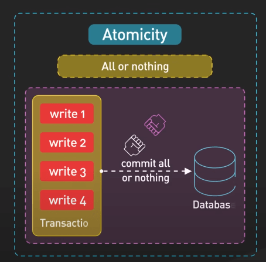{:class="centered-img"}

Ví dụ, bạn đang tạo một ứng dụng ngân hàng để chuyển $100 từ Alice sang Bob. Điều này đồng nghĩa với việc cập nhật hai thứ - trừ $100 từ tài khoản của Alice và cộng $100 vào tài khoản của Bob. Atomicity đảm bảo rằng cả hai cập nhật này sẽ được thực hiện cùng nhau hoặc không thực hiện gì cả. 

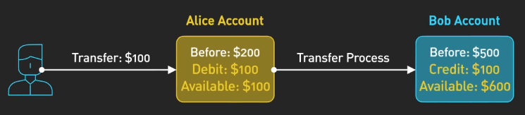{:class="centered-img"}

Nếu một phần nào đó thất bại, hệ thống quản lý transaction sẽ sử dụng logs để hoàn tác bất kỳ thay đổi nào, để bạn không bị mất hoặc thừa tiền. Transaction không thể chia nhỏ, như một nguyên tử vậy.

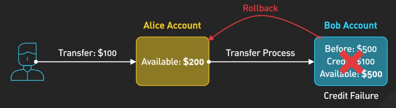{:class="centered-img"}

## Consistency (Tính nhất quán)

Transaction phải tuân thủ các quy tắc, đảm bảo dữ liệu luôn ở trạng thái hợp lệ. Bất kỳ dữ liệu nào được ghi trong transaction phải tuân thủ các ràng buộc, trigger và các quy tắc khác mà bạn đã thiết lập. Hệ thống cơ sở dữ liệu sẽ tự động kiểm tra tính nhất quán bằng cách kiểm tra vi phạm ràng buộc trong transaction. 

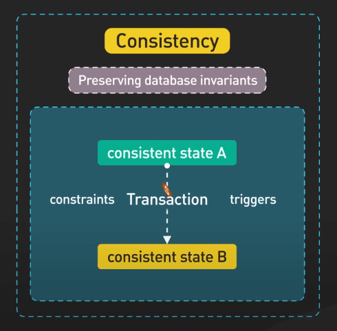{:class="centered-img"}

Ví dụ, giả sử bạn có một quy tắc rằng số dư tài khoản người dùng không thể âm. Nếu một transaction cố gắng rút tiền nhiều hơn số dư của người dùng, hệ thống cơ sở dữ liệu sẽ phát hiện vi phạm này và hủy bỏ transaction để giữ cho cơ sở dữ liệu nhất quán. Tính nhất quán ngăn chặn dữ liệu không hợp lệ làm hỏng cơ sở dữ liệu.

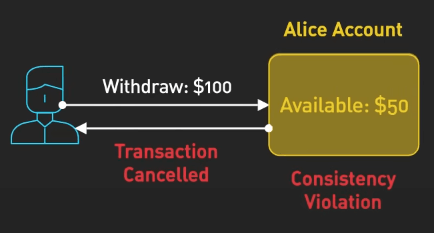{:class="centered-img"}

## Isolation (Tính độc lập)

Các transaction đồng thời sẽ không ảnh hưởng đến nhau, mỗi transaction sẽ chạy như không có transaction nào khác đang chạy. 

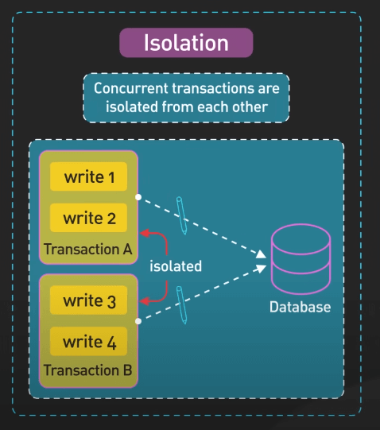{:class="centered-img"}

Cấp độ isolation cao nhất được gọi là "serializable". Nó khiến các transaction chạy lần lượt như thể chúng ở trong một hàng đợi duy nhất. Điều này cung cấp tính nhất quán mạnh nhất, nhưng có thể làm chậm mọi thứ vì mỗi transaction phải chờ tới lượt của mình. 

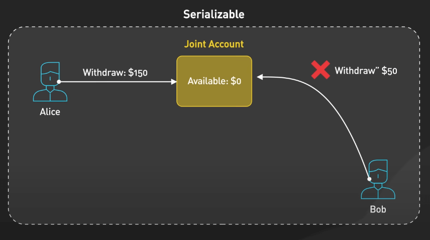{:class="centered-img"}

Để tăng tốc độ, cơ sở dữ liệu thường cung cấp các cấp độ isolation thấp hơn cho phép nhiều transaction chạy đồng thời hơn. Nhưng có một vấn đề - các cấp độ thấp này đôi khi dẫn đến sự không nhất quán, như dirty read, non-repeatable read và phantom read.

Dirty read xảy ra khi một transaction nhìn thấy dữ liệu đã bị thay đổi bởi một transaction khác mà chưa được commit. Hãy tưởng tượng một tài khoản ngân hàng với $100. Transaction T1 rút $20 nhưng không commit. Nếu Transaction T2 đọc số dư trước khi T1 commit, nó sẽ thấy $80. Nhưng nếu T1 rollback, số dư $80 đó chưa bao giờ tồn tại - đó là dirty read. 

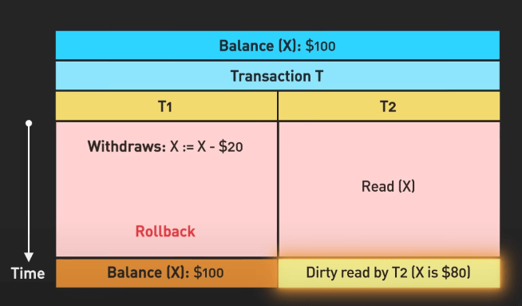{:class="centered-img"}

Cấp độ isolation "read committed" ngăn chặn dirty read bằng cách đảm bảo một transaction chỉ có thể nhìn thấy dữ liệu đã commit.

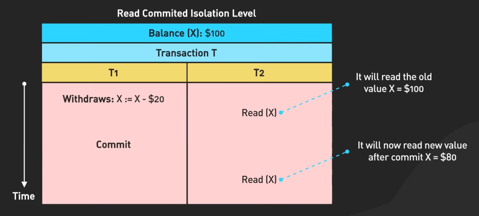{:class="centered-img"}

Nhưng vẫn có thể có non-repeatable read, khi một transaction đọc dữ liệu hai lần và nhận kết quả khác nhau vì một transaction khác đã thay đổi dữ liệu giữa hai lần đọc. Ví dụ, bạn kiểm tra số dư tài khoản và thấy $100. Sau đó, một transaction khác rút $50 và commit. Nếu bạn kiểm tra số dư một lần nữa trong cùng một transaction, bạn sẽ thấy $50. Đó là non-repeatable read.

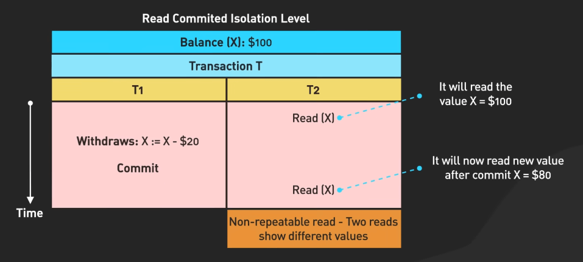{:class="centered-img"}

"Read committed" cũng có thể xảy ra phantom read, khi một transaction chạy lại một truy vấn và nhận kết quả khác vì một transaction khác đã thêm hoặc xóa row đó đi. Hãy tưởng tượng một transaction liệt kê tất cả các giao dịch chuyển khoản dưới $100. Trong khi đó, một transaction khác thêm một giao dịch $50 và commit. Nếu transaction đầu chạy lại truy vấn của mình, nó sẽ thấy giao dịch $50 mà trước đó không có - đó là phantom read.

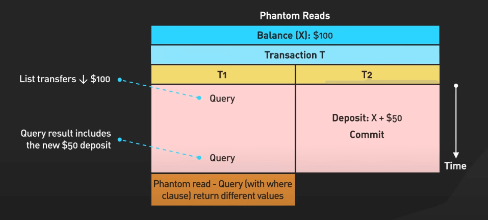{:class="centered-img"}

Cấp độ isolation "repeatable read" ngăn chặn non-repeatable read bằng cách cung cấp một snapshot nhất quán của dữ liệu cho mỗi transaction. Nhưng vẫn có thể có phantom read. Vì vậy, các cấp độ isolation thấp hơn hi sinh tính nhất quán để có hiệu suất tốt hơn. Bạn cần chọn sự cân bằng phù hợp cho ứng dụng của mình, cân nhắc giữa tốc độ và sự thiếu nhất quán.

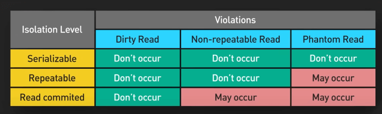{:class="centered-img"}

## Durability (Tính bền vững)

Khi một transaction được commit, dữ liệu sẽ tồn tại ngay cả khi hệ thống gặp sự cố. Tính bền vững thường được thực hiện thông qua việc ghi transaction logs hoặc sử dụng write-ahead logging (WAL) để lưu thay đổi vào đĩa trước khi xác nhận commit. 

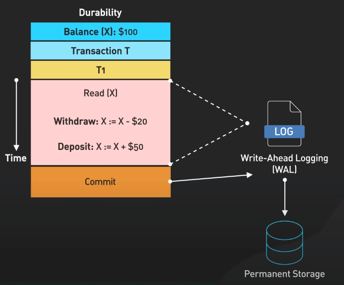{:class="centered-img"}

Trong cơ sở dữ liệu phân tán, tính bền vững cũng bao gồm việc sao chép dữ liệu qua nhiều node. Vì vậy, nếu một node gặp sự cố, bạn không mất bất kỳ transaction nào đã commit - chúng được lưu trữ an toàn trên các node khác.

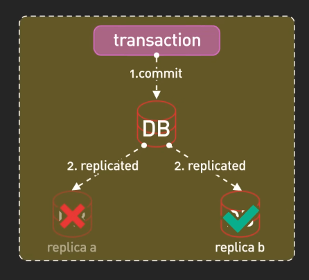{:class="centered-img"}

Tóm lại: Atomicity đảm bảo transaction toàn vẹn, Consistency giữ dữ liệu hợp lệ, Isolation ngăn chặn sự can thiệp, và Durability giữ cho dữ liệu tồn tại vĩnh viễn.

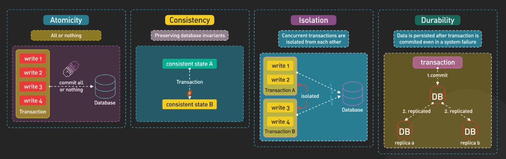{:class="centered-img"}
