# Các thuật toán quan trọng để phỏng vấn System Design

## Nguồn

 [Algorithms You Should Know Before System Design Interviews](https://www.youtube.com/watch?v=xbgzl2maQUU)

## Consistent Hashing

Có bao giờ bạn tự hỏi làm sao các hệ thống như Cassandra phân phối dữ liệu qua nhiều server chưa? Câu trả lời là họ dùng Consistent Hashing (băm nhất quán). Hãy tưởng tượng bạn có một vòng tròn, nơi mỗi key sau khi được băm sẽ ánh xạ (map) đến một điểm trên vòng tròn đó. Các server được gán các phạm vi trên vòng tròn này. 

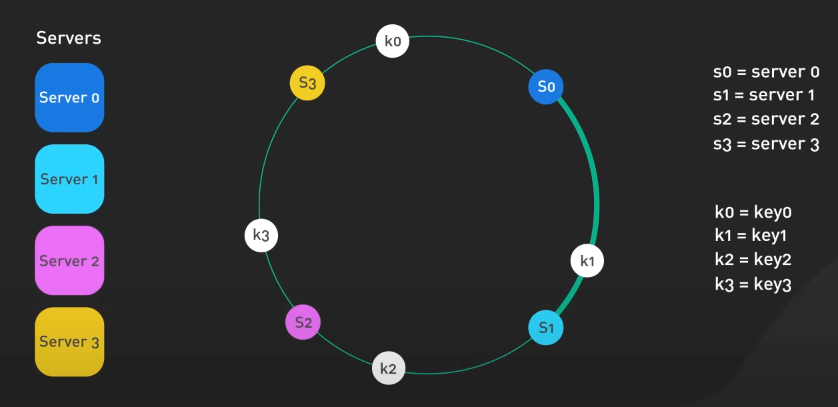{:class="centered-img"}

Nghĩa là khi thêm hoặc bớt các server, chỉ có các key trong vùng ảnh hưởng cần phải ánh xạ lại. Việc này tốt hơn nhiều so với ánh xạ băm bình thường, khi ta cần phải ánh xạ lại toàn bộ các key khi các server có sự thay đổi. 

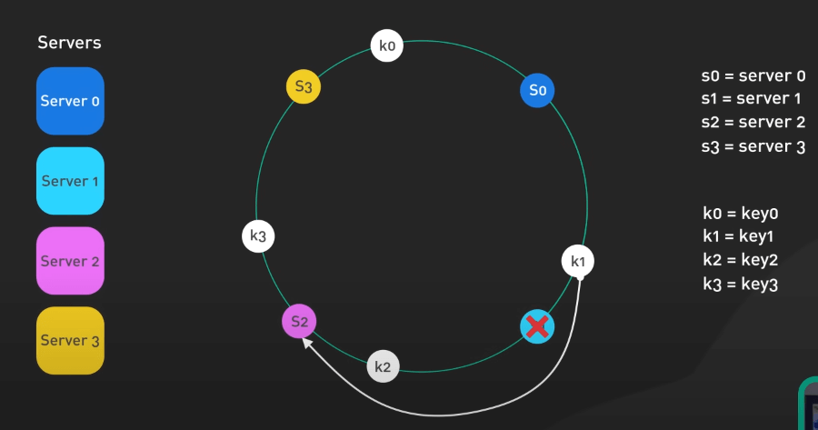{:class="centered-img"}

Cái hay ở đây là việc sử dụng các node ảo (virtual node), giúp giải quyết vấn đề phân phối dữ liệu không đồng đều. Hãy tìm hiểu các biến thể khác như Rendezvous Hashing hoặc Jump Consistent Hashing nếu bạn muốn tìm hiểu sâu hơn. Nếu bạn làm về caching phân tán hoặc cơ sở dữ liệu, Consistent Hashing là một kiến thức rất hữu ích. Trong thời đại của big data, việc đảm bảo phân phối dữ liệu hiệu quả là rất quan trọng. Consistent Hashing giảm thiểu sự gián đoạn khi các server thay đổi.

## Quadtree cho Spatial Indexing

Quadtree hoạt động bằng cách chia không gian 2D thành 4 phần. Mỗi node đại diện cho một vùng, có từ 0 đến 4 node con. 

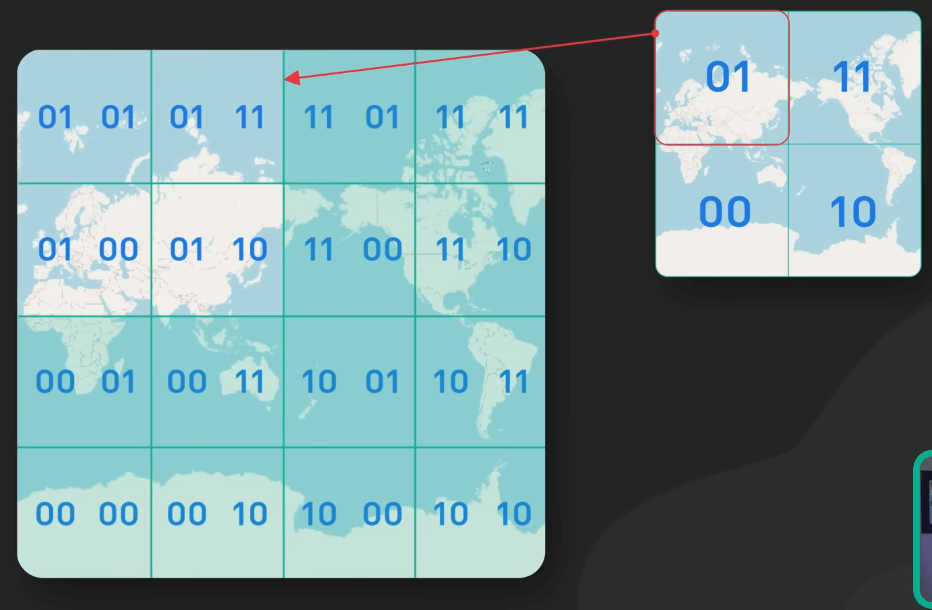{:class="centered-img"}

Tại sao lại là quadtree? Nó cho phép ta chèn và tìm kiếm vị trí nhanh chóng. Ta có thể tìm nhanh các điểm trong một bán kính bằng cách duyệt cây và loại bỏ các nhánh nằm ngoài phạm vi. Việc này giúp cho quadtree trở nên vô cùng hữu ích để index trong không gian, thứ được sử dụng rất nhiều trong các ứng dụng bản đồ. 

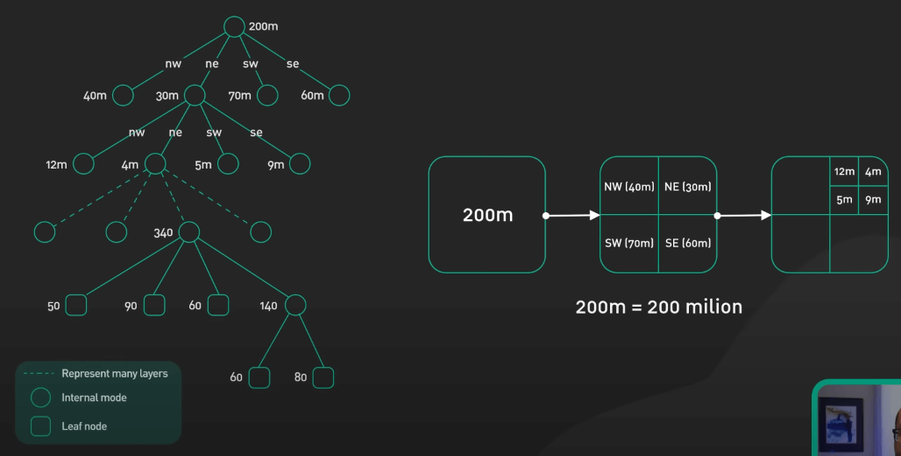{:class="centered-img"}

Quadtree rất linh hoạt và hiệu quả cho việc index không gian 2D. Hãy tìm hiểu các cây index không gian khác như R-trees và KD-trees nếu bạn muốn biết thêm.

## Thuật toán Leaky Bucket cho Rate Limiting

Giả sử ta có một cái xô với một cái lỗ nhỏ ở đáy, đó là một cái xô bị thủng và nó sẽ rỉ nước (leaky bucket). Các request đổ vào như nước, nhưng nếu xô đầy, các request sẽ bị từ chối cho đến khi cái xô có chỗ chứa. Việc cài đặt cũng rất đơn giản. Kích thước xô kiểm soát dung lượng lớn, và xô rò nước với tốc độ mà ta muốn. Mỗi request giống như thêm nước vào xô. Nếu xô tràn, các request sẽ phải chờ. Có các thuật toán rate limiting khác như token bucket và sliding window counter. Chúng là các thuật toán đơn giản và hiệu quả, mỗi thuật toán đều có những sự đánh đổi giữa độ chính xác và hiệu suất.

## Cây Trie cho tìm kiếm xâu

Tiếp theo ta đến với trie, một cấu trúc dữ liệu dạng cây được tối ưu để tìm kiếm xâu hoặc các tiền tố của xâu. Mỗi node của cây biểu thị một tiền tố chung, với các node chia sẻ các tiền tố sử dụng cùng một cây con. 

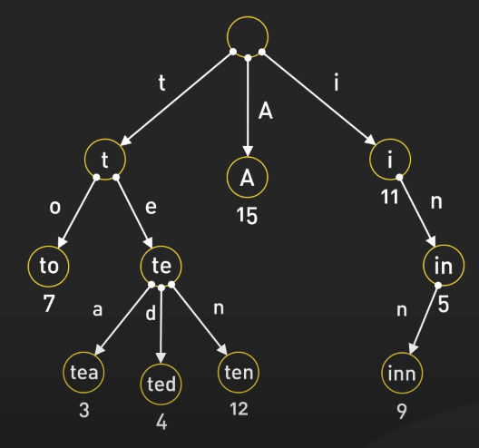{:class="centered-img"}

Sức mạnh của trie nằm ở tốc độ tra cứu nhanh chóng và vô cùng tiện lợi. Giả sử bạn đang tìm kiếm một từ hoặc tiền tố trong một tập dữ liệu lớn. Với trie, ta không cần phải duyệt qua từng từ. Thay vào đó, việc tìm kiếm sẽ diễn ra theo từng ký tự, di chuyển qua các nhánh khớp với từ khóa. Việc này giúp các thao tác như autocomplete trong các công cụ tìm kiếm hoặc trình soạn thảo văn bản trở nên nhanh chóng hơn nhiều so với các cấu trúc khác như hash table hoặc mảng. 

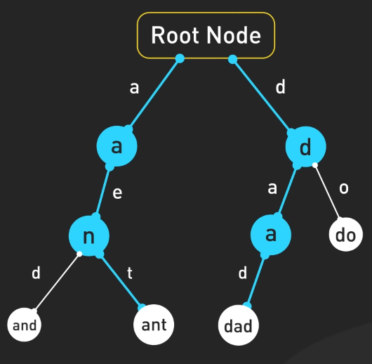{:class="centered-img"}

Một điểm cần lưu ý là trie có thể tiêu tốn nhiều bộ nhớ hơn so với các cấu trúc khác, do mỗi node thường lưu nhiều con trỏ trỏ sang các node khác. 

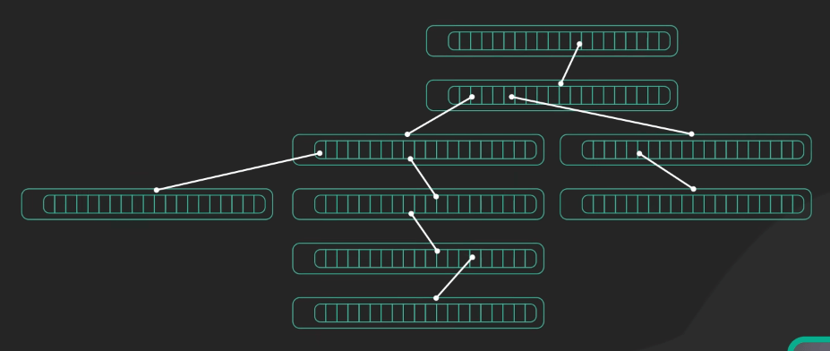{:class="centered-img"}

Có các biến thể như radix trie hoặc suffix trie giúp tối ưu hóa việc sử dụng bộ nhớ. Trie là một nền tảng mạnh mẽ cho việc tìm kiếm dựa trên xâu.

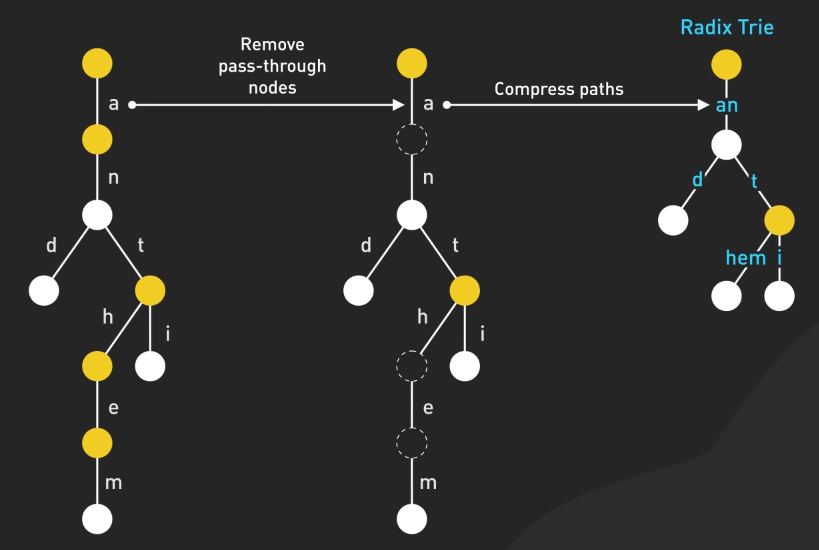{:class="centered-img"}

## Bloom Filter

Tiếp theo, ta đến với Bloom filter. Đây là một cấu trúc dữ liệu xác suất dùng để kiểm tra sự tồn tại của một phần tử trong một tập hợp. Hãy tưởng tượng một mảng bit kết hợp với một số hàm băm. Các phần tử khi cho vào tập hợp sẽ được băm và các bit tương ứng được set. Để kiểm tra sự tồn tại của phần tử nào đó, ta xem xem tất cả các bit đã được set chưa. Nếu không thì chắc chắn không có trong tập hợp. Nhưng nếu đủ thì lại chỉ có thể có trong tập hợp, nhưng cần chú ý đến các kết quả dương tính giả (false positive). 

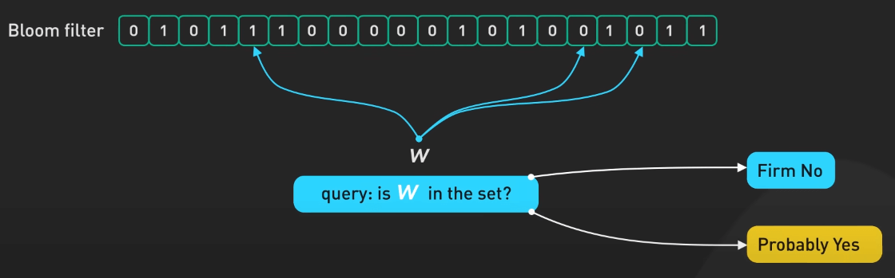{:class="centered-img"}

Ta cũng không thể xóa phần tử sau khi thêm vào. Với các trường hợp dương tính giả, ta có thể điều chỉnh kích thước hoặc hàm băm để cân bằng giữa không gian và độ chính xác. Bloom filter rất hữu ích trong việc lọc, loại bỏ trùng lặp và phân tích bằng cách nhanh chóng loại bỏ nhiễu.

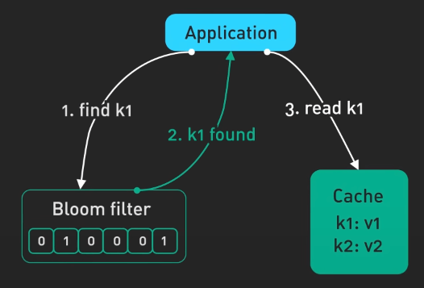{:class="centered-img"}

## Các thuật toán đồng thuận (Consensus Algorithms)

Trong các hệ thống phân tán, việc đạt được đồng thuận (consensus) nghĩa là việc đảm bảo tất cả các node đều nhất quán với một trạng thái chung. Đây là một thách thức, đặc biệt là với các sự cố mạng. Các thuật toán như Paxos hay Raft được thiết kế để giải quyết vấn đề này. 

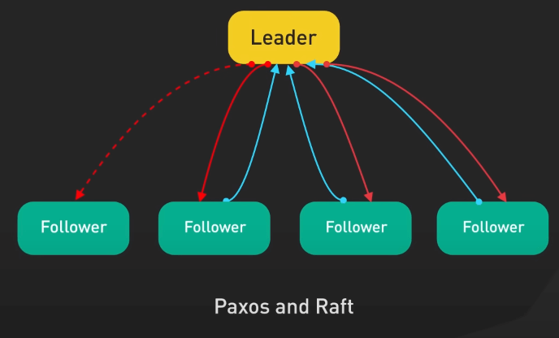{:class="centered-img"}

Ví dụ với Raft, nó bầu ra một leader để quản lý việc sao chép trạng thái trên toàn bộ cluster. Nếu các node chết đi, Raft bảo đảm hệ thống vẫn hoạt động để tránh dữ liệu không nhất quán và downtime. Một điểm cộng lớn của Raft là nó khá dễ hiểu và triển khai. Nhiều hệ thống phân tán như Kafka và etcd đã áp dụng Raft cho việc sao chép, chuyển giao và bầu ra leader. Paxos ra đời trước Raft và có ý nghĩa lịch sử nhưng phức tạp hơn nhiều.
