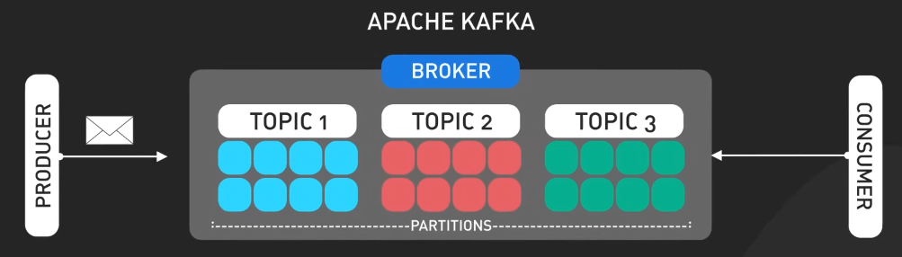

# Tóm tắt nhanh về Apache Kafka

## Nguồn

 [System Design: Apache Kafka In 3 Minutes](https://www.youtube.com/watch?v=HZklgPkboro)

## Giới thiệu

Apache Kafka là một nền tảng phân tán chuyên xử lý dữ liệu dòng thời gian thực ở quy mô lớn. Kafka được phát triển tại LinkedIn, để giải quyết vấn đề xử lý lượng lớn dữ liệu event với độ trễ thấp. Nó được phát hành mã nguồn mở vào năm 2011 thông qua Quỹ Apache và nhanh chóng trở thành một trong những nền tảng streaming event phổ biến nhất.

## Tổng quan

Dữ liệu event trong Kafka được tổ chức thành các topic (chủ đề), được phân phối trên nhiều server gọi là các broker. Việc này đảm bảo rằng dữ liệu luôn dễ truy cập và có khả năng chịu lỗi khi hệ thống gặp sự cố. Các ứng dụng gửi dữ liệu vào Kafka gọi là các producer (nhà sản xuất), trong khi các ứng dụng tiêu thụ dữ liệu gọi là các consumer (người tiêu thụ). Sức mạnh của Kafka nằm ở khả năng xử lý lượng dữ liệu khổng lồ, tính linh hoạt trong việc tương thích với nhiều ứng dụng khác nhau, và khả năng chịu lỗi tốt. Điều này giúp Kafka khác biệt so với các hệ thống messaging đơn giản hơn.

{:class="centered-img"}

Kafka đã trở thành một thành phần quan trọng trong kiến trúc hệ thống hiện đại nhờ khả năng cung cấp dòng dữ liệu thời gian thực và quy mô lớn. Hãy cùng điểm qua một số use case phổ biến và quan trọng nhất của Kafka.

## Các use case

Trước hết, Kafka có thể hoạt động như một hàng đợi thông điệp có độ tin cậy và khả năng mở rộng cao. Nó tách biệt giữa producer và consumer, cho phép chúng hoạt động độc lập và hiệu quả ở quy mô lớn. 

{:class="centered-img"}

Ví dụ như việc theo dõi hoạt động, Kafka rất phù hợp để lấy và lưu trữ các sự kiện thời gian thực như lượt nhấp chuột, lượt xem và giao dịch mua hàng từ các trang web và ứng dụng có lượng truy cập cao. Các công ty như Uber và Netflix sử dụng Kafka để phân tích các hoạt động người dùng trong thời gian thực.

{:class="centered-img"}

Đối với việc thu thập dữ liệu từ nhiều nguồn, Kafka có thể hợp nhất các dòng dữ liệu khác nhau vào một pipeline thời gian thực thống nhất để phân tích và lưu trữ. Điều này cực kỳ hữu ích trong việc tập hợp dữ liệu từ internet of things (IoT) và các cảm biến. 

{:class="centered-img"}

Trong kiến trúc microservices, Kafka đóng vai trò là bus dữ liệu thời gian thực giúp các dịch vụ khác nhau liên lạc với nhau.

{:class="centered-img"}

Kafka cũng rất hữu ích trong việc giám sát và quan sát khi được tích hợp với ELK stack. Nó thu thập các số liệu, nhật ký ứng dụng và dữ liệu mạng theo thời gian thực, sau đó có thể được tập hợp và phân tích để theo dõi tình trạng và hiệu suất của hệ thống.

{:class="centered-img"}

Cuối cùng, Kafka cho phép xử lý dòng dữ liệu lớn thông qua kiến trúc phân tán của nó. Kafka có thể xử lý lượng lớn dòng dữ liệu thời gian thực, ví dụ như xử lý dữ liệu nhấp chuột của người dùng để đưa ra đề xuất sản phẩm, phát hiện bất thường trong dữ liệu cảm biến IoT, hoặc phân tích dữ liệu thị trường tài chính.

{:class="centered-img"}

## Hạn chế

Tuy nhiên, Kafka cũng có một số hạn chế. Nó khá phức tạp và khó học. Cần có chuyên môn để thiết lập, mở rộng và bảo trì hệ thống. Kafka cũng tiêu tốn nhiều tài nguyên, đòi hỏi phần cứng và đầu tư vận hành đáng kể, có thể không phù hợp cho các công ty khởi nghiệp nhỏ. Ngoài ra, Kafka cũng không phù hợp cho các ứng dụng đòi hỏi độ trễ cực thấp như giao dịch tần suất cao, nơi mà bạn chậm hơn người ta vài mili giây cũng mất một đống tiền.

{:class="centered-img"}
