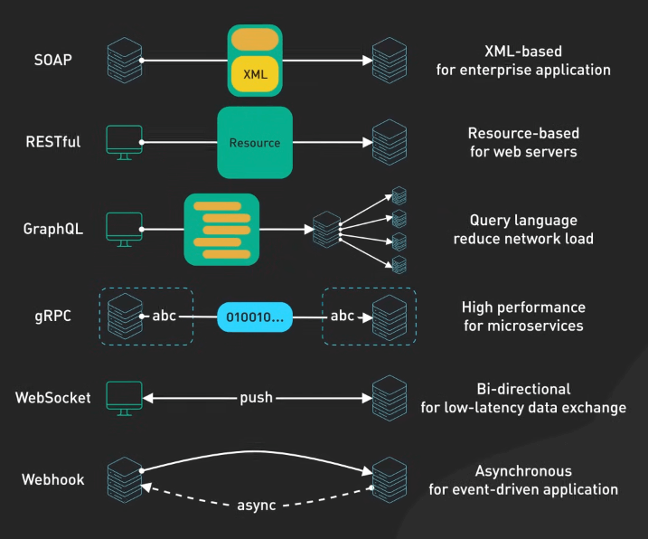
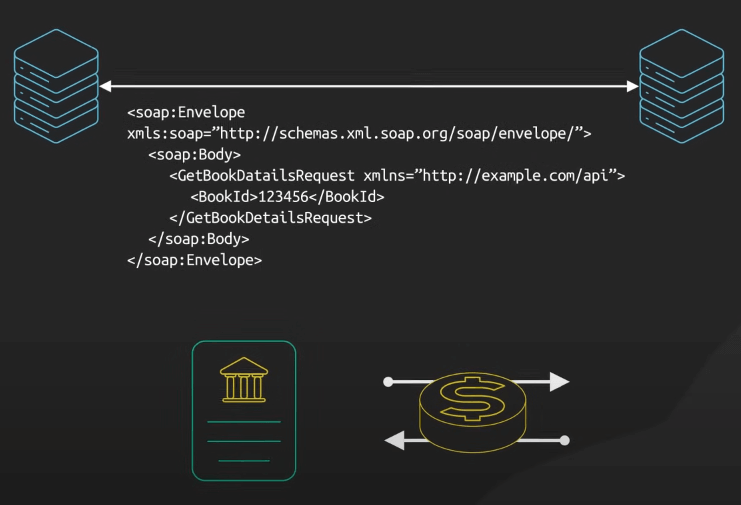
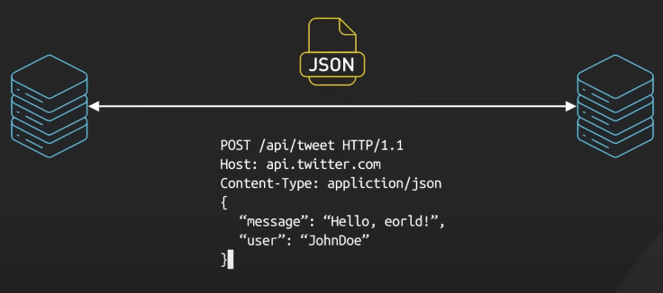
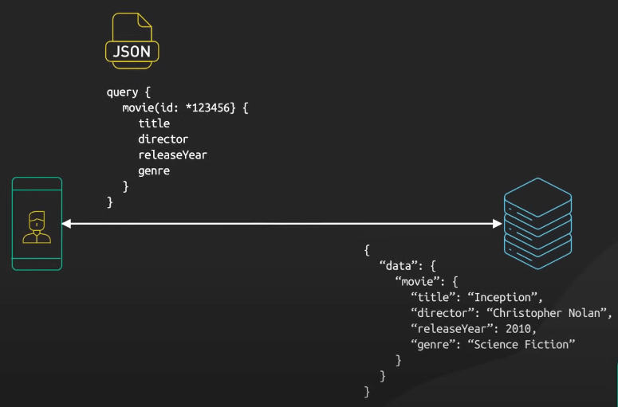
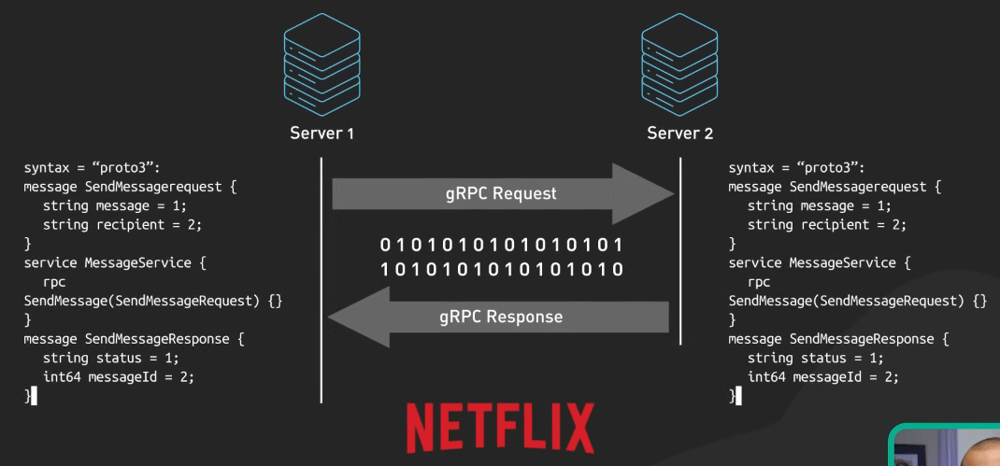
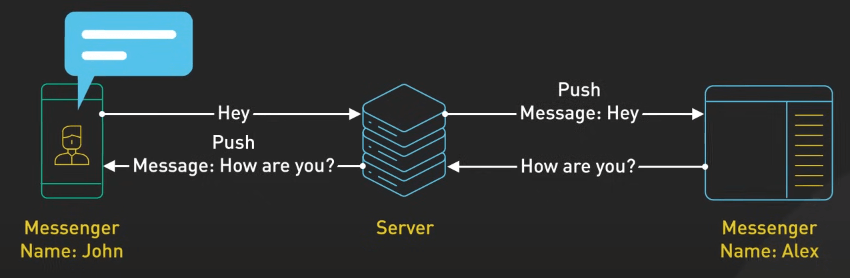
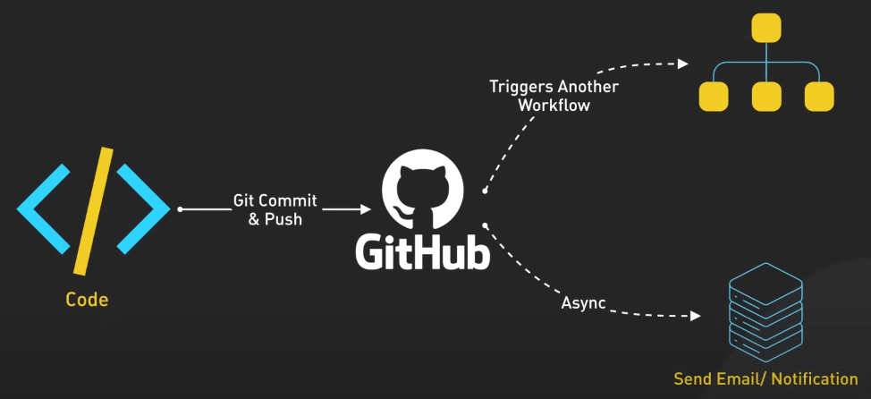

# 6 kiến trúc phổ biến trong thiết kế API

## Nguồn

 [Top 6 Most Popular API Architecture Styles](https://www.youtube.com/watch?v=4vLxWqE94l4)

## Giới thiệu

API, hay Application Programming Interfaces - giao diện lập trình ứng dụng, đóng vai trò cực kỳ quan trọng trong phát triển phần mềm. Chúng giống như cầu nối, cho phép các thành phần phần mềm khác nhau giao tiếp và tương tác với nhau. Chúng chịu trách nhiệm trao đổi dữ liệu, gọi hàm, và tích hợp giữa các thành phần hệ thống khác nhau.

Để hỗ trợ các hoạt động này, có nhiều kiến trúc khác nhau, mỗi kiến trúc có triết lý thiết kế và các use case riêng.

{:class="centered-img"}

## SOAP

Đầu tiên, chúng ta có SOAP. Đây là một kiến trúc cổ điển, toàn diện, và dựa trên XML. SOAP được sử dụng rộng rãi trong các dịch vụ tài chính và cổng thanh toán, nơi tính bảo mật và uy tín đóng vai trò tối quan trọng. Tuy nhiên, nếu bạn đang làm việc trên một ứng dụng di động hoặc một prototype nhanh, SOAP có thể quá phức tạp vì sự cồng kềnh của nó.

{:class="centered-img"}

## RESTful

Tiếp đến, ta có RESTful APIs. Chúng giống như cột sống của Internet, phổ biến, dễ triển khai, và sử dụng HTTP. Hầu hết các web service mà bạn tương tác hàng ngày, như Twitter hoặc YouTube, đều dùng RESTful APIs. Tuy nhiên, nếu bạn cần dữ liệu thời gian thực hoặc hoạt động với mô hình dữ liệu kết nối mạnh, REST có thể không phải là ưu tiên số 1.

{:class="centered-img"}

## GraphQL

GraphQL không chỉ là một kiến trúc mà còn là một ngôn ngữ truy vấn, cho phép client yêu cầu một số dữ liệu cụ thể. Điều này giúp tránh việc lấy quá nhiều hoặc quá ít dữ liệu. Bạn lấy những thứ bạn cần, giúp cho việc giao tiếp mạng hiệu quả hơn và phản hồi nhanh hơn. 

{:class="centered-img"}

Facebook phát triển GraphQL để cung cấp dữ liệu hiệu quả và chính xác cho hàng tỷ người dùng của mình. GraphQL cũng được sử dụng bởi các công ty như GitHub hay Shopify. Tính mềm dẻo và hiệu quả giúp nó trở thành lựa chọn phổ biến cho các ứng dụng với yêu cầu dữ liệu phức tạp. Tuy nhiên, việc học GraphQL sẽ tốn nhiều thời gian hơn bạn nghĩ, và cũng cần xử lý nhiều hơn ở phía server để phục vụ tính linh hoạt.

## gRPC

gRPC là một kiến trúc hiện đại, hiệu suất cao, sử dụng Protocol Buffers. Nó là lựa chọn cho các kiến trúc microservice và các công ty như Netflix, để xử lý việc giao tiếp liên tục giữa các service với nhau. Tuy nhiên, nếu sử dụng gRPC trên trình duyệt, bạn sẽ gặp một số khó khăn vì các trình duyệt ít hỗ trợ gRPC.

{:class="centered-img"}

## WebSocket

WebSocket được sử dụng khi bạn cần các kết nối liên tục, hai chiều, theo thời gian thực, phù hợp với các ứng dụng chat, chơi game theo thời gian thực, nơi cần truyền dữ liệu nhanh chóng và liên tục. Nhưng nếu ứng dụng của bạn không yêu cầu dữ liệu thời gian thực, việc sử dụng WebSocket có thể không cần thiết.

{:class="centered-img"}

## Webhook

Webhook là một cơ chế theo sự kiện, hay còn gọi là thông báo, callback, và thao tác bất đồng bộ. Ví dụ, GitHub dùng Webhook để thông báo cho các hệ thống khác khi một commit mới được push lên. Tuy nhiên, nếu bạn cần giao tiếp đồng bộ hay hay phản hồi ngay lập tức, Webhook có thể không phù hợp.

{:class="centered-img"}
