# 7 mẹo vặt cho thiết kế API

## Nguồn

 [Good APIs Vs Bad APIs: 7 Tips for API Design](https://www.youtube.com/watch?v=_gQaygjm_hg)

## Đặt tên rõ ràng

Khi xây dựng API, chọn tên rõ ràng và hợp logic. Thay vì dùng `/cart/123` cho một app mua hàng, hãy sử dụng `/carts/123`. Danh từ số nhiều sẽ cho người sử dụng API biết rằng mình đang làm việc với một tập các tài nguyên. Hãy nhất quán, nó sẽ giúp người dùng dễ dàng hơn khi sử dụng API của bạn.

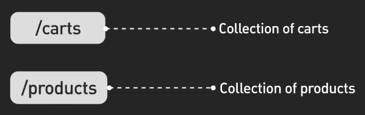{:class="centered-img"}

## Đảm bảo độ tin cậy của các idempotent API

Idempotency nghĩa là làm cho việc gọi API nhiều lần cũng giống như gọi một lần. Ý tưởng này là chìa khóa cho các API tin cậy, giúp tránh lỗi khi API được gọi lại, có thể do lỗi mạng.

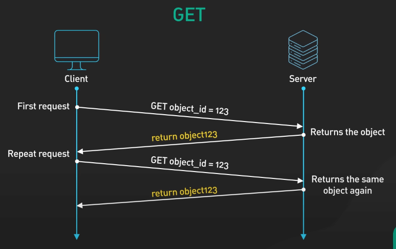{:class="centered-img"}

Thông thường, các request POST không phải idempotent vì gửi một request POST hai lần có thể tạo ra hai object giống nhau.

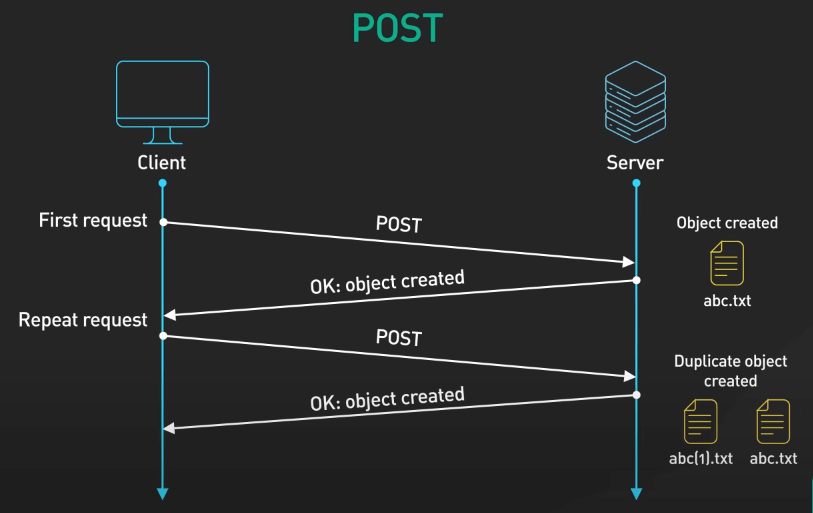{:class="centered-img"}

Ta có thể thêm logic để tránh tạo ra các object giống nhau, bằng cách sinh một ID mới cho các request khác nhau.

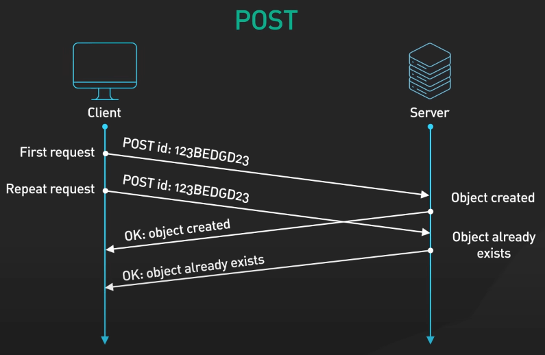{:class="centered-img"}

Các request GET thì thường idempotent. Các request GET giống nhau sẽ trả về thông tin như nhau.

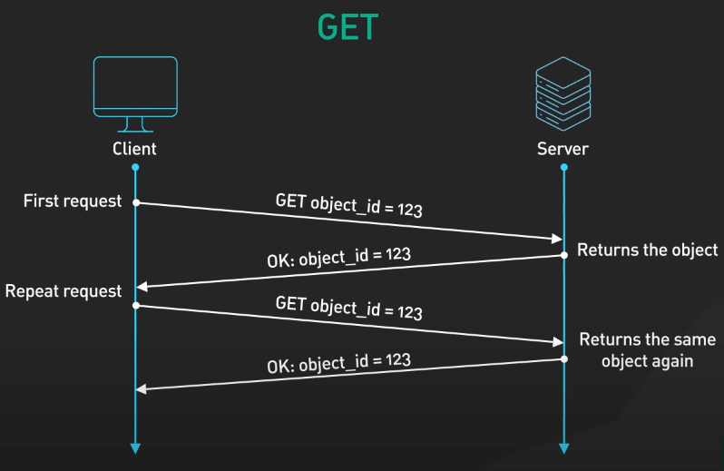{:class="centered-img"}

Các request PUT sẽ update toàn bộ object nên cũng thường là idempotent. Tuy nhiên, các request PATCH thì lại update một số trường của object thôi. Ví dụ, nếu bạn gửi PATCH request hai lần để thêm một màu xanh vào một trường màu (một mảng), ta sẽ có hai màu xanh trong mảng đó. Vì vậy, PATCH request không phải idempotent.

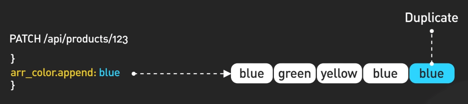{:class="centered-img"}

Cuối cùng, các request DELETE sẽ idempotent. DELETE sẽ chỉ thực hiện một lần khi gọi nhiều lần. Nếu object đã bị xóa thì DELETE sẽ chỉ trả về lỗi gì đó thôi, còn thông tin của object đã bị xóa sẽ không còn.

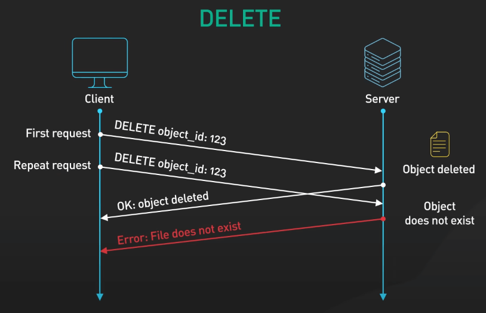{:class="centered-img"}

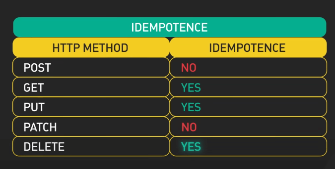{:class="centered-img"}

## Thêm phiên bản (versioning) vào API

API sẽ phát triển và cần update liên tục. Bạn sẽ cần phải update mà không làm gián đoạn hoạt động hiện tại của ứng dụng. Một URL kiểu `v1/carts/123` sẽ giúp bạn update thành `v2/carts/123` mà không ảnh hưởng đến những người đang sử dụng API trước đó.

Việc thêm phiên bản sẽ giúp hỗ trợ cả những người dùng cũ và mới, giúp người sử dụng nâng cấp bất kỳ lúc nào mà họ muốn và giúp cho việc tài liệu hóa API dễ dàng hơn.

## Thêm phân trang

Phân trang giúp kiểm soát số lượng tài nguyên trả về khi gọi API. Những cách phân trang phổ biến bao gồm: Page + Offset và Cursor-based.

Phân trang kiểu Page + Offset sử dụng số trang và số lượng tài nguyên trên mỗi trang. Ví dụ, trang 2 sẽ bao gồm các tài nguyên đánh số từ 11 đến 20 khi mỗi trang có 10 tài nguyên. Rất đơn giản, nhưng có thể chậm đi với tập du liệu lớn, vì database sẽ phải đếm tất cả các dòng từ đầu cho đến trang cần trả về.

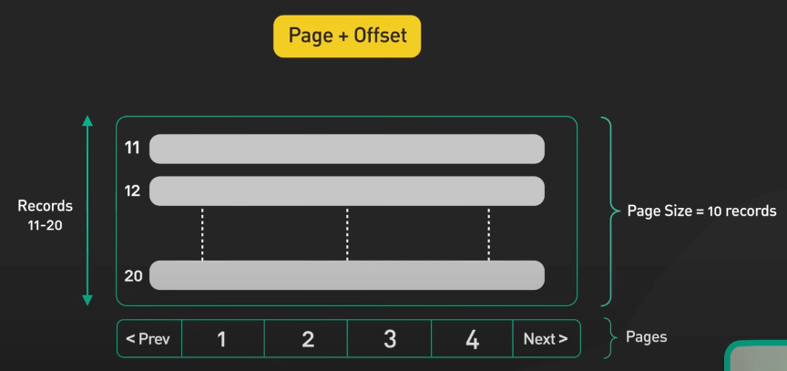{:class="centered-img"}

Phân trang kiểu Cursor-based sử dụng một con trỏ để xác định vị trí của tài nguyên trong tập dữ liệu. Nó theo dấu tài nguyên một cách chính xác, dù với tập dữ liệu thay đổi liên tục.

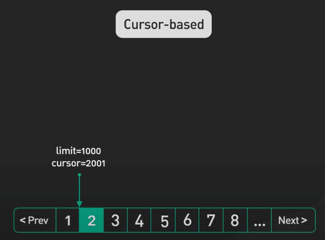{:class="centered-img"}

Phân trang giúp tránh việc trả về quá nhiều dữ liệu mà người dùng không cần, giúp giảm tải cho server và cải thiện trải nghiệm người dùng.

## Sử dụng truy vấn rõ ràng để sắp xếp và lọc dữ liệu

Ví dụ, nếu bạn muốn sắp xếp các user theo ngày đăng ký tài khoản, dùng truy vấn kiểu `/users?sort_by=registered`. Nếu muốn lọc ra các product có màu xanh chẳng hạn, dùng `/products?filter=color:blue`.

Lợi thế ở đây là gì?

1. Query string kiểu này giúp ta truy vấn một cách tự nhiên, dễ đọc và dễ hiểu.
2. Bạn có thể thêm điều kiện lọc bất kỳ lúc nào bạn muốn mà không làm thay đổi cấu trúc của API.
3. Kết quả lọc và sắp xếp có thể được cache ở đâu đó giúp giảm tải cho server.

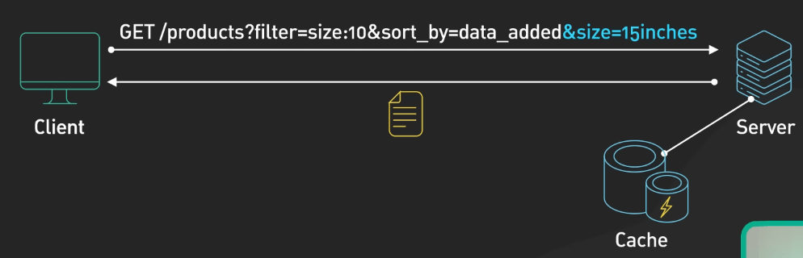{:class="centered-img"}

## Hãy quan tâm đến bảo mật

Với các credential nhạy cảm như API key, bạn nên cho vào header thay vì dùng trực tiếp trên URL. URL sẽ được log trên server và người ta có thể dễ dàng thấy được nó. Các header như Authorization giúp tránh tình trạng đó.

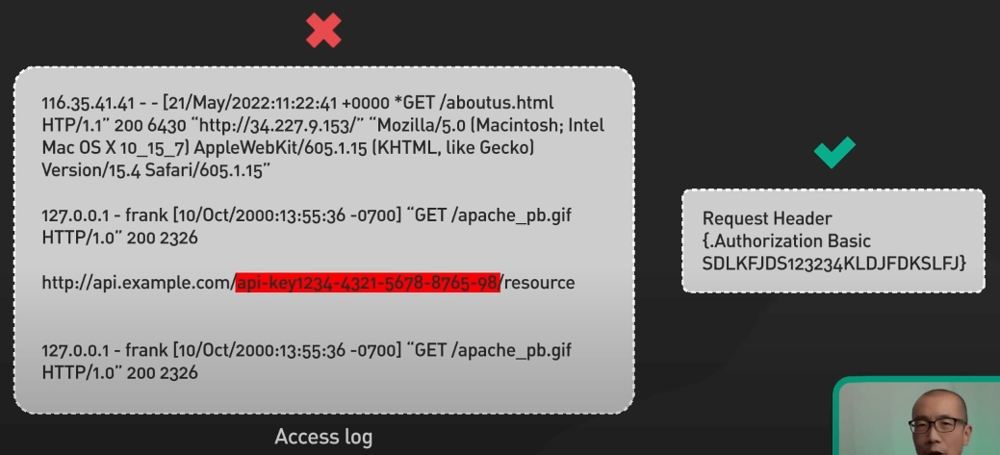{:class="centered-img"}

Tuy nhiên, header vẫn có thể làm rò rỉ thông tin, vì vậy bạn nên mã hóa TLS cho API của mình.

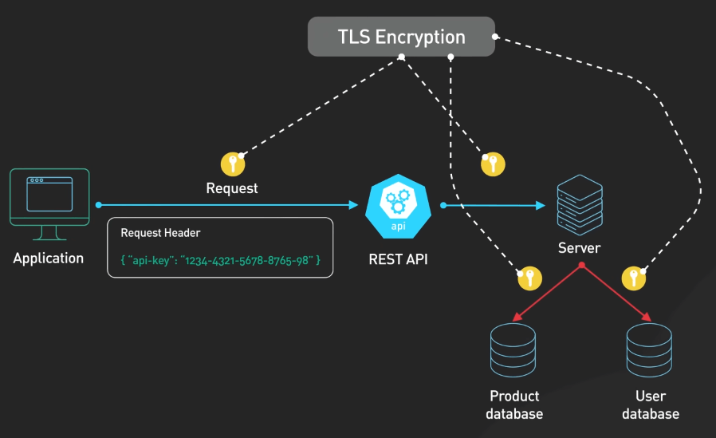{:class="centered-img"}

Kiểm soát truy cập (Access Control) chặt chẽ cho các API, xác thực tất cả các key hay token nhận được trước khi xử lý API.

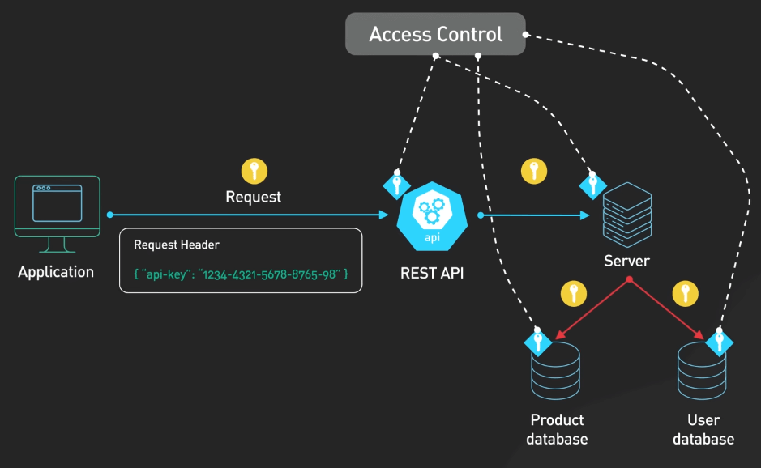{:class="centered-img"}

Bảo mật là một chủ đề rộng lớn, ta chỉ chạm vào phần nhỏ ở đây thôi. Hãy tìm hiểu thêm về bảo mật API để đảm bảo API của bạn an toàn nhé.

## Đơn giản hóa việc truy vấn đa tài nguyên

Truy vấn đa tài nguyên cần rõ ràng và đơn giản. Ví dụ, ta dùng `carts/123/items/321` để lấy thông tin item 321 trong cart 123, không nên dùng `items?cart_id=123&item_id=321`. Điều này giúp việc tích hợp trở nên dễ dàng hơn.

## Bonus: Sử dụng rate limiting

Rate limiting giúp giảm tải cho server, tránh bị quá tải hoặc tấn công. Ta có thể dùng một số tiêu chí như địa chỉ IP, tài khoản người dùng, hay các API để giới hạn số lượng request mà một người dùng có thể gửi trong một khoảng thời gian nhất định.

Ví dụ, người dùng miễn phí có thể gọi 1000 request mỗi ngày, và mỗi địa chỉ IP có thể gọi 20 lần mỗi phút.

