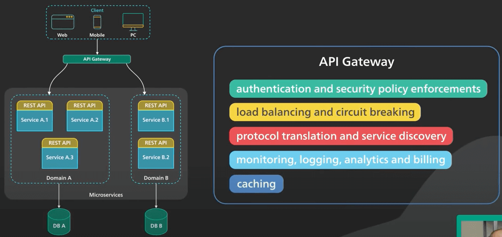
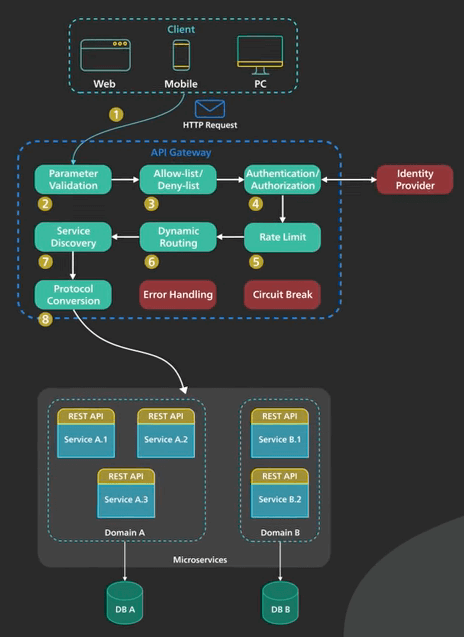
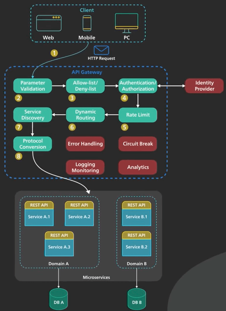
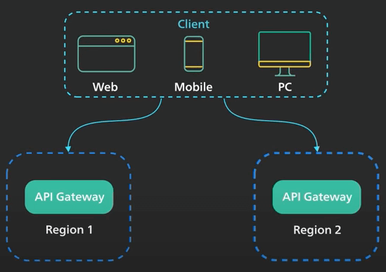
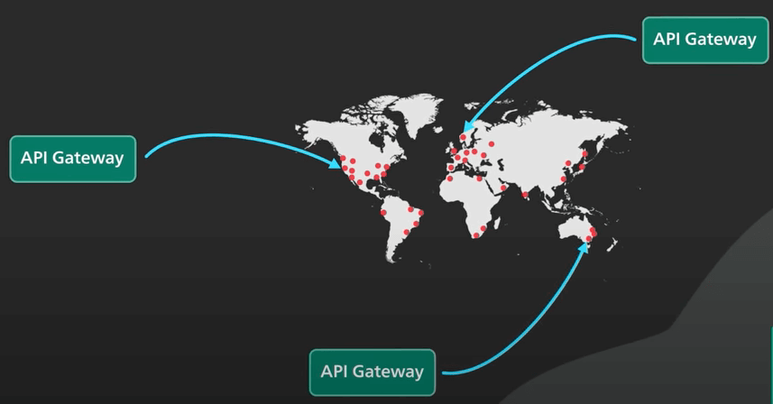

# API Gateway là gì?

## Nguồn

 [What is API Gateway?](https://www.youtube.com/watch?v=6ULyxuHKxg8)

## Khái niệm

API gateway là một điểm truy cập duy nhất của các client vào một ứng dụng. Nó nằm giữa client và một tập các backend service của ứng dụng. Một API gateway thường cung cấp một số chức năng quan trọng như:

- Xác thực người dùng và thực thi các chính sách bảo mật của ứng dụng.
- Cân bằng tải và ngắt mạch (circuit breaking).
- Biên dịch giao thức và khám phá dịch vụ
- Giám sát, logging, phân tích và thanh toán.
- Caching.

{:class="centered-img"}

## Quy trình

Ta hãy xem xét một quy trình thông thường của một request từ client qua API gateway đến backend service.

**Bước 1**: Client gửi một request đến API gateway. Request này thường qua giao thức HTTP. Nó có thể là REST, GraphQL, v.v...

**Bước 2**: API gateway xác thực HTTP request.

**Bước 3**: API gateway kiểm tra địa chỉ IP của client và các HTTP header với allow-list (whitelist) và deny-list (blacklist). Nó cũng có thể kiểm tra rate limit đơn giản với một số thuộc tính nhất định như địa chỉ IP và HTTP header. Ví dụ, nó có thể từ chối các request đến từ một IP address vượt quá một tỉ lệ nhất định.

**Bước 4**: API gateway đưa request đến một bên xác thực danh tính để xác thực và uỷ quyền cho request. API gateway nhận một phiên xác thực từ bên đó với phạm vi về những thứ được phép làm của client.

**Bước 5**: Một rate limit check chặt chẽ hơn được dùng để kiểm tra phiên xác thực ban nãy. Nếu vượt quá giới hạn, request sẽ bị từ chối.

**Bước 6 và 7**: Với sự giúp đỡ của thành phần khám phá dịch vụ (service discovery component), API gateway định vị dịch vụ phù hợp ở backend để xử lý request bằng cách so đường dẫn.

{:class="centered-img"}

**Bước 8**: API gateway chuyển đổi request thành một giao thức phù hợp và gửi request mới sang backend service. Một ví dụ là gRPC. 

Khi response trở lại từ backend service, API gateway sẽ chuyển đổi response lại thành giao thức cũ (trước bước 8) và trả lại response này cho client.

API gateway chuẩn cũng cung cấp các dịch vụ quan trọng khác. Ví dụ, một API gateway sẽ theo dõi lỗi và cung cấp chức năng ngắt mạch để bào vệ service khỏi bị quá tải. API gateway cũng cần cung cấp logging, giám sát, và dịch vụ phân tích để phục vụ mục đích theo dõi.

{:class="centered-img"}

API gateway là một yếu tố quan trọng trong cơ sở hạ tầng. Nó nên được triển khai cho nhiều khu vực để cải thiện tính khả dụng. Với nhiều dịch vụ đám mây từ các nhà cung cấp, API gateway được triển khai trên toàn thế giới để gần với khách hàng hơn.

{:class="centered-img"}

{:class="centered-img"}
