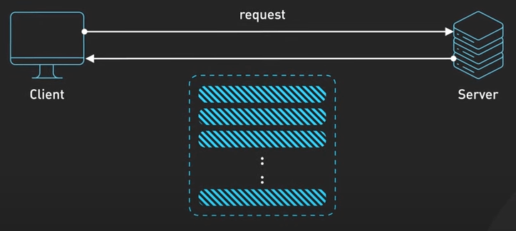
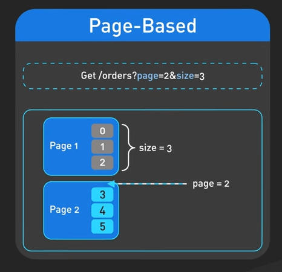
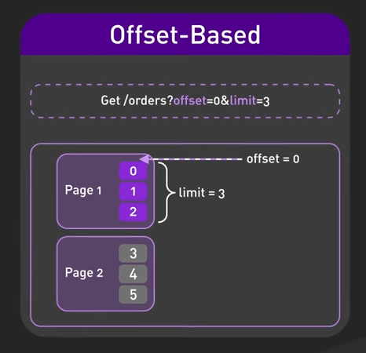
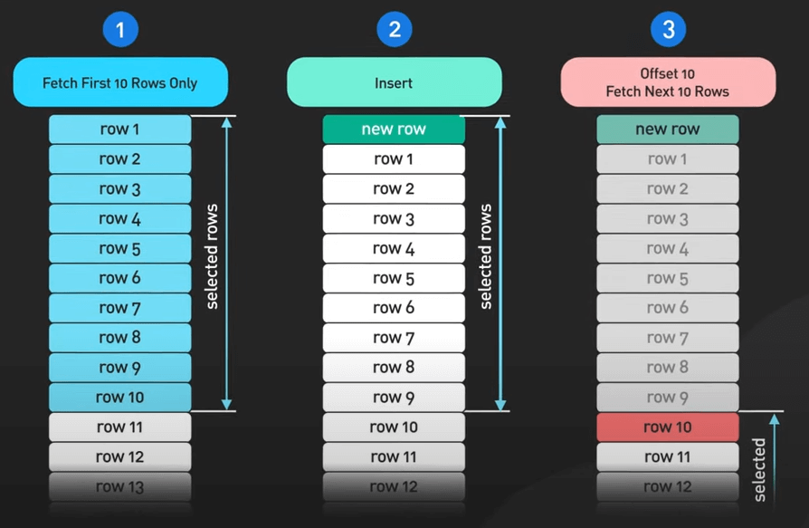
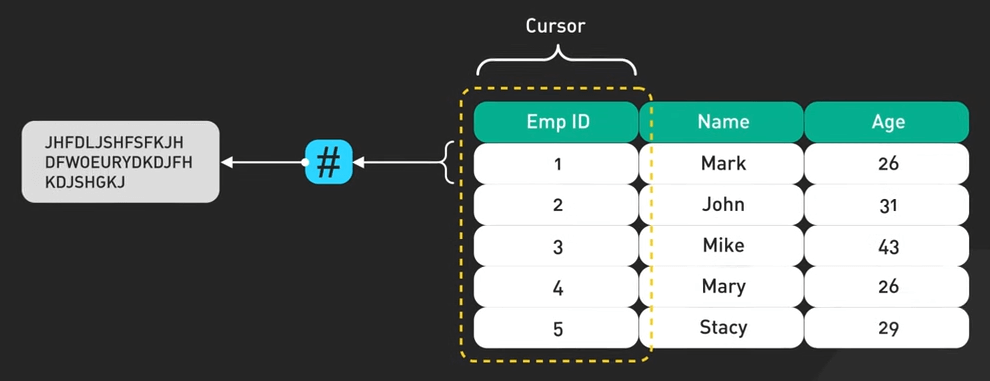
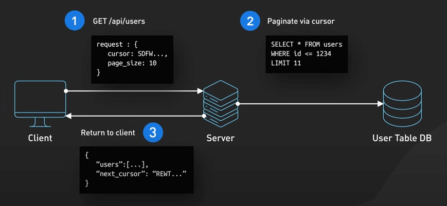
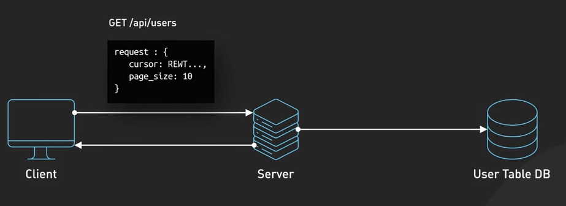
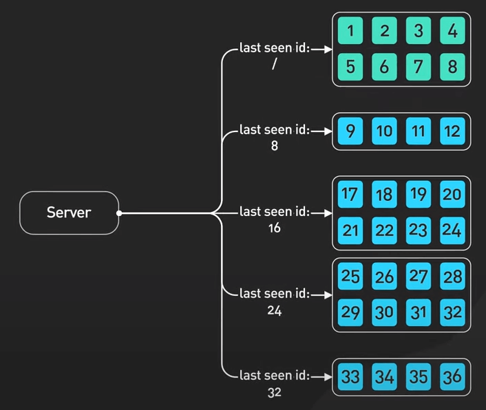
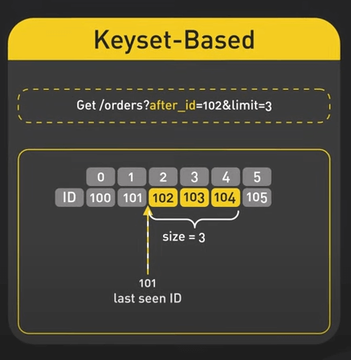
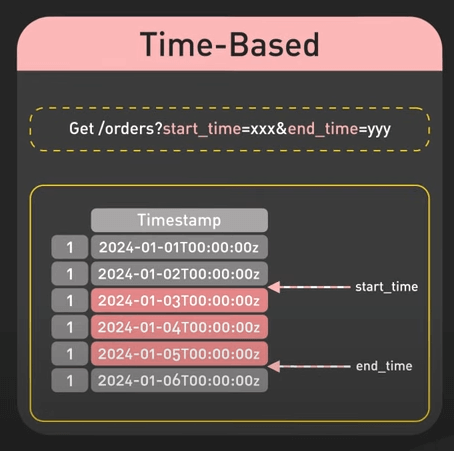

# Những cách phân trang API

## Nguồn

 [API Pagination: Making Billions of Products Scrolling Possible](https://www.youtube.com/watch?v=14K_a2kKTxU)

## Phân trang là gì?

Khi xây dựng API trả về tập dữ liệu lớn, ta cần một cách để chia dữ liệu đó thành các phần nhỏ để dễ dàng theo dõi. Đó chính là Phân trang - Pagination. Đây là cách chúng ta chia kết quả thành các phần và cho phép client request chúng một cách tuần tự thay vì gửi hàng ngàn record cùng một lúc. Ta gửi chúng theo từng batch, có thể là 10 hoặc 100. Việc này giúp quản lý tải server, giảm lưu lượng mạng và giúp ứng dụng của chúng ta phản hồi nhanh hơn.

{:class="centered-img"}

Có hai phương pháp chính để xử lý phân trang: dựa trên offset (Offset-based) và dựa trên cursor (Cursor-based).

## Phân trang dựa trên offset

Với phân trang dựa trên offset, chúng ta có hai dạng. 

Đầu tiên là phân trang dựa trên trang (Page-based). Ở đây, chúng ta chỉ cần biết trang hiện tại và số lượng item trên mỗi trang.

{:class="centered-img"}

Thứ hai là phân trang dựa trên offset (Offset-based). Ở đây, chúng ta chỉ cần biết offset và limit. Offset là vị trí bắt đầu của dữ liệu, còn limit là số lượng dữ liệu cần lấy. Trong SQL, một truy vấn offset sẽ trông như thế này: `SELECT * FROM table OFFSET 20 LIMIT 10;`.

{:class="centered-img"}

Phân trang dựa trên offset dễ xây dựng nhưng có vấn đề với các tập dữ liệu lớn. Khi offset lớn, truy vấn sẽ chậm hơn vì cần xử lý mọi dòng trước offset trước khi trả kết quả. Vấn đề lớn hơn xảy ra khi tập dữ liệu thay đổi nhanh. Offset-based có thể bỏ sót hoặc hiển thị dữ liệu hai lần nếu có dữ liệu mới được thêm vào. Điều này có nghĩa là kết quả có thể không nhất quán giữa các request.

{:class="centered-img"}

### Phân trang dựa trên cursor

Phân trang dựa trên cursor giải quyết các vấn đề của offset-based. Chúng ta chọn một cột index như ID làm cursor, sau đó hash giá trị của cursor để bảo mật.

{:class="centered-img"}

Client gửi giá trị cursor cuối cùng mà nó có. Chúng ta sử dụng cursor này để lọc và lấy batch tiếp theo. Sau đó, chúng ta trả kết quả cùng với cursor mới cho item cuối cùng.

{:class="centered-img"}

Client sử dụng cursor mới này cho request tiếp theo.

{:class="centered-img"}

Phân trang dựa trên cursor hoạt động rất tốt với các tập dữ liệu lớn và thay đổi nhanh. Nó giữ nguyên tính nhất quán ngay cả khi có dữ liệu được thêm hoặc xóa giữa các request. Điều này giúp nó trở nên rất thích hợp cho feeds thời gian thực hoặc bất kỳ dữ liệu nào thay đổi thường xuyên.

{:class="centered-img"}

Một số cách cài đặt phân trang dựa trên cursor bao gồm phân trang dựa trên keyset (Keyset-based) và phân trang dựa trên thời gian (Time-based).

Phân trang dựa trên key set sử dụng key index như primary key để lấy kết quả tiếp theo một cách hiệu quả bằng cách truy cập trực tiếp vào các row mà không cần quét qua tất cả các row trước đó.

{:class="centered-img"}

Phân trang dựa trên thời gian sử dụng cursor là các timestamp để phân đoạn và lấy các bản ghi trong khoảng thời gian cụ thể. Phương pháp này rất hữu ích cho các ứng dụng xử lý dữ liệu chuỗi thời gian.

{:class="centered-img"}

## Kết luận

Dùng phân trang cursor-based cho các tập dữ liệu lớn và thay đổi nhanh. Chúng giữ nguyên tính nhất quán và hoạt động tốt hơn so với offset-based. Mặc dù cài đặt phức tạp hơn, nhưng đáng với công sức bỏ ra.
