# Các giao thức API phổ biến

## Nguồn

 [Top 9 Most Popular API Protocols](https://www.youtube.com/watch?v=zY2DMpCUfCg)

## REST

Đầu tiên là anh bạn già REST của chúng ta. Dù việc sử dụng REST đã giảm đi phần nào, nhưng đây vẫn là lựa chọn hàng đầu cho các web API. Vì sao? REST đơn giản, có khả năng mở rộng và hoạt động tốt với các dịch vụ web. 

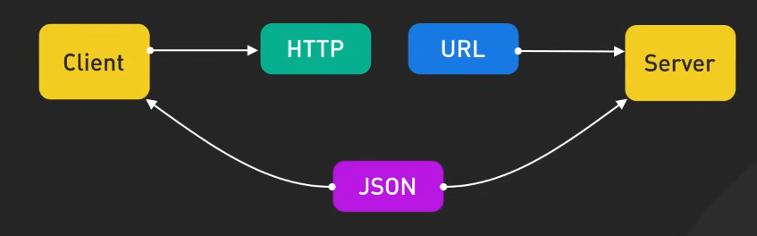{:class="centered-img"}

REST sử dụng các phương thức HTTP chuẩn, giúp dễ học và dễ sử dụng. Và nhờ REST không lưu trạng thái (stateless), việc mở rộng trở nên dễ dàng. 

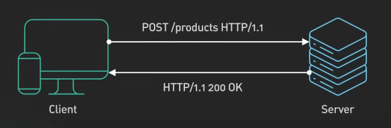{:class="centered-img"}

Tuy nhiên, REST không hoàn hảo. Bạn đã bao giờ gặp phải vấn đề tải dữ liệu quá nhiều (over-fetching) hoặc thiếu dữ liệu (under-fetching) chưa? Việc này có thể làm chậm hệ thống. Và nếu cần dữ liệu liên quan, chúng ta có thể phải thực hiện nhiều request, làm tăng độ trễ. Nhưng đừng lo, đó là khi GraphQL nhảy vào cuộc chơi.

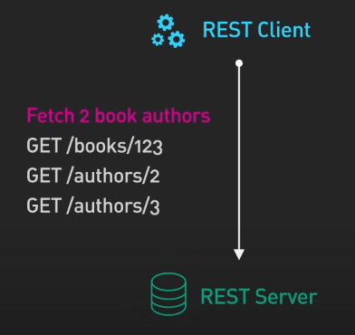{:class="centered-img"}

## GraphQL

GraphQL, được phát triển bởi Facebook, cung cấp một sự thay thế linh hoạt và hiệu quả hơn cho API REST truyền thống. 

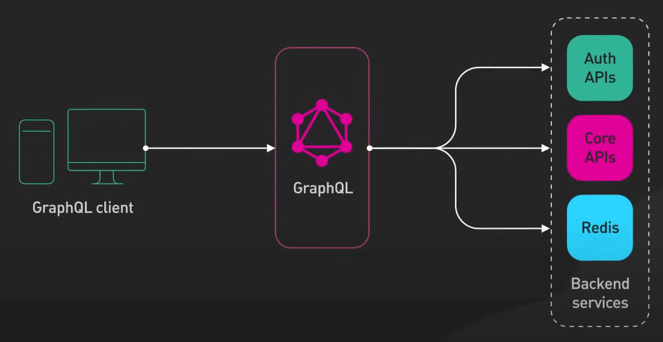{:class="centered-img"}

Với GraphQL, bạn có thể lấy tất cả dữ liệu cần thiết chỉ trong một truy vấn, cho phép các lập trình viên frontend kiểm soát quá trình lấy dữ liệu tốt hơn. Kiểu dữ liệu mạnh (strongly typed) và khả năng truy xuất dữ liệu chính xác của GraphQL giúp giải quyết các vấn đề tải quá nhiều hoặc thiếu dữ liệu.

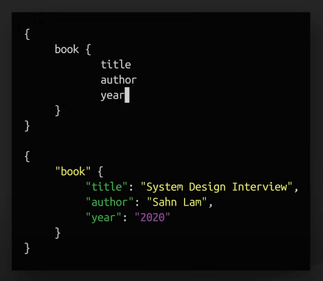{:class="centered-img"}

Hơn nữa, GraphQL hỗ trợ cập nhật dữ liệu theo thời gian thực thông qua subscriptions, giúp client luôn cập nhật thông tin mới. 

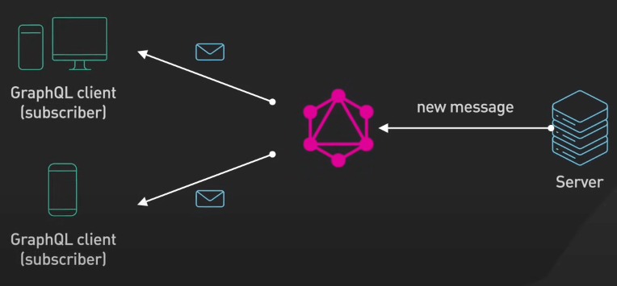{:class="centered-img"}

Tuy nhiên, dù mang đến nhiều sự linh hoạt, GraphQL cũng gặp một số thách thức. Thứ nhất, việc cho phép lập trình viên frontend kiểm soát quá nhiều có thể gây quá tải cho backend. 

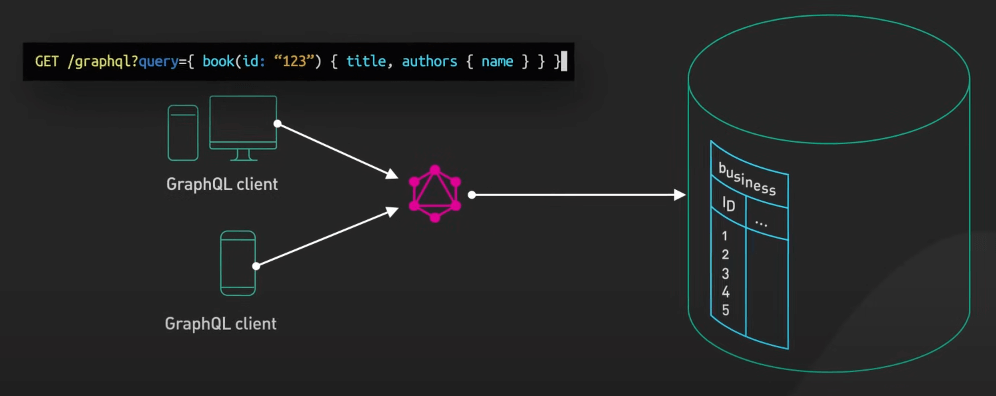{:class="centered-img"}

Thêm vào đó, do tính linh động của GraphQL, việc cache trở nên phức tạp hơn, làm cho việc tối ưu hóa hiệu suất không dễ dàng như với REST.

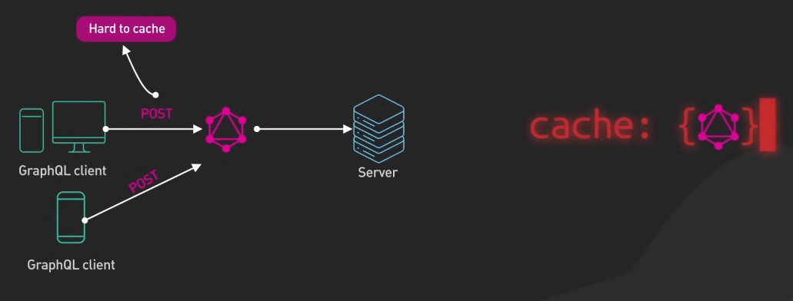{:class="centered-img"}

## Webhooks

Webhooks là các callback HTTP tùy chỉnh được kích hoạt bởi các sự kiện cụ thể trong ứng dụng. Chúng cho phép giao tiếp gần như thời gian thực giữa các hệ thống và loại bỏ nhu cầu kiểm tra (polling) liên tục. Cách tiếp cận này hiệu quả, tiết kiệm tài nguyên tính toán và băng thông. 

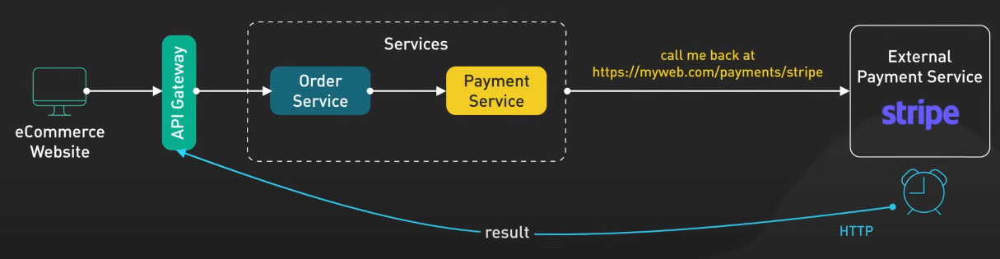{:class="centered-img"}

Webhooks hỗ trợ kiến trúc không phụ thuộc lẫn nhau, tăng cường tính mô đun hóa và khả năng mở rộng cho ứng dụng.

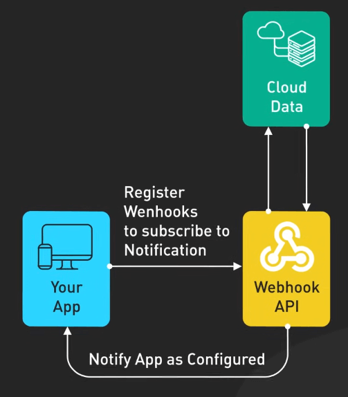{:class="centered-img"}

## SOAP

Nếu bạn đang tìm kiếm một giao thức với tiêu chuẩn nghiêm ngặt và tính năng bảo mật mạnh mẽ có sẵn, SOAP sẽ có thể là nàng thơ của bạn đấy. Mặc dù có vẻ hơi lỗi thời so với các công nghệ mới như REST và GraphQL, SOAP vẫn có giá trị trong một số trường hợp nhất định. 

Với các tiêu chuẩn nghiêm ngặt, kiểu dữ liệu mạnh và các tính năng bảo mật toàn diện (bao gồm xác thực, ủy quyền và mã hóa), SOAP đặc biệt phù hợp cho môi trường doanh nghiệp. SOAP nổi bật trong các ngành như dịch vụ tài chính, chăm sóc sức khỏe và các lĩnh vực liên quan đến chính phủ, nơi việc tuân thủ hợp đồng và tính toàn vẹn dữ liệu là những điều tối quan trọng.

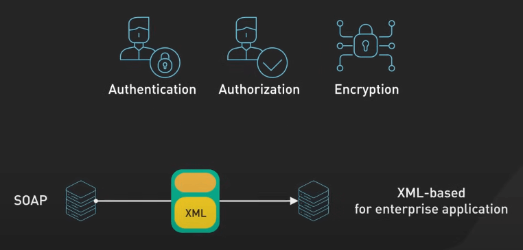{:class="centered-img"}

## WebSocket

WebSocket thiết lập một kết nối hai chiều, độ trễ thấp và liên tục giữa client và server, cho phép truyền dữ liệu thời gian thực. 

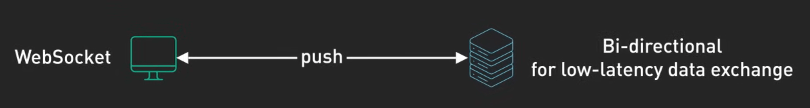{:class="centered-img"}

Điều này làm cho WebSocket trở thành lựa chọn lý tưởng cho các ứng dụng yêu cầu cập nhật tức thì, chẳng hạn như ứng dụng chat, game online và các nền tảng giao dịch.

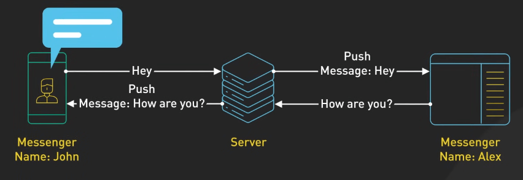{:class="centered-img"}

## gRPC

Được xây dựng trên nền tảng HTTP/2, gRPC là một giao thức hiện đại, hiệu suất cao, được thiết kế để giao tiếp giữa các dịch vụ. 

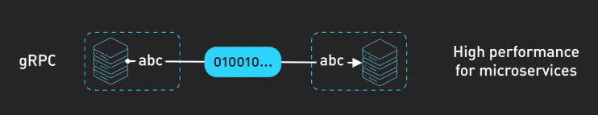{:class="centered-img"}

gRPC sử dụng Protocol Buffers để định nghĩa phương thức dịch vụ và định dạng thông điệp, cho phép các dịch vụ hiển thị phương thức tùy chỉnh giống như các hàm trong một ngôn ngữ lập trình. Với độ trễ thấp, thông lượng cao và hỗ trợ đa ngôn ngữ, gRPC là lựa chọn tốt cho hệ thống phân tán trong các trung tâm dữ liệu.

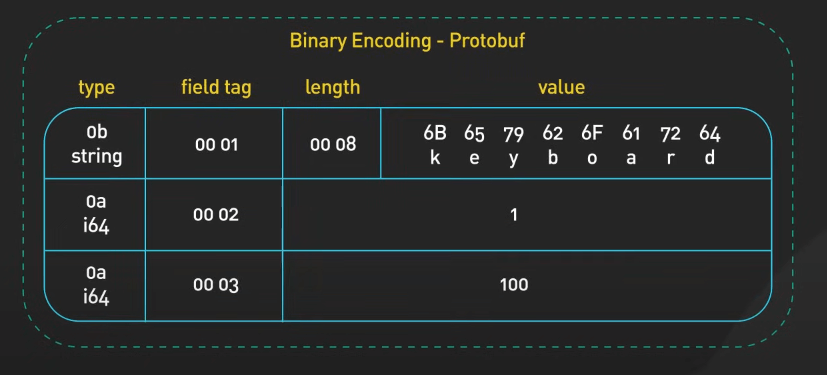{:class="centered-img"}

## Các giao thức khác

Ngoài các giao thức chính đã thảo luận, còn có những giao thức khác như MQTT, AMQP, SSE, EDI và EDA, mỗi giao thức được thiết kế để đáp ứng các nhu cầu cụ thể. Các lựa chọn thay thế này cũng đóng vai trò quan trọng trong nhiều ngành công nghiệp khác nhau.

Như vậy, chúng ta đã khám phá qua một số giao thức chủ chốt trong API, và từng giao thức có những ứng dụng cụ thể trong việc xây dựng các hệ thống mở rộng và linh hoạt.

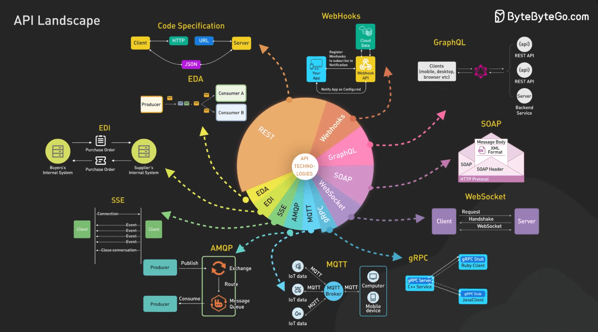{:class="centered-img"}
