# 12 mẹo bảo mật API

## Nguồn

 [Top 12 Tips For API Security](https://www.youtube.com/watch?v=6WZ6S-qmtqY)

## Sử dụng HTTPS

HTTPS là phiên bản an toàn của HTTP. HTTPS sẽ mã hóa dữ liệu giữa client và server. Việc mã hóa này giúp tránh dữ liệu bị nghe lén, tấn công man-in-the-middle và một số nguy cơ bảo mật khác. Với HTTPS, các thông tin nhạy cảm như API key, session token và dữ liệu cá nhân sẽ được bảo vệ.

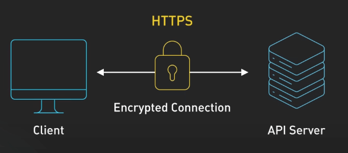{:class="centered-img"}

## Sử dụng OAuth2

OAuth2 là giao thức chuẩn trong việc xác thực và ủy quyền. Thay vì chia sẻ credential trực tiếp, OAuth2 cho phép người dùng cấp quyền truy cập hạn chế cho các ứng dụng thứ ba vào dữ liệu của mình.

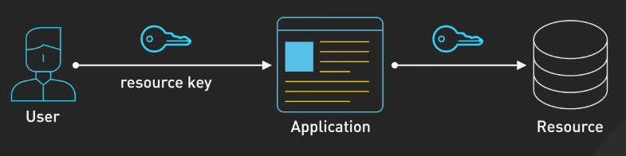{:class="centered-img"}

Một OAuth2 flow tiêu chuẩn sẽ như sau:

- Ứng dụng client (chẳng hạn như một app mobile) bắt đầu quá trình bằng cách điều hướng người dùng sang một Authorization Server (như Google hay Facebook)
- Người dùng sẽ đăng nhập và cấp quyền cho ứng dụng client để truy cập vào một tài nguyên cụ thể nào đó của người dùng.
- Authorization Server sẽ cấp cho ứng dụng client một access token, ứng dụng client sử dụng token này để truy cập vào tài nguyên của người dùng.
- Ứng dụng client sẽ thay mặt người dùng, dùng access token này để gọi API đến Resource Server (server chứa dữ liệu của người dùng)
- Resource Server sẽ kiểm tra token và phản hồi với dữ liệu cần thiết.

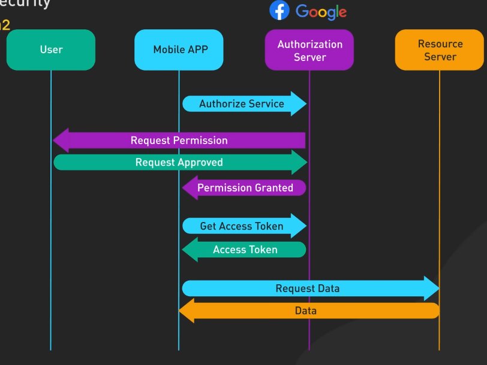{:class="centered-img"}

Như vậy không có credential nào bị chia sẻ giữa ứng dụng client và Resource Server, chỉ có các access token tạm thời mà thôi. Bằng cách này, ta không phải lưu password của người dùng mà vẫn có thể tích hợp với các dịch vụ bên thứ ba một cách an toàn.

Use case phổ biến ở đây sẽ là người dùng đăng nhập với Google hoặc Facebook để truy cập vào lưu trữ đám mây hoặc kết nối với API email hoặc lịch.

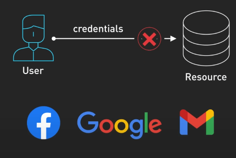{:class="centered-img"}

Ví dụ, ta xây dựng một ứng dụng du lịch cần truy cập vào Google Lịch của người dùng để xem người đó có rảnh trong khoảng thời gian nào đó hay không. Với OAuth2, ứng dụng sẽ điều hướng người dùng đến Google để đăng nhập và cấp quyền truy cập vào lịch. Google sau đó sẽ cung cấp một access token để ứng dụng sử dụng cho mục đích đọc lịch của người dùng thông qua API Google Lịch, mà không phải lưu trữ username và password của người dùng.

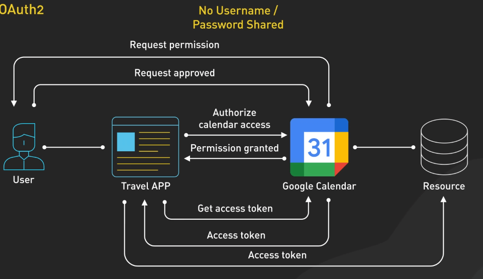{:class="centered-img"}

## Sử dụng WebAuthn

WebAuthn là chuẩn mới nhất và thân thiện với người sử dụng trong việc xác thực. Nó thay thế cách truyền thống là username và password bằng cách sử dụng các phương tiện xác thực như vân tay, khuôn mặt, hoặc security key. Việc này gây khó khăn cho hacker trong việc lừa đảo và lấy credential của người dùng. WebAuthn được hỗ trợ trên nhiều trình duyệt và nền tảng lớn hiện nay, giúp nó đang trên đường trở thành giải pháp xác thực đi đầu trên thị trường dành cho API.

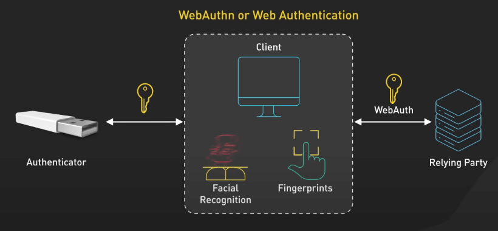{:class="centered-img"}

## Sử dụng hệ thống API Key phân cấp

API key là một cách phổ biến để xác thực và ủy quyền truy cập giữa các dịch vụ với nhau, ví dụ như khi backend service của chúng ta muốn truy cập vào một API của bên thứ ba hoặc API của chính một service của mình. Tuy nhiên, việc dùng chỉ một API key cho tất cả các dịch vụ sẽ tạo ra một điểm yếu lớn cho hệ thống.

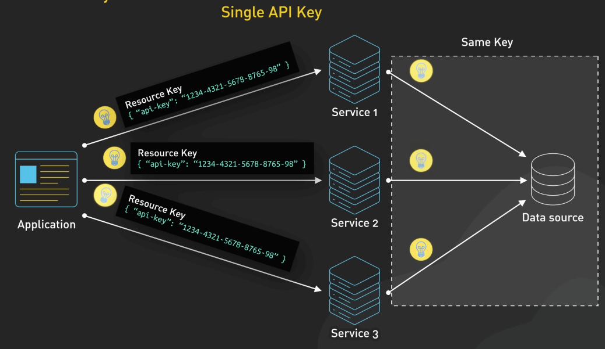{:class="centered-img"}

Thay vào đó, ta có thể sử dụng hệ thống API key phân cấp, tức là mỗi API key sẽ có một phạm vi truy cập cụ thể. Ví dụ, ta có thể có read-only key cho việc đọc các dữ liệu public, một cái write key để chỉnh sửa dữ liệu, và một cái admin key để thực hiện các thao tác quản trị.

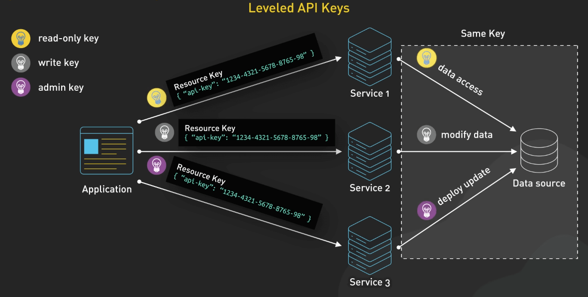{:class="centered-img"}

Bằng cách này, khi một API key bị đánh cắp, hacker sẽ chỉ có thể thực hiện các thao tác mà key đó được phép, giảm thiểu rủi ro cho hệ thống hơn so với việc sử dụng một key duy nhất cho tất cả các dịch vụ.

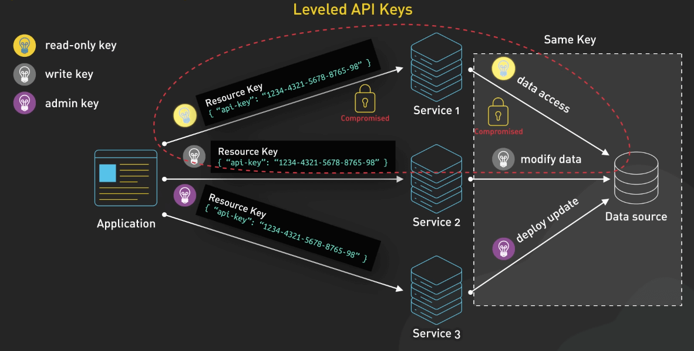{:class="centered-img"}

Một best practice nữa là bạn hãy thường xuyên rotate API key của mình (đổi key cũ và tạo key mới), và thu hồi key cũ khi phát hiện nó có thể bị lộ. Một số dịch vụ có thể cho chúng ta config thời gian sống của key, sau thời gian này key sẽ tự động hết hạn và không thể sử dụng nữa.

## Cài đặt ủy quyền

Ủy quyền (authorization) là quá trình kiểm tra xem tài nguyên hay hành động nào mà người dùng được cho phép truy cập hay thực hiện. Người dùng được xác thực (authentication) không có nghĩa là họ có quyền truy cập vào tất cả các tài nguyên trong hệ thống, mà chỉ được truy cập và sửa đổi phần tài nguyên mà họ được ủy quyền. Thông thường, người ta sẽ sử dụng Role-Based Access Control (RBAC) để quản lý quyền truy cập. Người dùng sẽ được chia vào các vai trò (role) khác nhau, mỗi vai trò sẽ có các quyền truy cập khác nhau. Ví dụ, một viewer chỉ có thể đọc dữ liệu, nhưng một editor vừa có thể đọc vừa có thể chỉnh sửa dữ liệu. Ủy quyền giúp tuân thủ nguyên tắc least privilege, tức là người dùng chỉ được cấp quyền truy cập những tài nguyên cần thiết cho công việc của họ, không nhiều hơn, giúp giảm thiểu rủi ro bị lộ thông tin và tấn công từ bên trong.

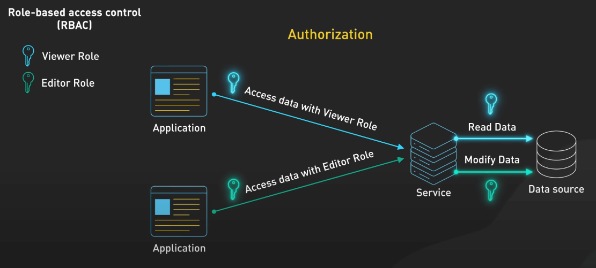{:class="centered-img"}

## Rate limiting

Rate limiting là việc giới hạn số lượng request mà một client có thể gửi đến server trong một khoảng thời gian nhất định. Việc này giúp giảm thiểu rủi ro bị tấn công DDoS, giúp server không bị quá tải và giữ cho dịch vụ luôn ổn định.

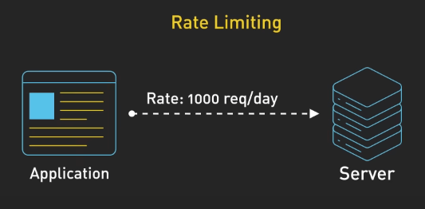{:class="centered-img"}

Cách chọn các con số để Rate limiting phụ thuộc vào nhiều yếu tố khác nhau, như địa chỉ IP, user ID hay API key.

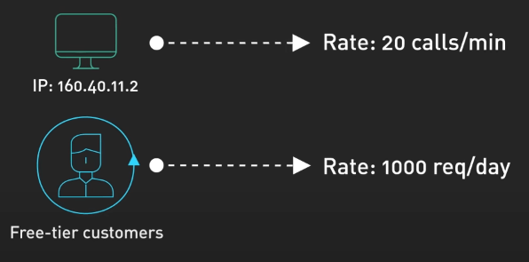{:class="centered-img"}

Ta cũng có thể có các rate limit khác nhau với các loại request khác nhau, ví dụ ta có thể có rate limit riêng cho request GET và POST, hoặc rate limit riêng cho các endpoint khác nhau.

Rate limiting giúp tăng cường bảo mật, cải thiện hiệu suất và tính khả dụng của API.

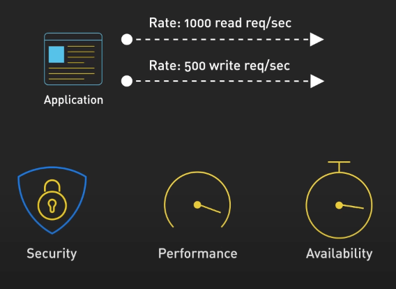{:class="centered-img"}

## API Versioning

API Versioning là việc quản lý các phiên bản của API. Khi một API thay đổi, ta cần đảm bảo rằng các client cũ vẫn có thể sử dụng API mà không bị ảnh hưởng bởi sự thay đổi đó. Việc này được thực hiện bởi việc thêm prefix version vào URL của API, ví dụ `/v1/users` hoặc `/v2/users`. Client có thể chọn phiên bản API mà họ muốn sử dụng, và phía server có thể loại bỏ API phiên bản cũ khi không còn ai sử dụng nữa. 

API Versioning giúp quản lý thay đổi và tài liệu hóa API một cách dễ dàng, giúp tăng cường bảo mật và tính ổn định của hệ thống.

## AllowListing

AllowListing là một kỹ thuật bảo mật, nơi mà ta sẽ cho phép truy cập từ một thực thể thỏa mãn một tập các điều kiện nhất định, các điều kiện đó có thể bao gồm địa chỉ IP, user ID hay API key. Tất cả những thực thể không thỏa mãn điều kiện sẽ bị từ chối truy cập, tuân theo quy tắc: từ chối tất, cho phép vài đứa. AllowListing an toàn hơn DenyListing, nơi mà ta sẽ không cho phép truy cập từ một thực thể thỏa mãn một số điều kiện, còn lại cho phép tất cả.

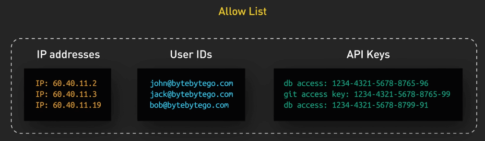{:class="centered-img"}

Trong hoàn cảnh của API, ta có thể cài đặt AllowListing dựa trên một số tiêu chí, như cho phép một dải IP được truy cập vào một hay một số endpoint, hay giới hạn truy cập dựa trên vai trò hay quyền của người dùng.

## Thường xuyên kiểm tra OWASP để phát hiện lỗ hổng bảo mật

OWASP (Open Web Application Security Project) là một tổ chức phi lợi nhuận chuyên về bảo mật ứng dụng web. OWASP cung cấp một danh sách các lỗ hổng bảo mật phổ biến nhất, cùng với các phương pháp để phòng tránh và khắc phục chúng. Việc kiểm tra OWASP thường xuyên giúp phát hiện và khắc phục các lỗ hổng bảo mật một cách nhanh chóng và hiệu quả, giúp tăng cường bảo mật cho hệ thống.

OWASP có top 10 các lỗ hổng bảo mật của API. Hãy đảm bảo bạn kiểm tra list này thường xuyên và vá các lỗ hổng có thể có trong API của mình.

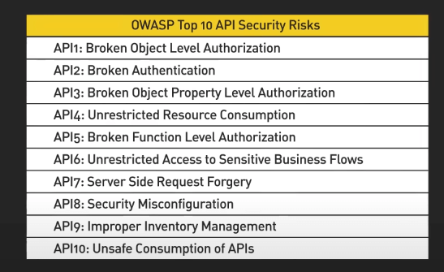{:class="centered-img"}

## Sử dụng API Gateway

API Gateway cung cấp một điểm truy cập duy nhất cho tất cả các dịch vụ API của bạn. Nó giúp API của bạn tuân theo các quy tắc bảo mật, rate limiting, xác thực, vân vân... Khi sử dụng API Gateway, ta có thể thêm tất cả các tính năng bảo mật này một cách dễ dàng, không cần phải thêm vào từng service một cách riêng lẻ. Một số lợi ích khác của API bao gồm quản lý traffic, caching, logging và monitoring, giúp nó trở thành một thành phần không thể thiếu trong kiến trúc API hiện đại.

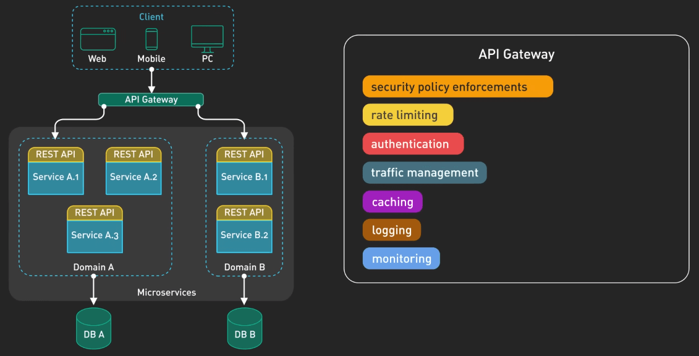{:class="centered-img"}

## Xử lý lỗi một cách an toàn

Xử lý lỗi đóng vai trò quan trọng trong thiết kế API để bảo mật và cải thiện trải nghiệm người dùng. Khi có lỗi xảy ra, ta muốn người dùng có được một thông báo lỗi chi tiết nhưng cũng phải an toàn. Ví dụ, thay vì `Internal Server Error`, ta có thể mô tả chi tiết hơn, như `Failed to retrieve user data. Please check that you are authenticated and have sufficient permissions`. Thông tin này sẽ cho phép người sử dụng API tìm ra lỗi nằm ở đâu mà không làm lộ các thông tin quan trọng và nhạy cảm của người dùng và hệ thống

Một ví dụ khác, thay vì trả về `SQL query failed due to malformed input containing a DROP TABLE command`, ta có thể trả về `Invalid input provided. Please review and try again`. Thông báo này giúp ta giấu đi việc sử dụng SQL phía sau, giảm thiểu rủi ro bị injection attack.

Ngoài ra, ta có thể tận dụng HTTP status code để thông báo rõ ràng hơn về các lỗi, như 401 Unauthorized, 403 Forbidden, 404 Not Found, 429 Too Many Requests, 500 Internal Server Error, vân vân...

Nhớ rằng, không bao giờ trả về stack trace bằng cách trả về toàn bộ lỗi từ phía backend, vì đây có thể là thông tin giá trị cho hacker.

## Kiểm tra input

Hãy kiểm tra kỹ input của các API, bao gồm parameter, header và payload.

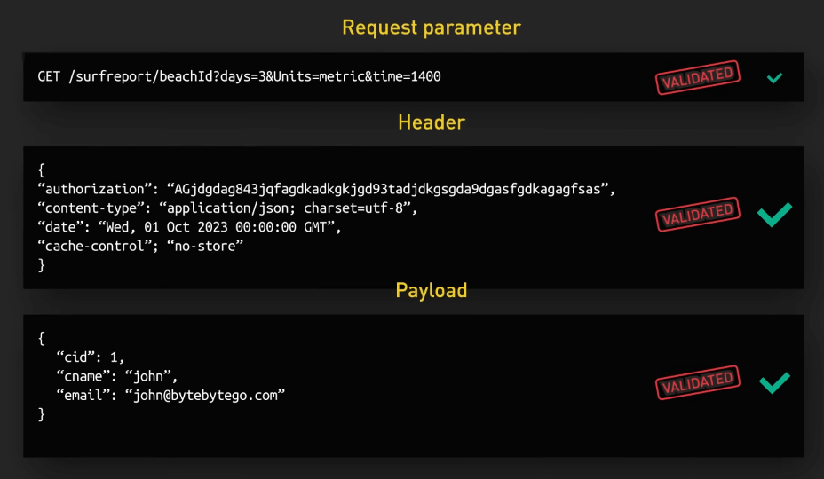{:class="centered-img"}

Nếu không kiểm tra, hệ thống của bạn sẽ có nguy cơ đối mặt với các rủi ro như SQL injection, Cross-Site Scripting (XSS), hoặc Remote Code Execution (RCE). Việc kiểm tra nên được tiến hành cả ở client và server. Ở phía server, ta có thể sử dụng các thư viện và framework validation để giúp kiểm tra input một cách dễ dàng và hiệu quả. Ta cũng có thể chuẩn hóa và tập trung hóa việc kiểm tra input ở một service khác, như API Gateway, hay một service riêng dành cho việc kiểm tra này.

Chúc các bạn thành công trong việc bảo mật API của mình!
