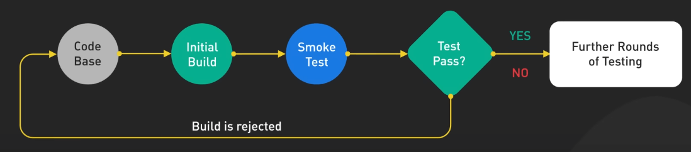
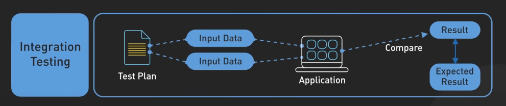
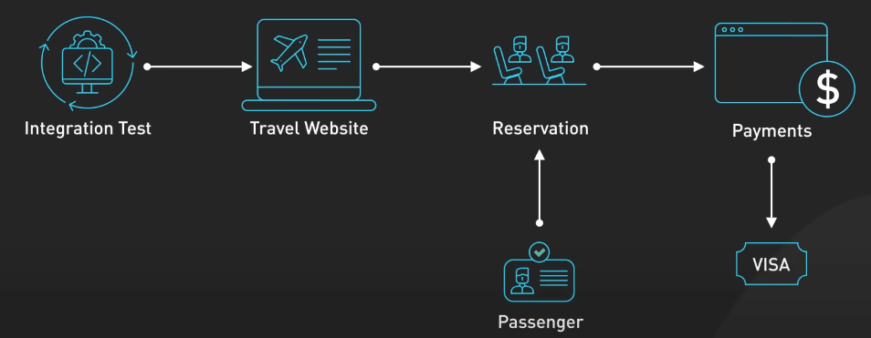
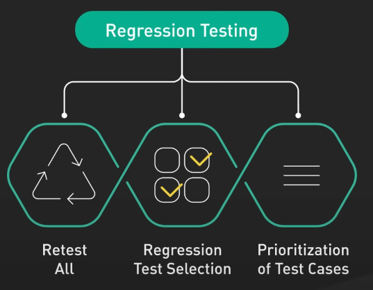
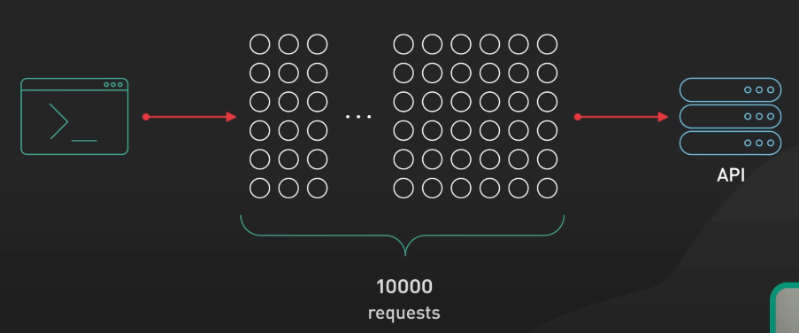
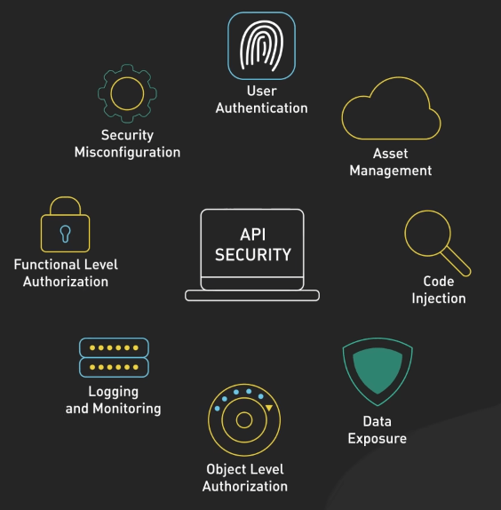
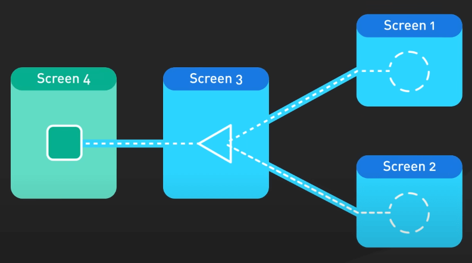
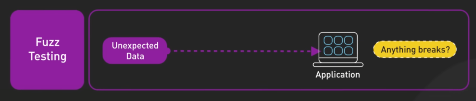
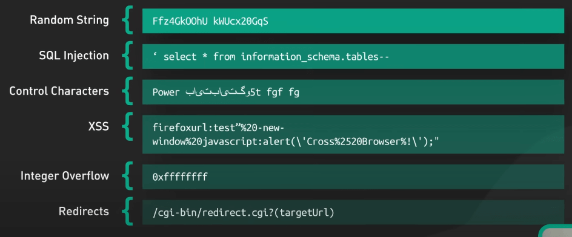

# 9 loại API testing phổ biến

## Nguồn

 [Top 9 Most Popular Types of API Testing](https://www.youtube.com/watch?v=qquIJ1Ivusg)

## Các loại API testing

**Smoke Testing** giống như một bài kiểm tra nhanh để xác nhận rằng API hoạt động và phản hồi đúng với các yêu cầu cơ bản. Đây là bước đầu tiên khi bạn vừa xây dựng một trang web mới và muốn chắc chắn mọi thứ hoạt động trước khi ra mắt.

{:class="centered-img"}

**Functional Testing** là bước tiếp theo, nơi các QA tạo ra các kịch bản kiểm thử chi tiết để đảm bảo mọi chức năng của API hoạt động đúng và đáp ứng các yêu cầu cụ thể. Giống như kiểm tra từng tính năng của một phần mềm mới, các Functional Test này đảm bảo các tính năng như tìm kiếm sản phẩm, thêm vào giỏ hàng, và thanh toán an toàn đều hoạt động chính xác.

{:class="centered-img"}

Khi có nhiều API làm việc cùng nhau, **Integration Testing** đảm bảo các API và dịch vụ đám mây này có thể giao tiếp và trao đổi dữ liệu một cách chính xác. Chẳng hạn, với một trang web đặt vé du lịch, kiểm thử tích hợp xác nhận rằng API đặt vé máy bay phối hợp chính xác với hệ thống thanh toán, nhận dạng hành khách và các hệ thống khác.

{:class="centered-img"}

{:class="centered-img"}

Mỗi khi có cập nhật hoặc thay đổi code, **Regression Testing** được thực hiện để chạy lại các kịch bản kiểm thử hiện có nhằm phát hiện bất kỳ lỗi nào xuất hiện do thay đổi. Điều này giúp các dev yên tâm triển khai các cập nhật mà không lo lắng về việc gây ra sự cố mới.

{:class="centered-img"}

**Load Testing** đánh giá hiệu suất thực tế của API bằng cách sử dụng nó với lưu lượng người dùng cao. **Stress Testing** thì đi xa hơn, mô phỏng các tình huống quá tải nghiêm trọng và các điều kiện xa hơn mức sử dụng bình thường. Cả hai đều giúp thử nghiệm API để duy trì sự ổn định và đáp ứng nhanh chóng trong các thời điểm cao điểm, như mùa mua sắm cuối năm hoặc một sự kiện gây bão trên mạng xã hội.

{:class="centered-img"}

An ninh là một yếu tố quan trọng khi API truy cập vào các hệ thống và dữ liệu nhạy cảm. **Security Testing** dò tìm các lỗ hổng có thể cho phép truy cập trái phép hoặc tấn công mạng. Kiểm tra bảo mật giúp củng cố API, giống như một két sắt bảo vệ tài sản quý giá.

{:class="centered-img"}

**UI Testing** đảm bảo rằng API góp phần vào trải nghiệm người dùng mượt mà. Ví dụ, thời gian phản hồi nhanh trong việc hiển thị bản đồ và điều hướng trong các ứng dụng chia sẻ xe trực tiếp liên quan đến trải nghiệm người dùng tích cực.

{:class="centered-img"}

Cuối cùng, **Fuzz Testing** đẩy API đến giới hạn bằng cách gửi dữ liệu không đúng định dạng, không như mong đợi hoặc ngẫu nhiên để xác định các tình huống tréo ngoe. Điều này giúp API chuẩn bị tốt hơn cho những use case không lường trước được trong thực tế.

{:class="centered-img"}

{:class="centered-img"}
