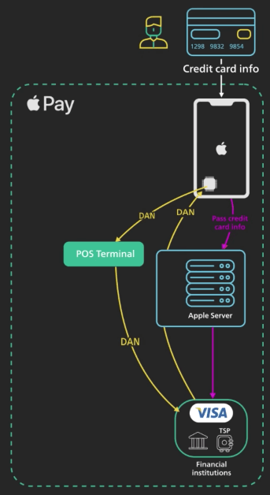

# Apple Pay và Google Pay hoạt động như thế nào?

## Nguồn

 [How Does Apple/Google Pay Work?](https://www.youtube.com/watch?v=cHv8LqkbPHk)

## Giới thiệu

Apple Pay và Google Pay xử lý thông tin thẻ tín dụng nhạy cảm của khách như thế nào? Cái nào ngon hơn? Cùng tìm hiểu nhé.

### Apple Pay

**Apple Pay** ra mắt vào năm 2013. Đó là một ý tưởng mới lạ vào thời điểm đó. Nó hoàn thiện khái niệm gọi là **tokenization**, trong đó chỉ cần một token thanh toán đại diện cho thông tin thẻ tín dụng nhạy cảm là đủ để hoàn tất một giao dịch. 

{:class="centered-img"}

Apple Pay yêu cầu sự hợp tác chặt chẽ từ các mạng thanh toán như Visa và các ngân hàng phát hành lớn, như JPMC, để xây dựng một hệ thống mới để hỗ trợ việc chấp nhận thanh toán dựa trên token.

### Google Pay

**Google Pay** ra mắt vào năm 2018. Trước đó nó có tên là **Android Pay** (2015), và trước đó nữa lại được gọi là **Google Wallet** (2014). Tên thương hiệu kiểu này nghe khá khó hiểu và có vẻ như bây giờ Google Pay lại là Google Wallet ở một số quốc gia. Ta sẽ gọi phiên bản hiện tại sử dụng token thanh toán là Google Pay.

## Cách thức hoạt động

Thực tế cả hai đều an toàn, nhưng chi tiết kỹ thuật có chút khác biệt.

### Tokenization

Cả hai nền tảng đều sử dụng tokenization để bảo vệ thông tin thẻ tín dụng nhạy cảm của khách hàng. Chú ý rằng cả hai nền tảng đều tuyên bố rằng họ không lưu **PAN** (Primary Account Number - số tài khoản chính) trên thiết bị. PAN sau đó được gửi đến những server tương ứng thông qua HTTPS.

#### Apple Pay

Tại Apple server, thông tin thẻ tín dụng không được lưu ở đâu cả. Nó được dùng để định danh mạng thanh toán và ngân hàng phát hành thẻ tín dụng. Để dễ hình dung, ta sẽ gọi mạng thanh toán, như Visa và ngân hàng phát hành thẻ tín dụng, từ bây giờ là ngân hàng nói chung.

Thông tin thẻ tín dụng sau đó được gửi từ Apple server đến ngân hàng một cách an toàn qua mạng. Ngân hàng xác thực số tài khoản và trả về một token gọi là **DAN** (Device Account Number - số tài khoản thiết bị). Số này được tạo ra chỉ cho thiết bị tương ứng sử dụng. Việc tạo ra token và ánh xạ token với PAN thường được giao cho một **TSP** (Token Service Provider - nhà cung cấp dịch vụ token). TSP là nơi chứa thông tin nhạy cảm nhất. Token sau đó được trả về Apple server. Apple server chuyển tiếp token đến iPhone, nơi nó được lưu trữ an toàn trong một chip đặc biệt gọi là **Secure Element**. Về logic thì Apple server chỉ là một bộ lọc. Nó kiểu như là iPhone gửi thông tin thẻ tín dụng trực tiếp đến ngân hàng để đổi lấy token.

{:class="centered-img"}

#### Google Pay

Với Google Pay, quá trình này hơi khác một chút. Giống như Apple, PAN cũng được gửi một cách an toàn từ thiết bị đến server của Google. Server của Google sử dụng PAN để xác định ngân hàng. PAN sau đó được gửi một cách an toàn đến ngân hàng qua mạng. Ngân hàng xác thực PAN và chuyển nó đến TSP để đổi lấy token thanh toán. Token được gọi là **D-PAN** (Device PAN - số tài khoản thiết bị). Token sau đó được gửi trở lại server của Google, nơi nó được chuyển đến thiết bị để lưu trữ an toàn.

{:class="centered-img"}

Bây giờ, có hai điểm cần đề cập ở đây khác với Apple. 

1. Token của Google Pay không được lưu trữ trong một secure element như các thiết bị Apple. Nó được lưu trữ trong ứng dụng ví. 
2. Apple khẳng định họ không bao giờ lưu trữ token thanh toán trên server của họ. Google không có tuyên bố như vậy, và thực tế, trong điều khoản dịch vụ của họ, họ khẳng định thông tin thanh toán được lưu trữ trên server của họ.

### Thanh toán

Rồi mấy cái token này được dùng để thanh toán kiểu gì?

#### Apple Pay

Với iPhone, khi ta bấm Thanh toán, token được lấy từ secure element và gửi đến **terminal Point-of-Sale** (là cái máy mà chủ quán đưa ra để cho bạn quẹt điện thoại hay thẻ vào ấy) của merchant qua **NFC** (near-field communication, hay còn gọi là giao tiếp không chạm). Nó thực sự an toàn vì token được gửi trực tiếp từ secure element đến bộ điều khiển NFC trên thiết bị, nơi nó được truyền đến terminal Point-of-Sale.

Bây giờ từ terminal Point-of-Sale, token được gửi đến ngân hàng của merchant. Ngân hàng của merchant xác định mạng thanh toán từ token, và định tuyến an toàn nó đến mạng thanh toán. Mạng thanh toán xác thực token sau đó yêu cầu TSP đổi nó trở lại thành PAN gốc. Số gốc được gửi an toàn từ TSP đến ngân hàng, ở đây thanh toán được xác nhận.

{:class="centered-img"}

#### Google Pay

Với Google Pay, quá trình cũng tương tự sau khi token thanh toán đến terminal Point-of-Sale. Bây giờ cách nó được gửi từ thiết bị đến terminal Point-of-Sale khác một chút. Thiết bị Android không lưu trữ token thanh toán trong secure element. Thay vào đó, nó sử dụng cái gọi là **HCE** (host card emulation). Với HCE, token thanh toán được lưu trữ trong ứng dụng ví, và được lấy ra khi cần thiết bởi ứng dụng ví an toàn từ đám mây. Bộ điều khiển NFC và ứng dụng ví làm việc cùng nhau để truyền token thanh toán qua NFC đến terminal Point-of-Sale. Đến đây, phần còn lại của giao dịch giống như Apple.

{:class="centered-img"}

## Kết luận

Tóm lại, cả Apple Pay và Google Pay đều sử dụng tokenization. 

Apple Pay hoàn thiện công nghệ và làm cho nó dễ sử dụng và an toàn. 

Cách triển khai của Google cũng tương tự. Sự khác biệt chính là cách token thanh toán được lưu trữ, xử lý và truyền trên thiết bị, và cách token thanh toán có thể được lưu trữ trên server của Google.
