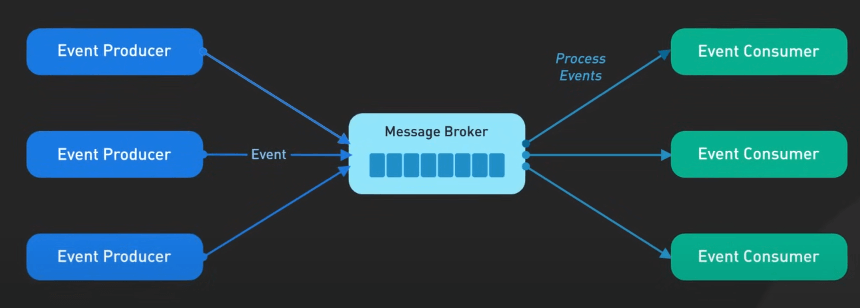

# 5 mô hình kiến trúc phần mềm được ưa chuộng nhất

## Nguồn

 [Top 5 Most Used Architecture Patterns](https://www.youtube.com/watch?v=f6zXyq4VPP8)

## Kiến trúc phân lớp (Layered Architecture)

Mô hình này chia các thành phần của hệ thống thành các lớp riêng biệt, thường là lớp giao diện (presentation layer), lớp logic nghiệp vụ (business logic layer), và lớp truy cập dữ liệu (data access layer). 

{:class="centered-img"}

Ví dụ, trong thiết kế giao diện người dùng, ta thường thấy mô hình Model-View-Presenter (MVP), một dạng kiến trúc phân lớp đặc biệt. Ở đây, Model đại diện cho dữ liệu và logic nghiệp vụ, View hiển thị dữ liệu, và Presenter đóng vai trò cầu nối để đảm bảo sự tách biệt rõ ràng giữa các khối chức năng.

{:class="centered-img"}

Mục tiêu chính của kiến trúc phân lớp là thúc đẩy sự tách biệt, để những thay đổi ở một lớp không ảnh hưởng tiêu cực đến các lớp khác. Cấu trúc này cung cấp sự trừu tượng hóa và đóng gói, với mỗi lớp có một nhiệm vụ rõ ràng.

## Kiến trúc hướng sự kiện (Event-Driven Architecture)

Mô hình này khuyến khích việc sản xuất (produce) và tiêu thụ (consume) các sự kiện (event) giữa các thành phần và dịch vụ phần mềm tách rời. Các thành phần hệ thống sẽ phát ra sự kiện khi có điều gì đó xảy ra, và các thành phần khác sẽ đăng ký nhận các sự kiện mà chúng quan tâm. Điều này cho phép tạo ra các kiến trúc có tính rời rạc cao. 

{:class="centered-img"}

Một ví dụ nổi bật là Command Query Responsibility Segregation (CQRS), trong đó các thao tác ghi dữ liệu (lệnh - commands) được tách biệt khỏi các thao tác đọc (truy vấn - queries), và sự thay đổi thường được truyền qua các sự kiện. Điều này làm cho hệ thống trở thành một hệ thống hướng sự kiện thực sự.

{:class="centered-img"}

Mô hình pub/sub (xuất bản/đăng ký), nơi các thành phần xuất bản và đăng ký sự kiện, thường được sử dụng trong các kiến trúc như vậy. Ở đây, các thành phần không gọi trực tiếp nhau; chúng chỉ phản ứng với các sự kiện đã ra lò.

## Kiến trúc vi nhân (Microkernel Architecture)

Mô hình này nhấn mạnh việc tách biệt chức năng cốt lõi của hệ thống thành một vi nhân nhỏ (microkernel) và các chức năng mở rộng thành các tiện ích bổ sung hoặc plugin. 

{:class="centered-img"}

Ví dụ, trong các hệ điều hành, vi nhân có thể xử lý các tác vụ quan trọng như giao tiếp giữa các tiến trình, trong khi các chức năng khác được giao cho các thành phần bên ngoài. 

{:class="centered-img"}

Một ví dụ khác là Eclipse IDE: lõi runtime của nó xử lý kiến trúc plugin, và các tính năng như công cụ Java hay tích hợp Git được cung cấp dưới dạng plugin. Thiết kế này ưu tiên khả năng mở rộng, dễ bảo trì và cô lập lỗi. Dù là một thành phần hệ điều hành hay một plugin trong Eclipse gặp sự cố, hệ thống cốt lõi vẫn ổn định và không bị ảnh hưởng.

## Kiến trúc vi dịch vụ (Microservices Architecture)

Mô hình này phân chia một ứng dụng thành một tập các dịch vụ nhỏ, kết nối lỏng lẻo. Mỗi dịch vụ thực hiện các khả năng nghiệp vụ cụ thể, chứa mô hình dữ liệu riêng của nó, và giao tiếp qua API. 

{:class="centered-img"}

Ví dụ, Netflix sử dụng kiến trúc vi dịch vụ để xử lý mọi thứ từ đề xuất phim đến thanh toán. Kiến trúc này thúc đẩy việc chia nhỏ chức năng, để các dịch vụ có thể được phát triển, triển khai và mở rộng độc lập. Điều này tăng cường sự linh hoạt và cho phép các công ty như Netflix nhanh chóng đổi mới. Tuy nhiên, sự đánh đổi là độ phức tạp trong việc quản lý giao tiếp giữa các dịch vụ và duy trì tính nhất quán của dữ liệu.

{:class="centered-img"}

## Kiến trúc nguyên khối (Monolithic Architecture)

Cốt lõi của thiết kế nguyên khối là tất cả các thành phần của ứng dụng – từ truy cập dữ liệu, logic nghiệp vụ đến giao diện người dùng – được gói gọn trong một mã nguồn và chạy như một đơn vị duy nhất. Phương pháp này đơn giản hóa việc phát triển và triển khai, làm cho nó trở thành lựa chọn hàng đầu cho nhiều công ty khởi nghiệp và các ứng dụng nhỏ. 

{:class="centered-img"}

Tuy nhiên, cần lưu ý sự trỗi dậy của modular monolith (nguyên khối phân mô-đun). Phương pháp này giữ nguyên lợi ích của một đơn vị triển khai duy nhất nhưng nhấn mạnh các ranh giới mô-đun rõ ràng trong mã nguồn. Điều này cho phép bảo trì và mở rộng dễ dàng hơn. Đây là một phương án tốt, mang lại sự đơn giản của kiến trúc nguyên khối trong khi mở đường cho khả năng chuyển đổi sang các kiến trúc phân tán như vi dịch vụ trong tương lai.

{:class="centered-img"}
