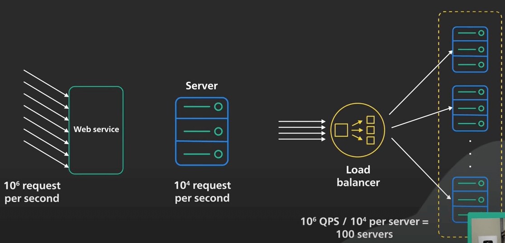
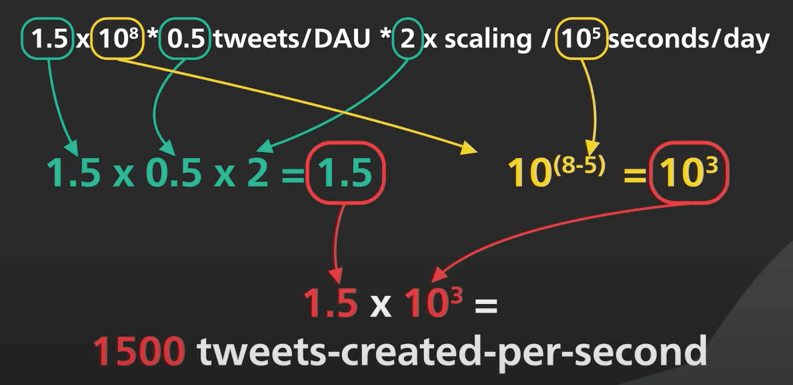
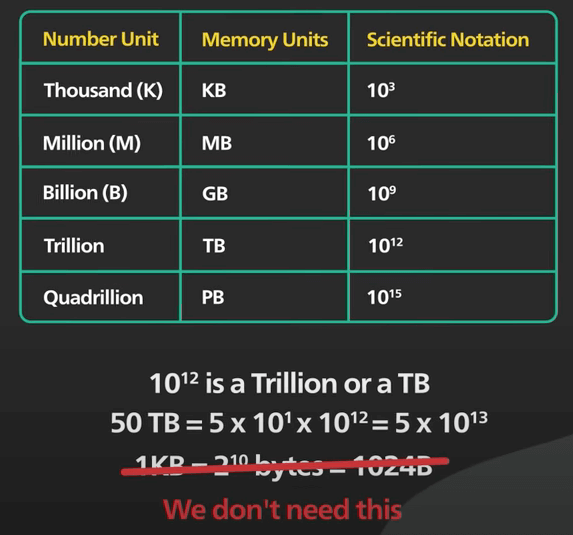

# Dự toán công suất cho ứng dụng - Back-of-the-envelope Estimation / Capacity planning

## Nguồn

 [Back-Of-The-Envelope Estimation / Capacity Planning](https://www.youtube.com/watch?v=UC5xf8FbdJc)

## Dự toán công suất là gì?

Dự toán công suất (Back-of-the-envelope estimation) là một công cụ rất hữu ích trong thiết kế hệ thống. Trong bài viết này, ta sẽ đi vào tìm hiểu làm thế nào và khi nào nên dự toán công suất, cũng như tìm hiểu một số mẹo để sử dụng công cụ này một cách hiệu quả.

Các dev với nhiều năm kinh nghiệm sử dụng dự toán công suất để kiểm tra nhanh một thiết kế hệ thống. Trong các trường hợp như vậy, ta không cần các con số phải chính xác tuyệt đối. Thường ta sẽ chỉ cần chính xác đến chục hoặc trăm lần so với con số thực tế thôi.

Ví dụ, nếu tính toán cho thấy quy mô của web service cần xử lý 1 triệu request mỗi giây, và mỗi web server chỉ có thể xử lý khoảng 10 nghìn request mỗi giây, ta sẽ nhanh chóng nhận ra hai điều: Một, ta cần phải tạo một cụm (cluster) các web server, với một load balancer ở trước cụm đó. Hai, ta cần khoảng 100 web server.

{:class="centered-img"}

Một ví dụ khác là khi tính toán cho thấy rằng database cần xử lý khoảng 10 truy vấn trên giây khi cao điểm, nghĩa là một database server duy nhất sẽ có thể xử lý được tải đó trong một thời gian dài, và ta không cần phải tính đến việc sharding hoặc caching trong một khoảng thời gian.

## Các giá trị cần dự toán

Giờ ta sẽ đi vào một số giá trị phổ biến mà ta cần dự toán. Giá trị quan trọng nhất là số request mỗi giây (Requests per second - RPS) ở mức service hoặc số truy vấn mỗi giây (Queries per second - QPS) ở mức database. Một số giá trị con của lớp giá trị RPS này bao gồm như sau. 

Thứ nhất là DAU (hay số người dùng hàng ngày - Daily Active Users), giá trị này khá dễ lấy. Đôi khi thì ta chỉ có thể biết MAU (hay số người dùng hàng tháng - Monthly Active Users). Trong trường hợp này, ta sẽ tính DAU dựa trên một số phần trăm của MAU.

Giá trị thứ hai là ước lượng về việc sử dụng trên DAU của service mà ta đang thiết kế. Ví dụ, không phải ai hoạt động trên Twitter cũng post bài, chỉ có một số phần trăm làm vậy thôi. 10%-25% có vẻ hợp lý. Một lần nữa, ta không cần phải chính xác tuyệt đối. Chỉ cần chính xác đến chục lần là đủ.

Giá trị thứ ba là một hệ số scaling. Tần suất sử dụng của một service thường có những lúc cao điểm và thấp điểm trong ngày. Ta cần phải ước lượng xem tần suất sử dụng cao điểm sẽ cao hơn bao nhiêu so với tần suất sử dụng trung bình. Điều này sẽ phản ánh khoảng RPS cao nhất khiến service của ta có thể tê liệt là bao nhiêu. Ví dụ, với một service như Google Maps, tần suất sử dụng trong giờ cao điểm có thể cao hơn trung bình 5 lần. Một ví dụ khác là dịch vụ chia sẻ xe như Uber, tần suất sử dụng vào tối cuối tuần có thể cao hơn trung bình 2 lần.

### Ví dụ

Ta sẽ ước lượng số Tweet mỗi giây được tạo ra trên Twitter. Lưu ý rằng các con số này chỉ là tính toán thôi, chứ không phải chính thức từ Twitter đâu. Giả sử Twitter có 300 triệu MAU, và 50% MAU dùng Twitter hàng ngày. Nghĩa là sẽ có 150 triệu DAU. Tiếp theo, ta ước tính rằng khoảng 25% DAU đó sẽ viết Tweet. Mỗi người sẽ viết trung bình khoảng 2 tweet chẳng hạn. Nghĩa là $25\% * 2 = 0.5$ tweet mỗi DAU. Với hệ số scaling, ta ước tính rằng phần lớn người dùng tweet vào buổi sáng khi ngủ dậy và không thể đợi để chia sẻ về giấc mơ tối hôm trước. Nó sẽ làm tăng mạnh traffic tạo tweet lên gấp đôi so với trung bình khi bờ đông nước Mỹ thức giấc.

Giờ ta đã có đủ dữ liệu để tính toán số tweet tạo ra mỗi giây. Ta có: 150 triệu DAU nhân 0.5 tweet mỗi DAU, nhân 2 lần hệ số scaling chia cho 86400 giây trong một ngày. Đó sẽ là khoảng 1500 tweet mỗi giây.

Giờ ta sẽ đi qua các kỹ thuật để đơn giản hóa tính toán. Đầu tiên, ta chuyển tất cả các con số lớn thành dạng kí hiệu khoa học. Tính toán trên các con số lớn thường dễ gây lỗi. Bằng cách chuyển các con số lớn thành kí hiệu khoa học, một phần của phép nhân sẽ trở thành phép cộng đơn giản, và phép chia sẽ trở thành phép trừ. Trong ví dụ trên, 150 triệu DAU sẽ trở thành $150 \cdot 10^6$ hay $1.5 \cdot 10^8$. Có $86400$ giây trong một ngày, ta sẽ làm tròn lên thành $100000$ giây, và nó sẽ trở thành $10^5$ giây. Và vì đây là phép chia, $10^5$ sẽ trở thành $10^{-5}$. Tiếp theo, ta nhóm tất cả các lũy thừa của 10 lại với nhau, và tất cả các con số khác lại với nhau. Ví dụ, phép toán trên trở thành: $1.5 \cdot 0.5 \cdot 2$ và $10^8 \cdot 10^{-5} = 10^{8-5} = 10^3$. Đặt tất cả lại với nhau, ta sẽ có $1.5 \cdot 10^3$ hay 1500.

{:class="centered-img"}

Ta có thể dễ dàng chuyển đổi qua lại các dạng số lớn và kí hiệu khoa học nhanh chóng. Một số cách chuyển nhanh ta cần nhớ là: $10^{12}$ là một triệu tỷ, hay 1TB. và khi ta thấy một số như 50TB, ta sẽ chuyển nó thành $5 \cdot 10^1 \cdot 10^{12}$, hay $5 \cdot 10^{13}$. Ta sẽ bỏ qua việc rằng 1KB thực sự là $2^{10}$ bytes, hay 1024 bytes, chứ không phải 1000 bytes. Ta không thực sự cần đến mức độ chính xác đó.

{:class="centered-img"}

Tổng kết với một ví dụ cuối. Ta sẽ tính xem cần bao nhiêu dung lượng để lưu file đa phương tiện (hình ảnh, video, ...) cho các tweet. Ta biết từ ví dụ trước rằng sẽ có khoảng 150 triệu tweet một ngày. Giờ ta cần ước tính khoảng bao nhiêu phần trăm số tweet đó sẽ chứa hình ảnh hoặc video, và mấy cái file đó sẽ lớn tầm bao nhiêu. Với sự nghiên cứu kỹ lưỡng, ta ước tính rằng 10% tweet chứa hình ảnh, và mỗi hình ảnh nặng khoảng 100KB, và 1% tweet chứa video, và mỗi video nặng khoảng 100MB. Ta cũng giả sử rằng mỗi file sẽ được lưu làm 3 bản, và Twitter sẽ lưu trữ các file đó trong 5 năm.

Giờ ta sẽ tính toán. Đối với việc lưu trữ hình ảnh, ta có: 150 triệu tweet x 0.1 số tweet chứa hình ảnh x 100KB mỗi hình ảnh x 400 ngày trong một năm x 5 năm x 3 bản sao, nó sẽ bằng $1.5 \cdot 10^8 \cdot 10^{-1} \cdot 10^5 \cdot 4 \cdot 10^2 \cdot 5 \cdot 3$. Ta nhóm các lũy thừa của 10 lại với nhau, và tất cả các con số khác lại với nhau, cho ra $1.5 \cdot 4 \cdot 5 \cdot 3$, bằng $90$ và $10^{8-1+5+2}$, hay $10^{14}$. kết quả là $9 \cdot 10^{15}$, hay 9PB. Đối với việc lưu trữ video, ta tính nhanh chút. Do video trung bình nặng 1000 lần hình ảnh, và chỉ có 1/10 số tweet chứa video so với hình ảnh, nên dung lượng lưu trữ video sẽ là $100 \cdot 9$ PB, hay 900PB.

## Kết luận

Dự toán công suất là một công cụ rất hữu ích trong hệ thống. Đừng quá chú trọng vào sự chính xác. Chỉ cần chính xác đến mức độ chục lần là đủ để có được đầy đủ thông tin và xác nhận thiết kế hệ thống.
