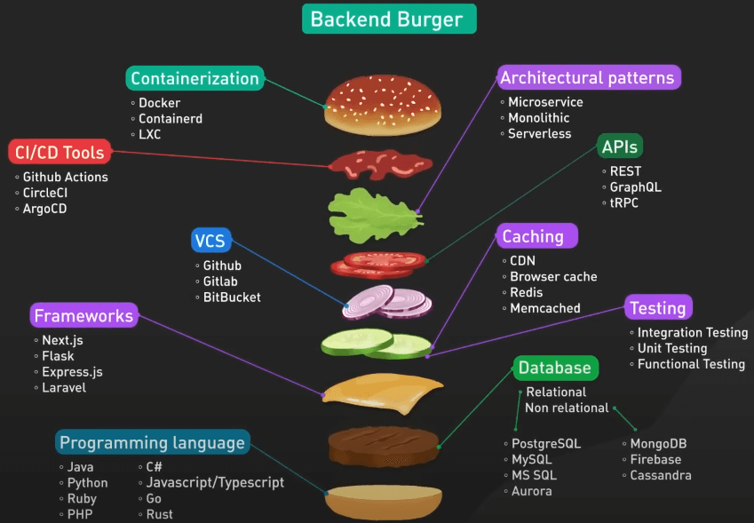

# Backend Burger cho startup có thể có những gì?

## Nguồn

 [The Most Beloved Burger for Developers](https://www.youtube.com/watch?v=7swoLEqABhQ)

## Tại sao lại là Burger?

Bánh mì hamburger là một món ăn phổ biến, nó bao gồm nhiều thành phần như thịt, các loại rau, sốt, và bánh mì kẹp ngoài, mọi thứ được kết hợp lại với nhau để tạo ra một món ăn ngon.

Phát triển phần mềm cũng giống như vậy, nó bao gồm nhiều thành phần như frontend, backend, database, và nhiều hơn nữa, mọi thứ được kết hợp lại với nhau để tạo ra một ứng dụng hoàn chỉnh. Cả frontend và backend đều sẽ có những chiếc burger cho riêng mình, góp phần tạo nên thành công cho một ứng dụng.

Bài viết này sẽ tập trung vào một chiếc burger cho backend. Tùy vào giai đoạn phát triển của một công ty, ta lại có những chiếc burger khác nhau. Ta sẽ chỉ tập trung vào một công ty ở giai đoạn đầu, khi nguồn lực còn hạn chế và chưa chắc chắn về product/market fit. Thêm nữa, tiêu chí chính là sự linh hoạt.

## Các thành phần của Backend Burger

Bắt đầu từ trên xuống. Đối với containerization, chúng ta không chọn gì cả. Để có được sự linh hoạt tối đa, chúng ta sẽ chọn serverless functions. Serverless functions có một mô hình lập trình request/response rất nghiêm ngặt, nhưng trong đó, hầu hết serverless functions đều được đóng gói dưới dạng container.

Về kiến trúc, Serverless là ngon nhất với chúng ta. Với serverless computing, ta chỉ trả tiền cho tài nguyên ta sử dụng, và không cần lo lắng về việc cung cấp, mở rộng, hoặc duy trì máy chủ. Điều này giúp giải phóng thời gian và nguồn lực để tập trung vào các tính năng cần có của sản phẩm.

Với CI/CD, ta chọn Github Actions. Ở giai đoạn này, ta không cần tự thiết lập CI/CD.

Với API, chỉ có thể là REST. REST là tiêu chuẩn giữa client và server.

Với hệ thống quản lý phiên bản (version control systems hay VCS), GitHub là được.

Với caching, cache trình duyệt và CDN là hai phần quan trọng nhất để cải thiện trải nghiệm người dùng. CDN đi kèm miễn phí với hầu hết các nhà cung cấp hosting như Vercel và Netlify. Nếu không thì chỉ cần sử dụng Cloudflare.

Với frameworks, ta sẽ sử dụng Next.js và host cả frontend và backend trên Vercel, nghĩa là dùng Express.js với Typescript ở phía backend. Một ngôn ngữ cho cả frontend và backend.

Với testing, sẽ hơi gây tranh cãi một chút nhưng ta thực sự không quá cần testing cho giai đoạn sớm như thế này, trừ một số unit testing đơn giản. Khi tìm thấy product/market fit và bắt đầu mở rộng công ty, ta sẽ đầu tư nhiều hơn vào testing (hứa luôn :v).

Với database, ta sẽ sử dụng Aurora Serverless nếu mô hình dữ liệu phức tạp, hoặc Firestore / Firebase nếu dữ liệu đơn giản.

Bạn có thể xem các lựa chọn khác có thể có cho Burger của mình ở hình dưới nhé. Chúc các bạn thành công.

{:class="centered-img"}
