# Big-O Notation là gì?

## Nguồn

 [Big-O Notation in 3 Minutes](https://www.youtube.com/watch?v=x2CRZaN2xgM)

## Big-O Notation là gì?

Big-O cho ta thấy cách mà thời gian chạy sẽ tăng theo kích thước của input. Đây là một phần quan trọng để hiểu về hiệu suất của thuật toán.

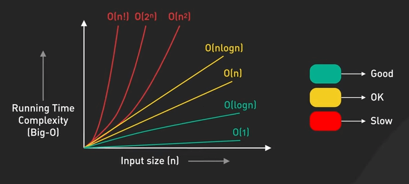{:class="centered-img"}

Ta có các notation phổ biến từ nhanh nhất đến chậm nhất như sau:

- $O(1)$ - Constant Time: Thời gian chạy giữ nguyên, không phụ thuộc vào kích thước của input, ví dụ như truy cập vào một phần tử trong mảng, hoặc thao tác với hash table.

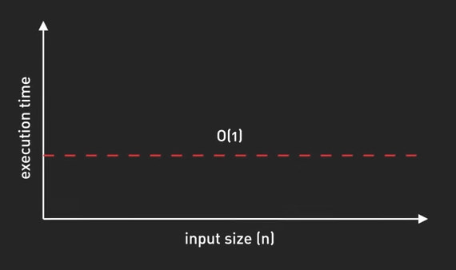{:class="centered-img"}

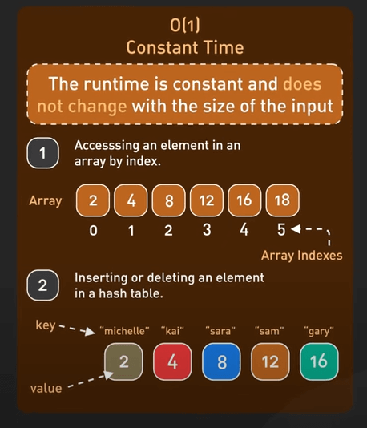{:class="centered-img"}

- $O(\log n)$ - Logarithmic Time: Thời gian chạy tăng chậm khi input tăng, ví dụ như binary search, hiệu quả với dữ liệu lớn, khi input tăng gấp đôi, ta chỉ cần tốn thêm một thao tác.

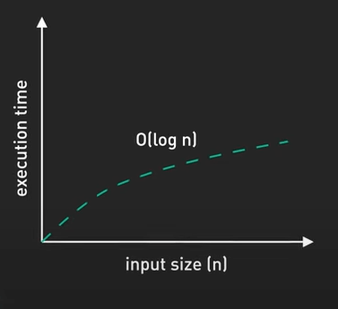{:class="centered-img"}

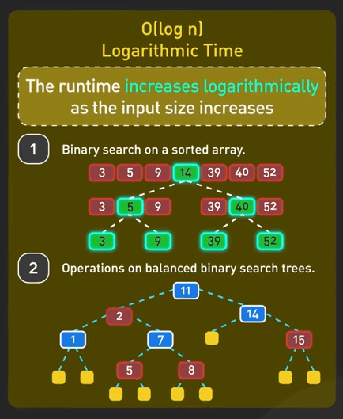{:class="centered-img"}

- $O(n)$ - Linear Time: Thời gian chạy tăng đều theo input. Ví dụ, tìm phần tử lớn nhất trong một mảng chưa sắp xếp, ta phải duyệt qua mỗi phần tử một lần.

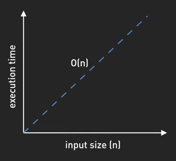{:class="centered-img"}

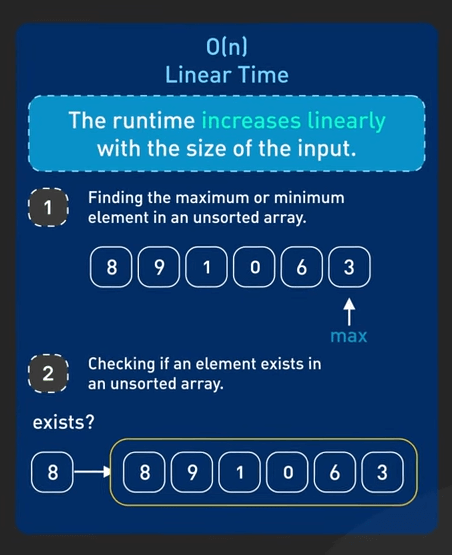{:class="centered-img"}

- $O(n \log n)$ - Linearithmic Time: Hiệu quả với các thuật toán sắp xếp như merge sort, quick sort, heap sort. Đây là mức độ tốt nhất mà các thuật toán sắp xếp dựa vào việc so sánh có thể đạt được.

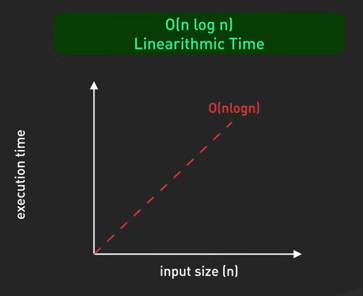{:class="centered-img"}

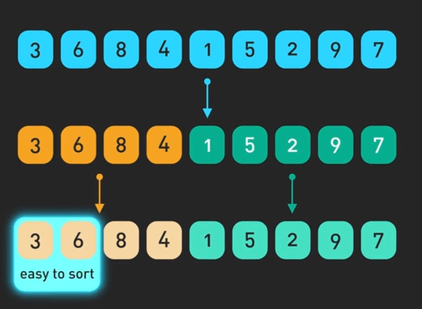{:class="centered-img"}

- $O(n^2)$ - Quadratic Time: Thời gian chạy tăng theo bình phương của input. Ví dụ, các thuật toán sắp xếp cơ bản như bubble sort, hay các vòng lặp lồng nhau duyệt qua cùng một dữ liệu.

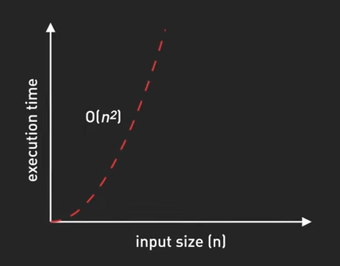{:class="centered-img"}

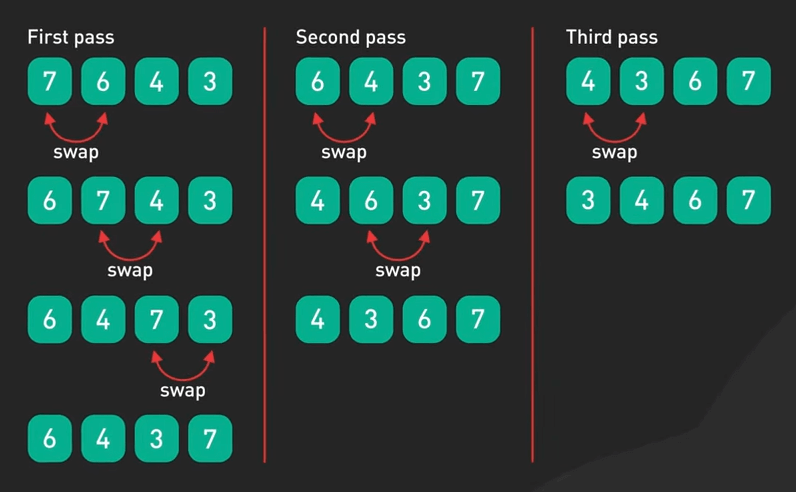{:class="centered-img"}

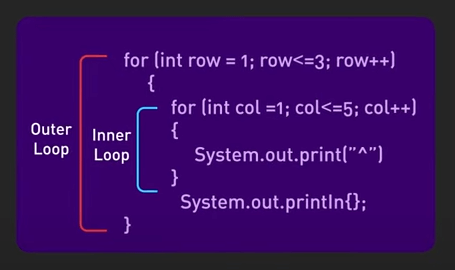{:class="centered-img"}

- $O(n^3)$ - Cubic Time: Thời gian chạy tăng theo lập phương của input. Ví dụ, nhân ma trận theo cách thường hay 3 vòng lặp lồng nhau.

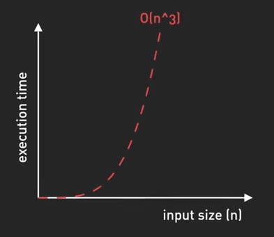{:class="centered-img"}

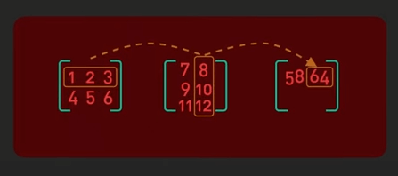{:class="centered-img"}

- $O(2^n)$ - Exponential Time: Thời gian chạy tăng gấp đôi với mỗi phần tử input. Ta có thể thấy điều này trong một số thuật toán đệ quy, với input nhỏ, thời gian chạy có thể rất lâu.

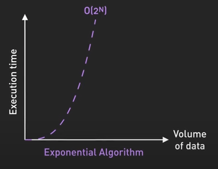{:class="centered-img"}

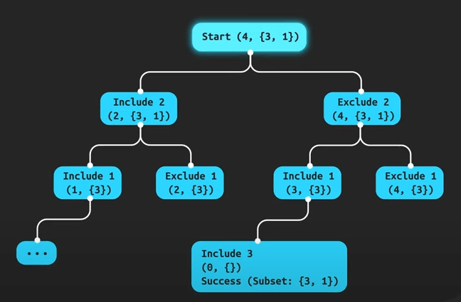{:class="centered-img"}

- $O(n!)$ - Factorial Time: Thời gian chạy tăng cực kỳ nhanh với kích thước input, ví dụ như việc sinh ra tất cả các hoán vị, không thực tế với input lớn.

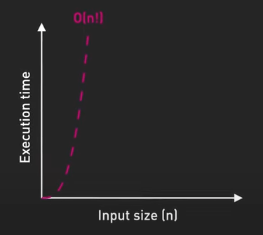{:class="centered-img"}

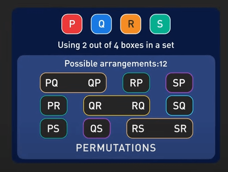{:class="centered-img"}

## Thời gian chạy thực tế bị ảnh hưởng bởi các yếu tố nào?

Nhớ rằng Big-O chỉ là một bước khởi đầu, hiệu suất thực tế có thể khác nhau do các yếu tố như caching, việc sử dụng bộ nhớ và phần cứng. Với các CPU hiện đại, việc tối đa hóa cache hit có thể quan trọng hơn việc giảm độ phức tạp của thuật toán.

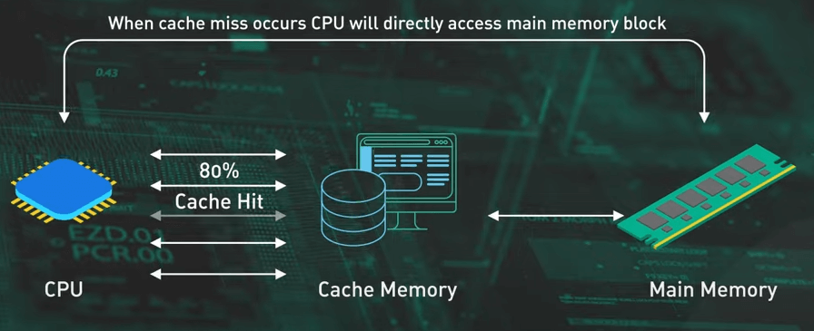{:class="centered-img"}

Ví dụ như việc duyệt mảng, xét một mảng hai chiều, việc duyệt theo hàng thường nhanh hơn so với duyệt theo cột, mặc dù cả hai đều có độ phức tạp bậc hai, duyệt theo hàng tối ưu hóa việc truy cập bộ nhớ tuần tự và thân thiện với cache.

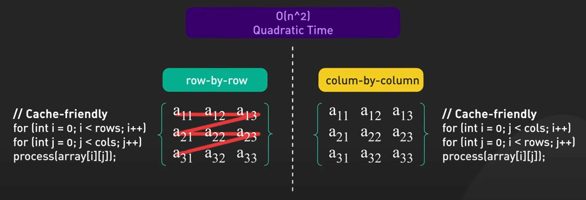{:class="centered-img"}

Một ví dụ khác, so sánh danh sách liên kết và mảng, cả hai đều có độ phức tạp tuyến tính cho việc duyệt, nhưng mảng thường vượt trội so với danh sách liên kết do sự liên tục của các phần tử trong bộ nhớ, trong khi các node trong danh sách liên kết có thể phân tán.

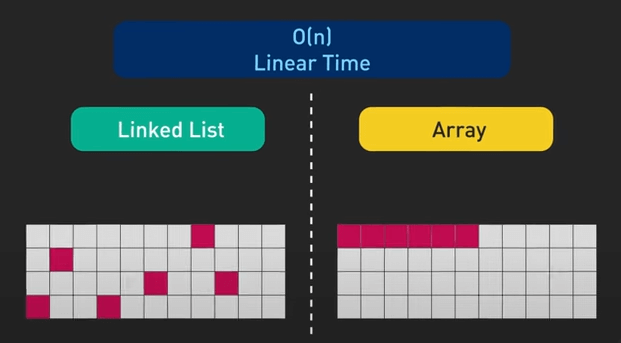{:class="centered-img"}

Như vậy, hãy sử dụng Big-O như một bước khởi đầu, nhưng đừng dừng lại ở đó. Hãy profile code của bạn, hiểu rõ phần cứng của bạn và tối ưu hóa chúng cho các điều kiện thực tế.
