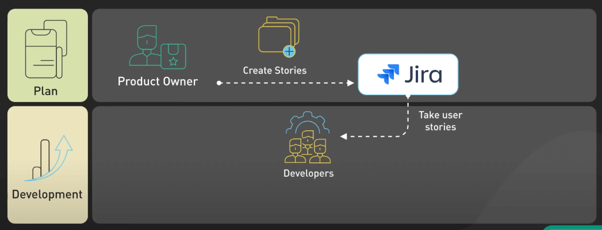
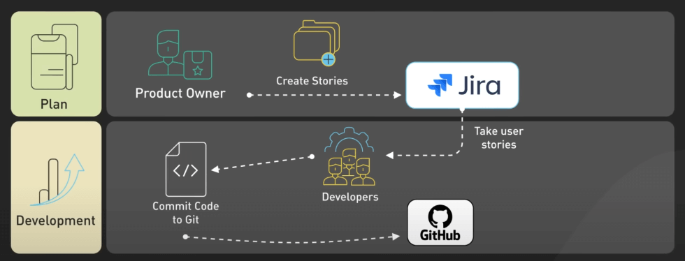
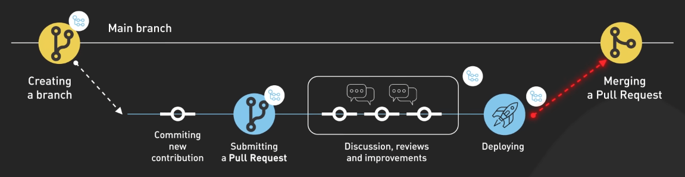
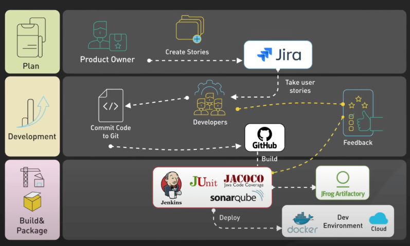
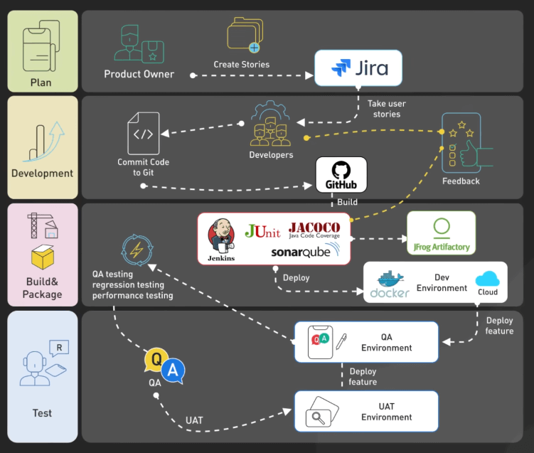
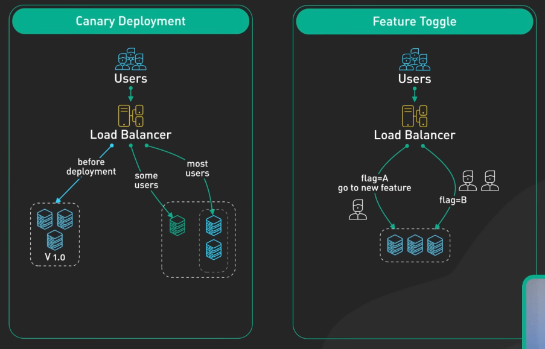
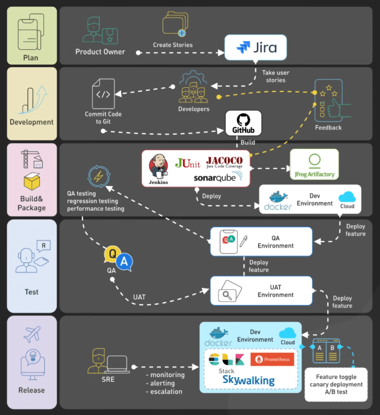

# Các công ty Big Tech release code như thế nào?

## Nguồn

 [How Big Tech Ships Code to Production](https://www.youtube.com/watch?v=xSPA2yBgDgA)

## Quy trình

Mọi thứ bắt đầu từ việc team product sẽ tập hợp feedback và yêu cầu của người dùng. Team product và team engineering sẽ chia nhỏ chúng thành các công việc hoặc user story nhỏ hơn. Dev sau đó sẽ chọn các công việc trong cuộc họp lập kế hoạch sprint, thường kéo dài từ 1-2 tuần. 

{:class="centered-img"}

Đối với các dự án lớn, công việc có thể kéo dài qua nhiều sprint. Engineering manager hoặc tech lead sẽ ưu tiên và sắp xếp các công việc qua các sprint để cân bằng khả năng của team. Khi có sprint, dev sẽ bắt đầu làm. Đối với các dự án lớn, thường có quy trình RFC hoặc thiết kế tài liệu để thống nhất về kiến trúc tổng thể và phương pháp kỹ thuật ngay từ đầu. 

Đây là nơi mà một số quy trình quan trọng xuất hiện. Dev sử dụng Git hoặc một công cụ tương tự để quản lý code và tạo các feature branch để xây dựng chức năng mới mà không ảnh hưởng đến code chính, giúp cho việc của các dev khác nhau không ảnh hưởng đến nhau. 

{:class="centered-img"}

Khi cần thay đổi database schema, các migration script được phát triển trong các branch tương ứng. Schema migration cần phải được thiết kế cẩn thận và test kỹ vì rủi ro mất dữ liệu. Khi code xong, dev sẽ mở pull request để team có thể review. Việc này giúp phát hiện lỗi sớm. Sau khi được duyệt, code sẽ được merge vào branch chính sau khi được chạy unit test. 

{:class="centered-img"}

Khi một chức năng mới được thêm vào branch chính, nó khởi động CI/CD pipeline. Các công cụ như GitHub Actions và Jenkins sẽ tự động build, test, và deploy code qua nhiều môi trường như dev, test, và staging. 

{:class="centered-img"}

Việc kiểm tra qua nhiều môi trường rất là quan trọng. Staging cần phải giống với cơ sở hạ tầng production để kiểm tra tính nhất quán, giúp giảm thiểu những bất ngờ sau này. 

QA engineer kiểm tra kỹ lưỡng chức năng, chạy regression test, scan bảo mật, test hiệu suất, vân vân... Cần lưu ý rằng một số team dựa vào chính dev để kiểm tra code thay vì có QA riêng. Việc này cũng ok cho một số sản phẩm, nhưng không phải tất cả. 

Khi build qua tất cả các checkpoint, nó sẽ được chuyển đến UAT. UAT là viết tắt của user acceptance testing. Team product, QA, và dev sẽ kiểm tra chức năng cùng nhau. Các release candidate qua UAT sẽ được chuyển từ từ vào production. 

{:class="centered-img"}

Một số team sử dụng kỹ thuật như canary release và feature flags để từ từ triển khai thay đổi và giảm rủi ro. 

{:class="centered-img"}

Đối với việc triển khai schema changes, các kỹ thuật như maintenance windows, read replicas, và rollback scripts giúp giảm rủi ro. Multi-phase migrations và feature flags giúp kiểm soát quyền truy cập trong quá trình chuyển đổi. Trong suốt quá trình này, SRE sẽ theo dõi metrics, logs, và traffic để phát hiện sớm vấn đề production. Bug được ưu tiên sửa trước. Ngoài ra, team product và engineering cũng theo dõi analytics để đảm bảo chức năng hoạt động như mong đợi và không ảnh hưởng đến các metrics khác. Tóm lại, yêu cầu chức năng của bạn sẽ trải qua quá trình thiết kế, phát triển, kiểm thử, và triển khai từ từ trước khi trở thành một phần của phần mềm bạn sử dụng.

{:class="centered-img"}
