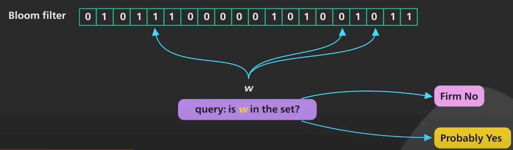
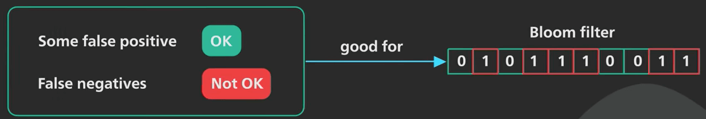
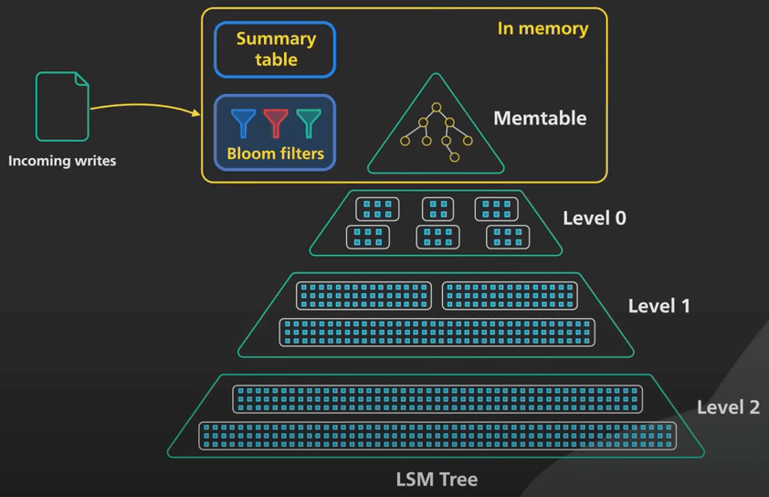
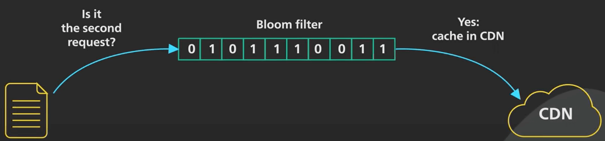
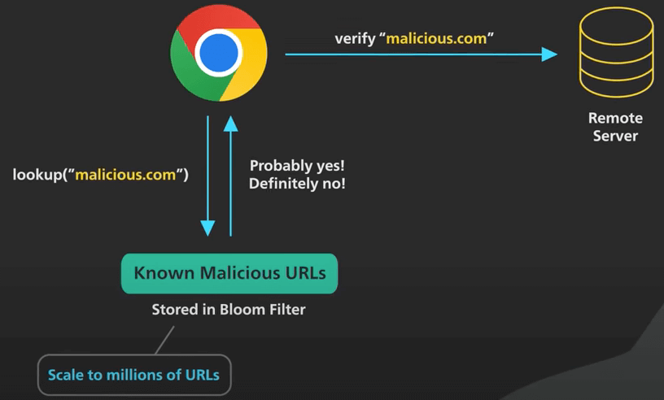
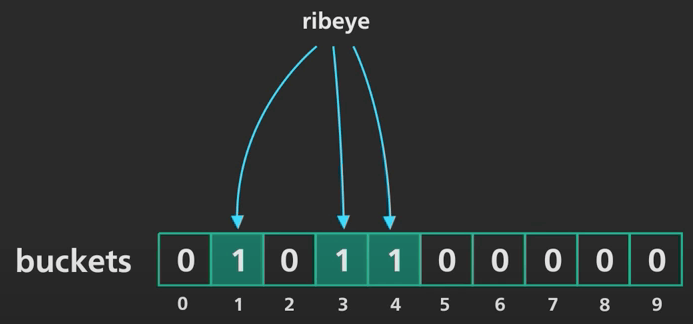
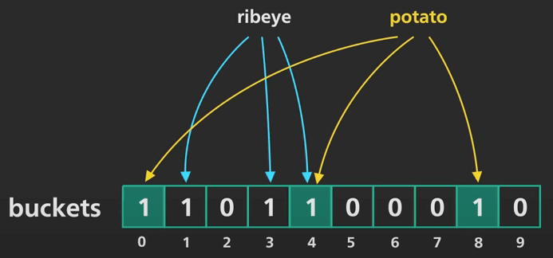
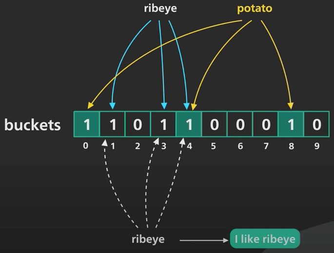
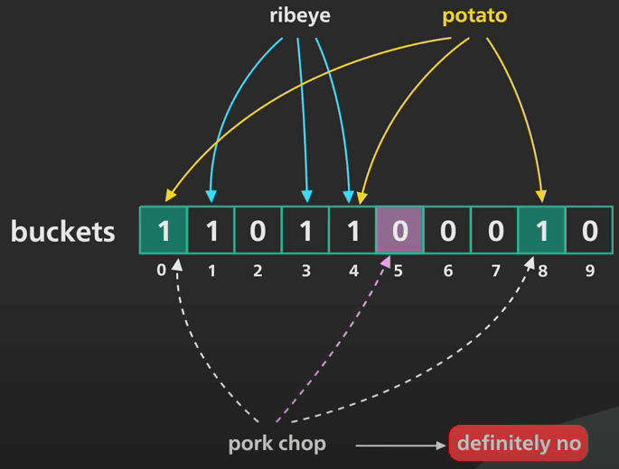
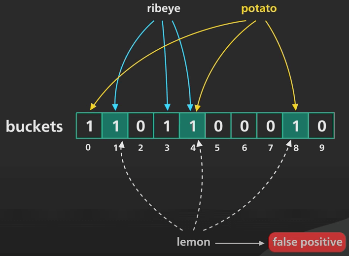

# Bloom Filter là gì?

## Nguồn

 [Bloom Filters | Algorithms You Should Know #2 | Real-world Examples](https://www.youtube.com/watch?v=V3pzxngeLqw)

## Mở đầu

**Bloom Filter (bộ lọc nở hoa)** là một cấu trúc dữ liệu có nhiều ứng dụng thực tế. Ta có thể thấy nó trong các router mạng, database và trình duyệt web, vân vân. Ta đã từng nói về Bloom Filter trong một bài viết về cây LSM. Ta cùng xem nó là gì qua bài viết sau nhé.

## Bloom Filter là gì?

Bloom filter là một cấu trúc dữ liệu xác suất, hiệu quả về mặt không gian, đã ra đời được tầm 50 năm. Nó được sử dụng để trả lời cho câu hỏi: phần tử này có ở trong tập hợp không? Bloom filter sẽ trả lời "chắc chắn là không" hoặc "có lẽ là có". Nói cách khác, ta có thể gặp trường hợp khẳng định sai, nghĩa là phần tử không ở trong tập hợp nhưng bloom filter lại cho kết quả là có. Ngược lại, phủ định sai không thể xảy ra, nghĩa là phần tử có trong tập hợp nhưng bloom filter cho ra kết quả là không.

{ style="display: block; margin: 0 auto" }

Phần "có lẽ là có" chính là điều làm cho bloom filter có tính xác suất. Cũng như nhiều thứ khác trong công nghệ phần mềm, đây là một sự đánh đổi. Sự đánh đổi ở đây là: đôi khi câu trả lời "có" có thể sai vài lần, nhưng bloom filter tiêu tốn rất ít bộ nhớ, so với các cấu trúc dữ liệu có ứng dụng tương tự, chẳng hạn như hash table, thứ sẽ luôn cho kết quả đúng. Nếu một use case chấp nhận một số câu trả lời "có" sai, nhưng không chấp nhận câu trả lời "không" sai, bloom filter sẽ là một giải pháp tuyệt vời. Một điểm quan trọng nữa là, ta không thể xoá phần tử ra khỏi bloom filter.

{ style="display: block; margin: 0 auto" }

## Bloom filter được ứng dụng như thế nào?

Nhiều database NoSQL sử dụng các bloom filter để giảm việc đọc đĩa với các key không tồn tại. Với một database dựa vào cây LSM, việc tìm một key không có trong database cần phải tra cứu qua nhiều file và rất tốn kém.

{ style="display: block; margin: 0 auto" }

Các CDN như Akamai dùng bloom filter để tránh cache các "one-hit-wonder". Đây là các trang web chỉ được request một lần. Theo Akamai, 75% số trang là "one-hit-wonder". Sử dụng bloom filter để theo dõi tất cả các URL được xem và chỉ cache các trang trong lần request thứ hai đã giúp giảm đáng kể việc cache và tăng tỉ lệ truy cập cache.

{ style="display: block; margin: 0 auto" }

Các trình duyệt như Chrome từng dùng bloom filter để xác định các URL độc hại. Bất kỳ URL nào trước hết cũng phải được kiểm tra trong bloom filter. Nó chỉ thực hiện kiểm tra kỹ URL sau khi bloom filter trả về "có thể là độc hại". Tuy nhiên, số lượng URL độc hại tăng lên hàng triệu nên bloom filter không còn được sử dụng nữa, mà thay vào đó là một giải pháp hiểu quả nhưng phức tạp hơn.

{ style="display: block; margin: 0 auto" }

Tương tự vậy, một số trình xác thực mật khẩu sẽ dùng bloom filter để tránh cho người dùng dùng các mật khẩu yếu. Đôi khi một mật khẩu mạnh sẽ không qua được do khẳng định sai, nhưng trong trường hợp này, nó chỉ có thể hỏi người dùng cung cấp mật khẩu khác.

Trên đây chỉ là một số ví dụ phổ biến. Bloom filter còn rất nhiều ứng dụng khác nữa.

## Bloom filter hoạt động như thế nào?

Một thành phần quan trọng của một bloom filter ngon lành là các hàm hash tốt. Các hàm hash này cần phải nhanh và chúng phải cho ra các output được phân phối đồng đều và ngẫu nhiên. Trùng lặp cũng được, miễn là hiếm khi xảy ra. Một bloom filter là một tập hợp lớn, với mỗi phần tử chứa một bit, và ban đầu bit đó là 0.

Giờ tưởng tượng ta đang lưu các món ăn nhé. Với ví dụ này, ta sẽ dùng một bloom filter với 10 phần tử đánh số từ 0 đến 9, và ta sẽ dùng 3 hàm hash. 

Thêm `ribeye` vào bloom filter nhé. Các hàm hash sẽ trả về lần lượt các số 1, 3 và 4. Các bit tương ứng sẽ được đánh dấu bằng 1, dĩ nhiên là trong thời gian hằng số. 

{ style="display: block; margin: 0 auto" }

Tiếp theo, cho `potato` vào bloom filter. Các hàm hash sẽ trả về lần lượt các số 0, 4 và 8. Đánh dấu 1 vào các bit đó. 

{ style="display: block; margin: 0 auto" }

Giờ ta cần kiểm tra xem `ribeye` có trong đó không. Vì cùng input sẽ cho ra cùng output, `ribeye` sẽ được hash thành 1, 3, 4. Ta kiểm tra các phần tử tương ứng, thấy chúng đều có bit bằng 1. Nên bloom filter sẽ trả về là "có lẽ là có". Trong trường hợp này, đúng là có.

{ style="display: block; margin: 0 auto" }

Giờ kiểm tra xem `pork chop` có trong đó không. Các hàm hash sẽ trả về 0, 5, 8. Dù phần tử thứ 0 và 8 chứa 1, nhưng phần tử 5 lại chứa 0. Vì vậy nên bloom filter trả về "chắc chắn là không".

{ style="display: block; margin: 0 auto" }

Với `lemon` thì sao? Các hàm hash trả về 1, 4, 8. Do các phần tử tương ứng đều chứa bit 1, bloom filter sẽ trả về "có lẽ là có". Đây là một ví dụ về khẳng định sai, vì ta ban đầu không cho `lemon` vào bloom filter.

{ style="display: block; margin: 0 auto" }

Trong thực tế, kích thước của bloom filter sẽ lớn hơn nhiều so với ví dụ này. Ta có thể kiểm soát tần suất thấy khẳng định sai bằng cách chọn chính xác kích thước cho bloom filter dựa vào kỳ vọng số entry trong đó. Đây là sự đánh đổi giữa không gian bộ nhớ và sự chính xác.
