# Cache có thể sai đến mức nào?

## Nguồn

 [Caching Pitfalls Every Developer Should Know](https://www.youtube.com/watch?v=wh98s0XhMmQ)

## Caching là gì?

Đơn giản mà nói, caching giống như một lớp nhớ tạm, lưu trữ các bản sao của dữ liệu thường xuyên được truy cập. Mục đích là để tăng tốc độ bằng cách giữ dữ liệu có sẵn, giảm nhu cầu lấy lại từ cơ sở dữ liệu mỗi khi có yêu cầu.

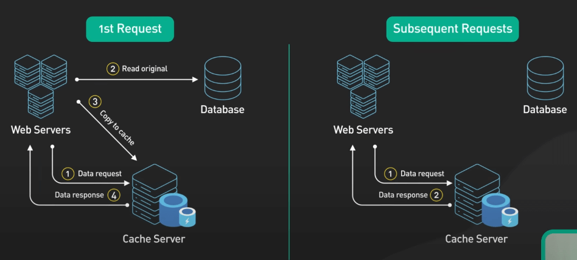{:class="centered-img"}

Ví dụ, hãy tưởng tượng một cơ sở dữ liệu chứa thông tin hồ sơ người dùng. Cache có thể lưu trữ các hồ sơ phổ biến nhất để khi ai đó truy cập, hồ sơ đó tải ngay lập tức mà không cần truy vấn cơ sở dữ liệu.

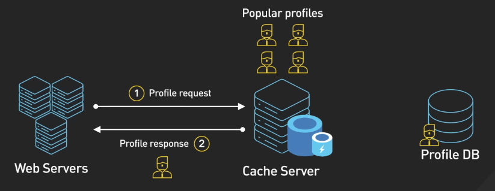{:class="centered-img"}

Tuy nhiên, cùng với những lợi ích về hiệu năng, caching cũng đem lại những thách thức mới. Hãy cùng khám phá một số vấn đề phổ biến có thể xảy ra.

## Các vấn đề với caching

### Cache Stampede

Hãy tưởng tượng một máy chủ web sử dụng Redis để cache các trang trong một khoảng thời gian nhất định. Các trang này yêu cầu các truy vấn cơ sở dữ liệu phức tạp và mất vài giây để tạo ra. Với caching, hệ thống vẫn duy trì khả năng phản hồi dưới tải cao vì các trang tốn nhiều tài nguyên được phục vụ từ cache. 

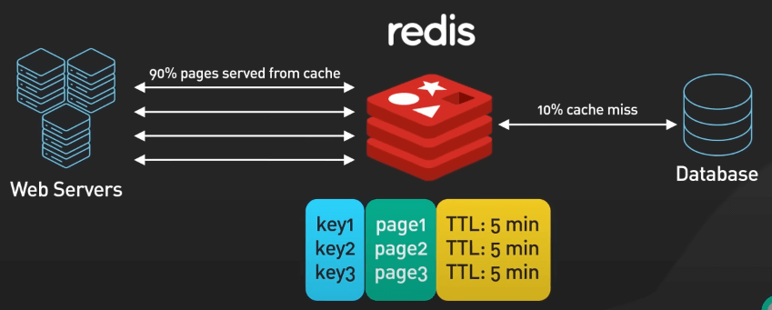{:class="centered-img"}

Tuy nhiên, dưới tải lớn, nếu một trang cache hết hạn, nhiều thread trên web cluster có thể cố gắng refresh trang hết hạn này trong cùng một thời điểm. Sự tăng đột biến số request như thế này có thể làm quá tải cơ sở dữ liệu, gây sự cố hệ thống và ngăn cản việc cache lại trang.

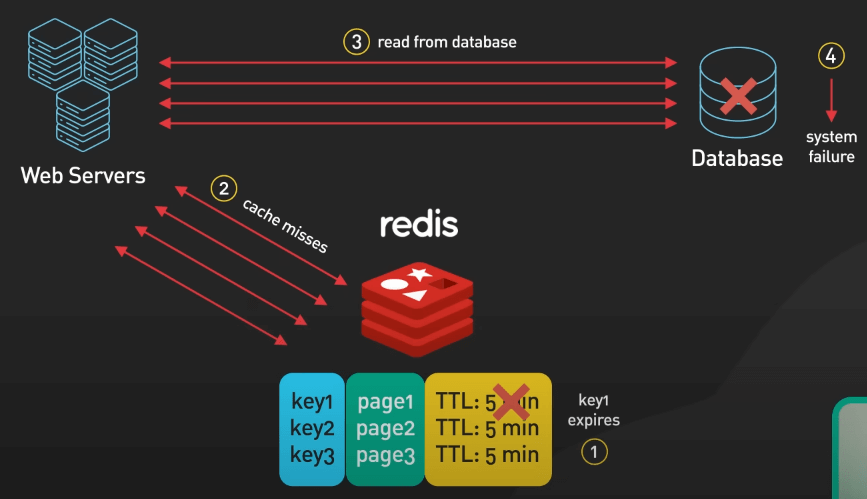{:class="centered-img"}

Để ngăn chặn tình trạng cache stampede, có vài cách như sau:

- Locking: Khi không có dữ liệu cần tìm trong cache, mỗi request sẽ cần phải lấy được một cái lock cho key cache đó trước khi truy vấn lại cái trang hết hạn đó. Nếu không lấy được lock, có thể chờ đợi hoặc trả về một thông báo "không tìm thấy" và cho phép client xử lý với back-off retry. Hệ thống cũng có thể duy trì một phiên bản cũ của dữ liệu cache để sử dụng tạm thời trong khi dữ liệu mới được tạo lại. Tuy nhiên, việc lấy lock cần thêm một bước ghi cho lock đó, và việc lấy lock đúng cách có thể khó khăn.

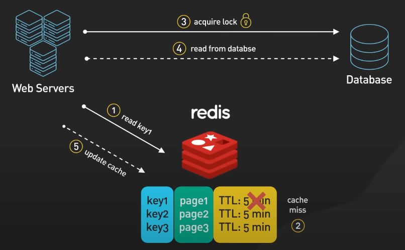{:class="centered-img"}

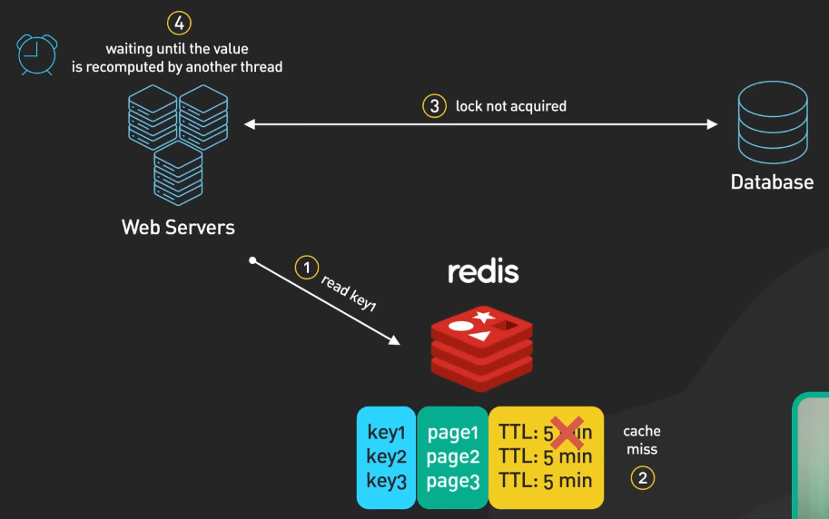{:class="centered-img"}

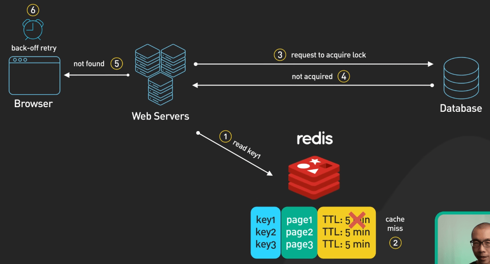{:class="centered-img"}

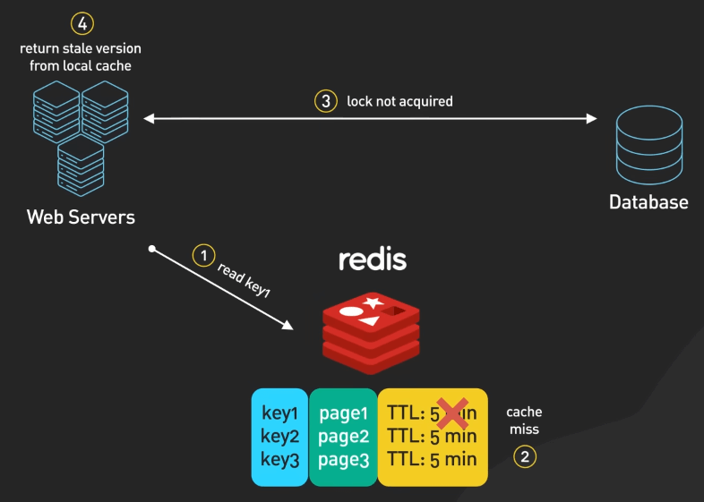{:class="centered-img"}

- Tính toán lại dữ liệu ở một chỗ khác: Phương pháp này có thể được thực hiện bằng nhiều cách, như chủ động làm khi cache key gần hết hạn, hoặc thụ động khi cache miss xảy ra. Phương pháp này buộc bạn phải thêm một thành phần vào kiến trúc của hệ thống, cần phải duy trì và giám sát cẩn thận.

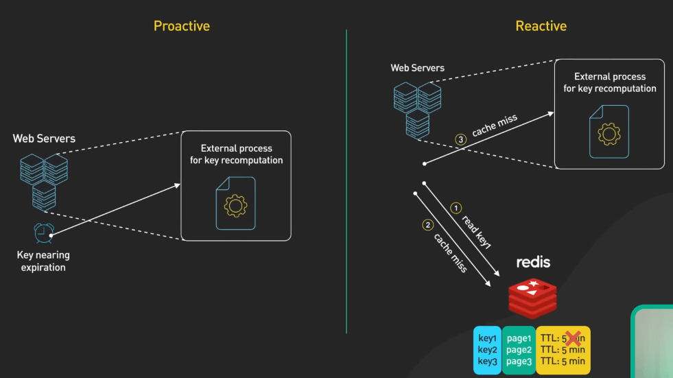{:class="centered-img"}

- Sử dụng xác suất để tính toán lại (probabilistic early expiration): Mỗi request sẽ có một xác suất nhỏ để tính toán lại cache trước khi hết hạn. Xác suất này tăng dần khi thời gian hết hạn càng gần. Phương pháp này giúp giảm tác động của cache stampede vì ít process hơn sẽ hết hạn.

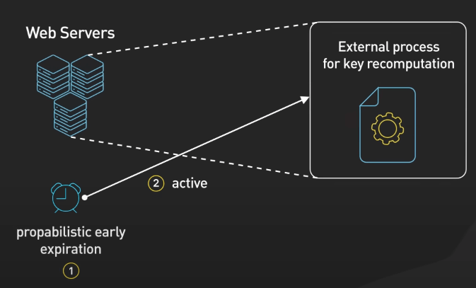{:class="centered-img"}

### Cache Penetration

Cache Penetration xảy ra khi một request được thực hiện cho dữ liệu không tồn tại trong cả cache và cơ sở dữ liệu, gây tải không cần thiết lên hệ thống khi cố gắng truy vấn dữ liệu không tồn tại. Việc này có thể làm mất ổn định cho toàn bộ hệ thống nếu số lượng request lớn. 

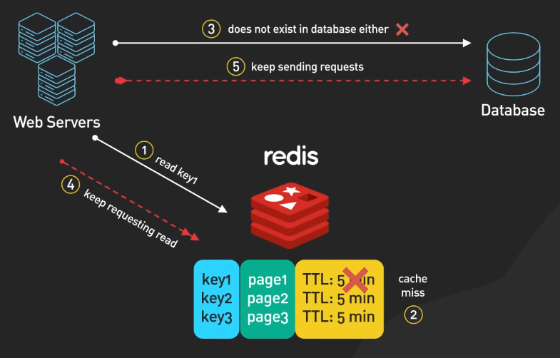{:class="centered-img"}

Để giảm thiểu tình trạng cache penetration, bạn có thể thực hiện một số cách sau:

- Sử dụng giá trị placeholder cho các key không tồn tại để tránh việc truy vấn cơ sở dữ liệu nhiều lần. Cài đặt TTL phù hợp cho các giá trị placeholder này để tránh chiếm nhiều không gian cache. Tuy nhiên, cách tiếp cận này cần phải được điều chỉnh cẩn thận để tránh tiêu tốn nhiều tài nguyên cache, đặc biệt là đối với hệ thống có nhiều truy vấn key không tồn tại.

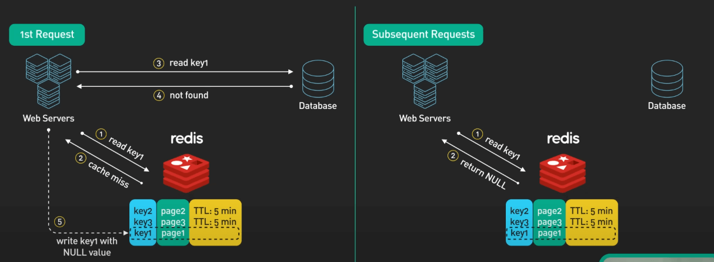{:class="centered-img"}

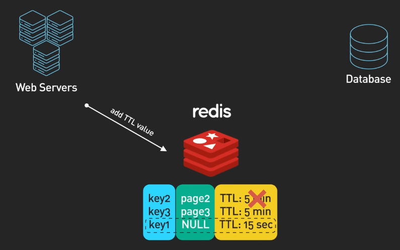{:class="centered-img"}

- Sử dụng bloom filter, một cấu trúc dữ liệu xác suất hiệu quả để kiểm tra nhanh xem các phần tử có trong một tập hợp trước khi truy vấn cơ sở dữ liệu. Khi thêm bản ghi mới vào lưu trữ, key của chúng được ghi lại trong bloom filter. Trước khi truy vấn dữ liệu, ứng dụng sẽ kiểm tra bloom filter trước. Nếu key không tồn tại, bản ghi chắc chắn không tồn tại, cho phép ứng dụng trả về giá trị null ngay lập tức. Tuy nhiên, sự hiện diện của key không đảm bảo sự tồn tại - một tỉ lệ nhỏ các truy vấn cache vẫn có thể không được tìm thấy.

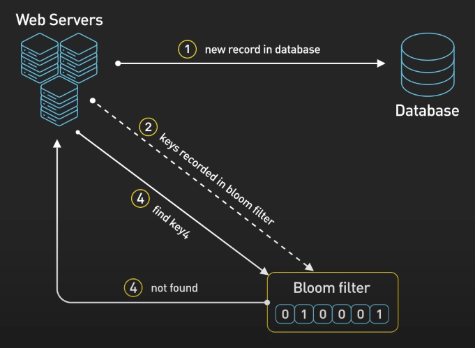{:class="centered-img"}

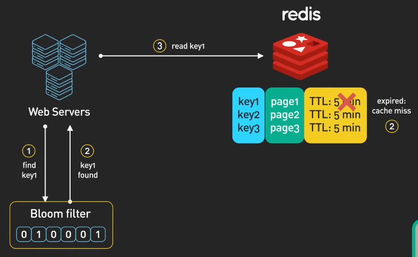{:class="centered-img"}

### Cache Crash

Khi hệ thống cache bị lỗi, mọi request sẽ truy cập trực tiếp vào cơ sở dữ liệu, gây quá tải nghiêm trọng. Điều tệ hơn là khi người dùng bắt đầu refresh liên tục, làm tăng thêm áp lực lên hệ thống.

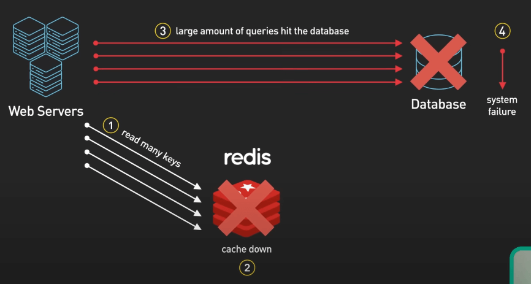{:class="centered-img"}

Một biến thể của Cache Crash là Cache Avalanche, xảy ra khi một lượng lớn dữ liệu cache hết hạn cùng một lúc hoặc khi cache khởi động lại và không có gì trong đó cả. Trong cả hai trường hợp, một lượng lớn request đột ngột đổ vào cơ sở dữ liệu. Sự tăng đột biến này có thể làm quá tải hệ thống, giống như hàng trăm người đột ngột đẩy nhau qua một cửa nhỏ sau khi báo động cháy.

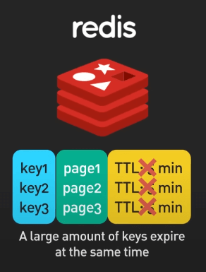{:class="centered-img"}

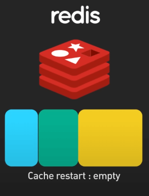{:class="centered-img"}

Giải pháp:

- Circuit breaker: Nó sẽ giúp chặn tạm thời các request đến khi hệ thống bị quá tải, giúp hệ thống trụ lại và câu giờ để hồi phục.

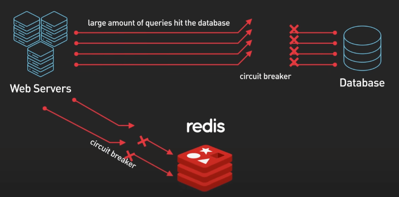{:class="centered-img"}

- Cache cluster với tính sẵn sàng và độ dự phòng cao: Nếu một phần của cache bị lỗi, các phần khác vẫn hoạt động. Mục tiêu là giảm thiểu tác động của crash.

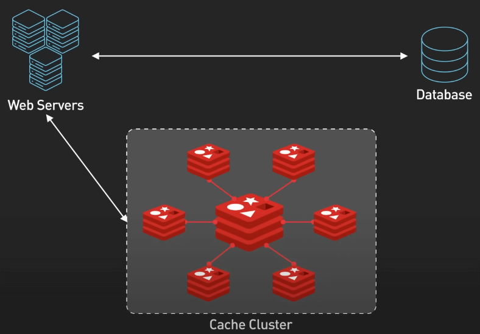{:class="centered-img"}

- Prewarming cache: Đặc biệt quan trọng khi khởi động lại hoàn toàn cache. Ở đây, các dữ liệu quan trọng sẽ được nạp vào cache trước được đưa vào sử dụng. Điều này giúp tránh việc đột ngột truy vấn vào cơ sở dữ liệu.

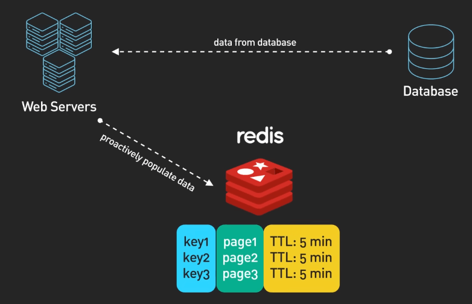{:class="centered-img"}

## Cache stampede vs. Cache avalanche

Cache stampede xảy ra khi nhiều request đồng thời truy vấn cùng một cache key đã hết hạn, còn cache avalanche là sự vố khi một lượng lớn request khác nhau ập đến hệ thống sau khi cache bị clear hoặc khởi động lại.

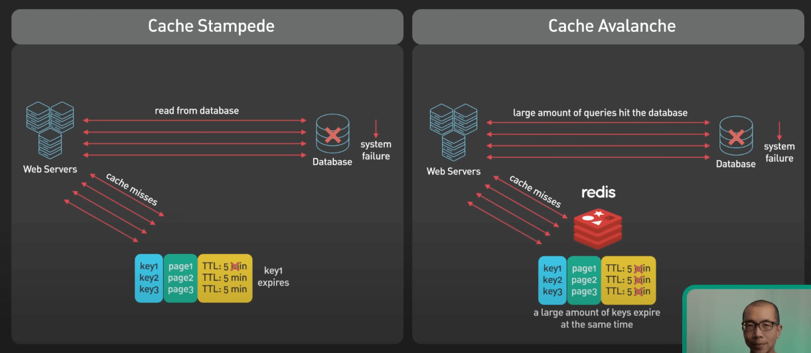{:class="centered-img"}
