# Các hệ thống cache phổ biến

## Nguồn

 [Cache Systems Every Developer Should Know](https://www.youtube.com/watch?v=dGAgxozNWFE)

## Tại sao cần cache?

Caching là một kỹ thuật phổ biến để tăng hiệu suất hệ thống và giảm thời gian phản hồi. Từ frontend đến backend, caching đóng một vai trò quan trọng trong việc cải thiện hiệu suất của các ứng dụng và hệ thống khác nhau. Một kiến trúc hệ thống điển hình bao gồm nhiều lớp caching. Tại mỗi lớp, ta lại có nhiều cơ chế caching dữ liệu, tùy vào yêu cầu của từng ứng dụng cụ thể.

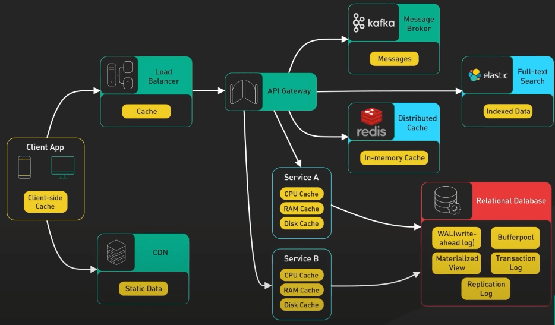{:class="centered-img"}

## Caching trong máy tính

Trong máy tính, các cache L1, L2, L3 là được biết đến nhiều nhất.

- Cache L1 là loại nhỏ nhất và cũng nhanh nhất, thường được tích hợp vào CPU. Nó lưu trữ dữ liệu và chỉ thị được truy cập thường xuyên, cho phép CPU truy cập chúng mà không cần phải lấy từ các loại bộ nhớ chậm hơn. 
- Cache L2 lớn hơn nhưng chậm hơn so với cache L1, thường được đặt trên chip CPU hoặc trên một chip riêng. 
- Cache L3 lớn hơn và chậm hơn so với cache L2, thường được chia sẻ giữa nhiều lõi CPU.

Một loại cache phần cứng khác cũng phổ biến là TLB (translation lookaside buffer). Nó cho phép CPU dịch nhanh địa chỉ bộ nhớ ảo thành địa chỉ bộ nhớ vật lý, bằng cách lưu trữ các bản dịch địa chỉ gần đây, để giảm thời gian cần thiết để truy cập dữ liệu từ bộ nhớ.

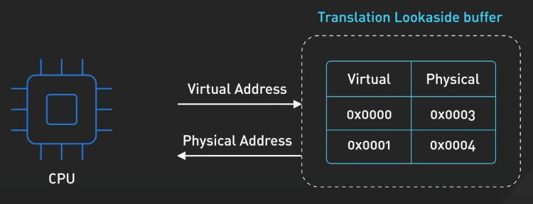{:class="centered-img"}

Ở cấp độ hệ điều hành, ta có page cache và các cache file hệ thống khác. Page cache được quản lý bởi hệ điều hành và nằm trong bộ nhớ chính. Nó được sử dụng để lưu trữ các khối đĩa được sử dụng gần đây trong bộ nhớ. Khi một chương trình yêu cầu dữ liệu từ đĩa, hệ điều hành có thể nhanh chóng truy xuất dữ liệu từ bộ nhớ thay vì đọc từ đĩa.

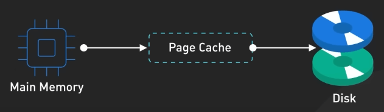{:class="centered-img"}

Ta cũng có các cache khác được quản lý bởi hệ điều hành, như cache inode. Những cache này được sử dụng để tăng tốc các hoạt động liên quan đến file hệ thống bằng cách giảm số lần truy cập đĩa cần thiết để truy cập các file và thư mục.

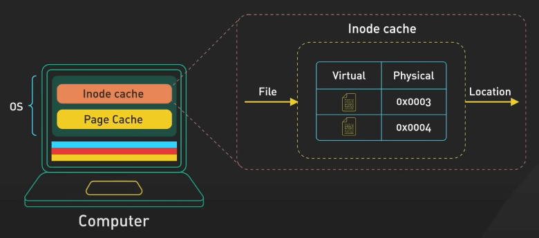{:class="centered-img"}

## Caching trong frontend

Trên phần frontend, trình duyệt web có thể cache các HTTP response để cho phép truy xuất dữ liệu nhanh hơn. Khi ta request dữ liệu qua HTTP lần đầu, ta sẽ nhận được một expiration policy (chính sách hết hạn) trong header HTTP.

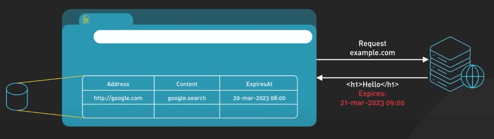{:class="centered-img"}

Ta request dữ liệu đó lần nữa, trình duyệt khi đó sẽ trả về dữ liệu từ cache nếu có dữ liệu đó trong cache.

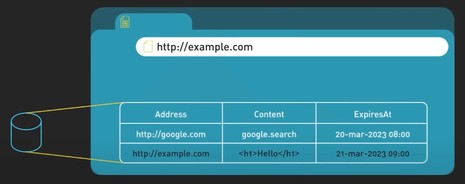{:class="centered-img"}

Mạng phân phối nội dung (CDN) được sử dụng rộng rãi để cải thiện việc phân phối nội dung tĩnh, như hình ảnh, video và các tài nguyên web khác. Một trong những cách mà CDN tăng tốc việc phân phối nội dung là thông qua việc caching. Khi một người dùng yêu cầu nội dung từ một CDN, mạng CDN sẽ tìm kiếm nội dung được request trong cache của mình. Nếu nội dung chưa có trong cache, CDN sẽ lấy nó từ server nguồn và lưu trữ nó trên các server edge.

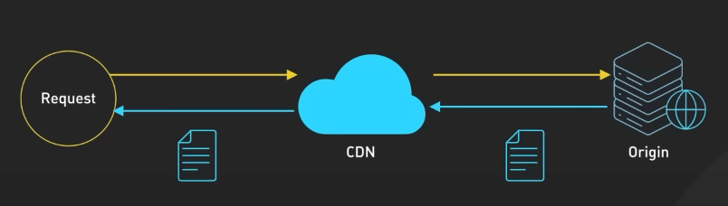{:class="centered-img"}

Khi một người dùng khác request cùng một nội dung, CDN có thể cung cấp nội dung trực tiếp từ cache của mình mà không cần lấy lại từ server nguồn.

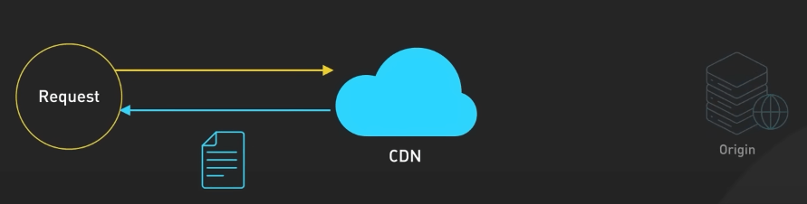{:class="centered-img"}

## Caching trong backend

Một số load balancer có thể cache tài nguyên để giảm tải cho các server phía sau. Khi một người dùng request nội dung từ một server đứng sau load balancer, load balancer có thể cache response và trả về trực tiếp cho người dùng tiếp theo nếu người đó request cùng nội dung đó. Điều này giúp cải thiện thời gian phản hồi và giảm tải cho các server phía sau.

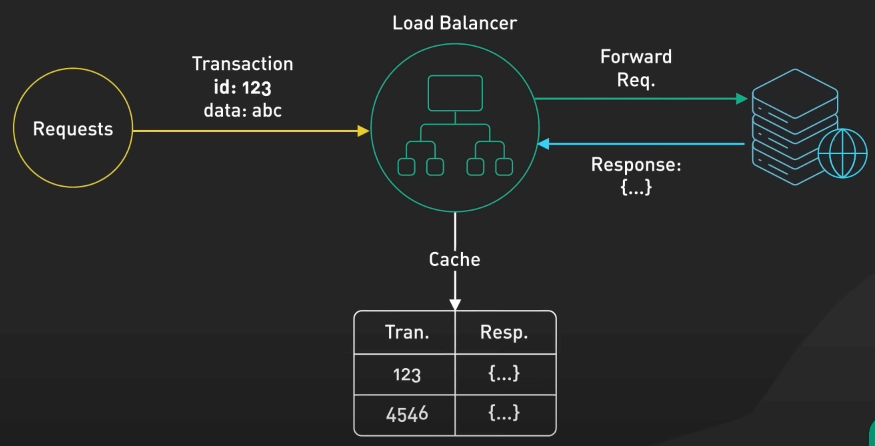{:class="centered-img"}

Caching không nhất thiết phải nằm trong bộ nhớ. Trong các hạ tầng messaging, các message broker như Kafka có thể cache một lượng lớn các message trên đĩa. Điều này cho phép các consumer truy xuất message theo tốc độ mà consumer mong muốn. Message có thể được cache trong một khoảng thời gian dài dựa trên retention.

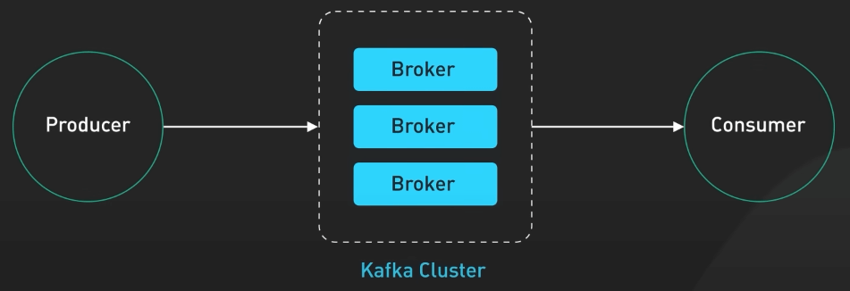{:class="centered-img"}

Các cache phân tán như Redis có thể lưu trữ các cặp key-value trong bộ nhớ, cung cấp hiệu suất đọc/ghi cao hơn so với các cơ sở dữ liệu truyền thống.

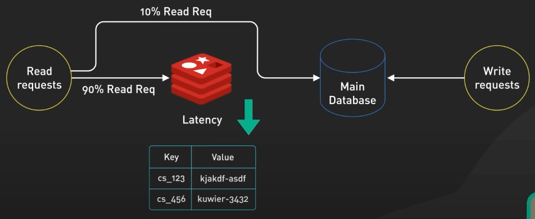{:class="centered-img"}

Các hệ thống tìm kiếm full-text như Elastic Search có thể index dữ liệu để tìm kiếm tài liệu và log một cách nhanh chóng và hiệu quả.

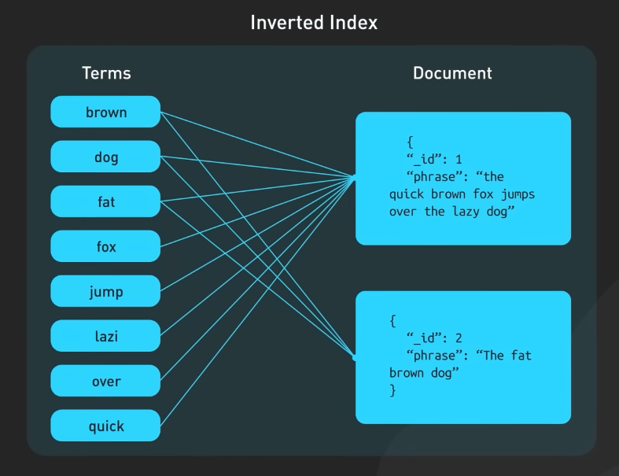{:class="centered-img"}

## Caching trong database

Ngay cả trong database, ta cũng có nhiều lớp caching.

Dữ liệu thường được ghi vào write-ahead log (WAL) trước khi được index trong một B-tree. Buffer pool là một khu vực bộ nhớ được sử dụng để cache kết quả truy vấn, trong khi materialized views có thể tính toán trước kết quả truy vấn để cải thiện hiệu suất. Transaction log ghi lại tất cả các giao dịch và cập nhật trong cơ sở dữ liệu, trong khi replication log theo dõi trạng thái sao chép trong một cụm cơ sở dữ liệu.

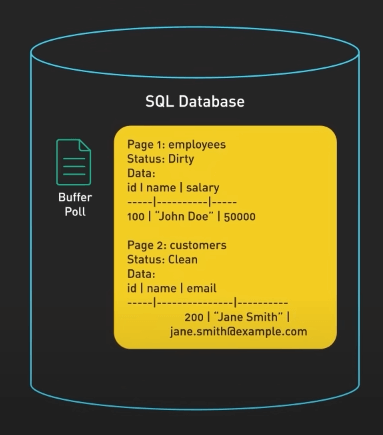{:class="centered-img"}

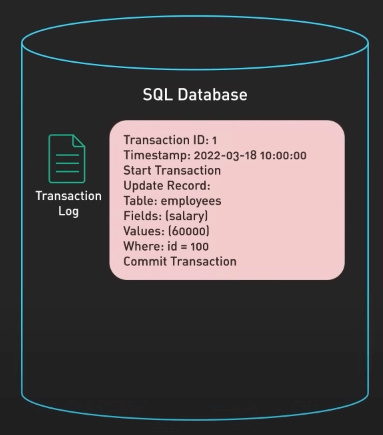{:class="centered-img"}
