# Định lý CAP - CAP theorem

## Nguồn

 [CAP Theorem Simplified | System Design Fundamentals](https://www.youtube.com/watch?v=BHqjEjzAicA)

## Khái niệm

Định lý CAP (CAP Theorem) là một khái niệm trong khoa học máy tính giải thích sự đánh đổi giữa **tính nhất quán (consistency - C)**, **tính khả dụng (availability - A)** và **sức chịu đựng sự phân vùng trong mạng (partition tolerance - P)** trong các hệ thống phân tán.

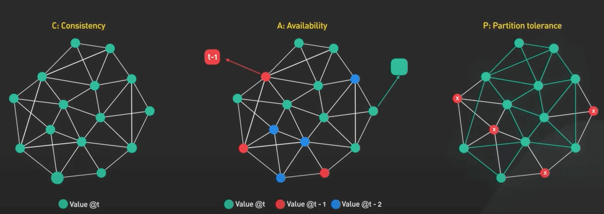{:class="centered-img"}

**Tính nhất quán (consistency - C)** là thuộc tính của một hệ thống trong đó tất cả các node có cùng một kết quả khi đọc dữ liệu. Điều đó có nghĩa là tất cả client đều nhìn thấy cùng một dữ liệu trong cùng thời điểm, bất kể việc client kết nối với node nào.

**Tính khả dụng (availability - A)** là khả năng của hệ thống để luôn luôn đáp ứng các request của người dùng.

**Sức chịu đựng phân vùng trong mạng (partition tolerance - P)** là khả năng hệ thống tiếp tục hoạt động ngay cả khi có một phân vùng mạng. 

## Phân vùng mạng

Nhưng phân vùng mạng (network partition) là gì? Phân vùng mạng xảy ra khi các node trong hệ thống phân tán không thể giao tiếp với nhau do lỗi mạng. 

Khi có phân vùng mạng, hệ thống phải chọn giữa tính nhất quán và tính khả dụng. 

Nếu hệ thống ưu tiên tính nhất quán, nó có thể không khả dụng cho đến khi phân vùng được giải quyết. Nếu hệ thống ưu tiên tính khả dụng, nó có thể cho phép cập nhật dữ liệu. Nhưng sự không thống nhất về mặt dữ liệu có thể xảy ra cho đến khi phân vùng được giải quyết.

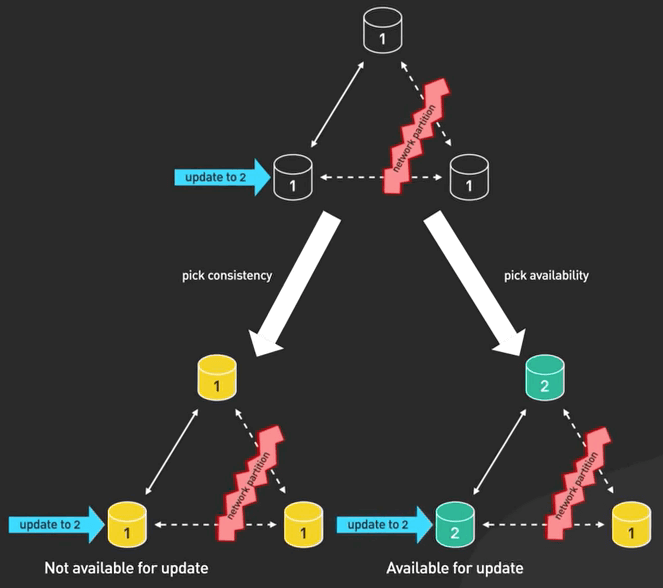{:class="centered-img"}

Cùng xem một ví dụ nhé.

## Ví dụ

Giả sử ta có một ngân hàng nhỏ với hai máy ATM được kết nối qua mạng. Các máy ATM này hỗ trợ 3 thao tác: gửi tiền, rút tiền và kiểm tra số dư. Bất kể điều gì xảy ra, số dư sẽ không bao giờ bị âm. Không có cơ sở dữ liệu trung tâm để lưu số dư tài khoản, nó được lưu trên cả hai máy ATM.

Khi một khách hàng dùng máy ATM, số dư sẽ được cập nhật trên cả hai máy ATM qua mạng. Điều này đảm bảo rằng các máy ATM có cùng kết quả khi kiểm tra số dư tài khoản.

Nếu có một phân vùng mạng và các máy ATM không thể giao tiếp với nhau, thì hệ thống phải chọn giữa tính nhất quán và tính khả dụng.

Nếu ngân hàng ưu tiên tính nhất quán, máy ATM có thể từ chối xử lý tiền gửi hoặc rút tiền cho đến khi phân vùng được giải quyết. Điều này đảm bảo rằng số dư vẫn nhất quán nhưng hệ thống không khả dụng với khách hàng.

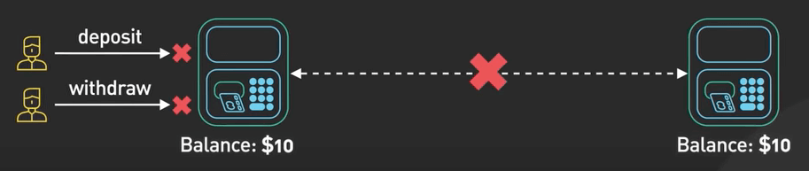{:class="centered-img"}

Nếu ngân hàng ưu tiên tính khả dụng, thì máy ATM có thể cho phép gửi và rút tiền, nhưng số dư có thể không ổn định cho đến khi phân vùng được giải quyết.

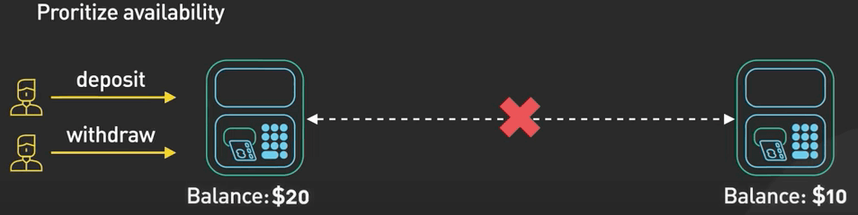{:class="centered-img"}

Khi có phân vùng mạng, khách hàng có thể rút toàn bộ số dư từ cả hai máy ATM. Khi phân vùng mạng được khắc phục, sự không nhất quán được giải quyết và bây giờ số dư là số âm. Đó là điều không được phép xảy ra.

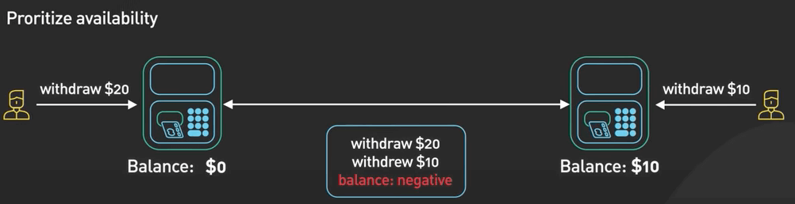{:class="centered-img"}

Hãy cùng xem một ví dụ khác và xem cách một mạng xã hội có thể áp dụng định lý CAP

Trong khi mạng bị phân vùng, nếu hai người dùng cùng bình luận một bài đăng cùng lúc, bình luận của một người dùng có thể không được hiển thị đến người dùng kia cho đến khi phân vùng được giải quyết. 

{:class="centered-img"}

Ngoài ra, nếu mạng xã hội ưu tiên tính nhất quán, thì tính năng comment có thể không khả dụng cho đến khi phân vùng được giải quyết. Đối với mạng xã hội, việc ưu tiên tính khả dụng thường được chấp nhận với cái giá là người dùng đôi khi thấy các data hơi khác nhau.

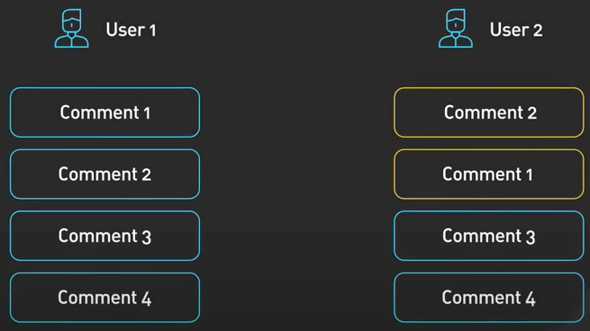{:class="centered-img"}

Định lý CAP nghe có vẻ rất đơn giản, nhưng thế giới thực lại rất hỗn loạn.

Cũng giống như nhiều thứ trong công nghệ phần mềm, tất cả đều liên quan đến sự đánh đổi và các lựa chọn không phải lúc nào cũng rành rành ra đó. Định lý CPA giả định 100% tính khả dụng hoặc 100% tính nhất quán. Trong thế giới thực, có các mức độ nhất quán và khả dụng mà những người thiết kế hệ thống phân tán phải xem xét cẩn thận. Đây là lúc mà mô hình đơn giản của định lý CAP có thể gây hiểu nhầm.

Quay lại ví dụ ngân hàng, trong quá trình phân vùng mạng, máy ATM chỉ có thể cho phép xử lý các yêu cầu về số dư, trong khi các khoản tiền gửi hoặc rút tiền bị chặn. 

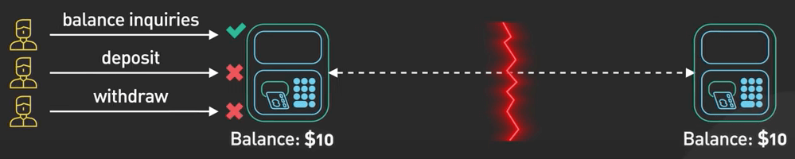{:class="centered-img"}

Ngoài ra, ngân hàng có thể triển khai một phương pháp kết hợp. Ví dụ, ATM có thể cho phép xử lý các yêu cầu về số dư và các khoản tiền nhỏ khi mạng đang bị phần vùng, nhưng chặn các khoản rút tiền hoặc gửi tiền lớn cho đến khi phân vùng được giải quyết.

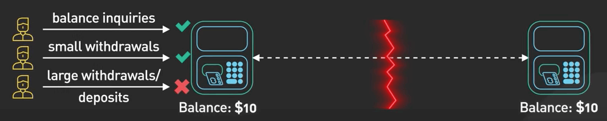{:class="centered-img"}

Cần lưu ý là trong thực tế, việc đối soát sau phân vùng mạng có thể rất là lộn xộn. Với ví dụ ngân hàng ở trên thì việc đối soát là tương đối đơn giản. Trong thực tế, các cấu trúc dữ liệu liên quan có thể phức tạp và khó dung hoà.

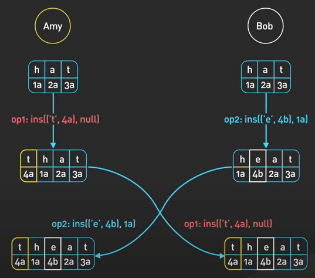{:class="centered-img"}

Một ví dụ điển hình về cấu trúc dữ liệu phức tạp là Google Docs. Giải quyết các bản cập nhật xung đột có thể rất phức tạp.

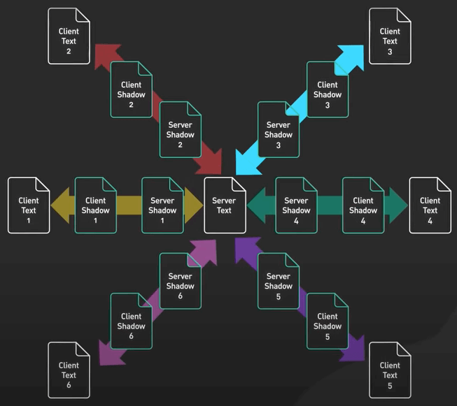{:class="centered-img"}

## Kết luận

Vậy định lý CAP có hữu ích không? Có, đó là một công cụ hữu ích để giúp ta cân nhắc những đánh đổi cần lưu ý khi có một phân vùng mạng. Có điều, nó không cung cấp một bức tranh toàn cảnh về sự đánh đổi cần xem xét khi thiết kế một hệ thống phân tán toàn diện.

Cụ thể, khi hệ thống hoạt động bình thường mà không có bất kỳ sự cố mạng nào (hầu hết thời gian là như vậy), ta lại có những đánh đổi khác để xem xét giữa độ trễ và tính nhất quán. Nó lại thuộc về định lý PACELC. Ta sẽ nói về nó trong một bài viết khác.

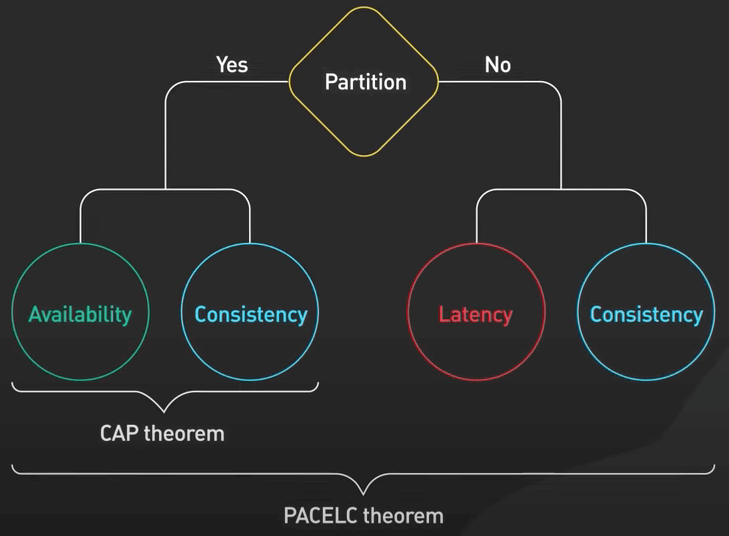{:class="centered-img"}
