# Tìm hiểu về CDN

## Nguồn

 [What Is A CDN? How Does It Work?](https://www.youtube.com/watch?v=RI9np1LWzqw)

## CDN là gì?

**CDN** (Content Delivery Network - Mạng lưới phân phối nội dung) được ra đời vào cuối những năm 90 của thế kỉ 20 (1998). Ban đầu nó được phát triển để tăng tốc việc phân phối content HTML tĩnh cho user trên toàn thế giới.

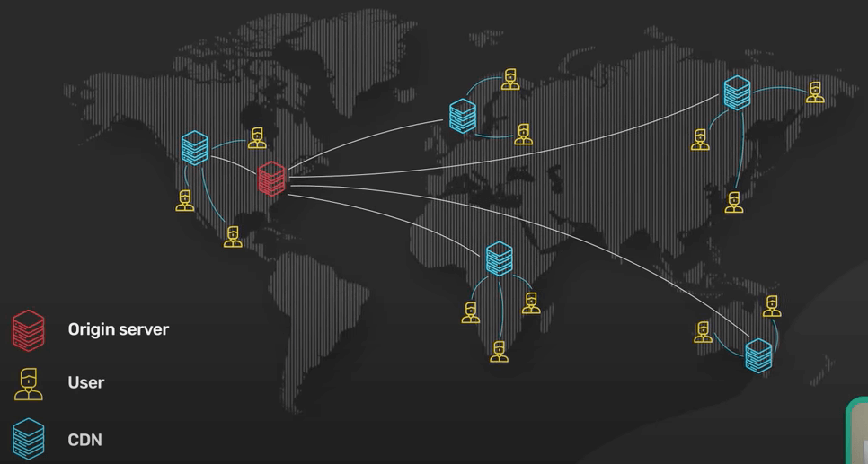{:class="centered-img"}

CDN phát triển mạnh mẽ trong những thập niên tiếp theo. Ngày nay, một CDN cần được sử dụng bất kì khi nào có HTTP traffic.

## CDN ngày nay làm được gì cho chúng ta?

Ở cấp độ cơ bản, một CDN mang content lại gần user hơn. Điều này cải thiện hiệu suất của web service dưới góc nhìn user. Thống kê chỉ ra rằng hiệu suất rất quan trọng cho việc tiếp cận và giữ chân user.

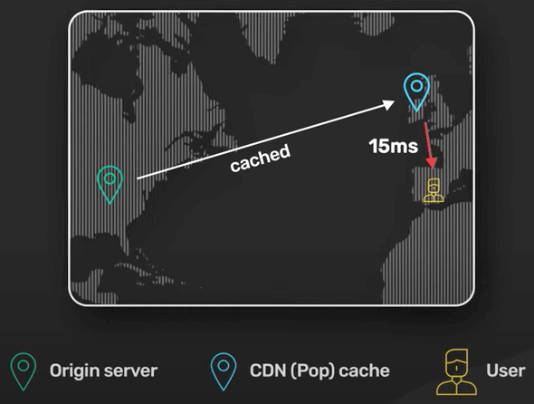{:class="centered-img"}

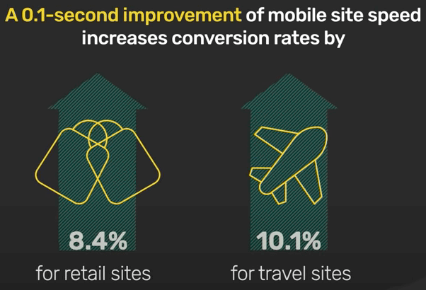{:class="centered-img"}

Để mang service lại gần user hơn, CDN triển khai rất nhiều server tại hàng trăm địa điểm trên thế giới. Các địa điểm này được gọi là **PoP** (Point of Presence - điểm tồn tại). Server nằm trong PoP thường được gọi là **edge server**. PoP hiện diện ở nhiều nơi trên thế giới giúp đảm bảo rằng mọi user có thể kết nối đến edge server gần họ nhất.

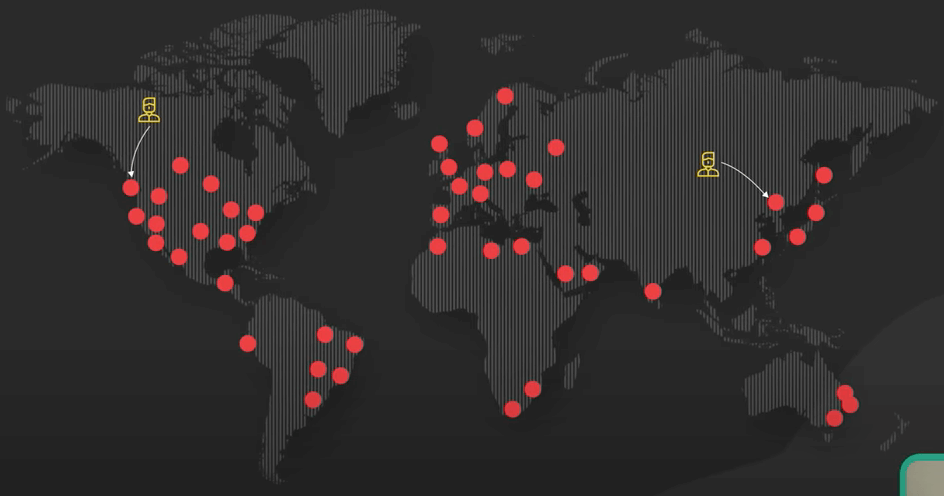{:class="centered-img"}

Các CDN khác nhau triển khai các công nghệ khác nhau để điều hướng request của user đến PoP gần nhất. Hai công nghệ phổ biến nhất là **routing dựa trên DNS** và **Anycast**.

Với routing dựa trên DNS, mỗi PoP có một địa chỉ IP riêng. Khi user tìm địa chỉ IP của CDN, DNS trả về địa chỉ IP của PoP gần với user nhất.

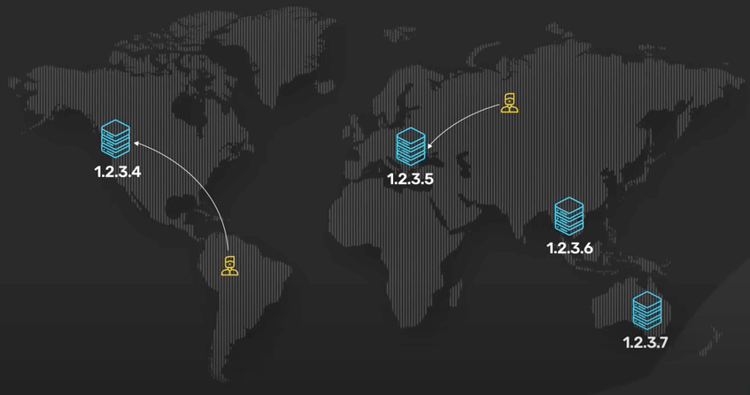{:class="centered-img"}

Với Anycast, các PoP chia sẻ cùng một địa chỉ IP. Khi một request vào mạng Anycast của địa chỉ IP đó, mạng này sẽ gửi request đến PoP gần nhất với user.

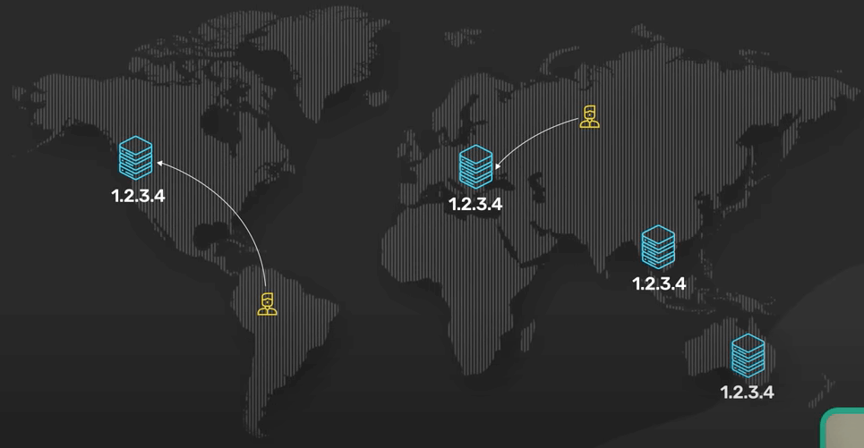{:class="centered-img"}

Mỗi edge server đóng vai trò là reverse proxy với content cache rất lớn. Content tĩnh được cache trong những content cache trên edge server. Nếu một content nằm trong cache, nó có thể được nhanh chóng trả về cho user. Edge server chỉ cần một bản sao của content tĩnh từ server gốc nếu content không nằm trong cache nên việc này giúp giảm yêu cầu tải và băng thông cho server gốc rất nhiều.

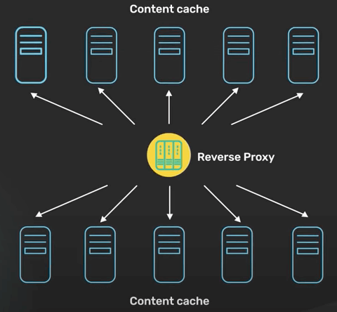{:class="centered-img"}

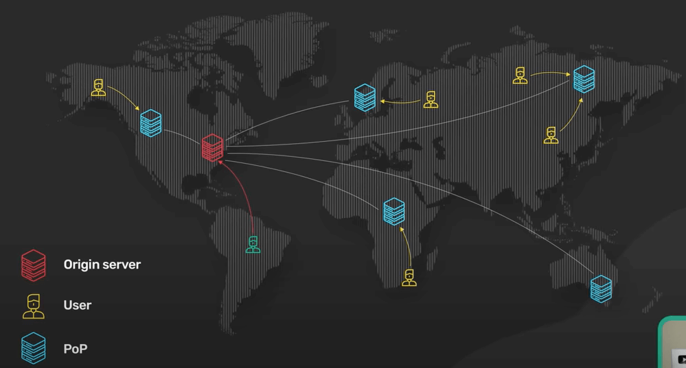{:class="centered-img"}

Một CDN hiện đại còn có thể chuyển đổi content tĩnh thành một dạng tối ưu hơn. Ví dụ, CDN có thể minify Javascript bundle trước khi đến tay user, hoặc chuyển đổi một file hình ảnh từ dạng cũ thành những dạng mới hơn như WebP hay AVIF.

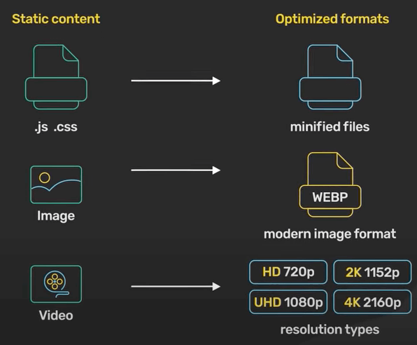{:class="centered-img"}

Edge server còn đóng vai trò cực kỳ quan trọng trong HTTP stack hiện đại. Tất cả TLS connection kết thúc tại edge server. Bắt tay TLS rất tốn kém. Các phiên bản TLS thịnh hành như TLS 1.2 cần vài network round trip để tạo connection. Thế nên kết thúc TLS connection tại edge server giúp giảm độ trễ để tạo TLS connection. Đây là lý do vì sao nhiều ứng dụng ngày nay gửi HTTP content động không cache được qua CDN.

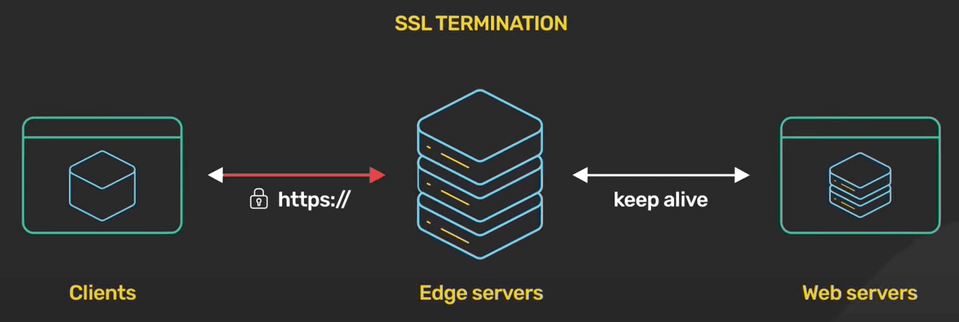{:class="centered-img"}

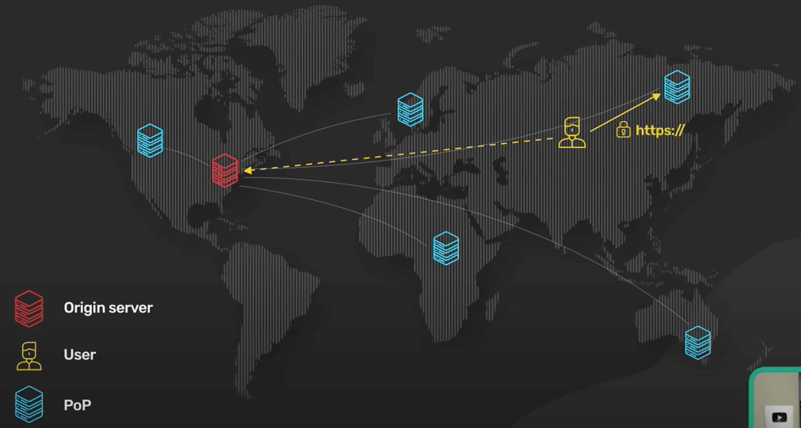{:class="centered-img"}

Bên cạnh hiệu suất, CDN hiện đại còn có hai lợi ích lớn nữa. 

Thứ nhất là bảo mật. Tất cả các mạng CDN đều có dung lượng mạng lớn tại edge server. Đây là mấu chốt để chống tần công từ chối dịch vụ (DDoS) quy mô lớn một cách hiệu quả, bằng việc có một mạng có dung lượng còn lớn hơn của kẻ tấn công. Điều này thật sự hiệu quả với CDN trên nền mạng Anycast. Nó cho phép CDN khuếch tán traffic tấn công trên một lượng lớn server.

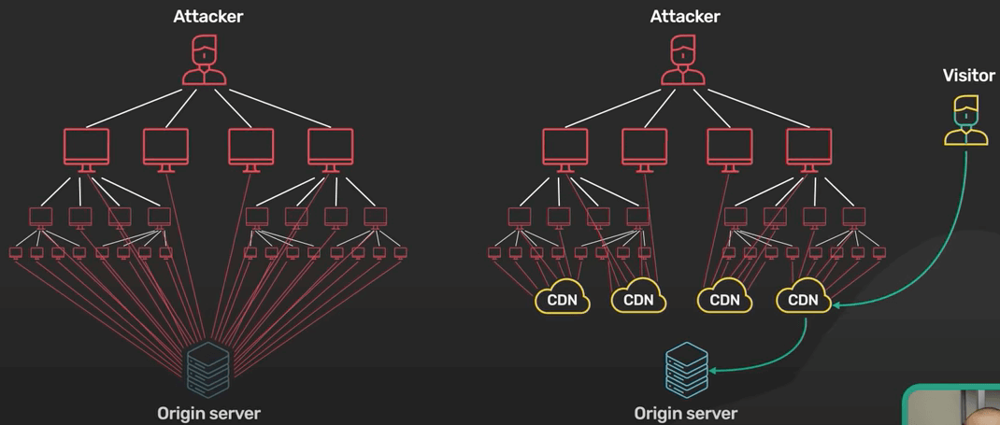{:class="centered-img"}

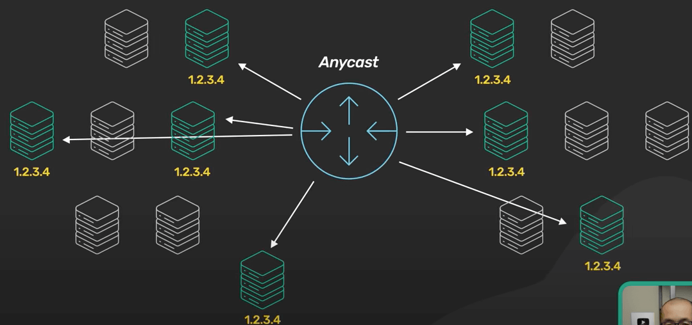{:class="centered-img"}

Thứ hai, CDN hiện đại cải thiện tính thường trực (availability). CDN có tính phân bố rất lớn. Với việc có bản sao content trên nhiều PoP, CDN có thể chịu được nhiều sự cố phần cứng hơn server gốc.

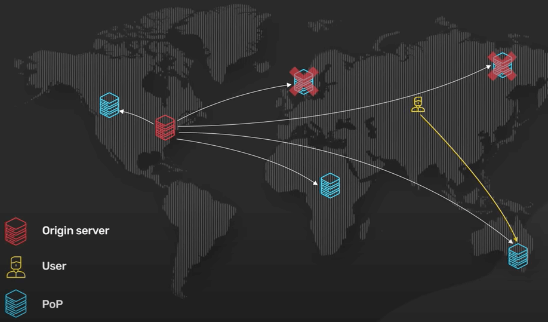{:class="centered-img"}

CDN hiện đại mang lại rất nhiều lợi ích. Hãy dùng CDN khi ta có HTTP traffic.
