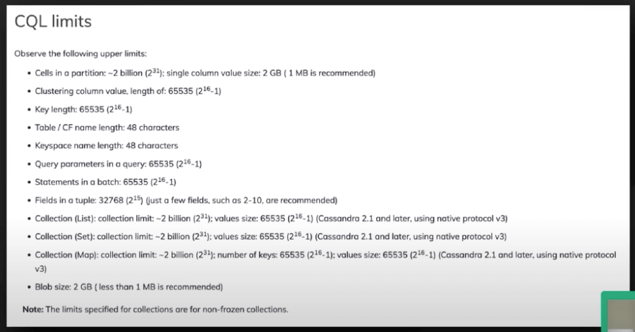
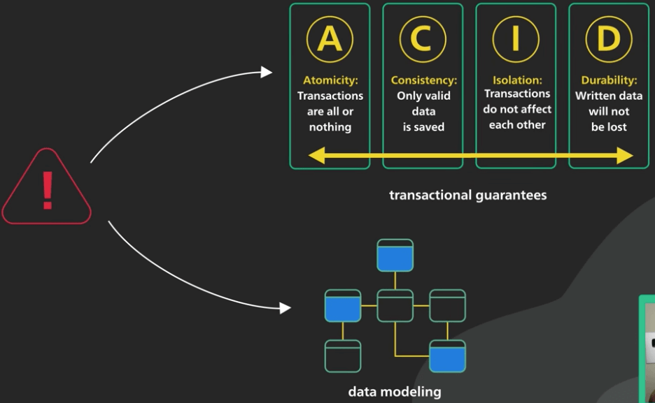

# Làm sao chọn database cho đúng?

## Nguồn

 [How To Choose The Right Database?](https://www.youtube.com/watch?v=kkeFE6iRfMM)

## Mở đầu

Khi xây dựng một hệ thống có khả năng mở rộng cao (highly scalable), việc chọn đúng database thường là quyết định quan trọng nhất mà ta phải đưa ra. Nếu bạn phải chọn database tiếp theo cho business đang phát triển cực nhanh của mình, sau đây là các điểm quan trọng cần lưu ý. 

Ta đang nói về việc chọn database cho một business đang phát triển thực sự, nơi mà một lựa chọn tồi sẽ dẫn đến thời gian sập kéo dài, gây ảnh hưởng xấu đến người dùng, thậm chí mất dữ liệu chứ không phải chơi.

## Có cần thiết không?

Đầu tiên, ta cần trả lời các câu hỏi sau:

- Ta có thực sự cần một database khác hay không? 
- Có lý do gì đủ thuyết phục để thay đổi database không? 
- Database hiện tại có đang đạt đến giới hạn hay không? Có thể độ trễ p95 đang quá cao. Có thể bộ nhớ database bây giờ đang quá tải, và một request đơn giản cũng cần rất nhiều thời gian. 

Bất kể vấn đề có là gì đi nữa, hãy chắc chắn rằng chúng **không dễ giải quyết với database hiện tại**. 

Hãy đọc đi đọc lại hướng dẫn sử dụng của database hiện tại. Sẽ có thể có một hoặc hai điểm gì đó có thể giải quyết sơ bộ vấn đề của chúng ta. Việc này rất hữu ích, **vì chuyển đổi database tốn rất nhiều thời gian**, thường là nhiều hơn bạn nghĩ. Các điểm mấu chốt này có thể là việc điều chỉnh kích thước bộ nhớ, chọn một kiểu nén dữ liệu khác hoặc một kiểu garbage collection khác chẳng hạn. Database rất phức tạp và có tính điều chỉnh cao. Hãy chắc rằng bạn hiểu được database hiện tại, hiểu được giới hạn của nó.

Hỏi các chuyên gia trong cộng đồng. Mô tả vấn đề của bạn. Ai biết sẽ trả lời, thường là theo những cách rất bất ngờ.

Để tìm thêm một số khoảng trống chưa được khai thác, có thể sẽ có một số bản vá cho kiến trúc ứng dụng, giúp ta có lối thoát. Có thể thêm một cache trước nó, và cho ta thêm vài tháng nghiên cứu không? Có thể thêm vài replica để giảm tải việc đọc dữ liệu không? Có thể shard database hoặc partition nó theo cách nào đó không? Điểm quan trọng là: Chuyển đổi database trên môi trường live rất rủi ro và tốn kém. Ta cần chắc rằng không có cách nào để tiếp tục dùng database hiện tại nữa.

## Làm sao chọn database mởi?

Ok, giờ coi như ta đã hết cách với database hiện tại. Chọn cái mới sao đây? 

Những dev như chúng ta thường bị thu hút bởi cái mới, như những con thiêu thân lao vào ngọn lửa. Nhưng khi nhắc đến database, càng chán thì càng tốt. Ta nên chọn những cái nào lâu đời và đã được test kỹ. Bất kể mảng bạn đang làm là gì, sẽ có một cộng đồng và thị trường với những nhà quản trị và dev có kinh nghiệm với loại database mà ta đang cân nhắc.

Phát triển phần mềm là về sự đánh đổi. Khi nhắc đến database, nó càng đúng hơn. Cần nhớ là **không có gì miễn phí** hết. Cẩn thận với những lời tiếp thị thái quá. Sẽ luôn có những chi phí ẩn sau những lời có cánh như "khả năng mở rộng đến vô hạn mà không tốn công sức". Hãy đào sâu nghiên cứu để xem bạn cần đánh đổi gì. Hãy đọc hướng dẫn sử dụng thay vì xem mỗi quảng cáo. Ở đó thường sẽ có một phần gọi là "Giới hạn" (Limits). Phần FAQ cũng rất hữu ích. Các phần này là nơi những giới hạn của database thực sự được phơi bày.

{:class="centered-img"}

Theo kinh nghiệm của chúng tôi, càng tuyên bố hấp dẫn thì các tuyên bố từ chối trách nhiệm (disclaimers) càng dài hơn ở sau. Ví dụ, nhiều database NoSQL hỗ trợ mở rộng nhiều hơn so với các database quan hệ cũ. Chúng thường tuyên bố rằng có thể hỗ trợ mở rộng theo chiều ngang gần như là tuyến tính. Tuy nhiên, đi đôi với đó là những đánh đổi như sau. Một, chúng loại bỏ hoặc hạn chế việc đảm bảo tính transactional. Hai, chúng hạn chế nghiêm trọng tính linh hoạt của mô hình dữ liệu. Không có truy vấn nào giữa các data entity. Data bị denormalize khi cùng một data được lưu tại nhiều collection khác nhau để hỗ trợ nhiều kiểu truy cập data khác nhau. 

{:class="centered-img"}

Để biết thêm về một loại database nào đó, gia nhập nhóm chat. Hỏi nhiều câu hỏi. Với các project mã nguồn mở, đọc GitHub issues. Cố gắng biết càng nhiều càng tốt về các ứng viên database mà ta đang cân nhắc. Thời gian đầu tư vào cho đến giờ giờ vẫn tương đối nhỏ đấy.

## Test database mởi sao đây?

Rồi, giờ ta đã có một số ít ứng viên còn sót lại, tiếp theo làm gì? 

Tạo bench test với data của chính chúng ta cho mỗi ứng viên, với kiểu truy cập như thực tế luôn. Ta có data đó mà phải không? Dù sao thì database hiện tại cũng đang quá tải rồi, nên có một tập data tượng trưng cũng là có thể. Đúng, điều này sẽ tốn kém, và có thể mất hàng tuần, nhưng không thể bỏ qua bước này. Việc chuyển đổi database trên live rất rủi ro, và sẽ tốn nhiều công sức hơn là việc benchmark. Nếu ta đang đánh cược sự nghiệp vào cái này, hãy chắc chắn là nó hoạt động. 

Trong khi benchmark, hãy chú ý đến các ngoại lệ. Đo p99 của mọi thứ. p50 không có ý nghĩa gì đâu. Cố gắng mô phỏng lại môi trường live, và đẩy giới hạn đi xa hơn xem nó chịu được đến đâu. 

{:class="centered-img"}

Thử một số tác vụ vận hành rủi ro hơn, như phá hỏng một node, hoặc test xem có hỏng data khi bị phân vùng dữ liệu không. Thử tăng, giảm sharding, nếu có thể. Sau khi kiểm tra hết, lên kế hoạch chuyển đổi database cẩn thận. Viết ra một kế hoạch chuyển đổi từng bước và nhờ đồng nghiệp review lại cho cẩn thận. Nếu có thể, chuyển một service nhỏ trước, và lấy thật nhiều thông tin từ nó.

Chọn ra một database đúng không hề hấp dẫn tí nào, và tốn rất nhiều công sức. Chuyển đổi sang một database mới trong thực tế có thể mất nhiều năm ở quy mô lớn. Chúc may mắn.
