# Các mô hình kiến trúc Client phổ biến

## Nguồn

 [Everything You NEED to Know About Client Architecture Patterns](https://www.youtube.com/watch?v=I5c7fBgvkNY)

## Lịch sử

Bắt đầu với mô hình MVC (Model-View-Controller) đã tồn tại gần nửa thế kỷ. Đây là một cách tiếp cận mang tính đột phá, tách biệt giữa UI, dữ liệu, và logic điều khiển, cho phép dev tập trung vào từng phần riêng lẻ. Tuy nhiên, khi công nghệ phát triển, độ phức tạp của ứng dụng cũng tăng lên, điều đó dẫn đến nhu cầu về các mô hình mới.

## Các mô hình

Vậy điểm chung giữa các mô hình này là gì? Tất cả đều có `V` cho View, phần mà người dùng tương tác. Đây là "gương mặt" của ứng dụng, chịu trách nhiệm trình bày nội dung và thu thập các thao tác của người dùng. Tiếp theo là `M` cho Model, phần chịu trách nhiệm quản lý logic nghiệp vụ và dữ liệu. Nó quan tâm đến cách dữ liệu được lưu trữ và thao tác.

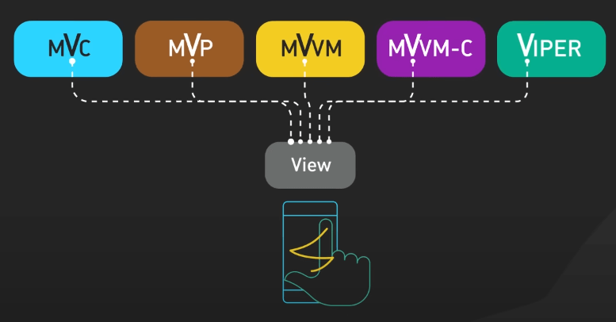{:class="centered-img"}

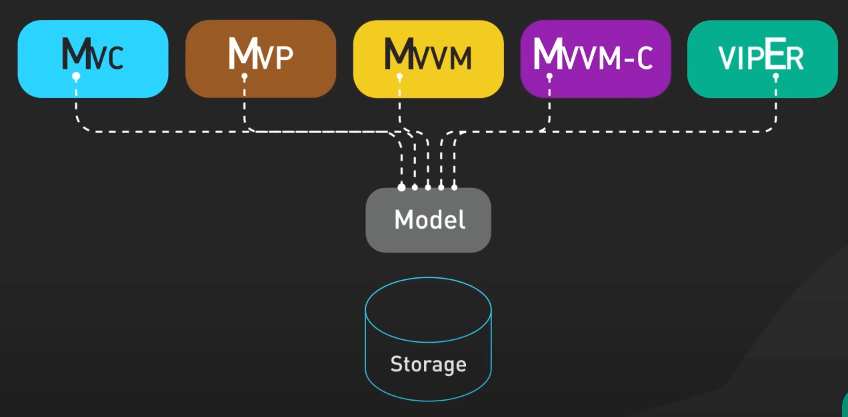{:class="centered-img"}

Sự khác biệt thực sự xảy ra ở các thành phần trung gian: Controller, Presenter, và ViewModel, là những thành phần giúp View và Model giao tiếp mà không liên kết trực tiếp với nhau. 

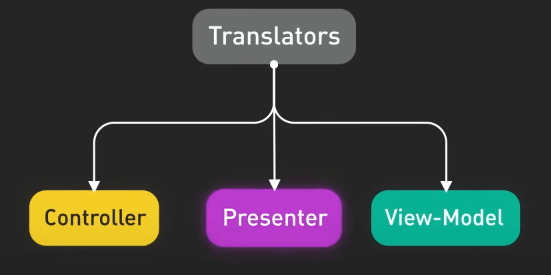{:class="centered-img"}

{:class="centered-img"}

Hãy cùng xem xét ví dụ đơn giản – một người dùng cập nhật ảnh đại diện của mình.

### MVC

Với MVC, khi người dùng chọn ảnh mới, View gửi hành động này đến Controller, sau đó Controller sẽ cập nhật Model. 

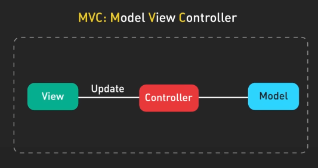{:class="centered-img"}

Khi Model được cập nhật, Controller sẽ yêu cầu View refresh lại giao diện. Đây là một luồng đơn giản nhưng có thể dẫn đến việc Controller bị quá tải khi ứng dụng phát triển to ra.

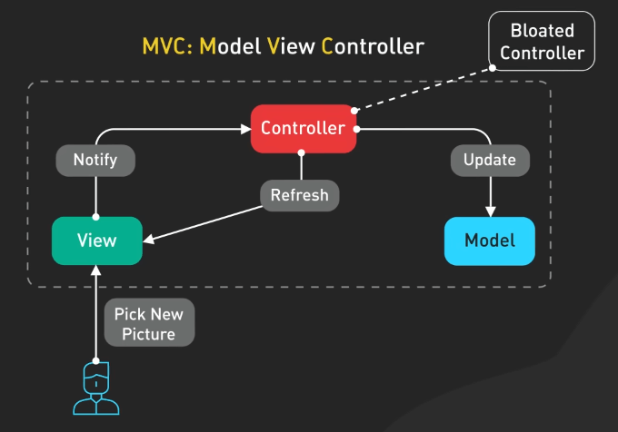{:class="centered-img"}

### MVP

MVP giới thiệu một Presenter rõ ràng hơn, chịu trách nhiệm xử lý logic UI - biến đổi dữ liệu từ Model để hiển thị, xử lý đầu vào của người dùng, và điều phối việc cập nhật giữa Model và View. Điều này giúp View chỉ cần tập trung vào việc hiển thị, trong khi Presenter xử lý mọi hành vi UI. 

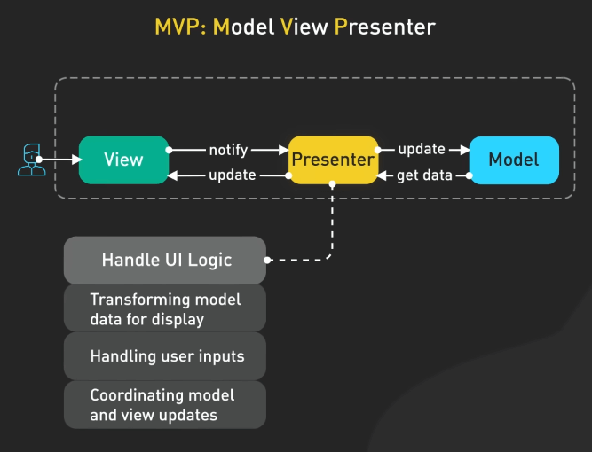{:class="centered-img"}

Khi người dùng chọn ảnh mới, View sẽ thông báo cho Presenter, và Presenter sẽ cập nhật Model, đồng thời định dạng dữ liệu mới và yêu cầu View hiển thị ảnh mới. Với việc cô lập logic UI, MVP giúp View tập trung vào việc vẽ hình ảnh để có code sạch hơn, dễ test hơn.

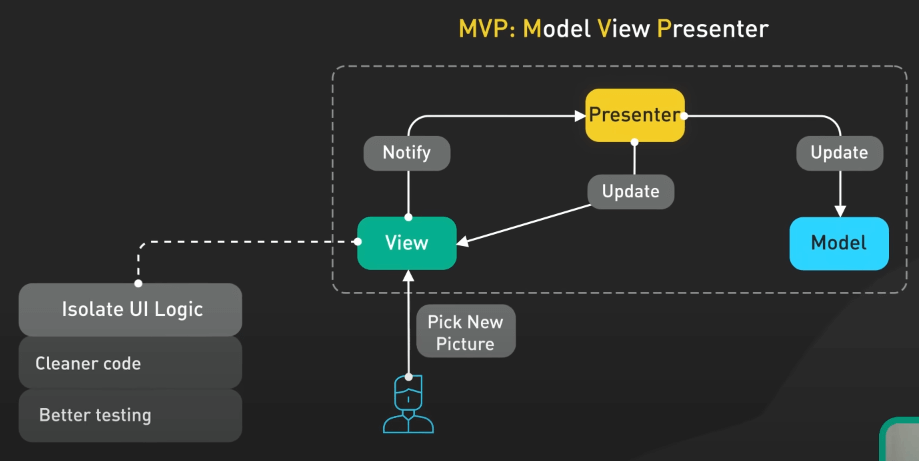{:class="centered-img"}

### MVVM và MVVM-C

MVVM sử dụng data binding giữa View và ViewModel, cho phép tự động cập nhật dữ liệu theo cả hai hướng, giảm thiểu việc phải viết các logic cập nhật rõ ràng. Khi người dùng chọn ảnh mới, View sẽ cập nhật ViewModel thông qua ràng buộc dữ liệu hai chiều, và ViewModel sẽ lưu thay đổi này vào Model. Mọi thay đổi từ Model sẽ tự động được phản ánh trong View mà không cần phải chủ động refresh. Bằng cách xử lý đồng bộ hai chiều giữa View và Model, data binding giúp cập nhật mà không cần code rườm rà.

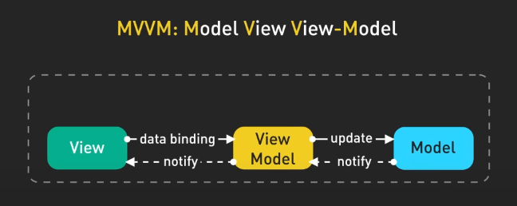{:class="centered-img"}

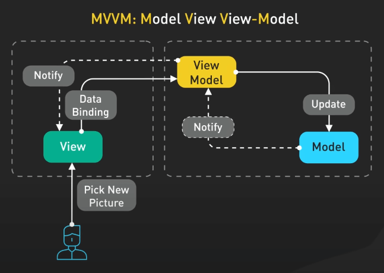{:class="centered-img"}

MVVM-C thêm một lớp Coordinator để quản lý logic điều hướng. Coordinators giữ trách nhiệm chuyển đổi giữa các màn hình và use case. 

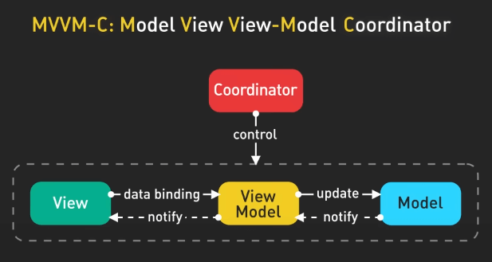{:class="centered-img"}

Trong ví dụ của chúng ta, Coordinator sẽ chịu trách nhiệm chuyển từ màn hình hồ sơ sang chọn ảnh, rồi quay lại, trong khi ViewModel chỉ tập trung vào việc xử lý dữ liệu.

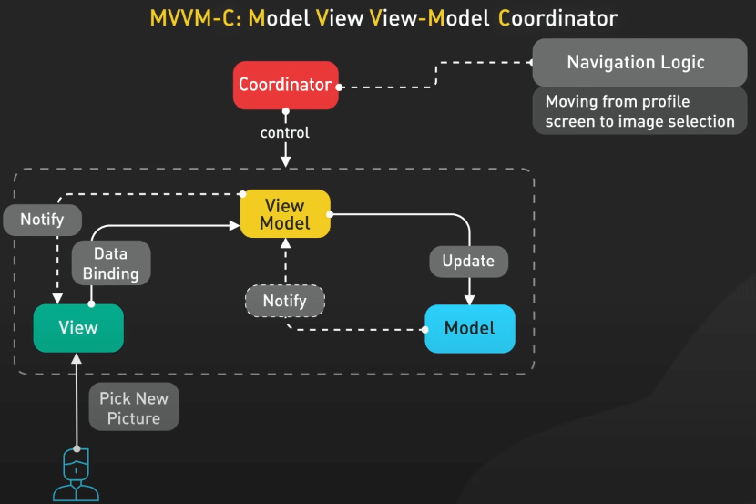{:class="centered-img"}

### VIPER

VIPER là mô hình phân chia chi tiết nhất, bao gồm View, Interactor cho logic nghiệp vụ, Presenter để chuẩn bị dữ liệu cho View, Entity cho dữ liệu thô, và Router cho điều hướng.

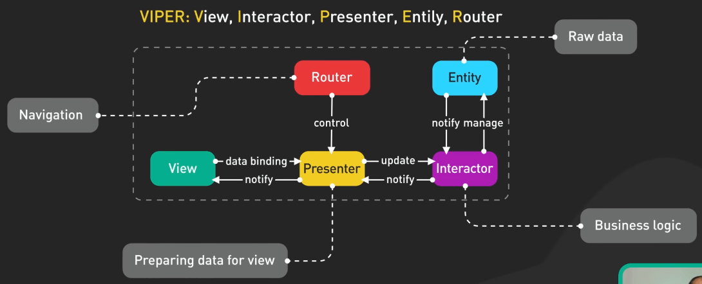{:class="centered-img"}

Trong ví dụ, View chỉ hiển thị hành động của người dùng, Interactor xử lý logic nghiệp vụ của việc cập nhật ảnh, Presenter cập nhật cả View và Entity tương ứng với Model, và Router quản lý điều hướng. Mô hình này đặc biệt mạnh mẽ cho các ứng dụng lớn, phức tạp.

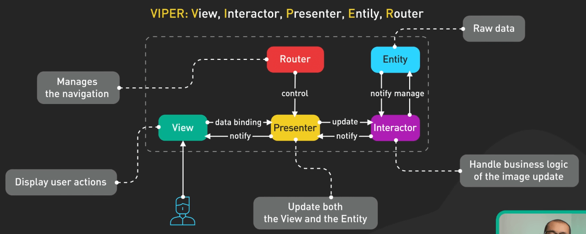{:class="centered-img"}

## Biết chọn gì đây?

Vậy nên chọn mô hình nào? Tùy thuộc vào kích thước và độ phức tạp của ứng dụng của bạn. 

- MVC có thể phù hợp cho các dự án nhỏ với yêu cầu đơn giản. 
- MVP tăng cường khả năng kiểm thử và tách biệt logic UI. 
- MVVM hoặc MVVM-C tỏa sáng trong lập trình reactive và khi sử dụng ràng buộc dữ liệu. 
- VIPER là lựa chọn hàng đầu cho các ứng dụng lớn, nơi việc tách biệt rõ ràng và khả năng mở rộng là điều quan trọng.

Cuối cùng, sự lựa chọn cũng phụ thuộc vào kinh nghiệm của team và thách thức cụ thể mà project của bạn gặp phải.
