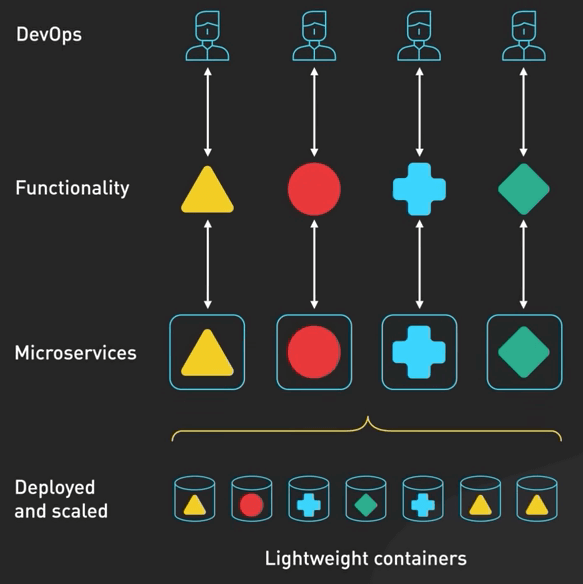

# Cloud Native thực sự là gì?

## Nguồn

 [But What Is Cloud Native Really All About?](https://www.youtube.com/watch?v=p-88GN1WVs8)

## Giới thiệu

Thuật ngữ "Cloud Native" có vẻ như xuất hiện lần đầu vào tầm 10 năm trước khi Netflix nói về kiến trúc ứng dụng web-scale của họ tại một buổi talk AWS re:Invent năm 2013. Lúc đó, ý nghĩa của thuật ngữ này có lẽ khác so với hiện tại. Tuy nhiên, có một điều vẫn giữ nguyên: không có định nghĩa rõ ràng cho nó lúc đó, và hiện tại cũng vẫn chưa có định nghĩa rõ ràng. Nó có ý nghĩa khác nhau với mỗi người. Trong bài này, ta sẽ đi vào giải nghĩa thuật ngữ "Cloud Native" và thảo luận về lý do và khi nào nó quan trọng.

## Hứa hẹn

Đầu tiên, Cloud Native hứa hẹn điều gì? Cloud Native là một bản thiết kế để xây dựng ứng dụng web-scale trên cloud có tính sẵn sàng (availability) và mở rộng (scalability) cao hơn. Nó hứa hẹn tăng cường tính linh hoạt để triển khai các tính năng mới một cách nhanh chóng mà không ảnh hưởng đến tính sẵn sàng, giúp phản ứng nhanh hơn với các yêu cầu thay đổi của khách hàng.

## Cloud Computing

Trước khi đi vào việc làm sao Cloud Native đáp ứng những lời hứa này, ta hãy xem xét người anh em của nó, Cloud Computing. Theo kiểu cơ bản nhất, Cloud Computing là việc chạy ứng dụng trên các tài nguyên máy tính do các nhà cung cấp cloud quản lý, mà không cần phải mua và quản lý phần cứng. Di dời một ứng dụng nguyên khối lên cloud là một bước khởi đầu tốt. Nó giúp đội ngũ không cần phải quản lý cơ sở hạ tầng phần cứng. Ta có thể nhanh chóng cung cấp tài nguyên máy tính và dễ dàng mở rộng quy mô. Tuy nhiên, việc chỉ chạy ứng dụng trên cloud không làm cho nó trở thành Cloud Native. Để một ứng dụng được coi là Cloud Native, ta cần ít nhất 4 trụ cột.

## 4 trụ cột của Cloud Native

### Kiến trúc ứng dụng

Trụ cột đầu tiên là kiến trúc ứng dụng. Ứng dụng Cloud Native được tạo thành từ nhiều service nhỏ, phụ thuộc lẫn nhau gọi là microservice. 

{:class="centered-img"}

Theo truyền thống, dev sẽ xây dựng ứng dụng nguyên khối với một binary duy nhất chứa tất cả các chức năng cần thiết. Việc phát triển, kiểm thử và triển khai ứng dụng nguyên khối nhanh chóng khá là khó khăn. Việc mở rộng ứng dụng nguyên khối cũng khó khăn. Bằng cách sử dụng Cloud Native, nhà phát triển chia các chức năng của ứng dụng lớn thành các microservice nhỏ hơn. Các service này nhỏ, cho phép các team tự quản lý service của mình và triển khai, mở rộng chúng một cách độc lập theo lịch trình của họ. Các microservice này được kết nối lỏng lẻo. Chúng giao tiếp với nhau qua API được định nghĩa rõ ràng. Ví dụ, một ứng dụng thương mại điện tử có thể bao gồm một service giỏ hàng giao tiếp với service thanh toán và service quản lý hàng tồn kho.

{:class="centered-img"}

### Container và container orchestration

Trụ cột thứ hai là container và container orchestration. Ứng dụng Cloud Native được đóng gói trong các container. Container là các thành phần nhẹ chứa tất cả mọi thứ cần thiết để chạy một microservice trong bất kỳ môi trường nào. 

{:class="centered-img"}

Container orchestration là một thành phần quan trọng cho các ứng dụng Cloud Native lớn. Khi số lượng microservice tăng, container orchestration quản lý số lượng lớn các container để tất cả các microservice có thể chạy một cách mượt mà như một ứng dụng đơn nhất. Một nền tảng container orchestration phổ biến là Kubernetes. Nó giám sát và điều khiển nơi container chạy, phát hiện và sửa chữa lỗi, và cân bằng tải giữa các microservice.

{:class="centered-img"}

### Quá trình phát triển

Trụ cột thứ ba là quá trình phát triển. Các ứng dụng cloud native được xây dựng với kiến trúc microservice. Các service khác nhau được phát triển, triển khai và mở rộng quy mô một cách độc lập với nhau. Điều này đòi hỏi sự hợp tác cao giữa các team phát triển và vận hành, cũng như đầu tư lớn vào tự động hóa quá trình phát triển và triển khai. Đây là nơi mà DevOps ra tay. DevOps là một phương pháp phát triển nhấn mạnh sự hợp tác, giao tiếp và tự động hóa giữa các team phát triển và vận hành để triển khai ứng dụng cloud native một cách nhanh chóng và đáng tin cậy.

{:class="centered-img"}

Một phần quan trọng của DevOps là CI/CD. Nó cho phép team tự động hóa quá trình phát triển và triển khai phần mềm, giúp nó nhanh chóng và đáng tin cậy hơn. 

Phần Continuous Integration của CI/CD đề cập đến việc thường xuyên hợp nhất các thay đổi code vào một kho lưu trữ chung và chạy các bài kiểm thử tự động để đảm bảo rằng code hoạt động như ý.

{:class="centered-img"}

Phần Continuous Delivery của CI/CD đề cập đến việc tự động hóa việc triển khai phần mềm lên môi trường sản xuất, thường thông qua việc sử dụng các pipeline triển khai tự động.

{:class="centered-img"}

### Tiêu chuẩn mở

Trụ cột cuối cùng là việc áp dụng các tiêu chuẩn mở của Cloud Native. Khi hệ sinh thái Cloud Native trưởng thành, các thành phần quan trọng trở nên chuẩn hóa và các best practice trở nên phổ biến. Việc trở nên cloud native có nghĩa là việc sử dụng các thành phần chuẩn hóa này như các building block và tuân theo các best practice khi sử dụng chúng.

Ta cùng đi qua một số tiêu chuẩn và dự án nổi tiếng đằng sau những tiêu chuẩn đó. Ta đã đề cập đến Kubernetes. Đó là một dự án quản lý rất nổi tiếng. Distributed tracing là một thành phần quan trọng của observability. Nó theo dõi các request khi chúng đi qua một đống các microservice. Một số dự án nổi tiếng là Jaeger, Zipkin và OpenTelemetry.

{:class="centered-img"}

Service mesh là một lớp cơ sở hạ tầng quan trọng để quản lý giao tiếp giữa các microservice. Istio và Linkerd là một số ví dụ. 

{:class="centered-img"}

Bằng cách sử dụng các tiêu chuẩn mở, dev được giải phóng khỏi việc lo lắng về các chức năng chung như logging, tracing và service discovery. Điều này cho phép dev tập trung vào những điều quan trọng, đó là ứng dụng microservice của họ.

## Cloud Native nên được áp dụng khi nào?

Vậy thì, khi nào ta nên áp dụng Cloud Native? Câu trả lời là còn tuỳ. Nếu ứng dụng nhỏ và đơn giản, Cloud Native có thể không cần thiết và một kiến trúc nguyên khối truyền thống hoặc một mô hình triển khai đơn giản là được.

Tuy nhiên, đối với các ứng dụng lớn và phức tạp hơn, Cloud Native có thể cung cấp hàng loạt các lợi ích, như tăng cường khả năng mở rộng, tính sẵn sàng và phát triển nhanh hơn.

Cuối cùng, quyết định áp dụng Cloud Native nên dựa trên đánh giá cẩn thận về yêu cầu của ứng dụng và tài nguyên của tổ chức. Khi thực hiện đúng cách, Cloud Native có thể giúp tổ chức xây dựng và triển khai các ứng dụng đáng tin cậy, có tính mở rộng và chống chịu cao hơn trong thời gian ngắn hơn.
