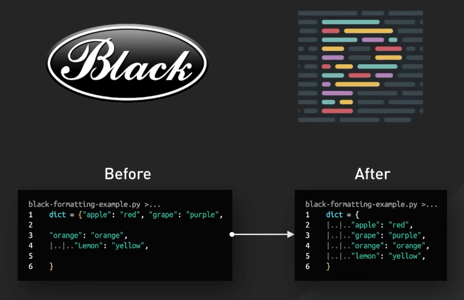
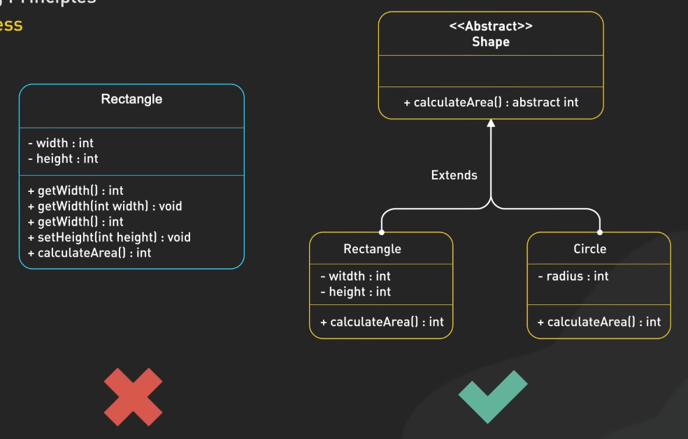
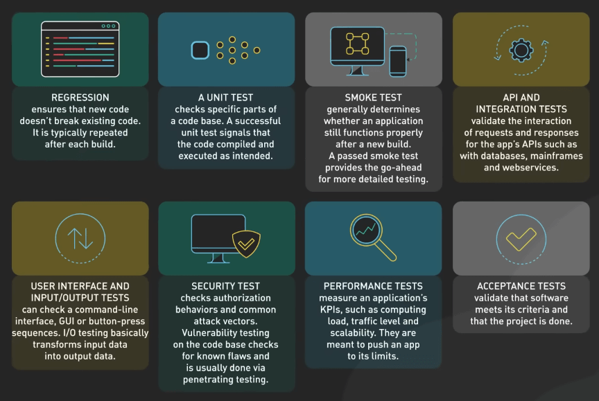
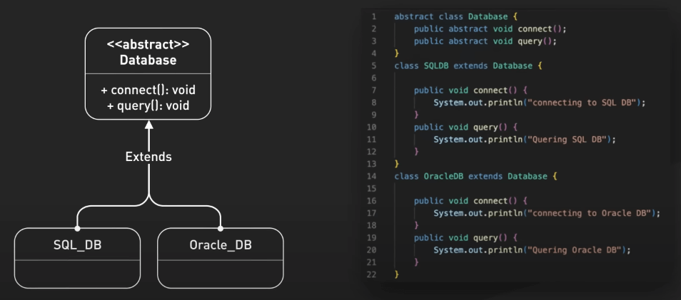
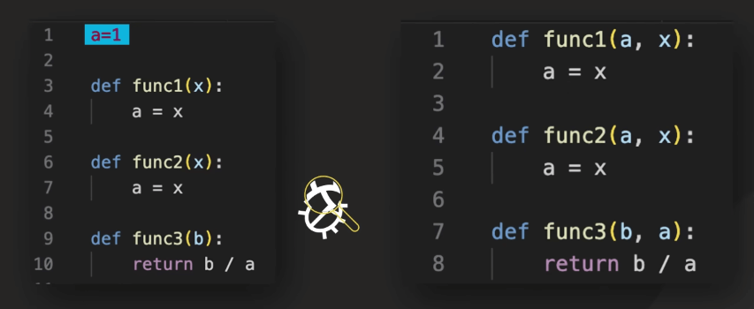
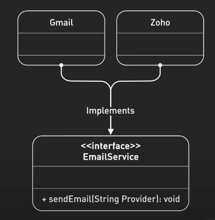
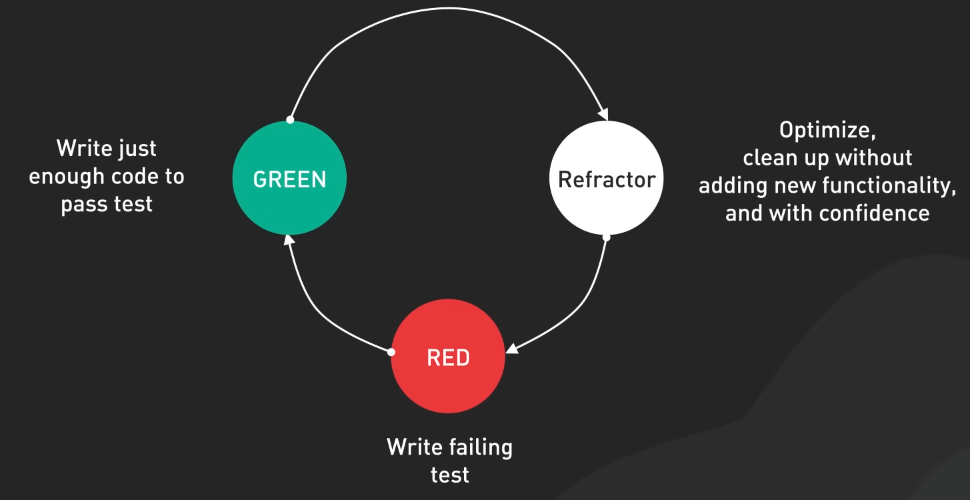
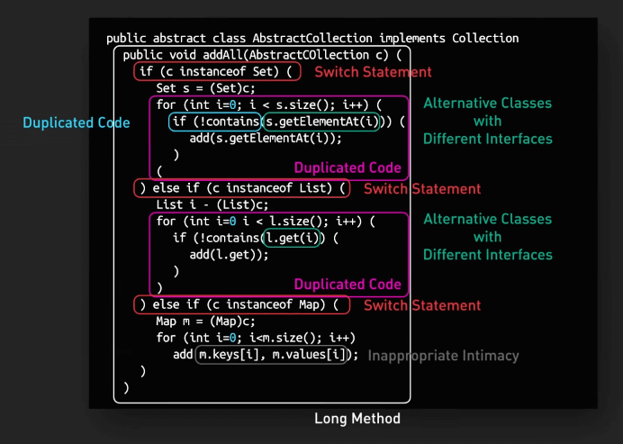
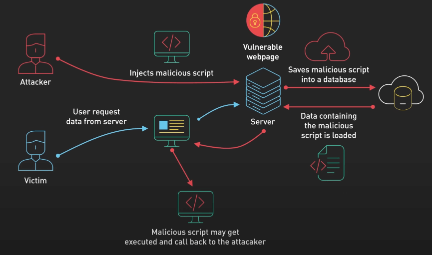

# 10 nguyên tắc coding bạn nên biết

## Nguồn

 [10 Coding Principles Explained in 5 Minutes](https://www.youtube.com/watch?v=GmXPwRNIrAU)

## Coding Style

Đầu tiên hãy nói về coding style, đây là ngôn ngữ chung mà team của chúng ta sử dụng. Mỗi ngôn ngữ đều có hướng dẫn về coding style của riêng nó - Python có PEP 8, Java có Google Java Style Guide - và tuân thủ chúng giúp code của chúng ta đồng nhất và dễ đọc, bất kể ai đang làm việc với nó. Chúng ta có thể sử dụng các công cụ tự động định dạng code như Black hoặc Prettier có thể tự động áp dụng các style guide này, giúp ta tiết kiệm thời gian và sức lực,  giúp tập trung vào logic và chức năng của code.

{:class="centered-img"}

## Comment

Ta từng thấy các đoạn code trông như đánh đố, khiến ta mất hàng giờ để hiểu nó viết về cái gì. Nhớ rằng, "code nói về cách thức, comment nói về lý do". Mục tiêu chính của chúng ta là viết code sạch, dễ hiểu. Tuy nhiên, luôn có những lúc ta cần thêm thông tin bổ sung. Đó là lúc các comment sẽ giúp giải thích lý do đằng sau các quyết định thiết kế, làm cho thuật toán phức tạp trở nên dễ hiểu hơn, và cung cấp ngữ cảnh quý giá cho những lập trình viên khác sau này. Một số dự án mã nguồn mở, như Postgres, SQLite, và Django, có những ví dụ tuyệt vời về việc comment một cách hợp lý.

## Độ tin cậy (Robustness)

Code cần xử lý được các tình huống bất ngờ mà không bị lỗi. Nghĩa là ta cần thêm các xử lý lỗi phù hợp để tránh crash hoặc các hành vi không kiểm soát được của code. Quản lý tài nguyên cũng rất quan trọng. Ta cần đảm bảo rằng tài nguyên như bộ nhớ, file handle, và kết nối mạng được sử dụng và giải phóng đúng cách. Các kỹ thuật như RAII trong C++ và 'defer' trong Go có thể rất hữu ích ở đây. Một khía cạnh quan trọng khác là lập trình phòng thủ, nghĩa là suy nghĩ trước về các lỗi có thể xảy ra và thực hiện các biện pháp để xử lý chúng. Kiểm tra input, sử dụng guard clauses để fail nhanh, xử lý lỗi đầy đủ, và sử dụng assertions là những công cụ hữu ích.

## SOLID Principles

SOLID bao gồm 5 nguyên tắc: Trách nhiệm Đơn lẻ (Single Responsibility), Mở/Đóng (Open/Closed), Thay thế Liskov (Liskov Substitution), Phân chia Interface (Interface Segregation) và Đảo ngược Phụ thuộc (Dependency Inversion). Chúng giúp code dễ hiểu, dễ thay đổi và mở rộng. Các nguyên tắc này giúp tạo ra các đoạn code có thể hoạt động cùng nhau mà không quá phụ thuộc lẫn nhau, làm code dễ kiểm tra và tổ chức hơn. Việc này đặc biệt hữu ích khi làm việc theo nhóm, nhưng chúng ta cũng cần chú ý tránh làm mọi thứ phức tạp quá mức.

{:class="centered-img"}

## Viết code dễ test

Code tốt không chỉ là về việc code làm tốt những gì nó được tạo ra, code tốt còn đồng nghĩa với việc dễ test nữa. Khi thiết kế các thành phần với ý tưởng test, ta nên code đơn giản và rõ ràng. Đừng quên nguyên tắc Trách nhiệm Đơn lẻ (Single Responsibility); những phần code nhỏ và tập trung thường dễ test hơn. Kiểm thử tự động giúp chúng ta tự tin khi thay đổi hoặc thêm tính năng, vì biết rằng nếu có gì sai, các test case sẽ phát hiện ra.

{:class="centered-img"}

## Trừu tượng hóa

Trừu tượng hóa là nghệ thuật ẩn đi sự phức tạp. Quá ít trừu tượng hóa có thể dẫn đến việc code trông rối rắm, trong khi quá nhiều có thể tạo ra các lớp không cần thiết, khiến code khó hiểu. Ví dụ, thay vì viết code riêng cho mỗi hệ thống cơ sở dữ liệu, chúng ta có thể tạo một class trừu tượng `Database` với các action chung như `connect` và `query`, sau đó tạo các subclass cụ thể cho từng cơ sở dữ liệu, giữ cho logic ứng dụng chính sạch sẽ.

{:class="centered-img"}

## Design Patterns

Design patterns giống như công cụ trong hộp công cụ - hữu ích khi sử dụng đúng cách. Chúng cung cấp giải pháp thông minh cho các vấn đề phổ biến, nhưng quan trọng là chọn pattern đúng cho vấn đề hiện tại. Ví dụ, Pattern Model-View-Controller (MVC) rất hữu ích để tách biệt dữ liệu, hiển thị và tương tác người dùng. Nhưng hãy nhớ, không phải tất cả vấn đề đều cần một giải pháp phức tạp. Đôi khi giải pháp đơn giản nhất mới là giải pháp tốt nhất.

## Giảm thiểu biến hoặc giá trị toàn cục

Các biến toàn cục có thể làm cho code rối và khiến khó tìm ra lỗi hơn. Thay vào đó, hãy sử dụng state cục bộ và truyền tham số. Điều này giúp code của chúng ta gọn gàng và dễ hiểu hơn. 

{:class="centered-img"}

Ví dụ, thay vì tạo một dịch vụ email trong module thông báo, chúng ta có thể định nghĩa một interface dịch vụ email và inject implementation cụ thể. Điều này cho phép chúng ta dễ dàng thay thế các nhà cung cấp email khác nhau hoặc sử dụng các dịch vụ giả lập cho testing, mà không cần thay đổi logic thông báo chính.

{:class="centered-img"}

## Tái cấu trúc (Refactoring)

Phát triển phần mềm là một quá trình lặp đi lặp lại, và code của chúng ta nên phản ánh điều đó. 

{:class="centered-img"}

Tái cấu trúc giống như bảo trì cho code. Bằng cách giải quyết các vấn đề như trùng lặp, phức tạp và đặt tên không rõ ràng, chúng ta ngăn ngừa nợ kỹ thuật và giúp code dễ hiểu và sửa đổi hơn, tiết kiệm thời gian và công sức trong quá trình phát triển lâu dài.

{:class="centered-img"}

## Bảo mật

Cẩn thận với các nguy cơ phổ biến như SQL injection và cross-site scripting, nơi kẻ tấn công có thể chèn mã độc vào ứng dụng của chúng ta. Để ngăn chặn, cần xác thực và lọc dữ liệu đầu vào của người dùng. Sử dụng các phương pháp an toàn như truy vấn tham số và mã hóa đầu ra. Ngoài ra, bảo vệ dữ liệu nhạy cảm và chỉ thu thập dữ liệu cá nhân khi thực sự cần thiết.

{:class="centered-img"}
