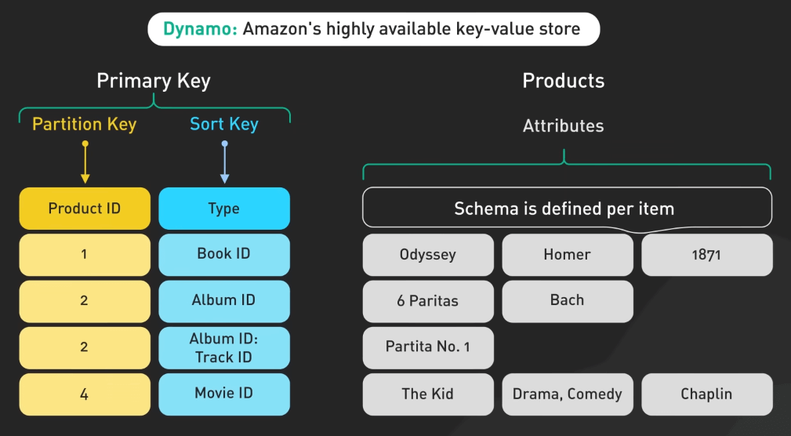
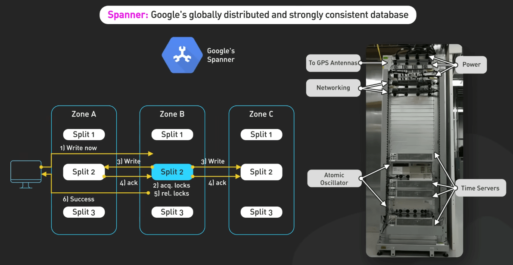

# Các bài báo khoa học máy tính nên đọc

## Nguồn

 [25 Computer Papers You Should Read](https://www.youtube.com/watch?v=_kynGl5hr9U)

## Hệ thống và cơ sở dữ liệu phân tán

### Google File System

**[Google File System](https://static.googleusercontent.com/media/research.google.com/en//archive/gfs-sosp2003.pdf)** giới thiệu hệ thống file phân tán có khả năng mở rộng cao được xây dựng để xử lý các ứng dụng đòi hỏi dữ liệu lớn. GFS có thể xử lý sự cố trong khi sử dụng phần cứng giá rẻ và cung cấp hiệu suất cao cho nhiều người dùng. 

{:class="centered-img"}

Nó khác biệt với hệ thống file truyền thống vì nó chịu được sự cố, tối ưu hóa cho các file lớn thường được thêm vào và đọc tuần tự và sử dụng chunk replication để giữ dữ liệu an toàn. Phương pháp đổi mới này đã mở ra cánh cửa cho các hệ thống xử lý dữ liệu lớn hiện đại.

{:class="centered-img"}

### Amazon Dynamo

**[Amazon Dynamo](https://www.allthingsdistributed.com/files/amazon-dynamo-sosp2007.pdf)** giới thiệu một key-value store có khả năng mở rộng cao được thiết kế để mở rộng với nhiều data center. 

{:class="centered-img"}

Dynamo ưu tiên tính khả dụng hơn là tính nhất quán trong một số tình huống sự cố, nó sử dụng các kỹ thuật như object versioning và cơ chế giải quyết xung đột dữ liệu từ phía ứng dụng để duy trì tính tin cậy của dữ liệu. Phương pháp này đã truyền cảm hứng cho nhiều cơ sở dữ liệu NoSQL khác, bao gồm cả DynamoDB của chính Amazon.

{:class="centered-img"}

### BigTable và Cassandra

**[BigTable](https://static.googleusercontent.com/media/research.google.com/en//archive/bigtable-osdi06.pdf)** và **[Cassandra](https://www.cs.cornell.edu/projects/ladis2009/papers/lakshman-ladis2009.pdf)** đã chứng minh được những gì cơ sở dữ liệu phân tán NoSQL có thể làm bằng cách quản lý dữ liệu có cấu trúc một cách hiệu quả ở quy mô lớn trong khi đảm bảo tính khả dụng cao và khả năng chịu lỗi.

{:class="centered-img"}

BigTable, được phát triển bởi Google, nổi tiếng với độ trễ thấp và khả năng mở rộng, khiến nó trở thành lựa chọn hoàn hảo cho việc xử lý dữ liệu quy mô lớn và phân tích thời gian thực. 

{:class="centered-img"}

Ngược lại, Apache Cassandra, ban đầu được thiết kế tại Facebook, kết hợp các tính năng từ Dynamo của Amazon và BigTable của Google, cung cấp một hệ thống sao chép nhiều master có khả năng mở rộng cao với việc đọc và ghi nhanh.

{:class="centered-img"}

### Spanner

**[Spanner](https://research.google/pubs/pub39966/)** của Google cải thiện cơ sở dữ liệu phân tán bằng cách cung cấp một hệ thống có khả năng nhất quán toàn cầu, tính khả dụng và mở rộng cao. Nó giới thiệu TrueTime API, sử dụng đồng bộ hóa thời gian để hỗ trợ snapshot một cách nhất quán và kiểm soát đa phiên bản, hỗ trợ các tính năng mạnh mẽ như non-blocking read và lock-free read-only transaction.

{:class="centered-img"}

### FoundationDB

**[FoundationDB](https://www.foundationdb.org/files/fdb-paper.pdf)** giới thiệu một cách mới để xử lý transaction phân tán với kiến trúc lưu trữ key-value đa mô hình. Nó nổi tiếng với ACID transaction trên hệ thống phân tán, cung cấp tính nhất quán mạnh mẽ và hỗ trợ nhiều mô hình dữ liệu. Thiết kế phân lớp của FoundationDB hỗ trợ nhiều mô hình dữ liệu trên một lõi mạnh mẽ, làm cho nó rất linh hoạt.

{:class="centered-img"}

### Amazon Aurora

**[Amazon Aurora](https://pages.cs.wisc.edu/~yxy/cs764-f20/papers/aurora-sigmod-17.pdf)** đẩy giới hạn của cơ sở dữ liệu hiệu suất cao bằng cách tách biệt việc lưu trữ và tính toán. Thiết kế này cho phép lưu trữ mở rộng và chịu lỗi mà có thể tự động mở rộng và co lại khi cần. Aurora cũng cung cấp tính khả dụng và bền vững cao với sự sao chép sáu chiều qua ba khu vực khả dụng, đảm bảo tính toàn vẹn dữ liệu và khả năng chịu lỗi.

{:class="centered-img"}

## Xử lý và phân tích dữ liệu

### MapReduce

**[MapReduce](https://static.googleusercontent.com/media/research.google.com/en//archive/mapreduce-osdi04.pdf)** của Google đã cách mạng hóa xử lý dữ liệu lớn bằng cách cho phép xử lý song song của các tập dữ liệu lớn trên các cụm phần cứng giá rẻ, giúp dễ dàng xử lý song song, chịu lỗi và phân phối dữ liệu. Apache Hadoop, phiên bản mã nguồn mở của MapReduce, trở thành lựa chọn phổ biến cho các nhiệm vụ xử lý dữ liệu lớn, sử dụng cùng nguyên tắc để xử lý hiệu quả dữ liệu quy mô lớn.

{:class="centered-img"}

### Flink

**[Flink](https://asterios.katsifodimos.com/assets/publications/flink-deb.pdf)** kết hợp xử lý dữ liệu theo stream (dòng) và batch (lô), cho phép xử lý dữ liệu thời gian thực một cách mượt mà. Nó cung cấp một framework mạnh mẽ để xây dựng ứng dụng xử lý dữ liệu nặng bằng cách xem xử lý theo batch như một trường hợp đặc biệt của xử lý theo stream, cung cấp ngữ nghĩa nhất quán qua cả hai loại xử lý dữ liệu.

{:class="centered-img"}

### Kafka

**[Kafka](https://notes.stephenholiday.com/Kafka.pdf)**, phát triển bởi LinkedIn, đã trở thành nền tảng hàng đầu cho messaging phân tán và streaming dữ liệu thời gian thực. Nó cho phép tạo ra các data pipeline đáng tin cậy, dễ mở rộng và chịu lỗi. Kafka tổ chức dữ liệu thành các topic, với producer đăng dữ liệu và consumer lấy dữ liệu, tất cả được quản lý bởi broker đảm bảo sao chép dữ liệu và khả năng chịu lỗi. Kafka có thông lượng cao và độ trễ thấp, là lựa chọn lý tưởng cho các ứng dụng yêu cầu xử lý dữ liệu thời gian thực.

{:class="centered-img"}

### Dapper

**[Dapper](https://research.google/pubs/pub36356/)** của Google giới thiệu một hệ thống theo dõi phân tán giúp giải quyết và tối ưu hóa các hệ thống phức tạp bằng cách cung cấp sự minh bạch ở mức ứng dụng với chi phí thấp. Nó nhấn mạnh việc sử dụng sampling và instrumentation tối thiểu để duy trì hiệu suất trong khi cung cấp thông tin quý giá về hành vi hệ thống phức tạp.

{:class="centered-img"}

### Monarch

**[Monarch](https://research.google/pubs/monarch-googles-planet-scale-in-memory-time-series-database/)** của Google là một cơ sở dữ liệu in-memory time series được thiết kế để lưu trữ và truy vấn hiệu quả lượng lớn dữ liệu chuỗi thời gian. Nó có kiến trúc phân khu cho khả năng mở rộng và đáng tin cậy, là lựa chọn lý tưởng cho việc giám sát ứng dụng và hệ thống quy mô lớn bằng cách tiếp nhận hàng terabyte dữ liệu mỗi giây và phục vụ hàng triệu truy vấn.

{:class="centered-img"}

## Các thách thức phức tạp trong hệ thống phân tán

### Borg

**[Borg](https://research.google/pubs/pub43438/)** của Google giải thích cách Google quản lý các cụm quy mô lớn của mình. Nó giới thiệu khái niệm container và trình bày lợi ích của một hệ thống quản lý cụm tập trung.

{:class="centered-img"}

### Shard Manager

**[Shard Manager](https://eng.uber.com/shard-manager/)** của Uber cung cấp một framework chung cho việc quản lý sharding trong hệ thống phân tán. Nó đơn giản hóa quá trình mở rộng và quản lý cơ sở dữ liệu quy mô lớn bằng cách điều chỉnh vị trí shard tùy theo sự cố và tối ưu hóa việc sử dụng tài nguyên.

{:class="centered-img"}

### Zanzibar

**[Zanzibar](https://research.google/pubs/pub48190/)** của Google là một hệ thống kiểm soát truy cập toàn cầu. Nó quản lý hiệu quả các danh sách kiểm soát truy cập trên hệ thống phân tán quy mô lớn. Nó cung cấp một mô hình dữ liệu và ngôn ngữ cấu hình thống nhất để biểu diễn các chính sách kiểm soát truy cập đa dạng cho các dịch vụ Google. Zanzibar mở rộng để xử lý hàng nghìn tỷ danh sách kiểm soát truy cập và hàng triệu yêu cầu xác thực mỗi giây.

{:class="centered-img"}

### Thrift

**[Thrift](https://thrift.apache.org/static/files/thrift-20070401.pdf)** của Facebook khám phá các lựa chọn thiết kế đằng sau công cụ sinh code của họ. Nó nêu bật lợi ích của việc sử dụng một ngôn ngữ định nghĩa giao diện chung để xây dựng hệ thống có khả năng mở rộng và dễ bảo trì.

{:class="centered-img"}

### Raft

**[Raft](https://raft.github.io/raft.pdf)** cung cấp một lựa chọn dễ hiểu hơn cho thuật toán đồng thuận Paxos. Nó đơn giản hóa quá trình xây dựng hệ thống phân tán chịu lỗi.

{:class="centered-img"}

### Time, Clocks, and the Ordering of Events in a Distributed System

Bài báo năm 1978 có tiêu đề **[Time, Clocks, and the Ordering of Events in a Distributed System](https://lamport.azurewebsites.net/pubs/time-clocks.pdf)** giới thiệu khái niệm đồng hồ logic. Nó thiết lập một phần tử sắp xếp các sự kiện trong hệ thống phân tán, cung cấp một framework cho việc đồng bộ hóa sự kiện và giải quyết các vấn đề đồng bộ hóa mà không cần dựa vào đồng hồ vật lý.

{:class="centered-img"}

## Các kiến trúc và ý tưởng đột phá

### Attention Is All You Need

**[Attention Is All You Need](https://proceedings.neurips.cc/paper_files/paper/2017/file/3f5ee243547dee91fbd053c1c4a845aa-Paper.pdf)** giới thiệu kiến trúc transformer vào năm 2017. Nó đã có ảnh hưởng lớn đến xử lý ngôn ngữ tự nhiên. Bài báo cho thấy hiệu quả của cơ chế tự chú ý. Chúng cho phép mô hình đánh giá sự quan trọng của các từ khác nhau trong một câu. Đổi mới này đã dẫn đến các mô hình ngôn ngữ mạnh như GPT. Chúng đã cải thiện đáng kể các nhiệm vụ như dịch, tóm tắt và trả lời câu hỏi.

{:class="centered-img"}

### Bitcoin

**[Bitcoin](https://bitcoin.org/bitcoin.pdf)** whitepaper đã đặt nền móng cho tiền điện tử và blockchain. Nó giới thiệu khái niệm của một hệ thống tiền điện tử phân quyền, ngang hàng và kích thích một kỷ nguyên mới của tiền điện tử và ứng dụng phân quyền.

{:class="centered-img"}

### Go To Statement Considered Harmful

**[Go To Statement Considered Harmful](https://homepages.cwi.nl/~storm/teaching/reader/Dijkstra68.pdf)**, được xuất bản vào năm 1968, đã thách thức kiến thức thông thường và khơi dậy các cuộc thảo luận quan trọng về thiết kế ngôn ngữ lập trình. Nó lập luận chống lại việc sử dụng "go to" và ủng hộ các phương pháp lập trình có cấu trúc.

{:class="centered-img"}

## Các ứng dụng và tối ưu hóa cụ thể

### Scaling Memcache at Facebook

**[Scaling Memcache at Facebook](https://research.facebook.com/publications/scaling-memcache-at-facebook/)** giới thiệu những thách thức và giải pháp trong việc xây dựng một hệ thống caching phân tán để cải thiện hiệu suất ứng dụng.

{:class="centered-img"}

### MyRocks

**[MyRocks](https://vldb.org/pvldb/vol13/p3217-matsunobu.pdf)** giới thiệu một engine lưu trữ cơ sở dữ liệu dựa trên cây LSM. Nó thể hiện cách tối ưu hóa các thao tác lưu trữ và truy xuất cho cơ sở dữ liệu quy mô lớn.

{:class="centered-img"}

### WTF

**[Who to Follow](https://stanford.edu/~rezab/papers/wtf_overview.pdf)** của Twitter cung cấp cái nhìn sâu sắc về việc xây dựng hệ thống gợi ý hiệu quả. Nó giới thiệu các thuật toán và kỹ thuật được sử dụng để tạo ra gợi ý cá nhân dựa trên phân tích đồ thị xã hội.

{:class="centered-img"}

### A Comprehensive Survey on Vector Database

**[A Comprehensive Survey on Vector Database](https://arxiv.org/pdf/2310.11703)** khám phá công nghệ vector database. Bài báo tập trung vào cách thiết kế các cơ sở dữ liệu này để xử lý và tìm kiếm dữ liệu phức tạp, nhiều chiều một cách hiệu quả.

{:class="centered-img"}
