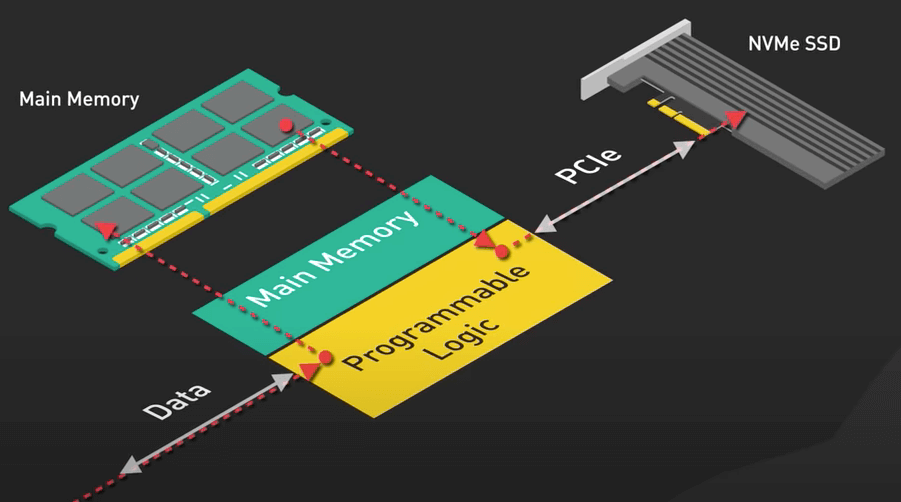
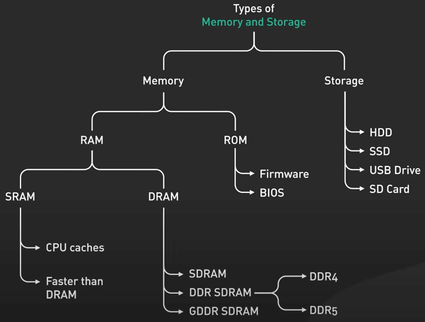

# Bộ nhớ và ổ cứng trong máy tính

## Nguồn

 [10+ Key Memory & Storage Systems: Crash Course System Design #5](https://www.youtube.com/watch?v=lX4CrbXMsNQ)

## Bộ nhớ

Đầu tiên ta có cặp đôi cơ bản là RAM và ROM

**RAM** (Random Access Memory - bộ nhớ truy cập ngẫu nhiên) là loại bộ nhớ chỉ lưu data tạm thời khi máy tính đang chạy. RAM nhanh và có tính linh động, giúp chuyển đổi trạng thái giữa tất cả các chương trình đang chạy tại bất cứ thời điểm nào. Tuy nhiên, data trong RAM sẽ mất đi nếu ta tắt máy tính.

**ROM** (Read-Only Memory - bộ nhớ chỉ đọc) là loại bộ nhớ giữ data ngay cả khi tắt máy. Nó được dùng để lưu các thông tin quan trọng như BIOS hay firmware mà máy tính cần để khởi động.

RAM có các loại khác nhau bao gồm SRAM, DRAM và những thứ khác nữa. 

- **SRAM** (Static Random Access Memory - bộ nhớ truy cập ngẫu nhiên tĩnh) là một loại RAM nhanh và đắt tiền, sử dụng các công cụ tốc độ cao như CPU cache, nơi mà thời gian truy cập là cực kỳ quan trọng.
- **DRAM** (Dynamic Random Access Memory - bộ nhớ truy cập ngẫu nhiên động) là một loại RAM chậm và rẻ hơn so với SRAM. Nó cần được refresh thường xuyên để lưu trữ data, làm cho nó có tính bảo dưỡng cao. 
    - Có nhiều loại DRAM như: FPM DRAM, EDO DRAM, SDRAM và DDR SDRAM, với mỗi thế hệ mang lại cho người dùng tốc độ và độ hiệu quả cao hơn. Một số loại đã lỗi thời, như FPM DRAM hay EDO DRAM, và các loại phổ biến bây giờ là các thế hệ DDR như DDR4 và DDR5. 
    - GDDR SDRAM cũng đàng được nhắc đến. Nó là một loại RAM chuyên biệt được tối ưu cho việc truyền dữ liệu tốc độ cao. GPU cần điều này để xử lý song song ở quy mô lớn. GDDR6 được dùng nhiều nhất hiện nay.

ROM thì bao gồm firmware và BIOS.

- **Firmware** là phần mềm được lưu trong ROM để điều khiển các thiết bị phần cứng giao tiếp với nhau.
- **BIOS** (Basic Input / Output System) là phần mềm đầu tiên máy tính chạy khi khởi động. Nó chịu trách nhiệm khởi động máy tính, khởi tạo các thành phần phần cứng và giao lại quyền điều khiển cho hệ điều hành.

## Ổ cứng

**HDD** (Hard Disk Drive) được IBM giới thiệu lần đầu vào năm 1956. Nó đọc dữ liệu bằng cách quay đĩa từ và được biết đến với khả năng lưu trữ ít với giá thành rẻ.

**SSD** (Solid State Drive) sử dụng công nghệ dựa trên bộ nhớ điện tĩnh flash (NAND) để cho ra tốc độ truy cập data nhanh hơn, giảm hao phí điện năng và tăng cường tuổi thọ ổ đĩa so với HDD, nhưng với giá cao hơn.

- **NVMe** (Non-Volatile Memory Express) là interface hiệu suất cao dành cho SSD. NVMe kết nối trực tiếp đến CPU qua các liên kết PCIe. Điều này cho phép độ trễ thấp và tốc độ truyền data tăng một cách đáng kể, so với SATA SSD.

{ style="display: block; margin: 0 auto" }

**Ổ USB** là một thiết bị nhỏ mà bạn có thể cắm vào cổng USB để gửi / nhận data đến / từ thiết bị có cổng USB đó. Nó rất dễ dùng và được dùng để truyền data giữa các máy tính với nhau.

**Thẻ nhớ SD** là một loại thẻ nhỏ bằng con tem (hoặc nhỏ hơn như Mini SD hay Micro SD), có khả năng chứa data được dùng để lưu trữ data trong máy ảnh số hay điện thoại thông minh. Nó có thể chứa hàng trăm GB hoặc thậm chí vài TB bộ nhớ.

{ style="display: block; margin: 0 auto" }
