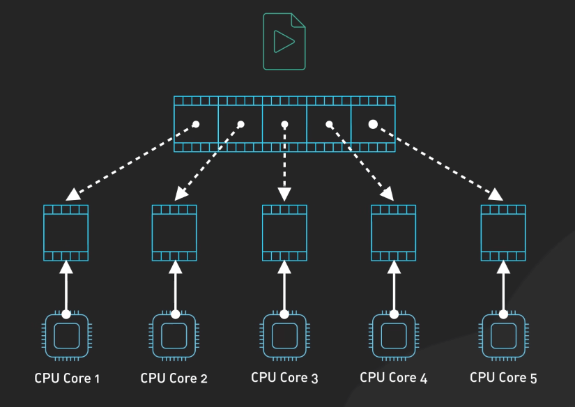

# Concurrency vs. Parallelism

## Nguồn

 [Concurrency vs. Parallelism!](https://www.youtube.com/watch?v=RlM9AfWf1WU)

## Concurrency (Đồng thời)

Hãy tưởng tượng một chương trình xử lý nhiều nhiệm vụ như tiếp nhận dữ liệu người dùng, đọc file và thực hiện các yêu cầu mạng. Concurrency cho phép chương trình xử lý linh hoạt các nhiệm vụ này, ngay cả trên một lõi CPU duy nhất. Cách thức hoạt động là CPU chuyển đổi nhanh chóng giữa các nhiệm vụ, làm việc trên mỗi nhiệm vụ trong một thời gian ngắn trước khi chuyển sang nhiệm vụ tiếp theo. Quá trình này, được gọi là chuyển đổi ngữ cảnh (context switching), tạo ảo giác rằng các nhiệm vụ đang được thực hiện đồng thời, mặc dù thực tế không phải vậy.

{:class="centered-img"}

Giống như một đầu bếp đang làm nhiều món ăn cùng một lúc. Anh ta chuẩn bị một món một chút, sau đó chuyển sang món khác và cứ tiếp tục luân phiên. Mặc dù các món ăn không hoàn thành cùng lúc, tất cả đều tiến triển. Tuy nhiên, chuyển đổi ngữ cảnh cũng có chi phí: CPU phải lưu và khôi phục trạng thái của mỗi nhiệm vụ, và quá nhiều chuyển đổi ngữ cảnh có thể ảnh hưởng đến hiệu suất.

## Parallelism (Song song)

Trong parallelism, nhiều nhiệm vụ thực sự được thực hiện cùng lúc bằng nhiều lõi CPU. Mỗi lõi xử lý một nhiệm vụ khác nhau một cách độc lập cùng một thời điểm. Tưởng tượng một bếp có hai đầu bếp; một người thái rau, người kia nấu thịt, cả hai công việc đều được thực hiện song song, giúp bữa ăn được chuẩn bị nhanh hơn.

{:class="centered-img"}

## Sự khác biệt

Trong thiết kế hệ thống, concurrency phù hợp với các nhiệm vụ đợi, như thao tác I/O. Nó cho phép các nhiệm vụ khác tiếp tục tiến hành trong thời gian chờ, giúp cải thiện hiệu suất tổng thể. Ví dụ, một máy chủ web có thể xử lý nhiều yêu cầu đồng thời, ngay cả khi chỉ sử dụng một lõi CPU. 

{:class="centered-img"}

Ngược lại, parallelism rất hiệu quả trong các tác vụ tính toán nặng như phân tích dữ liệu hoặc kết xuất đồ họa. Những tác vụ này có thể được chia thành các phần nhỏ, độc lập và thực hiện đồng thời trên các lõi khác nhau, tăng tốc quá trình đáng kể.

{:class="centered-img"}

## Một số ví dụ

- Ứng dụng web: Sử dụng concurrency để xử lý đồng thời input từ người dùng, truy vấn cơ sở dữ liệu và các tác vụ nền, mang lại trải nghiệm người dùng mượt mà.

{:class="centered-img"}

- Học máy: Tận dụng parallelism để huấn luyện các mô hình lớn. Bằng cách phân phối việc huấn luyện trên nhiều lõi hoặc máy, thời gian tính toán được giảm đáng kể.

{:class="centered-img"}

- Kết xuất video: Sử dụng parallelism để xử lý nhiều khung hình đồng thời trên các lõi khác nhau, giúp tăng tốc quá trình kết xuất.

{:class="centered-img"}

- Mô phỏng khoa học: Sử dụng parallelism để mô phỏng các hiện tượng phức tạp như mô hình thời tiết hoặc tương tác phân tử trên nhiều bộ xử lý.

{:class="centered-img"}

- Xử lý dữ liệu lớn: Các framework xử lý dữ liệu lớn như Hadoop và Spark tận dụng parallelism để xử lý các tập dữ liệu lớn một cách nhanh chóng và hiệu quả.

{:class="centered-img"}

## Sự liên quan giữa Concurrency và Parallelism

Mặc dù concurrency và parallelism là hai khái niệm khác nhau, chúng có liên hệ mật thiết với nhau. Concurrency là về **quản lý nhiều nhiệm vụ cùng lúc**, trong khi parallelism là về **thực hiện nhiều nhiệm vụ cùng lúc**. 

{:class="centered-img"}

Concurrency có thể kích hoạt parallelism bằng cách cấu trúc chương trình để có thể thực hiện song song một cách hiệu quả. Bằng cách sử dụng concurrency, chúng ta có thể chia nhỏ một chương trình thành các nhiệm vụ độc lập nhỏ hơn, từ đó dễ dàng tận dụng parallelism.

{:class="centered-img"}

Tuy concurrency không tự động dẫn đến parallelism, nhưng nó tạo nền tảng giúp parallelism dễ dàng đạt được. Các ngôn ngữ lập trình có tính năng concurrency mạnh giúp việc viết các chương trình hỗ trợ concurrency dễ dàng hơn, từ đó tạo điều kiện cho việc tận dụng parallelism.

## Kết luận

Concurrency giúp quản lý nhiều nhiệm vụ hiệu quả để giữ cho chương trình của bạn phản hồi nhanh, đặc biệt là với các thao tác I/O. Parallelism tập trung vào việc tăng hiệu suất bằng cách xử lý các nhiệm vụ tính toán nặng cùng lúc. 

{:class="centered-img"}

Hiểu sự khác biệt và sự tương tác giữa concurrency và parallelism, đồng thời tận dụng sức mạnh của concurrency để hỗ trợ parallelism, sẽ giúp chúng ta thiết kế các hệ thống hiệu quả hơn và tạo ra các ứng dụng hoạt động tốt hơn.

{:class="centered-img"}
