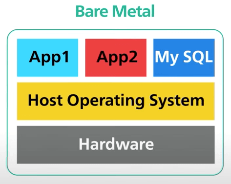
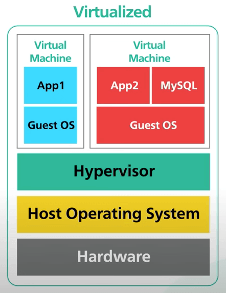
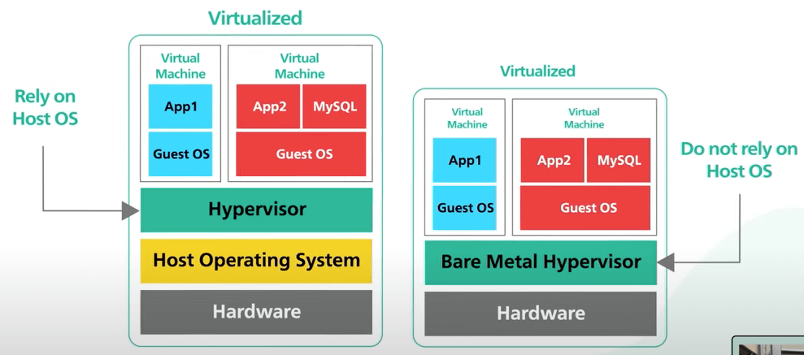
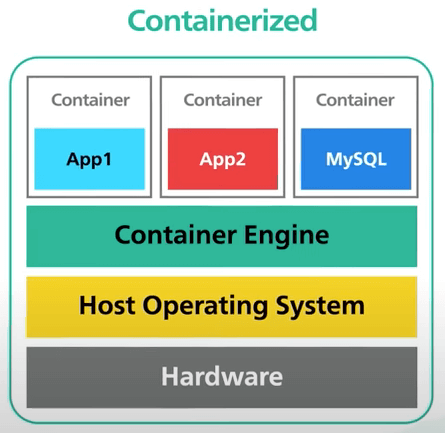
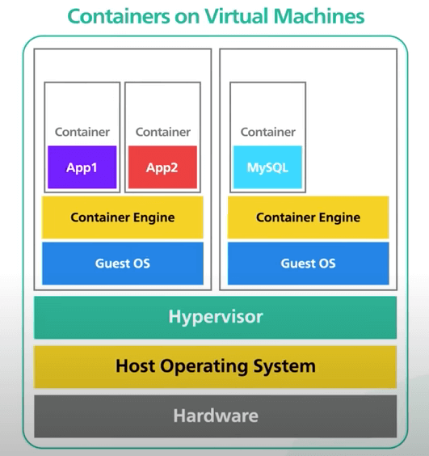
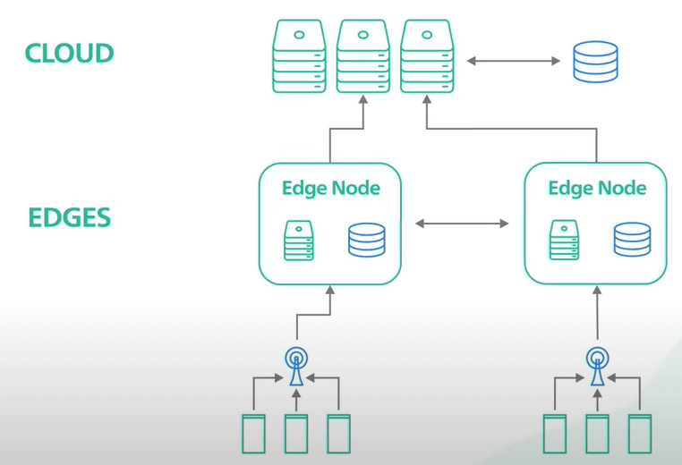
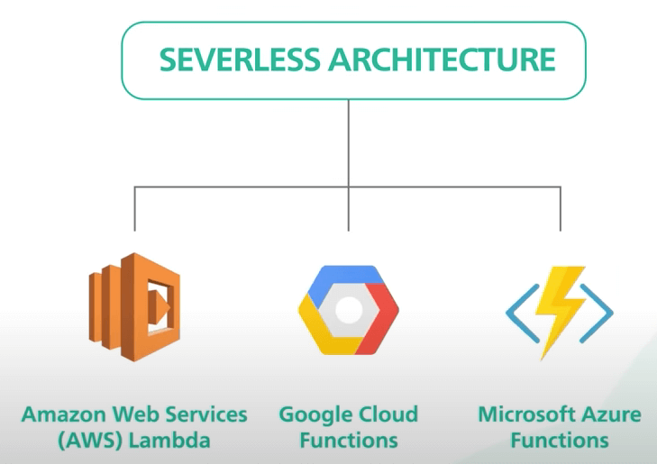

# Những hiểu nhầm về Bare Metal, Virtual Machine và Container

## Nguồn

 [Big Misconceptions about Bare Metal, Virtual Machines, and Containers](https://www.youtube.com/watch?v=Jz8Gs4UHTO8)

## Bare Metal Machine

Một **Bare Metal Machine** là một **máy tính vật lý**, một máy tính độc lập. Ngày xưa tất cả các server đều là máy vật lý. Máy vật lý cho phép chúng ta có toàn quyền kiểm soát các tài nguyên phần cứng và các phần mềm để chạy. Đối với các phần mềm cần hiệu suất cực cao từ phần cứng, máy vật lý là một lựa chọn khá tốt.

{:class="centered-img"}

Bare Metal Server được cô lập vật lý. Sự cô lập này mang đến 2 cái lợi:

1. Máy vật lý không bị ảnh hưởng bởi noisy neighbor problem. Noisy neighbor problem xảy ra khi hiệu suất của người thuê máy bị ảnh hưởng bởi hoạt động của người thuê máy khác dùng chung phần cứng.
2. Sự cô lập cung cấp mức độ bảo mật cao nhất. Ví dụ, nó miễn nhiễm với side-channel attack. Side-channel attack tận dụng các lỗ hổng thiết kế trong bộ xử lý hiện đại để cho phép một người thuê máy đánh cắp các thông tin nhạy cảm từ những máy lân cận. Đây cũng là một lý do nữa để dùng máy vật lý.

Khi một ứng dụng cần đáp ứng các yêu cầu bảo mật, tuân thủ quy định, hoặc các yêu cầu nghiêm ngặt khác, máy vật lý có thể là lựa chọn duy nhất của bạn. Tuy nhiên, điểm yếu của nó là gì?

Máy vật lý đắt, khó quản lý, và khó mở rộng quy mô. Việc mua phần cứng mới khá mất thời gian, và bạn cần một team có năng lực để quản lý tốt các máy này.

## Virtual Machine

**Máy ảo (virtual machine)** là giả lập của một máy vật lý. Đây được gọi là **ảo hóa (virtualization)**. Nhiều máy ảo có thể chạy trên một máy tính vật lý. Phía trên phần cứng máy tính vật lý là hệ điều hành của máy vật lý. Bên trên hệ điều hành này chạy một phần mềm đặc biệt gọi là **hypervisor**. Đây cũng được gọi là **trình giám sát máy ảo**. Hypervisor quản lý các máy ảo. Nó tạo ra một lớp trừu tượng phía trên phần cứng để nhiều hệ điều hành có thể chạy song song với nhau. Mỗi máy ảo có hệ điều hành riêng. Trên mỗi hệ điều hành máy ảo, ta có các ứng dụng cho một người thuê máy.

{:class="centered-img"}

Lưu ý, có một khái niệm gọi là **bare metal hypervisor**, không nên nhầm lẫn với **bare metal hardware**. Bare metal hypervisor điều khiển phần cứng trực tiếp mà không phụ thuộc vào hệ điều hành máy vật lý. Điều này cho phép hypervisor có toàn quyền kiểm soát phần cứng và cung cấp hiệu suất cao hơn. Tuy nhiên, phần cứng hỗ trợ bare metal hypervisor cũng đắt hơn.

{:class="centered-img"}

Máy ảo đã có được bước tiến dài về hiệu suất và quy mô. Ngày nay chúng ta có thể chọn máy ảo với bất kỳ kích thước nào để phù hợp với khối lượng công việc của chúng ta, từ máy ảo kiểu đơn giản với vài CPU core và vài GB bộ nhớ, cho đến máy ảo hiệu suất cao với hàng trăm core và hàng terabyte bộ nhớ. 

Lợi ích của máy ảo là gì?

- Máy ảo vận hành ít tốn kém hơn.
- Chúng có thể chia sẻ cùng một phần cứng, cho phép tận dụng tối đa tài nguyên phần cứng.
- Chúng cũng dễ mở rộng hơn, làm tăng tính linh hoạt cho các công ty, tổ chức sử dụng chúng. Một số phần mềm ảo hóa có thể di chuyển máy ảo đang chạy từ một phần cứng máy tính vật lý này sang một phần cứng khác mà không cần tắt máy ảo.

Rồi thế điểm yếu của máy ảo là gì?

- Máy ảo có thể bị ảnh hưởng bởi noisy neighbor problem mà chúng ta đã nói ở trên. Nếu ứng dụng của chúng ta chạy cùng với một noisy neighbor, hiệu suất của ứng dụng có thể bị ảnh hưởng.
- Hơn nữa, các máy ảo chạy trên cùng một phần cứng vật lý sẽ dùng chung các CPU core vật lý. Chúng cũng có thể bị tấn công bởi các lỗ hổng thiết kế trong bộ xử lý hiện đại. Side-channel attack như Meltdown và Spectre là một số ví dụ nổi tiếng.

## Container

**Container** là một package nhẹ và độc lập của một ứng dụng với tất cả các dependency của nó như thư viện, framework, và runtime. **Containerization** được coi là một phiên bản nhẹ hơn của ảo hóa.

Giống như ảo hóa, ở đây chúng ta có phần cứng bare metal và hệ điều hành máy vật lý. Nhưng thay vì ảo hóa phần cứng với hypervisor, chúng ta ảo hóa hệ điều hành chính với một phần mềm đặc biệt gọi là container engine, trên đây chạy nhiều container. Mỗi container là một môi trường ứng dụng độc lập với các container khác. Container engine cung cấp việc chia sẻ tài nguyên nhanh hơn. Và tất cả các tài nguyên cần thiết để chạy ứng dụng được đóng gói cùng nhau để các ứng dụng có thể chạy ở bất cứ đâu. Container có thể mở rộng và có thể di chuyển. Chúng nhẹ và cần ít tài nguyên phần cứng hơn để chạy hơn máy ảo. Một máy vật lý có thể chứa nhiều container hơn nhiều so với máy ảo. Do mỗi container chạy như một tiến trình bình thường của hệ điều hành máy vật lý, chúng cũng khởi động nhanh hơn. Tất cả những điều này làm cho việc triển khai và bảo trì các container dễ dàng hơn ở quy mô lớn.

{:class="centered-img"}

Tuy nhiên, container có thể ít an toàn hơn. Chúng chia sẻ cùng một hệ điều hành, và sự cô lập dựa trên các nguyên tắc cấp thấp của hệ điều hành. Điều này có nghĩa là container dễ bị tấn công bởi các lỗ hổng bảo mật của hệ điều hành. Ta cũng có thể chạy container bên trong máy ảo. Mà sao ta lại muốn thể nhỉ? Lý do là nó cung cấp bảo mật tốt hơn bằng cách giảm các khả năng tấn công có thể xảy ra. Đây là một sự đánh đổi giữa tính linh hoạt và tính bảo mật.

{:class="centered-img"}

## Kết luận

Rồi sau container ta sẽ có gì nữa? Serverless và edge computing là hai cái tên đầu tiên mà ta có thể nghĩ đến. Chúng cung cấp cho chúng ta một cách tiếp cận triển khai và bảo trì ứng dụng dễ dàng hơn, nhưng cũng có những đánh đổi riêng của chúng.

{:class="centered-img"}

{:class="centered-img"}

Kết lại thì thiết kế hệ thống là một quá trình đánh đổi. Điều này cũng đúng với bare metal, máy ảo, và container. Không có một câu trả lời đúng duy nhất nào cả.
