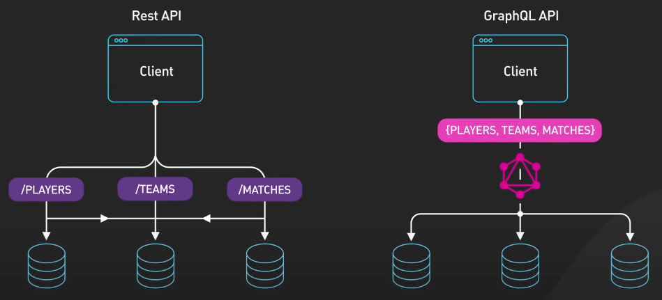

# Làm thế nào để có kết quả tốt trong phỏng vấn System Design?

## Nguồn

 [How to Crack Any System Design Interview](https://www.youtube.com/watch?v=iLuVsCTXiyE)

## Phỏng vấn System Design là gì?

Mục tiêu chính của loại phỏng vấn này là để đánh giá khả năng của bạn trong việc:

1. Biến đổi một yêu cầu không rõ ràng thành các yêu cầu kỹ thuật cụ thể.
2. Thiết kế kiến trúc hệ thống đáp ứng các yêu cầu đó.
3. Trình bày và bảo vệ các quyết định thiết kế của mình trong quá trình phỏng vấn.

Bạn sẽ được yêu cầu thiết kế các hệ thống quy mô lớn như feed của Instagram, dịch vụ chia sẻ xe của Uber, hoặc thậm chí là cơ sở hạ tầng phía sau công cụ tìm kiếm của Google. Không có cái gọi là giải pháp "đúng" hay "hoàn hảo". Điều quan trọng là thể hiện sự hiểu biết về kỹ thuật, cách tiếp cận vấn đề và khả năng giao tiếp hiệu quả của bạn.

## Tại sao phải chuẩn bị cho phỏng vấn System Design?

Khả năng của bạn trong phỏng vấn System Design có thể quyết định bạn có được nhận vào các vị trí senior hay không. Khi bạn đã có vài năm kinh nghiệm trong ngành, phỏng vấn thiết kế hệ thống là cách mà các công ty đánh giá khả năng của bạn trong việc xây dựng các hệ thống phức tạp và có quy mô lớn. Bạn làm tốt trong phỏng vấn System Design, bạn đang trên đường hướng tới các vị trí senior, ngược lại, bạn chỉ có thể nhận được offer cho các vị trí junior. Vì vậy, hãy chuẩn bị kỹ lưỡng và nghiêm túc cho loại phỏng vấn này.

Bạn có thể cho rằng làm sao người ta có thể đánh giá khả năng của bạn trong thời gian ngắn vậy được? Đúng vậy, họ không làm thế được, nhưng chỉ là không hoàn toàn. Phỏng vấn System Design là một cách để mô phỏng các tình huống thực tế. Bạn cần giúp người phỏng vấn thấy được vì sao họ cần phải tuyển bạn. Đây không phải là cách tốt nhất, nhưng với các công ty, đây là phương pháp đánh giá sát thực tế nhất mà họ có để tránh tuyển nhầm người.

## Cách chuẩn bị cho phỏng vấn System Design

### Luyện tập đê

Thực hành thiết kế các ứng dụng thực tế mà ta sử dụng hàng ngày như Instagram, Uber hay Gmail. Chỉ đọc về kiến trúc thôi là chưa đủ. Lấy giấy bút ra và vẽ các thành phần chính cũng như cách chúng tương tác với nhau.

{:class="centered-img"}

Ví dụ, hãy thiết kế kiến trúc backend cho Instagram. Liệt kê các thành phần chính như các thành phần frontend tương tác với người dùng, các server xử lý hàng triệu request, hệ thống cache tăng tốc độ phản hồi, cơ sở dữ liệu để lưu trữ bài viết và bình luận, và kho lưu trữ phân tán để lưu các hình ảnh và video. Sau đó vẽ ra các luồng dữ liệu chính hoạt động như thế nào, như hình ảnh người dùng được tải lên và lưu trữ như thế nào, các thuật toán xác định thứ tự bài viết trên feed ra sao, hệ thống sử dụng dữ liệu cache như thế nào và khi nào sẽ gọi vào cơ sở dữ liệu. Xây dựng từng phần của bức tranh không chỉ giúp bạn hiểu sâu hơn mà còn giúp bạn nhớ lâu hơn.

{:class="centered-img"}

### Nghiên cữu các mô hình thiết kế phổ biến

Hãy nghiên cứu các mô hình thiết kế như cân bằng tải (load balancing), phân chia cơ sở dữ liệu (database sharding), mạng phân phối nội dung (CDN), cache dữ liệu, vân vân... Nghiên cứu ưu nhược của mỗi cách tiếp cận để cân nhắc sự đánh đổi trong thiết kế. Khi học các mô hình này, dự đoán loại câu hỏi nào người phỏng vấn có thể hỏi và tập trả lời một cách tự tin.

{:class="centered-img"}

Câu hỏi ví dụ: tại sao bạn lại chọn Redis để cache thay vì Memcached? Hãy sẵn sàng thảo luận về các chi tiết như các cấu trúc dữ liệu trong Redis và các tùy chọn lưu trữ dữ liệu để bảo vệ lựa chọn của bạn.

{:class="centered-img"}

### Tập dùng whiteboard

Thêm nữa, tập dùng whiteboard và các ứng dụng vẽ biểu đồ một cách thoải mái. Trong nhiều trường hợp, bạn cần phải dùng chúng để biểu thị điều bạn muốn trình bày. Hãy thành thạo chúng để tập trung vào việc giao tiếp một cách hiệu quả, chứ không phải bối rối khi sử dụng rồi nhận lại cái kết đắng.

{:class="centered-img"}

### Phỏng vấn thử

Cuối cùng, phỏng vấn thử thường xuyên. Không có gì tốt hơn phỏng vấn theo thời gian thực để kiểm tra kỹ năng của bạn. Nhận phản hồi từ người phỏng vấn thử, không chỉ về design mà còn về cách giao tiếp, khả năng suy luận và quản lý thời gian của bạn. Dùng phỏng vấn thử như một cái gương, phản ánh những điểm mạnh và yếu của bạn.

## Làm gì trong phỏng vấn System Design?

1. Bắt đầu bằng việc đặt các câu hỏi để hiểu rõ yêu cầu, phạm vi, các giới hạn kỹ thuật và các yêu cầu khác trước khi bước vào thiết kế. Tránh việc lao vào đề xuất tính năng ngay từ đầu, cứ viết ra các yêu cầu cốt lõi đã. 
2. Chú ý quản lý thời gian hợp lý. Thời gian bạn thực sự thiết kế sẽ ít hơn nhiều khi có sự xuất hiện của các phần như giới thiệu, đặt câu hỏi, vẽ biểu đồ, và những lần gián đoạn nhỏ. Mỗi phút giây đều rất quan trọng, cho nên hãy điều chỉnh tốc độ và tiến bước. Xác định các chỗ bạn có thể bí. 
3. Khi bạn vẽ biểu đồ các thành phần hệ thống, nói ra suy nghĩ của mình và giải thích lý do cho các lựa chọn của bản thân, đừng để người phỏng vấn phải đoán bạn đang nghĩ gì. Nhớ nói ra các giả thiết nữa. 
4. Ghi lại các khía cạnh quan trọng trên whiteboard để người phỏng vấn có thể theo được bạn. Chia hệ thống thành các thành phần logic. Đánh dấu các luồng dữ liệu chính và các dependency giữa chúng. Tránh việc sa đà vào low-level design, tập trung vào high-level và các tradeoff rộng hơn.
5. Nếu bí, hãy thở đều và đừng hoảng. Hỏi người phỏng vấn để giải quyết những điều không rõ ràng. Suy nghĩ từng bước một để giải quyết thế bí. Việc vượt qua các trở ngại và tiến lên khi không có đầy đủ thông tin cũng là một phần của thử thách này.

{:class="centered-img"}

{:class="centered-img"}

Chúc các bạn thành công!
