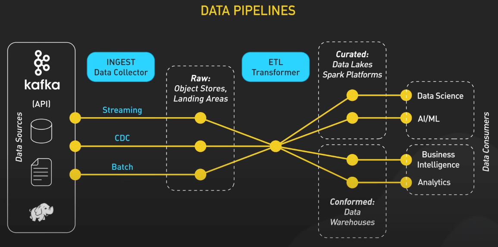
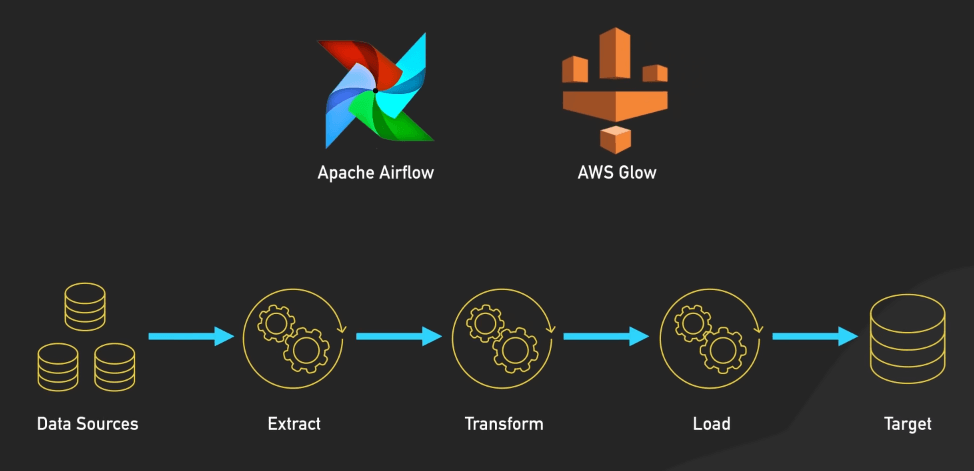
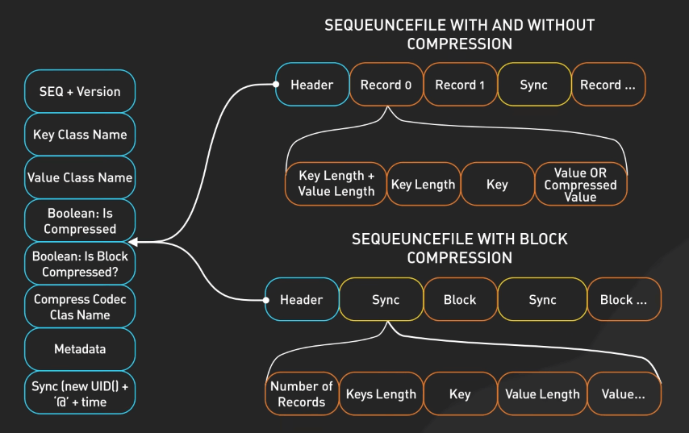
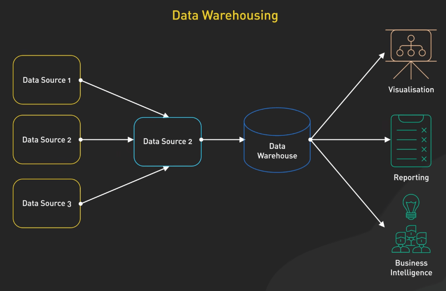
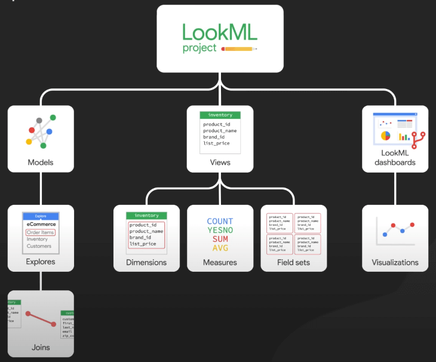

# Data Pipeline là gì?

## Nguồn

 [What is Data Pipeline? | Why Is It So Popular?](https://www.youtube.com/watch?v=kGT4PcTEPP8)

## Là gì vậy?

Trong thế giới hiện đại, các công ty thu thập lượng lớn dữ liệu từ nhiều nguồn khác nhau. Dữ liệu này rất quan trọng để đưa ra các quyết định kinh doanh sáng suốt và thúc đẩy sự đổi mới. Tuy nhiên, dữ liệu thô thường rất lộn xộn, không có cấu trúc và được lưu trữ ở nhiều định dạng khác nhau trong các hệ thống khác nhau. Data pipelines tự động hóa quá trình thu thập, chuyển đổi và phân phối dữ liệu để làm cho nó trở nên hữu ích và có giá trị.

{:class="centered-img"}

Data pipelines có rất nhiều dạng khác nhau. Thuật ngữ này bao quát bất kỳ quy trình nào di chuyển một lượng lớn dữ liệu từ nơi này đến nơi khác. Ở đây, chúng ta sẽ xem xét một phiên bản tổng quát, nhưng đây không phải là cách duy nhất để triển khai một data pipeline hiệu quả. Nhìn chung, một data pipeline có các giai đoạn chính: thu thập, tiếp nhận, lưu trữ, tính toán, và tiêu thụ. Thứ tự của các giai đoạn này có thể thay đổi dựa trên loại dữ liệu, nhưng chúng thường bao gồm tất cả các giai đoạn này.

{:class="centered-img"}

## Thu thập

Hãy tưởng tượng chúng ta đang làm việc cho một gã khổng lồ thương mại điện tử như Amazon. Dữ liệu sẽ đổ về từ nhiều nguồn: data store, data stream và các ứng dụng. Data store là các cơ sở dữ liệu như MySQL, Postgres, hoặc DynamoDB, nơi các bản ghi transaction được lưu trữ. Ví dụ, mỗi lần đăng ký người dùng, đặt hàng, và thanh toán sẽ được lưu vào các cơ sở dữ liệu này. Data stream thu nhận các luồng dữ liệu trực tiếp, như việc theo dõi các lượt nhấp chuột và tìm kiếm của người dùng trong thời gian thực, với các công cụ như Apache Kafka hoặc Amazon Kinesis, hoặc dữ liệu đến từ các thiết bị IoT.

## Tiếp nhận

Với các nguồn dữ liệu đa dạng này, giai đoạn tiếp theo là ingest (tiếp nhận), nơi dữ liệu được tải vào môi trường của data pipeline. Tùy vào loại dữ liệu, dữ liệu có thể được tải trực tiếp vào pipeline xử lý hoặc vào một hàng đợi sự kiện trung gian. Các công cụ như Apache Kafka hoặc Amazon Kinesis thường được sử dụng cho luồng dữ liệu thời gian thực. Dữ liệu từ các cơ sở dữ liệu thường được tiếp nhận thông qua các quy trình xử lý theo đợt hoặc các công cụ Change Data Capture (CDC). Sau khi tiếp nhận, dữ liệu có thể được xử lý ngay hoặc lưu trữ trước, tùy thuộc vào các use case cụ thể.

## Tính toán

Giai đoạn tiếp theo là compute (tính toán), nơi dữ liệu được xử lý và biến đổi thành định dạng có thể phân tích. Có hai loại xử lý chính là xử lý theo lô và xử lý theo dòng:

- Batch Processing (Xử lý theo lô): Liên quan đến việc xử lý khối lượng lớn dữ liệu vào những thời điểm được lên lịch trước. Apache Spark, với khả năng tính toán phân tán, đóng vai trò quan trọng ở đây. Các công cụ xử lý theo lô khác bao gồm Apache Hadoop MapReduce và Apache Hive. Ví dụ, các job Spark có thể được cấu hình để chạy hàng đêm, nhằm tổng hợp dữ liệu bán hàng hàng ngày.
- Stream Processing (Xử lý theo dòng): Dùng để xử lý dữ liệu theo thời gian thực. Các công cụ như Apache Flink, Google Cloud Dataflow, Apache Storm hoặc Apache Samza xử lý dữ liệu ngay khi dữ liệu đến. Ví dụ, Flink có thể được sử dụng để phát hiện các giao dịch gian lận theo thời gian thực bằng cách phân tích các luồng giao dịch và áp dụng các quy tắc xử lý sự kiện phức tạp.

Trong giai đoạn này, quy trình ETL hoặc ELT cũng đóng vai trò quan trọng. Các công cụ ETL như Apache Airflow và AWS Glue giúp điều phối việc nạp dữ liệu, đảm bảo các thao tác chuyển đổi như làm sạch dữ liệu, chuẩn hóa và làm phong phú dữ liệu được thực hiện trước khi tải vào lớp lưu trữ. Đây là giai đoạn mà dữ liệu lộn xộn, không có cấu trúc và không đồng nhất được chuyển đổi thành một định dạng sạch sẽ, có cấu trúc, phù hợp để phân tích.

{:class="centered-img"}

## Lưu trữ

Sau khi xử lý, dữ liệu sẽ chảy vào storage (lưu trữ). Ta có một số lựa chọn như:

- Data Lake (hồ dữ liệu): Lưu trữ dữ liệu thô, chưa qua xử lý, thường sử dụng các công cụ như Amazon S3 hoặc HDFS. Dữ liệu thường được lưu trữ ở các định dạng như Parquet hoặc Avro, các định dạng này rất hiệu quả cho lưu trữ và truy vấn quy mô lớn.

{:class="centered-img"}

- Data Warehouse (kho dữ liệu): Lưu trữ dữ liệu đã qua xử lý, có cấu trúc, chẳng hạn như Snowflake, Amazon Redshift hoặc Google BigQuery.
- Data Lakehouse: Kết hợp các tính năng của cả data lake và data warehouse, hỗ trợ cả dữ liệu thô và có cấu trúc.

## Tiêu thụ

Cuối cùng, dữ liệu đã qua xử lý sẵn sàng cho giai đoạn consume (tiêu thụ). Các team sử dụng dữ liệu cho các mục đích khác nhau:

- Data Science Teams (Các team khoa học dữ liệu): Sử dụng dữ liệu cho mô hình dự đoán. Các công cụ phổ biến là Jupyter Notebooks với các thư viện như TensorFlow hoặc PyTorch. Các nhà khoa học dữ liệu có thể xây dựng các mô hình để dự đoán tỷ lệ rời bỏ khách hàng dựa trên dữ liệu tương tác lịch sử được lưu trữ trong kho dữ liệu.

- Business Intelligence Tools (Các công cụ phân tích kinh doanh): Các công cụ như Tableau hoặc Power BI cung cấp bảng điều khiển và báo cáo tương tác. Các công cụ này kết nối trực tiếp với data warehouses hoặc lakehouses, cho phép các nhà lãnh đạo doanh nghiệp xem KPI và xu hướng.

{:class="centered-img"}

- Self-Service Analytics Tools (Công cụ phân tích tự phục vụ): Các công cụ như Looker cho phép các team tự chạy truy vấn mà không cần kiến thức kỹ thuật sâu. LookML, ngôn ngữ mô hình của Looker, giúp đơn giản hóa SQL, cho phép các team như marketing phân tích hiệu suất chiến dịch.

{:class="centered-img"}

- Machine Learning Models (Các mô hình học máy): Sử dụng dữ liệu này để học liên tục và cải tiến. Ví dụ, các mô hình phát hiện gian lận ngân hàng liên tục được đào tạo với dữ liệu giao dịch mới để thích ứng với các pattern gian lận hiện nay.
