# Các chiến lược scale database phổ biến

## Nguồn

 [7 Must-know Strategies to Scale Your Database](https://www.youtube.com/watch?v=_1IKwnbscQU)

## Tại sao cần scale database?

Khi ứng dụng của bạn phát triển, lượng dữ liệu mà nó xử lý và số lượng người dùng cũng tăng lên. Điều này có thể dẫn đến các vấn đề về hiệu suất như thời gian phản hồi chậm, timeout, thậm chí là crash nếu cơ sở dữ liệu của bạn không thể theo kịp. Việc mở rộng quy mô trở thành điều cần thiết để duy trì hoạt động trơn tru và đảm bảo trải nghiệm người dùng tốt.

Hãy tưởng tượng bạn điều hành một startup bất ngờ trở nên nổi tiếng. Số lượng người dùng tăng vọt và cơ sở dữ liệu của bạn bây giờ phải xử lý hàng triệu yêu cầu thay vì chỉ vài nghìn. Nếu không có việc mở rộng quy mô phù hợp, ứng dụng của bạn có thể trở nên không ổn định, khiến người dùng rời đi. Hoặc hãy nghĩ về các đợt bán hàng vào kỳ nghỉ trên một nền tảng thương mại điện tử như Amazon. Lượng truy cập tăng đột biến trong các sự kiện như vậy yêu cầu cơ sở dữ liệu có khả năng mở rộng để xử lý tải cao một cách trơn tru.

## Indexing

Index giống như mục lục ở cuối một cuốn sách. Nó giúp bạn xác định thông tin cụ thể nhanh chóng mà không cần phải quét qua từng trang. Ví dụ, trong cơ sở dữ liệu khách hàng của một nhà bán lẻ trực tuyến, index có thể nhanh chóng tìm thấy các đơn hàng của khách hàng dựa trên mã đơn hàng hoặc mã khách hàng. Điều này cho phép bên chăm sóc khách hàng truy xuất lịch sử đơn hàng nhanh chóng vì các trường này được index.

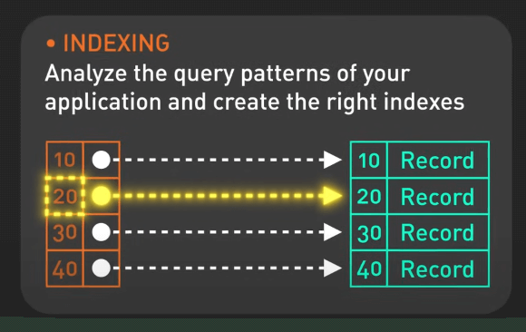{:class="centered-img"}

Loại index phổ biến nhất là B-tree index. B-tree index giữ cho dữ liệu được sắp xếp, lý tưởng cho nhiều loại truy vấn và cho phép các thao tác chèn, xóa và truy xuất nhanh. B-tree index đặc biệt hiệu quả cho các truy vấn phạm vi, như tìm tất cả các đơn hàng trong một khoảng thời gian cụ thể hoặc truy xuất hồ sơ khách hàng theo thứ tự bảng chữ cái theo họ.

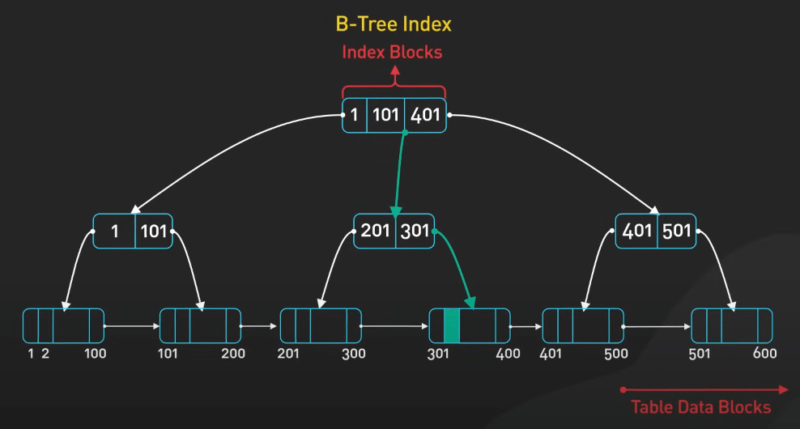{:class="centered-img"}

Index có thể giảm đáng kể thời gian thực hiện truy vấn. Tuy nhiên, cần lưu ý rằng mặc dù index cải thiện hiệu suất đọc, nó có thể làm chậm các thao tác ghi vì index cần được cập nhật mỗi khi dữ liệu thay đổi. Tìm ra sự cân bằng và biết những trường nào cần index là chìa khóa để duy trì hiệu suất tối ưu.

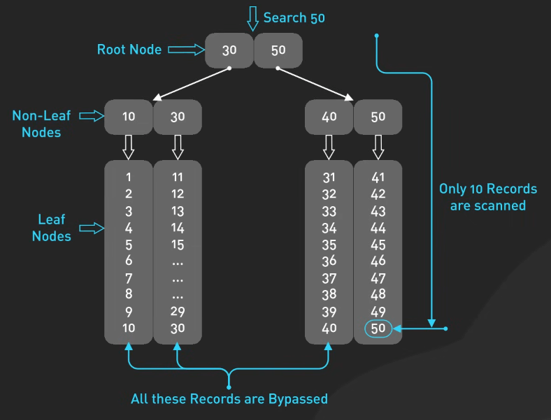{:class="centered-img"}

## Materialized Views

Materialized View giống như những ảnh chụp nhanh được tính toán trước của dữ liệu, được lưu trữ để truy cập nhanh hơn. Chúng đặc biệt hữu ích cho các truy vấn phức tạp, sẽ trở nên chậm khi tính toán lại từ đầu mỗi lần truy vấn. 

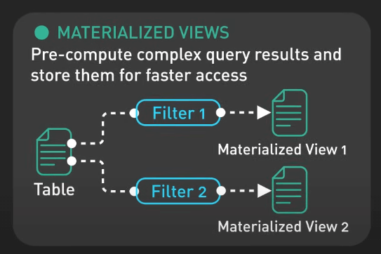{:class="centered-img"}

Ví dụ thực tế là trên các nền tảng phân tích kinh doanh như Tableau. Thay vì truy vấn dữ liệu thô mỗi lần một báo cáo được yêu cầu, một materialized view có thể lưu trữ dữ liệu đã được tính toán trước, cho phép các báo cáo được tạo ra nhanh chóng và hiệu quả.

Materialized View có thể cải thiện hiệu suất đáng kể bằng cách giảm tải tính toán trên cơ sở dữ liệu. Tuy nhiên, chúng phải được làm mới định kỳ để đảm bảo dữ liệu luôn cập nhật, và thao tác làm mới có thể ngốn tài nguyên, đặc biệt nếu dữ liệu nền thay đổi thường xuyên.

## Denormalization

Denormalization là việc lưu trữ dữ liệu trùng lặp để giảm độ phức tạp của truy vấn và tăng tốc độ truy xuất dữ liệu. 

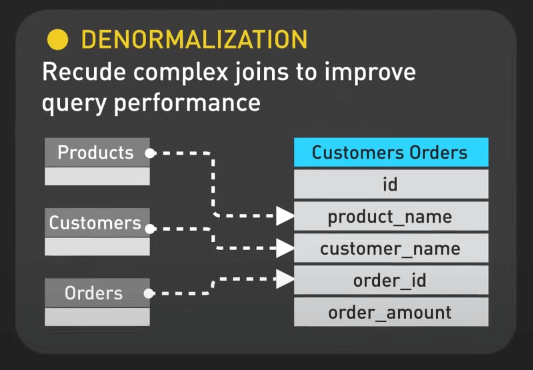{:class="centered-img"}

Ví dụ phổ biến là các nền tảng mạng xã hội như Facebook. Facebook lưu trữ các bài đăng và thông tin người dùng trong cùng một bảng, giảm nhu cầu về các join phức tạp giữa các bảng, giúp truy xuất nhanh hơn khi hiển thị các nội dung của người dùng.

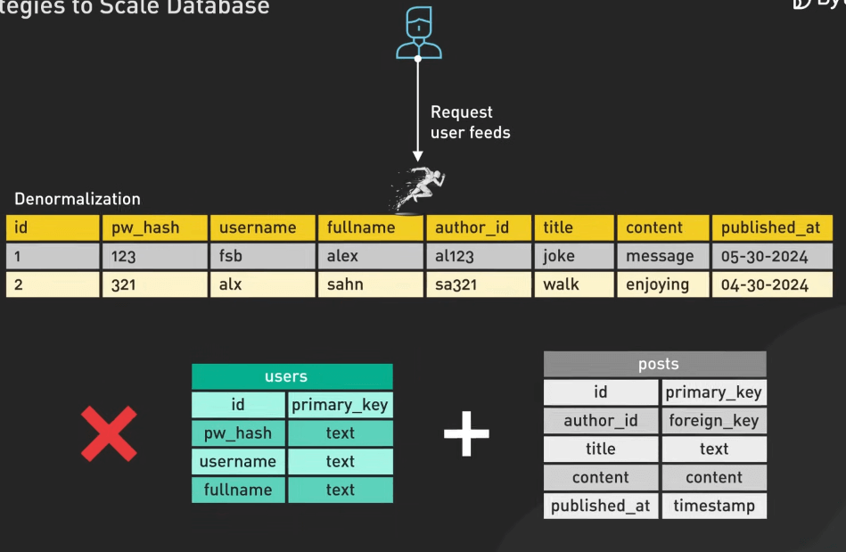{:class="centered-img"}

Mặc dù denormalization có thể cải thiện đáng kể hiệu suất đọc, nhưng nó cũng đi kèm với đánh đổi. Việc lưu trữ dữ liệu trùng lặp đồng nghĩa với việc các cập nhật phải được quản lý cẩn thận để duy trì tính nhất quán trong cơ sở dữ liệu.

## Vertical Scaling

Vertical Scaling bao gồm việc thêm tài nguyên, chẳng hạn như CPU, RAM hoặc bộ nhớ cho máy chủ cơ sở dữ liệu hiện có để xử lý tải tăng lên. 

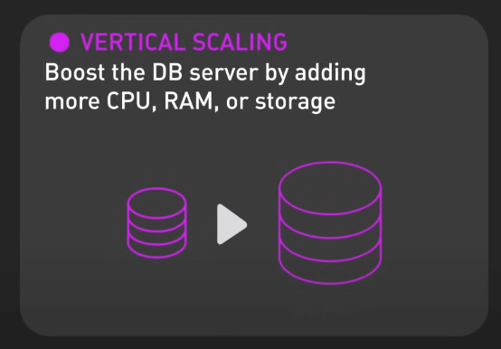{:class="centered-img"}

Ví dụ, một sàn giao dịch trực tuyến có thể bắt đầu xử lý tải hiệu quả với một máy chủ cơ sở dữ liệu, nhưng khi lượng người dùng và khối lượng giao dịch tăng lên, máy chủ bắt đầu gặp khó khăn. Khi đó, họ có thể nâng cấp máy chủ cơ sở dữ liệu bằng cách thêm CPU mạnh hơn, tăng RAM và mở rộng dung lượng lưu trữ.

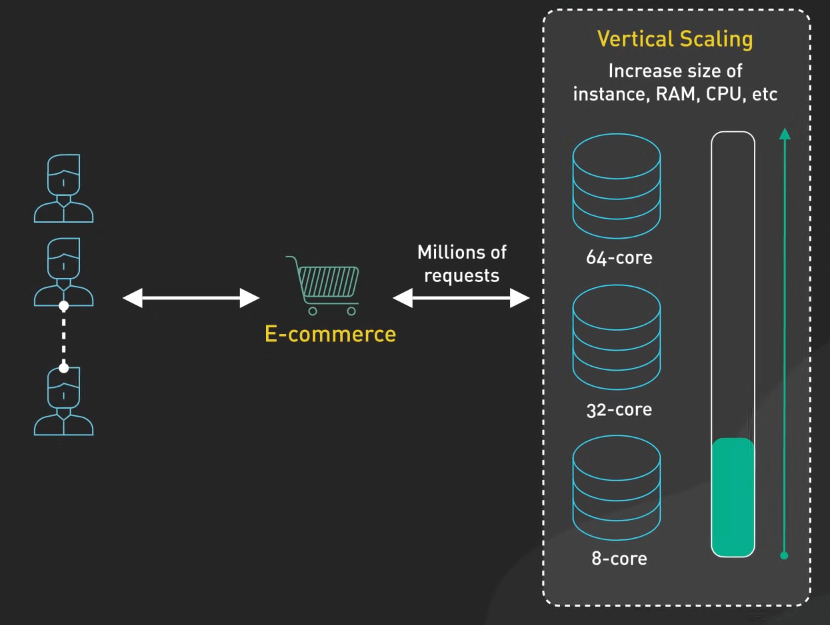{:class="centered-img"}

Vertical Scaling thường là bước đầu tiên vì dễ thực hiện và không yêu cầu thay đổi cấu trúc ứng dụng. Tuy nhiên, đến một mức nào đó, chi phí nâng cấp có thể trở nên quá cao và không đáp ứng được vấn đề về dự phòng. Khi đó, các chiến lược mở rộng khác trở nên cần thiết.

## Caching

Caching liên quan đến việc lưu trữ dữ liệu truy cập thường xuyên trong một lớp lưu trữ nhanh hơn để giảm tải cho cơ sở dữ liệu và tăng tốc độ phản hồi.

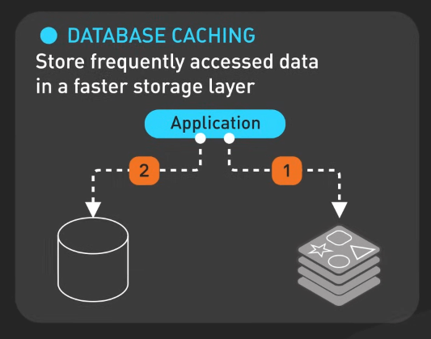{:class="centered-img"}

Ví dụ, khi người dùng duyệt các tiêu đề phim trên Netflix, Netflix truy xuất dữ liệu từ bộ nhớ cache thay vì truy vấn cơ sở dữ liệu mỗi lần.

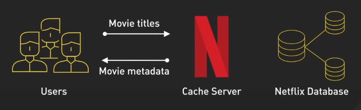{:class="centered-img"}

Caching có thể được triển khai ở nhiều cấp độ, chẳng hạn như cache trong bộ nhớ với Redis hoặc Memcached. Tuy nhiên, một vấn đề chính là làm mới cache để đảm bảo dữ liệu luôn cập nhật. Dữ liệu trong cache có thể bị outdate, nên cần chiến lược làm mới cache thích hợp, có thể dựa trên thời gian hết hạn hoặc các sự kiện cụ thể.

## Replication

Replication là việc tạo các bản sao của cơ sở dữ liệu chính trên các máy chủ khác nhau để cải thiện tính khả dụng, phân phối tải và tăng khả năng chịu lỗi. 

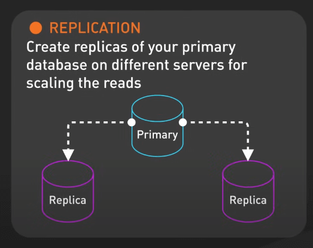{:class="centered-img"}

Replication có thể được cấu hình theo nhiều cách, chẳng hạn như sao lưu đồng bộ hoặc không đồng bộ. Trong sao lưu đồng bộ, dữ liệu được sao chép đến các máy chủ phụ đồng thời khi ghi vào máy chủ chính, đảm bảo tính nhất quán ngay lập tức, nhưng có thể gây độ trễ.

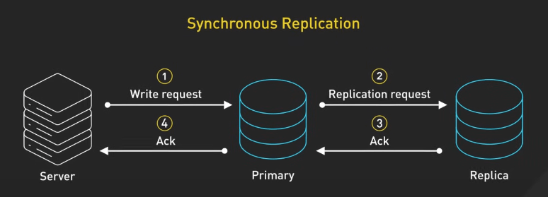{:class="centered-img"}

Trong khi đó, sao lưu không đồng bộ cho phép ghi nhanh hơn trên máy chủ chính, nhưng dữ liệu trên các máy chủ phụ có thể không nhất quán ngay lập tức.

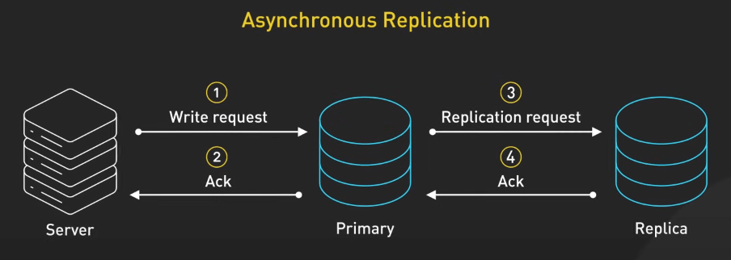{:class="centered-img"}

Trong khi Replication giúp cải thiện hiệu suất đọc và tính khả dụng, nó cũng làm tăng độ phức tạp trong việc duy trì tính nhất quán dữ liệu, đặc biệt là trong các hệ thống phân tán.

## Sharding

Sharding là một mẫu kiến trúc cơ sở dữ liệu phân tách cơ sở dữ liệu lớn thành các phần nhỏ hơn, gọi là các shards. Mỗi shard là một cơ sở dữ liệu riêng biệt chứa một tập con dữ liệu. 

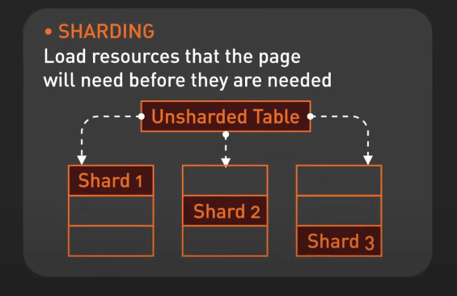{:class="centered-img"}

Ví dụ, một nền tảng mạng xã hội phổ biến như Instagram có thể shard cơ sở dữ liệu theo ID người dùng, nghĩa là dữ liệu của mỗi người dùng được lưu trữ trên một shard cụ thể.

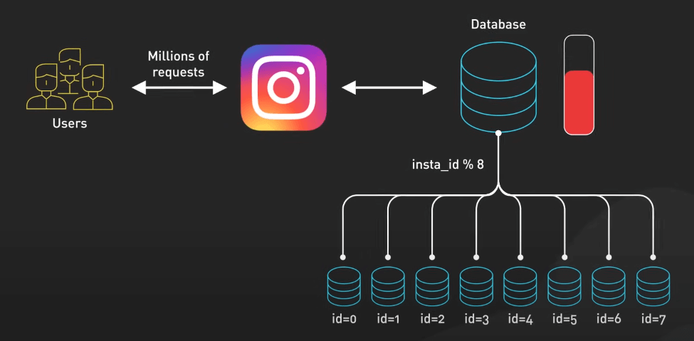{:class="centered-img"}

Sharding đặc biệt hiệu quả trong việc mở rộng cơ sở dữ liệu theo chiều ngang. Thay vì nâng cấp phần cứng của một máy chủ duy nhất, bạn có thể thêm nhiều máy chủ để phân phối tải. Tuy nhiên, sharding cũng làm tăng độ phức tạp trong thiết kế và quản lý cơ sở dữ liệu. Việc chọn khóa sharding đúng là rất quan trọng để đảm bảo phân phối dữ liệu và tải đều đặn giữa các shards.
