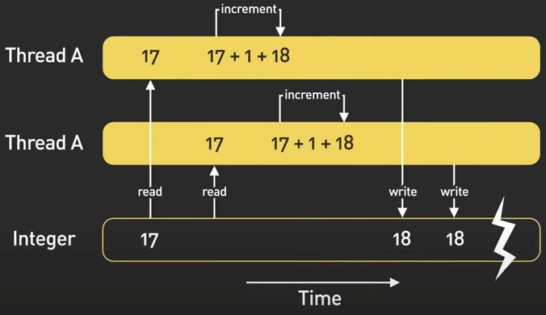
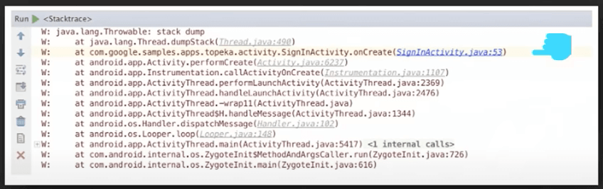
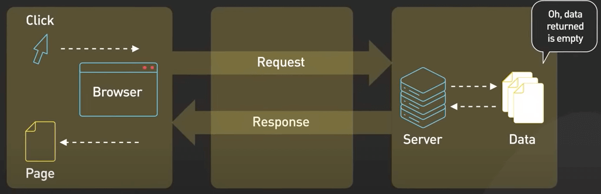

# Các kĩ thuật debug

## Nguồn

 [Debugging Like A Pro](https://www.youtube.com/watch?v=J8uAiZJMfzQ)

## Mở đầu

Bạn có bao giờ tự hỏi vì sao ở trường người ta không dạy **gỡ lỗi** (debug) hay không? Phần lớn lập trình viên học debug thông qua công việc, và chỉ có một vài thanh niên may mắn có người hướng dẫn để chỉ cho họ debug như nào cho chuẩn.

Hôm nay, ta sẽ nghiên cứu một cách tiếp cận có hệ thống cho việc debug, bạn có thể dùng nó như một checklist trong quá trình debug của chính bản thân bạn. Debug đòi hỏi kỉ luật, bạn có thể dễ dàng xao nhãng và phí phạm thời gian quý giá. Ta sẽ nghiên cứu làm sao để có trực giác tốt và những sự đánh đổi cần thiết trong việc debug. Hãy nhớ rằng, bạn có thể dùng những kĩ thuật này theo thứ tự nào cũng được, không có cách đúng hoặc sai gì để debug.

Ta bắt đầu với tầm quan trọng của việc có một tư duy đúng đắn khi debug. Nó cũng có nghĩa là sự khác nhau giữa việc đầu hàng quá sớm hoặc giải quyết vấn đề hoàn toàn. Khi gặp những lỗi khó debug, việc giữ được những tư duy như sau rất quan trọng: 

1. Nhớ rằng máy tính hoạt động theo logic, và luôn có một cách giải thích logic cho vấn đề mà bạn đang gặp phải, ngay cả khi nghe nó thật vô lý trong thời điểm bạn đánh giá.
2. Khó khăn chỉ là tạm thời, và với sự kiên nhẫn và nỗ lực, vấn đề rồi sẽ được giải quyết.
3. Biết được giới hạn của bản thân và nhận ra khi nào cần đến sự giúp đỡ từ người chuyên nghiệp hơn là điều rất quan trọng
4. Không phải lúc nào ta cũng cần nỗ lực lớn để giải quyết mọi loại bug. Ta cần sắp xếp chúng theo thứ tự ưu tiên dựa vào độ nghiêm trọng và sự ảnh hưởng đến hệ thống hoặc chương trình. Ta cần chấp nhận một thực tế rằng một số bug thực sự không đáng để ta bỏ nhiều công sức đến như thế.

{:class="centered-img"}

## Những điều cơ bản

Khi ta nhận được báo cáo lỗi từ khách hàng, ta cần phải thu thập nhiều thông tin nhất có thể. Xin ảnh chụp màn hình hoặc video mô tả lỗi từ khách hàng nếu có thể. Thêm vào đó, thu thập các bước để tái tạo lại lỗi và các log có liên quan, kể cả các error message liên quan đến lỗi. Mục tiêu là để lấy được nhiều thông tin nhất có thể để giúp chúng ta tái tạo lại lỗi.

Nếu ta có thể cô lập môi trường và hoàn cảnh nơi mà lỗi xảy ra, ta có thể thử tạo lại lỗi đó trên một server test và xem thử nó có hiện ra hay không. Có được một môi trường để tạo lại lỗi đã là đi được nửa chẳng đường.

Giờ tạo được lỗi lại rồi thì làm gì nữa. Đây là một số phương pháp để bạn cân nhắc:

Thứ nhất, dùng print một cách tự do. Chúng có thể giúp ta tạo ra được một timeline về những gì đã xảy ra và xem thử code có chạy theo thứ tự như ta print ra hay không. Với một số hệ sinh thái ngôn ngữ, setup một debugger có vẻ như khả thi hơn. Ví dụ, các hệ thống như Erlang/OTP có debugger rất mạnh, giúp ích nhiều cho lập trình viên khi gặp khó khăn. Nói chung, nếu có thể tái tạo lại lỗi, sẽ không quá khó để debug. Nó có thể mất chút thời gian và sự kiên nhẫn, nhưng nếu làm theo những phương pháp ở trên thì cuối cùng lỗi cũng sẽ được giải quyết.

Cơ mà nếu không tái tạo lại được lỗi thì sao? Khá là khó đấy. Ta cần chút may mắn cùng với rất nhiều sự kiên nhẫn. Hãy xem thử vì sao đôi khi tái tạo lỗi lại rất khó. Một số trường hợp thường gặp là:

Thứ nhất, một số lỗi chỉ phát sinh trên môi trường live.

Thứ hai, một số lỗi chỉ phát sinh trên môi trường live trong một số race condition cụ thể. 

{:class="centered-img"}

Thứ ba, một số hoàn cảnh hoặc môi trường trên thiết bị của người dùng gây phát sinh lỗi, như là khi một người dùng twitter có quá nhiều followers chẳng hạn.

Rồi làm gì nữa? Một số cách bạn có thể dùng là:

Nếu có một lỗi cụ thể nào đó, traceback code với call stack.

{:class="centered-img"}

Thu thập hết các log và xây dựng timeline bằng cách theo một request thất bại qua hết toàn bộ vòng đời của request. Nếu may mắn, ta có thể suy ra chuyện gì đã xảy ra.

{:class="centered-img"}

Sau đó, ta có thể thêm log vào code để chứng minh luận điểm trên và push lên môi trường live. Lặp lại quy trình này cho đến khi ta có thêm thông tin và cuối cùng giải quyết được lỗi. Lưu ý rằng quá trình này có thể dài và mệt mỏi, nhưng sự kiên nhẫn rất quan trọng.

Cuối cùng, ta hãy review một số phương pháp chung để cân nhắc khi ta thực sự bế tắc: 

1. Nghỉ tí đi. Đôi khi rời máy tính một lát và quay lại với tâm hồn tươi mới có thể cho bạn nhiều ý tưởng. Ngủ một giấc, tập thể dục, hay làm gì đó khác để thanh tẩy tâm trí bạn.
2. Độc thoại. Đôi khi nói ra cái vấn đề bạn đang gặp phải có thể dẫn đến một khoảnh khắc Eureka nào đó. Với một số người khác, viết vấn đề ra giấy hoặc gửi email cho một người bạn tưởng tượng có thể giúp họ có một số ý tưởng hoặc góc nhìn mới. 
3. Nhờ giúp đỡ. Đừng ngần ngại nhờ ai đó giúp bạn. Hai cái đầu thì tốt hơn một. Một góc nhìn khác bạn thường giúp bạn rất nhiều trong việc giải quyết vấn đề.

Debug có thể khó, nhưng với một tư duy và chiến lược đúng đắn, bạn có thể vượt qua mọi trở ngại. Chúc bạn thành công! 