# 5 chiến lược triển khai phần mềm phổ biến

## Nguồn

 [Top 5 Most-Used Deployment Strategies](https://www.youtube.com/watch?v=AWVTKBUnoIg)

## Big Bang Deployment

Một trong những cách triển khai sớm nhất là Big Bang Deployment. Ta sẽ đẩy tất cả các thay đổi lên production cùng một lúc. Người dùng sẽ phải trải nghiệm một chút downtime vì ta phải tắt hệ thống cũ để chuyển sang hệ thống mới, mà downtime này thường ngắn thôi, nhưng phải cẩn thận, mọi chuyện sẽ rất tệ nếu việc deploy không như ý. Hãy chuẩn bị tốt và test thật kỹ càng.

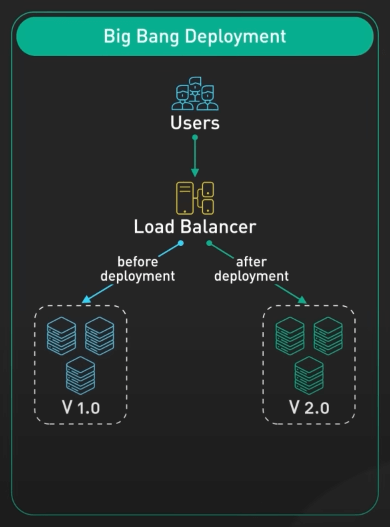{:class="centered-img"}

Nếu có vấn đề thì sao? Ta sẽ rollback về phiên bản trước. Nhưng rollback không phải lúc nào cũng mượt. Rollback vẫn có thể gây gián đoạn cho người dùng và ảnh hưởng đến dữ liệu. Ta cần có một kế hoạch rollback chắc chắn. Big Bang đôi khi là lựa chọn duy nhất, chẳng hạn khi thực hiện nâng cấp database phức tạp.

## Rolling Deployment

Tiếp theo ta có Rolling Deployment, giống như chạy marathon hơn là chạy nhanh như Big Bang. Phương pháp này cho phép ta cập nhật dần dần từng phần của hệ thống theo thời gian. Đây là cách triển khai từng bước, nơi ta triển khai phiên bản mới của ứng dụng tới môi trường production. 

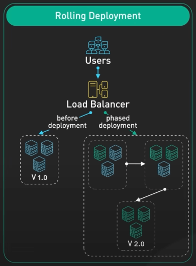{:class="centered-img"}

Ví dụ, nếu có 10 server chạy ứng dụng, khi dùng Rolling Deployment, ta sẽ tắt server đầu tiên, triển khai phiên bản mới trong server đó, bật server lên lại. Khi mọi thứ ok, ta chuyển sang server thứ hai, và cứ như vậy. Cách này cho phép phiên bản mới dần dần thay thế phiên bản cũ, từng cái server một, cho đến khi cả hệ thống được update.

Ưu điểm lớn của Rolling Deployment là thường tránh được downtime. Khi ta đang update một server, các server khác vẫn đang chạy, vẫn đang phục vụ người dùng. Một ưu điểm khác là ta có thể phát hiện và giải quyết vấn đề sớm khi đang rollout, giúp giảm nguy cơ vấn đề đó lan rộng. Ta chỉ deploy một phần nhỏ của hệ thống với phiên bản mới trong một thời điểm.

Tuy nhiên, Rolling Deployment thường chậm hơn. Và mặc dù giảm nguy cơ vấn đề hệ thống, nhưng không loại trừ hoàn toàn. Nếu cái vấn đề đó qua được hết các test khi rollout, nó vẫn có thể lan rộng khi ta update nhiều server hơn. Rolling Deployment không hỗ trợ triển khai cho từng nhóm người dùng cụ thể. Ta không thể kiểm soát được phiên bản mới sẽ đến với người dùng nào trong quá trình rollout. Tất cả người dùng sẽ dần thấy phiên bản mới khi ta update các server. Ta không thể chỉ định phiên bản mới cho người dùng dựa trên tiêu chí như vị trí, loại thiết bị, v.v. Rolling Deployment vẫn là lựa chọn phổ biến cho nhiều team. Nó cân bằng giữa rủi ro và ảnh hưởng đến người dùng một cách có trật tự.

## Blue-Green Deployment

Giờ ta đến với Blue-Green Deployment. Ta sẽ duy trì hai môi trường production giống nhau, đặt tên lần lượt là Blue và Green. Tại bất kỳ thời điểm nào, chỉ có một trong hai môi trường hoạt động, cái còn lại thì không. Môi trường hoạt động (ví dụ Blue) phục vụ phiên bản hiện tại của ứng dụng cho người dùng. Môi trường không hoạt động (ví dụ Green) là nơi ta triển khai và test phiên bản mới.

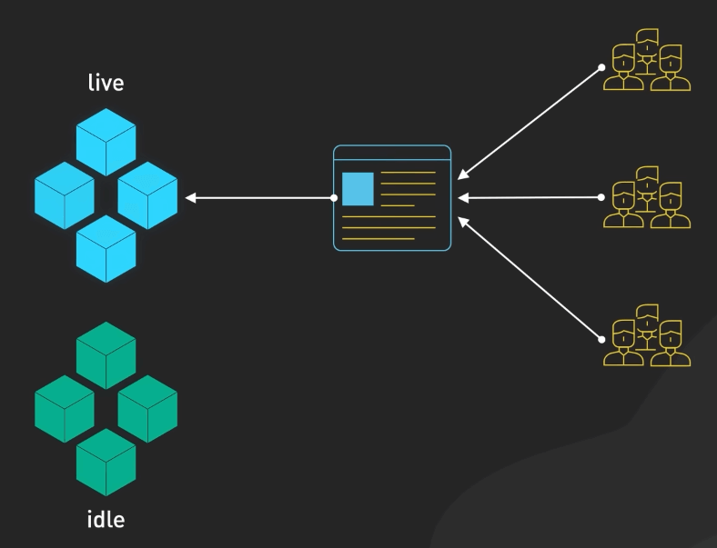{:class="centered-img"}

Cách làm có thể như sau. Khi ta có phiên bản mới, ta sẽ deploy nó lên Green. Trong khi đó, Blue vẫn đang phục vụ phiên bản hiện tại cho người dùng. 

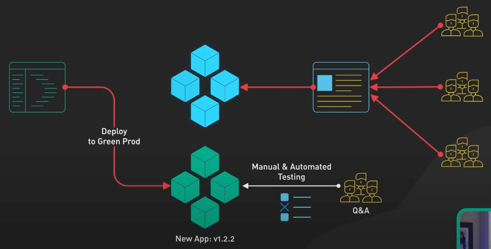{:class="centered-img"}

QA team sẽ test phiên bản mới trong môi trường Green. Điều này giúp ta phát hiện và sửa lỗi trước khi nó đến với người dùng. Khi phiên bản mới trong môi trường Green được xác định là ổn, ta chỉ cần chuyển load balancer để chuyển traffic từ Blue sang Green. Người dùng sẽ được chuyển sang phiên bản mới của ứng dụng mà không gặp downtime. Bây giờ Blue trở thành môi trường không hoạt động, là môi trường dự bị của ta. Nếu gặp vấn đề với phiên bản mới, ta có thể chuyển ngay về Blue, nơi chứa phiên bản cũ.

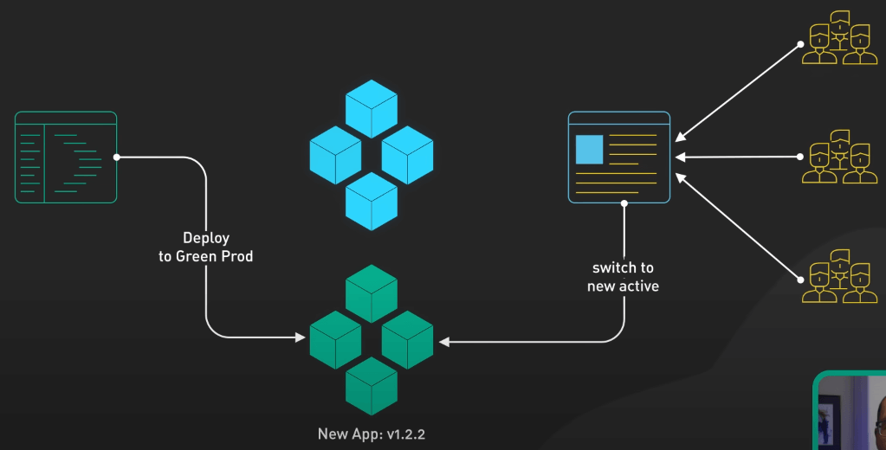{:class="centered-img"}

Mặc dù Blue-Green Deployment cho phép chuyển đổi mượt mà và rollback dễ dàng, nhưng nó cũng có nhược điểm. Giống như Rolling Deployment, ta không thể chỉ định phiên bản mới cho từng người dùng. Việc chuyển từ Blue sang Green ảnh hường đến tất cả người dùng cùng một lúc. Nó cũng tốn nhiều tài nguyên. Duy trì hai môi trường production giống nhau tăng gấp đôi cần tài nguyên và cơ sở hạ tầng. Ta có thể tắt môi trường không hoạt động giữa các lần triển khai, nhưng điều này tăng độ phức tạp. Quản lý hai môi trường production song song và đảm bảo đồng bộ dữ liệu có thể tăng đáng kể độ phức tạp của quá trình triển khai. Cần có công cụ và cơ sở hạ tầng quản lý phức tạp. Tuy nhiên, với mức độ kiểm soát cao và rủi ro ít, Blue-Green Deployment vẫn là một chiến lược phổ biến để hường đến trải nghiệm người dùng mượt mà và rollback uy tín.

## Canary Deployment

Tiếp theo là Canary Deployment, lấy cảm hứng từ việc dùng chim hoàng yến (canary) để phát hiện khí độc trong hầm mỏ. Nếu chim hoàng yến có vấn đề, thợ mỏ biết rằng cần phải sơ tán khỏi mỏ. Tương tự, trong phát triển phần mềm, ta dùng chiến lược này để "phát hiện khí độc" trước khi rollout toàn bộ.

Cách làm như sau. Thay vì triển khai phiên bản mới cho tất cả server hay người dùng, ta chọn một tập nhỏ, là mấy con canary đấy. Đó có thể là vài phần trăm server hay một nhóm người dùng, thường được chọn dựa trên một số tiêu chí gì đó. 

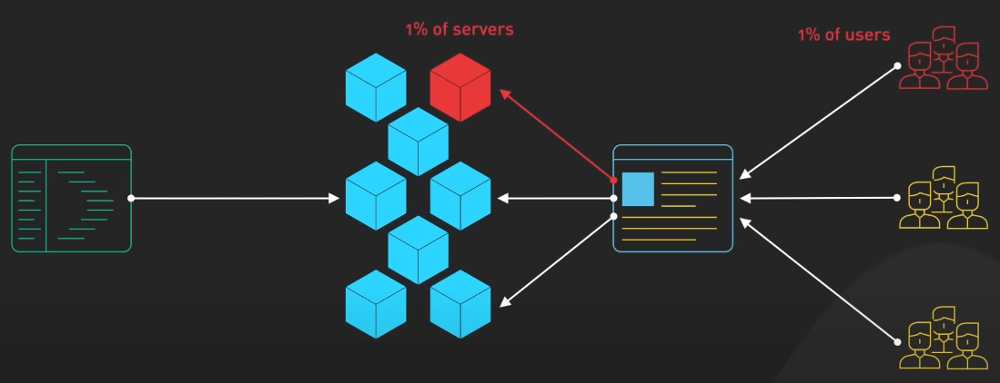{:class="centered-img"}

Ví dụ, ta bắt đầu bằng việc triển khai lên một server, hoặc một cluster nhỏ, hay thậm chí một khu vực địa lý cụ thể. Điều này cho phép ta theo dõi hiệu suất của phiên bản mới dưới điều kiện thực tế, nhưng trên quy mô nhỏ hơn. Nếu mọi thứ ổn và phiên bản mới hoạt động như ý, ta có thể dần dần triển khai nó cho toàn bộ server hay người dùng. 

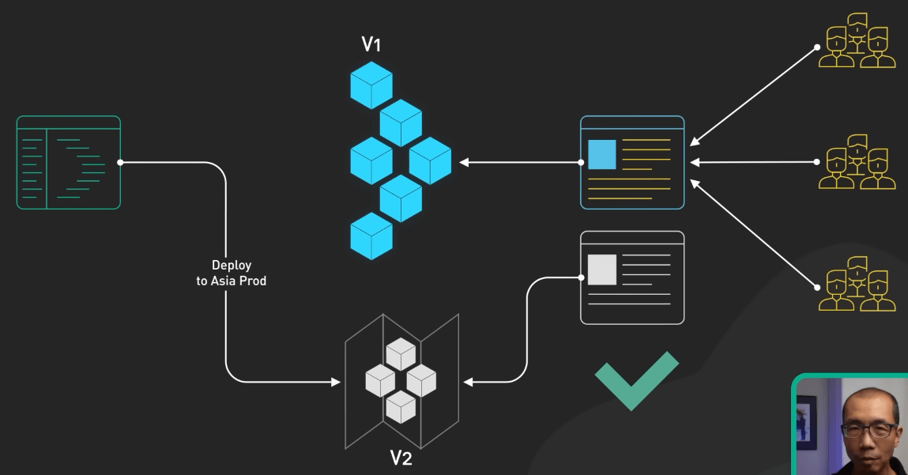{:class="centered-img"}

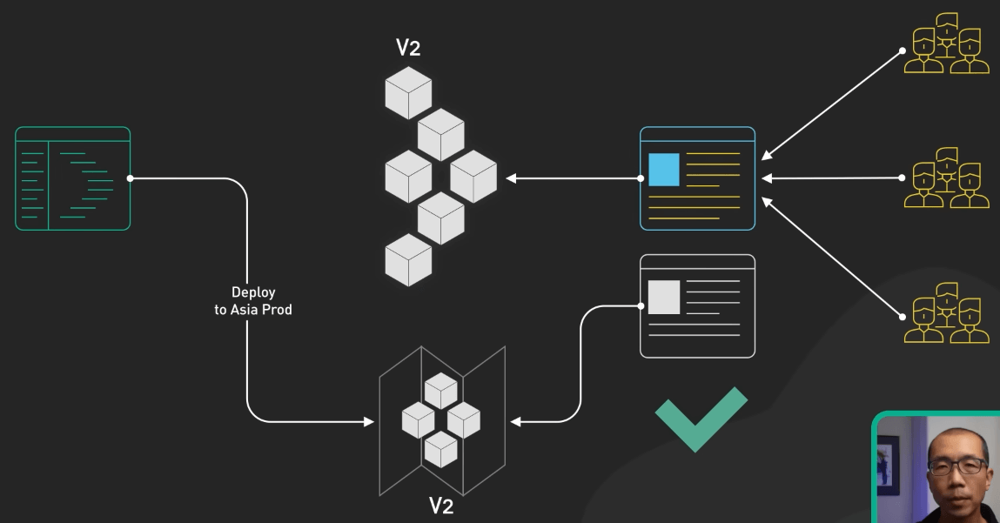{:class="centered-img"}

Nhưng nếu có vấn đề, ta có thể dừng triển khai, sửa lỗi, và thử lại, mà không ảnh hưởng đến phần lớn người dùng. Cách tiếp cận từng bước này mang lại tính an toàn và có trật tự. 

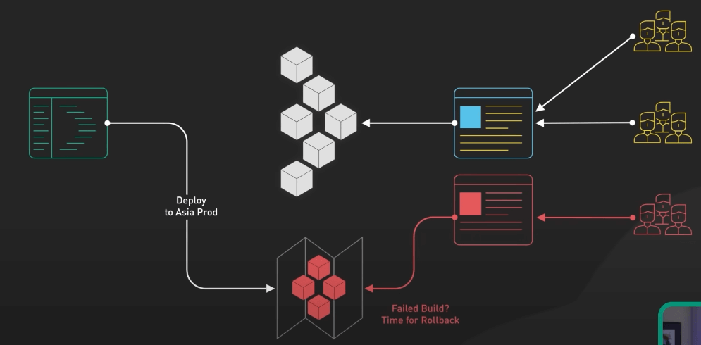{:class="centered-img"}

Canary Deployment cũng cho ta khả năng triển khai trên từng mục tiêu cụ thể. Khác với Rolling hay Blue-Green Deployment, ta có thể điều hướng các canary dựa trên một số tiêu chí nhất định, như vị trí địa lý hay loại thiết bị. Tuy nhiên, Canary Deployment cũng đến với những thách thức riêng. Nó yêu cầu theo dõi cẩn thận và test tự động cho các canary. Nó yêu cầu công cụ infra phức tạp hơn để tăng giảm hoặc dừng triển khai khi cần. Chiến lược này có thể phức tạp để triển khai và quản lý, đặc biệt khi xử lý các thay đổi schema database hay vấn đề tương thích API. Canary Deployment thường không phải là một chiến lược độc lập. Nó thường được kết hợp với Rolling Deployment để tạo ra một chiến lược kết hợp mang lại những lợi ích tốt nhất từ cả hai.

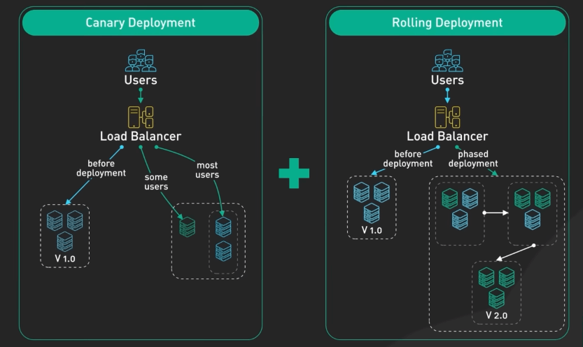{:class="centered-img"}

## Feature Toggle

Cuối cùng, ta có Feature Toggle. Thay vì triển khai một phiên bản mới của toàn bộ ứng dụng, Feature Toggle quản lý từng tính năng cụ thể trong ứng dụng đó. Ta thêm một 'toggle' hay 'switch' (công tắc) trong code cho tính năng mới, cho phép ta bật hoặc tắt tính năng cho một số người dùng hay điều kiện cụ thể. Nó giống như một cái cổng có thể đóng mở. Ta có thể kiểm soát ai thấy được tính năng mới.

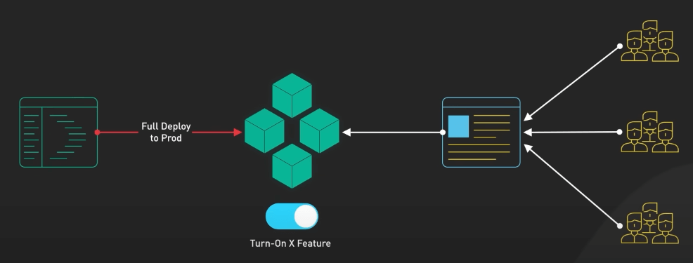{:class="centered-img"}

Feature Toggle có thể được kết hợp với bất kỳ chiến lược nào ở trên. Ví dụ ta kếp hợp với Canary đi. Ta có thể bật tính năng với những người dùng canary, cho phép họ test tính năng này, trong khi những người dùng còn lại vẫn sử dụng phiên bản cũ. Feature Toggle cung cấp khả năng kiểm soát tuyệt vời cho tính năng mới và cho phép triển khai trên từng mục tiêu. Feature Toggle rất phù hợp với A/B testing hay triển khai từng bước để xem hiệu suất. Tuy nhiên, Feature Toggle cũng có nhược điểm. Nếu không quản lý cẩn thận, toggle có thể làm phức tạp codebase và làm cho việc test khó khăn hơn. Ta cũng cần phải dọn dẹp những toggle cũ hoặc không cần thiết để tránh 'toggle debt', làm cho hệ thống ngày càng khó bảo trì.

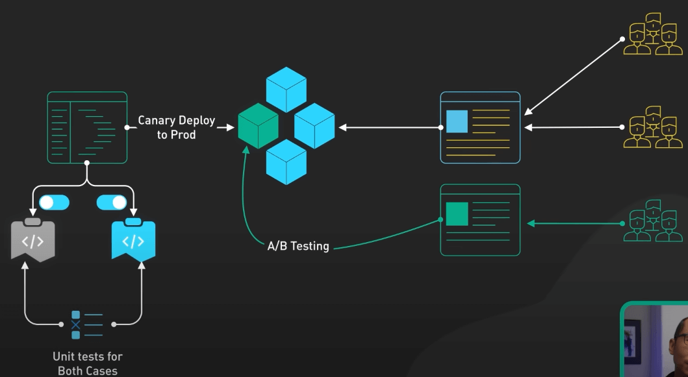{:class="centered-img"}
