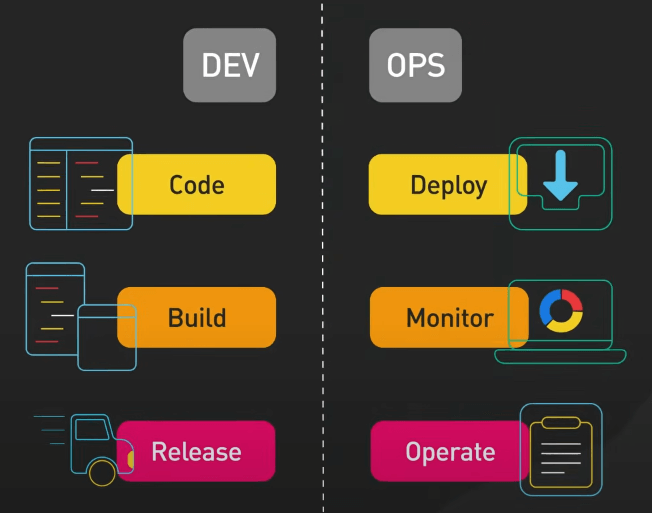
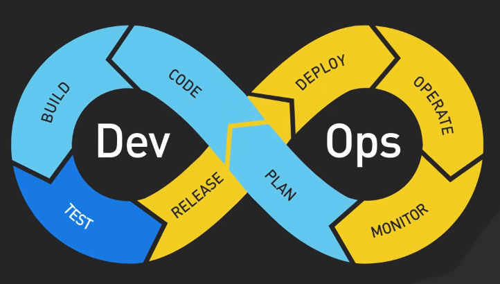
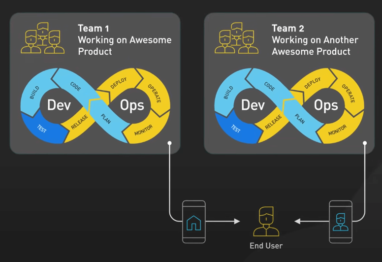
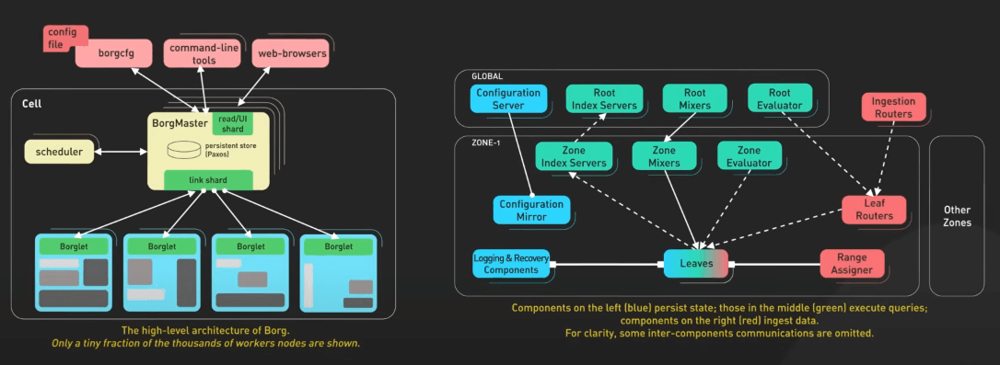
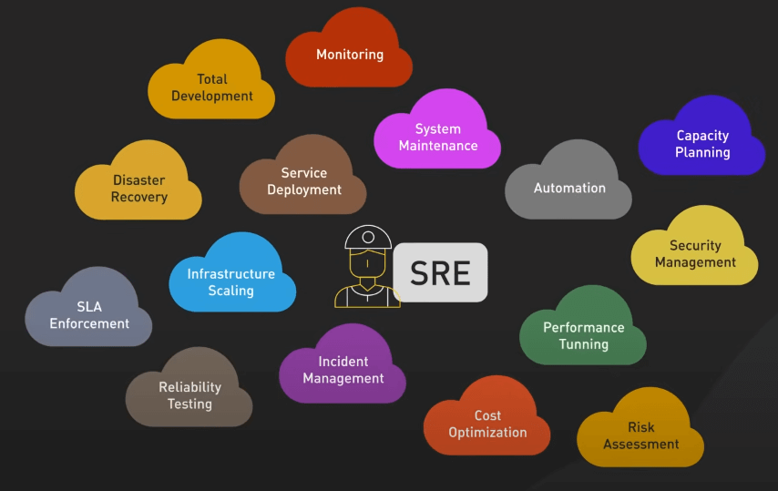

# DevOps, SRE, và Platform Engineering là gì?

## Nguồn

 [DevOps vs SRE vs Platform Engineering | Clear Big Misconceptions](https://www.youtube.com/watch?v=an8SrFtJBdM)

## DevOps

DevOps là khái niệm được ra đời vào năm 2009 bởi Patrick Debois và Andrew Shafer, với mục tiêu kết nối hai team vốn tách biệt nhau - Development và Operations.

{:class="centered-img"}

Nó tập trung vào việc xây dựng một văn hóa mà hai team này làm việc cùng nhau xuyên suốt vòng đời phát triển phần mềm, từ thiết kế đến triển khai và hỗ trợ sản xuất. 

{:class="centered-img"}

Ví dụ điển hình là nguyên tắc "You build it, you run it" của Amazon, nơi các team dev cũng chịu trách nhiệm deploy và duy trì sản phẩm. Việc này giúp đẩy nhanh quá trình cung cấp các tính năng mới đến người dùng.

{:class="centered-img"}

Nhưng ta cần phải thừa nhận rằng trong bối cảnh linh động của ngành công nghệ hiện nay, cái vai trò trong ngành thường hòa trộn và tiến hóa. Một cloud engineer tự khởi tạo máy ảo với Ansible và chạy Kubernetes có thể trông giống một chuyên gia DevOps. Tương tự, một sysadmin xây dựng công cụ và sử dụng hệ thống giám sát có thể được coi là một Site Reliability Engineer (SRE). Điều này tạo nên sự thú vị và động lực trong ngành.

## SRE

SRE, hay Site Reliability Engineering, là một ý tưởng của Google, với mục tiêu xây dựng sự tính bền bỉ cho các hệ thống lớn và phức tạp. Các SRE phát triển các công cụ và quy trình để đảm bảo phần mềm có thể chịu được áp lực của yêu cầu thực tế, như hệ thống quản lý các Borg cluster và hệ thống giám sát Monarch. 

{:class="centered-img"}

Họ không chỉ đảm bảo phần mềm hoạt động đúng cách mà còn sử dụng các phương pháp kỹ thuật phần mềm để giải quyết vấn đề vận hành. Mục tiêu của họ là tạo ra các hệ thống phần mềm có khả năng mở rộng và độ tin cậy cao.

{:class="centered-img"}

## Platform Engineering

SRE cũng có thể đảm nhiệm vai trò của một Platform Engineer, khi họ xây dựng các công cụ để đơn giản hóa quy trình cho dev. Vậy Platform Engineering là gì? 

Netflix là một ví dụ điển hình, với đội ngũ Platform Engineer phát triển một hệ thống hạ tầng mạnh mẽ, cho phép dev tạo ra phần mềm chất lượng cao một cách nhanh chóng. Họ không chỉ tập trung vào công nghệ mà còn kết nối quá trình phát triển sản phẩm với mục tiêu kinh doanh. Platform Engineering chính là mối liên kết giữa các thành phần trong phát triển và vận hành phần mềm.

## Kết luận

Mặc dù DevOps, SRE, và Platform Engineering có những vai trò khác nhau, nhưng tất cả đều chia sẻ chung một tầm nhìn: tăng cường sự hợp tác, tự động hóa và hiệu quả trong phát triển và vận hành phần mềm. Điều quan trọng không phải là bám vào các chức danh công việc cứng nhắc, mà là sự thích nghi và tiến hóa của các chuyên gia trong ngành để xây dựng một hệ sinh thái công nghệ mạnh mẽ hơn.
