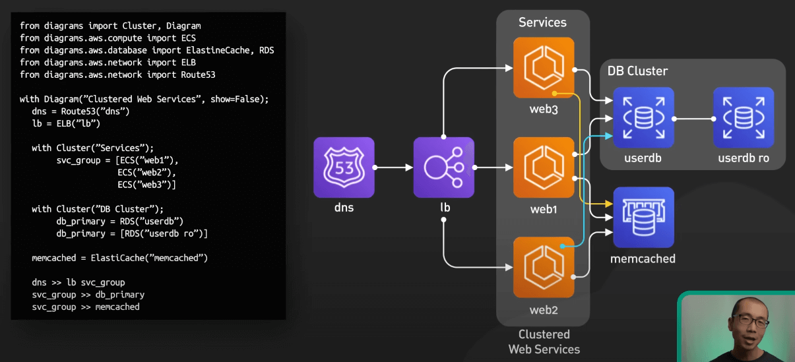
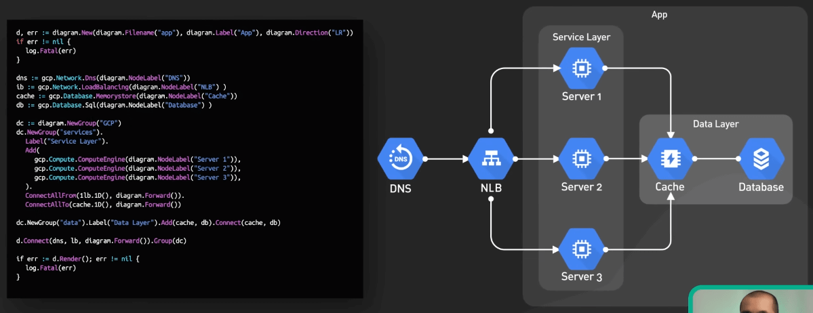
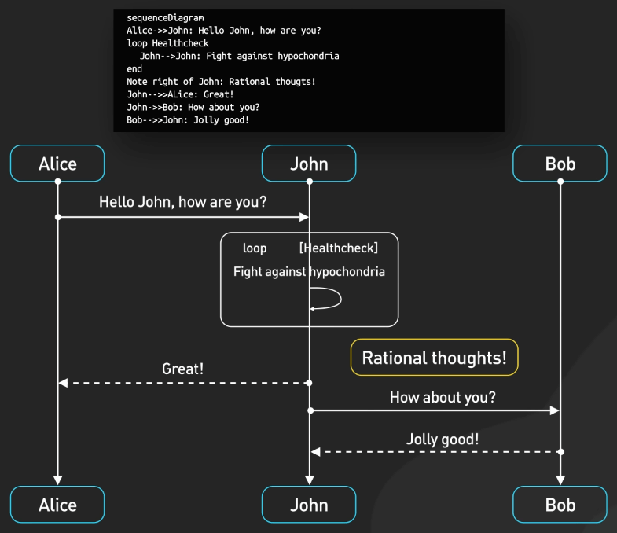
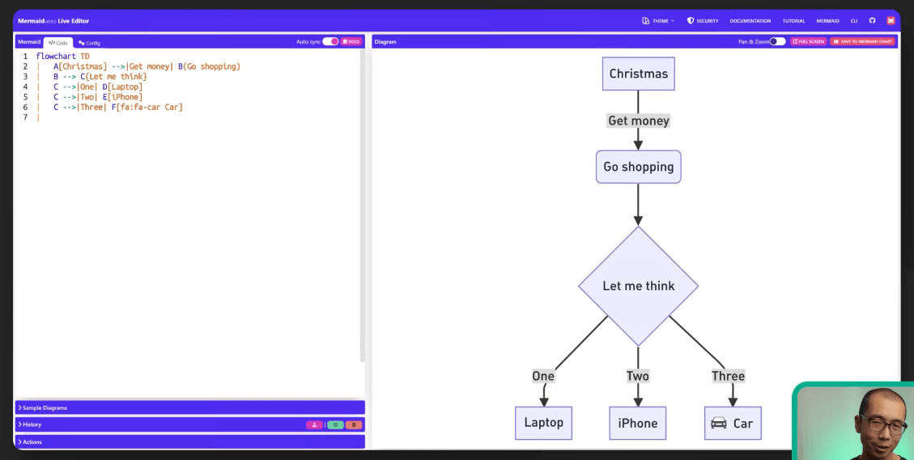
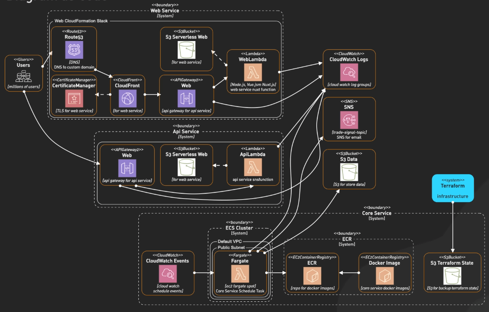
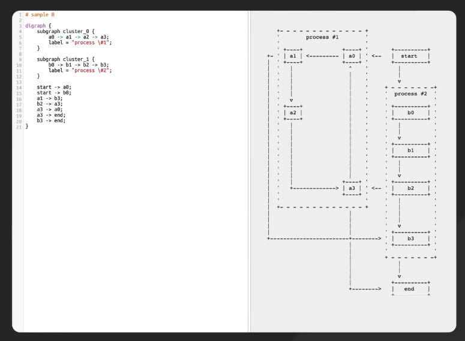
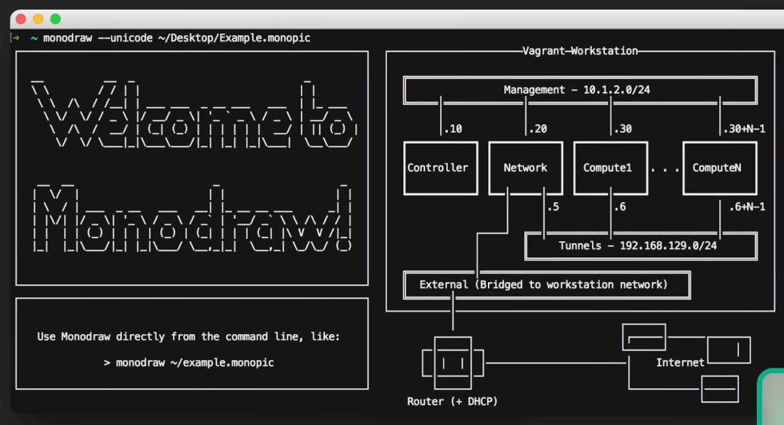
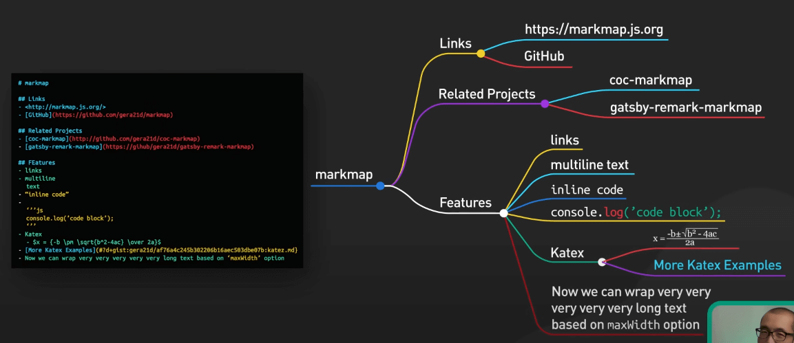

# 6 công cụ vẽ biểu đồ kiến trúc bằng code

## Nguồn

 [Top 6 Tools to Turn Code into Beautiful Diagrams](https://www.youtube.com/watch?v=jCd6XfWLZsg)

## Diagrams và Go-Diagrams

Diagrams là một thư viện Python cho phép bạn vẽ kiến trúc hệ thống cloud bằng code. Công cụ này được thiết kế để tạo nguyên mẫu nhanh chóng mà không cần các công cụ vẽ sơ đồ riêng biệt. Diagrams hỗ trợ việc theo dõi thay đổi của sơ đồ trong các hệ thống quản lý phiên bản, giúp kết nối tài liệu với việc triển khai hệ thống. Nó hỗ trợ hiển thị icon của hạ tầng của các nhà cung cấp lớn như AWS, Azure, GCP, Kubernetes, cũng như các dịch vụ SaaS và framework phổ biến.

{:class="centered-img"}

Nếu bạn thích Go thì ta có Go-Diagrams. Đây là một công cụ tương tự như phiên bản Python, nhưng cho phép bạn viết bằng Go.

{:class="centered-img"}

## Mermaid

Tiếp theo là Mermaid – một thư viện JavaScript cho phép vẽ sơ đồ bằng văn bản. Mermaid sử dụng cú pháp giống Markdown để định nghĩa sơ đồ và cung cấp công cụ chỉnh sửa trực tiếp (Mermaid Live Editor). Công cụ này giúp giảm thiểu tình trạng "doc-rot" (tài liệu bị lỗi thời nhanh chóng), vì quá trình cập nhật dễ dàng và nhanh chóng.

{:class="centered-img"}

{:class="centered-img"}

## PlantUML

Nếu bạn cần một công cụ mạnh mẽ hơn, hãy thử PlantUML. Nó cung cấp một ngôn ngữ đặc thù cho việc tạo ra nhiều loại sơ đồ khác nhau: từ sơ đồ trình tự, sơ đồ kiến trúc, tới sơ đồ mạng và biểu đồ Gantt. Mặc dù PlantUML có chút hơi khó học, nhưng tính linh hoạt của nó lại rất ấn tượng.

{:class="centered-img"}

## ASCII Diagram Editors

Một loại công cụ khác hoàn toàn là các trình chỉnh sửa sơ đồ ASCII. Những công cụ này cho phép bạn vẽ sơ đồ hoặc bằng văn bản và sau đó hiển thị chúng dưới dạng ASCII (nghệ vl), một định dạng văn bản thuần túy dễ nhúng vào bất kỳ nơi nào. Một số ví dụ điển hình là asciiflow (dựa trên web) và Monodraw (chỉ dành cho Mac).

{:class="centered-img"}

{:class="centered-img"}

## Markmap

Cuối cùng là Markmap, giúp tạo và trực quan hóa bản đồ tư duy từ các tài liệu Markdown. Công cụ này phân tích nội dung Markdown và trích xuất các cấu trúc phân cấp để hiển thị thành bản đồ tư duy. Markmap phù hợp để kết nối các ý tưởng và mối quan hệ được định nghĩa trong văn bản. Nó hỗ trợ nhiều nền tảng nhưng có thể không hoạt động tốt trên các loại bản đồ tư duy lớn hoặc phức tạp.

{:class="centered-img"}
