# Discord lưu hàng nghìn tỉ tin nhắn như thế nào?

## Nguồn

 [How Discord Stores TRILLIONS of Messages](https://www.youtube.com/watch?v=O3PwuzCvAjI)

## Lời tựa

Trong bài này, ta sẽ không chỉ nói về database migration (di chuyển dữ liệu từ database này sang database khác), mà còn nói về một task siêu to khổng lồ mà các dev của Discord đã làm được - chuyển hàng nghìn tỉ tin nhắn từ một database này sang database khác. Nếu bạn tự hỏi rằng sẽ tốn bao nhiêu công sức để di chuyển data với quy mô khó tưởng tượng ra như vậy, bạn sẽ thích bài viết này.

**Discord** gần đây đã vén bức màn về cách công ty này di chuyển hàng nghìn tỉ tin nhắn từ **Cassandra** - database chứa các cuộc trò chuyện và hội thoại của bạn, sang **ScyllaDB** - một giải pháp thay thế nhanh hơn và đáng tin cậy hơn. Bí mật này được chia sẻ lần đầu tại ScyllaDB Summit 2023 bởi Bo Ingram (video tại [đây](https://resources.scylladb.com/videos/how-discord-migrated-trillions-of-messages-from-cassandra-to-scylladb-2)), với một bài blog chi tiết tại [đây](https://discord.com/blog/how-discord-stores-trillions-of-messages). Mình sẽ tóm tắt ý tưởng cùng bài học rút ra ngay sau đây.

## Vấn đề của Cassandra

Hãy quay trở lại thời gian tầm vài năm trước. Discord lúc này đang hơi khó xử với việc chọn database. Họ đang dùng Cassandra, nhưng khi nền tảng này tiếp tục phát triển, họ phải đối mặt với các vấn đề nghiêm trọng về hiệu suất. Việc duy trì cluster Cassandra chính (nơi lưu trữ tin nhắn) mất rất nhiều công sức. Độ trễ khó đoán và các sự cố thường xuyên xảy ra khi on-call gây nên căng thẳng rất lớn cho team.

Đến năm 2022, cluster Cassandra chứa hàng nghìn tỉ tin nhắn trên **177 node**. Họ hiểu rằng họ cần một sự khác biệt, nhưng cluster tin nhắn này rất quan trọng với Discord. Nếu cluster này chậm, Discord cũng sẽ chậm. Nếu cluster ngừng hoạt động, Discord cũng chết luôn.

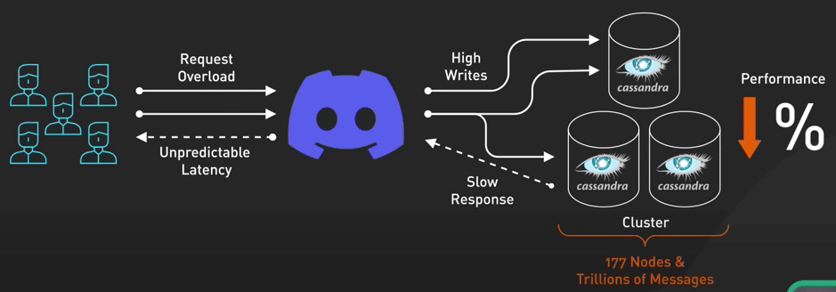{:class="centered-img"}

## ScyllaDB và quá trình di chuyển

Giải pháp là gì? ScyllaDB, một database tương thích với Cassandra, nhưng với một engine dựa trên C++ mạnh mẽ hơn.

### Các giai đoạn trong quá trình di chuyển

Thay vì lao vào giải quyết vấn đề rủi ro nhất và lớn nhất, **họ bắt đầu di chuyển với các database nhỏ hơn**. Và đây chính là bài học đầu tiên. Ở Discord, dev sẽ hành động nhanh chóng khi sai lầm có thể khắc phục được, nhưng nếu giải pháp không thể đảo ngược khi có vấn đề, họ sẽ dành thêm thời gian để nghiên cứu làm sao cho đúng. Họ di chuyển những database nhỏ để **kiểm tra và giải quyết nhiều vấn đề nhất có thể** trước khi di chuyển con quái vật nghìn tỉ tin nhắn.

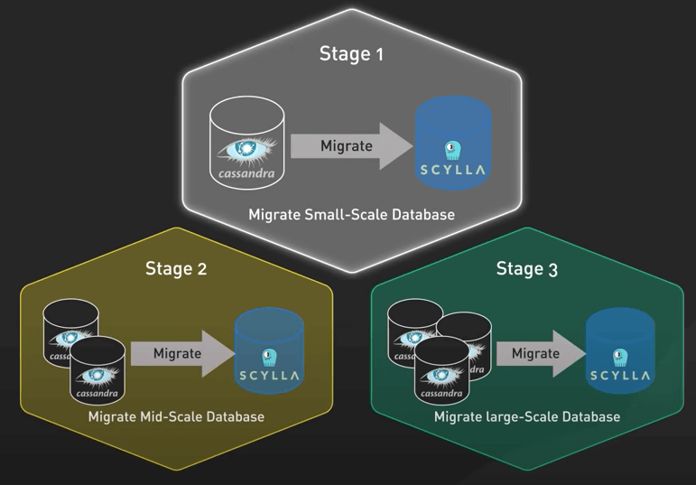{:class="centered-img"}

Nói thêm một chút về ScyllaDB. Nó được viết bằng C++ và hứa hẹn hiệu suất tốt hơn, sửa chữa nhanh hơn, và quan trọng nhất là **không có garbage collection**. Với một team có quá nhiều vấn đề với garbage collector của Cassandra, đây thực sự là một luồng gió mới. 

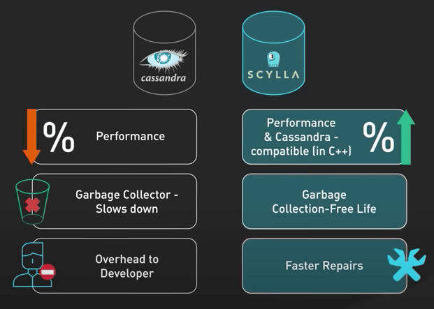{:class="centered-img"}

### Data service

Bước quan trọng tiếp theo là tạo một lớp trung gian giữa khối API và các cluster database được gọi là các **data service**. Lớp này được viết bằng **Rust**, một ngôn ngữ an toàn và có hiệu suất cao.

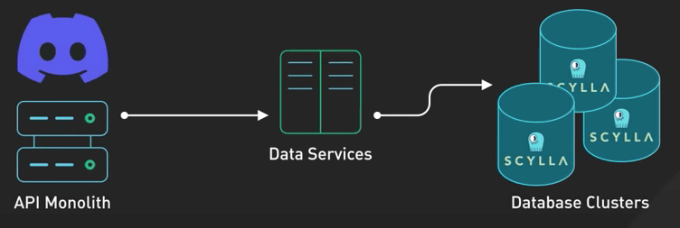{:class="centered-img"}

Ý tưởng cực hay về lớp data service này là thứ được gọi là **request coalescing** (hợp nhất request). Nếu nhiều người dùng cùng request một dữ liệu, database chỉ cần được truy vấn một lần duy nhất.

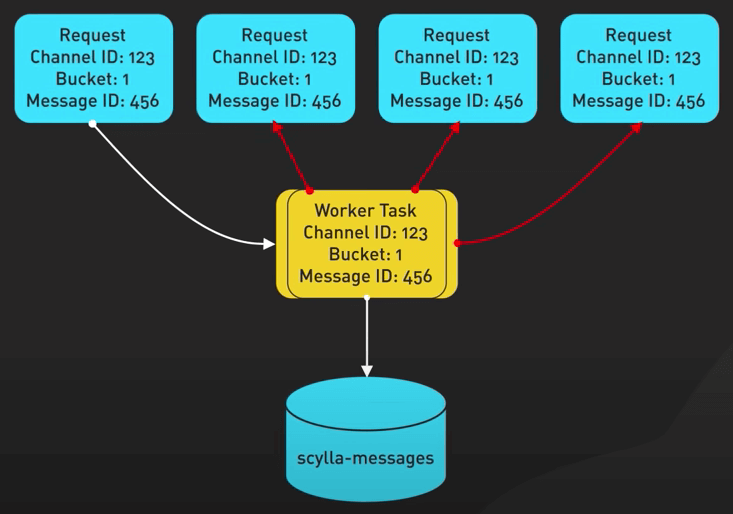{:class="centered-img"}

Điều này làm giảm khả năng tạo ra các hot partition (là các partition bị truy cập quá nhiều, đặc biệt trong giờ cao điểm). Hãy tưởng tượng tất cả những tin nhắn `@everyone` ngoài ý muốn đó trong các server Discord cực to đi. Với lớp này ở giữa, sẽ không có vấn đề gì đối với database. 

### Super-Disk

Sau đó, họ đưa ra khái niệm về Super-Disk. Các cluster database chạy trên Google Cloud. Khi gặp các vấn đề về độ trễ trên đĩa cứng, họ không thể dựa vào ổ SSD NVMe cục bộ trên máy ảo để lưu trữ dữ liệu quan trọng do các vấn đề về độ tin cậy và độ bền. 

Giải pháp thay thế là các **Persistent Disk** của Google Cloud. Mặc dù nó đáng tin cậy và linh hoạt, nó có một nhược diểm là độ trễ cao hơn do chúng được gắn thông qua mạng thay vì được gán trực tiếp.

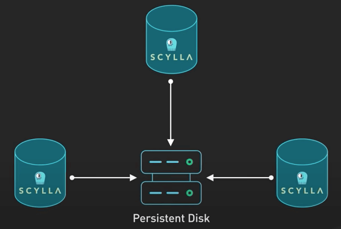{:class="centered-img"}

Vậy Discord đã làm gì? Họ quay lại bản vẽ và tập trung tạo ra một giải pháp phù hợp với nhu cầu cụ thể của họ. Họ chọn ưu tiên các lần đọc đĩa có độ trễ thấp, ưu tiên hơn tất cả các chỉ số khác của đĩa cứng, trong khi vẫn duy trì bảo đảm thời gian hoạt động của database hiện có. Họ đã nghĩ ra một Super-Disk kết hợp những gì tốt nhất của các SSD cục bộ và các Persistent Disk ở cấp độ phần mềm. 

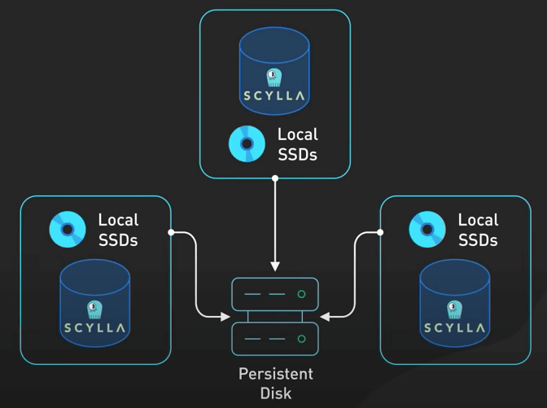{:class="centered-img"}

Super-Disk này là một giải pháp RAID hai lớp. Họ dùng RAID0 để kết hợp nhiều SSD cục bộ thành một đĩa ảo có độ trễ thấp, và sau đó RAID1 để mirror RAID0 này vào Persistent Disk. Sau đó, họ cấu hình linux kernel để chuyển hướng ghi vào Persistent Disk để đảm bảo độ bền cao, và hướng đọc vào SSD cục bộ để có độ trễ thấp. Thiết lập này đảm bào khả năng đọc có độ trễ thấp từ SSD cục bộ và độ bền ghi từ Persistent Disk.

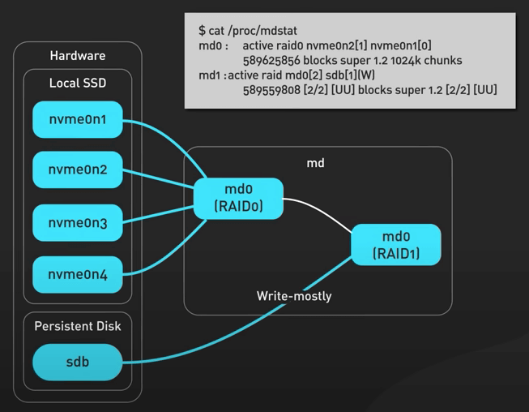{:class="centered-img"}

**Cái này thì có gì mà hay?** Đây chính là một ví dụ tuyệt vời về giải quyết vấn đề từ những nguyên tắc đầu tiên. Discord đang xử lý một vấn đề không có sẵn giải pháp. Thay vì cố gắng làm với những gì có sẵn, họ xác định lại vấn đề dựa trên nhu cầu cụ thể và sau đó xây dựng một giải pháp phù hợp.

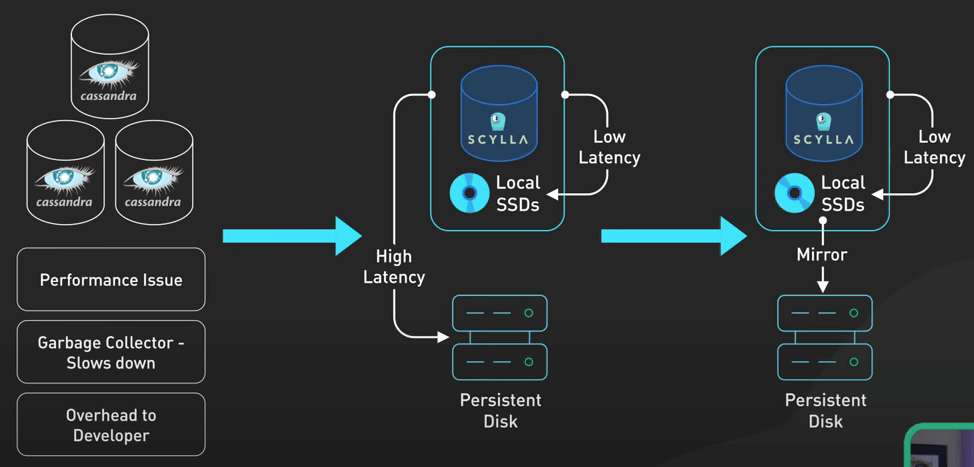{:class="centered-img"}

Super-Disk hoạt động thực sự rất tốt. Ở mức tải cao nhất, các database không còn dồn các thao tác trên đĩa thành đống nữa, và không có thay đổi nào về độ trễ khi truy vấn. 

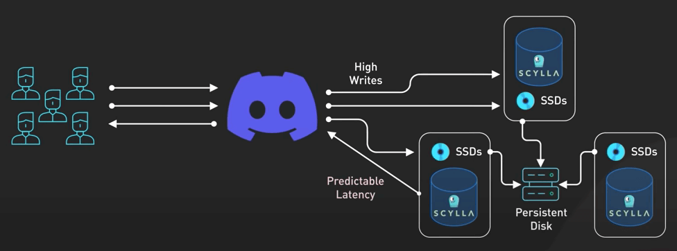{:class="centered-img"}

Cuối cùng, với tất cả việc chuẩn bị hoàn tất, đã đến lúc di chuyển database lớn nhất - con quái vật "cluster tin nhắn".

Với hàng nghìn tỉ tin nhắn và gần 200 node, đây là một nhiệm vụ khó khăn. Nhưng với một trình chuyển dữ liệu viết bằng Rust và một số chiến lược thông minh, họ đã làm xong trong chỉ 9 ngày. Đúng, bạn không nhầm đâu, họ di chuyển hàng nghìn tỉ tin nhắn mà không có downtime trong vòng chưa đến hai tuần! Và phần thưởng là gì? Một hệ thống nhẹ nhàng và hiệu quả hơn rất nhiều. Từ 177 node Cassandra, qua ScyllaDB chỉ còn **72 node**. Nó cải thiện đáng kể độ trễ và chất lượng cuộc sống của các dev on-call. 

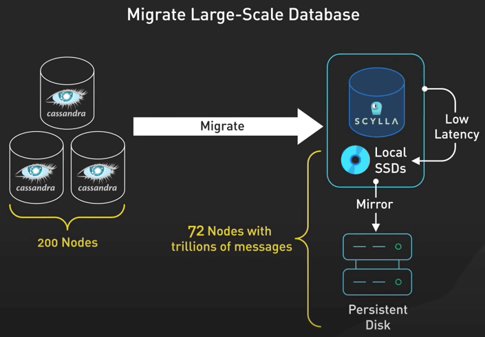{:class="centered-img"}

Đó không phải là một task bình thường, nhưng với các giải pháp sáng tạo và giảm thiểu rủi ro một cách thông minh, họ đã hoàn tất nó một cách tuyệt vời. Di chuyển database trên môi trường live không phải là trò đùa, và làm ở quy mô lớn như thế này, thực sự rất khó đấy.
