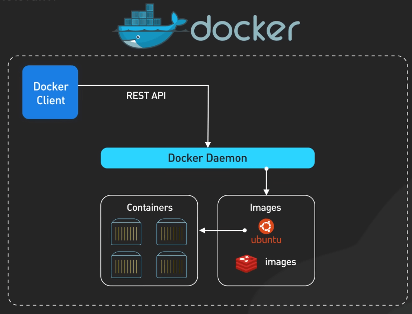
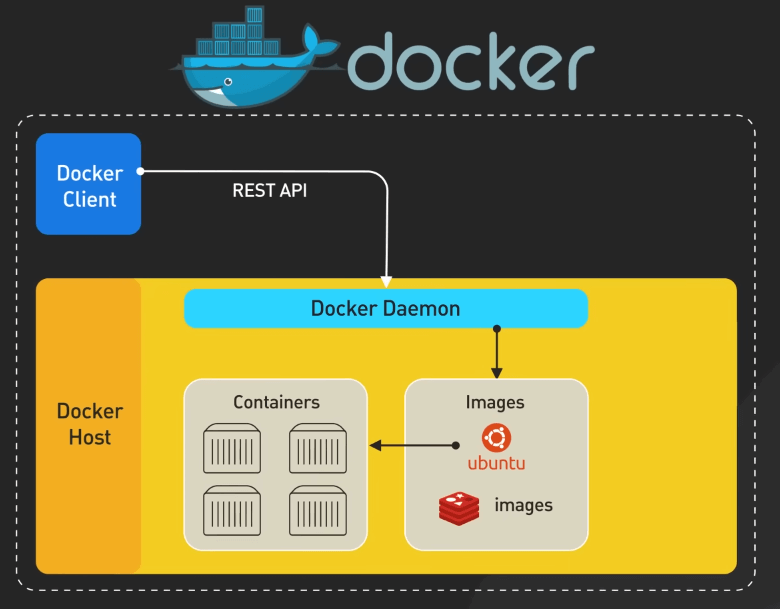
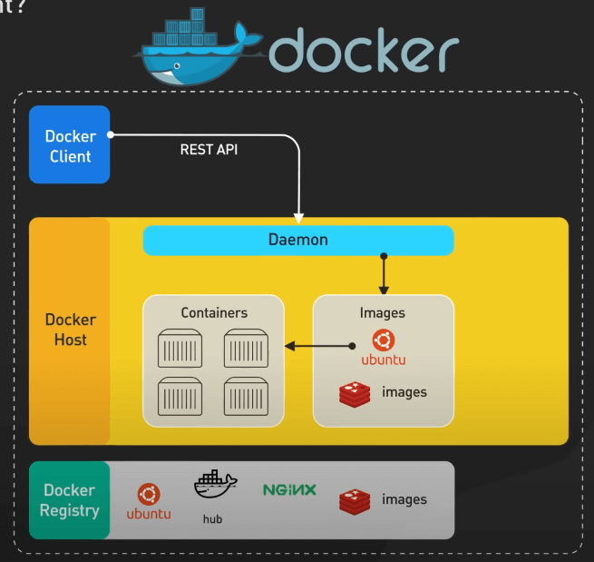
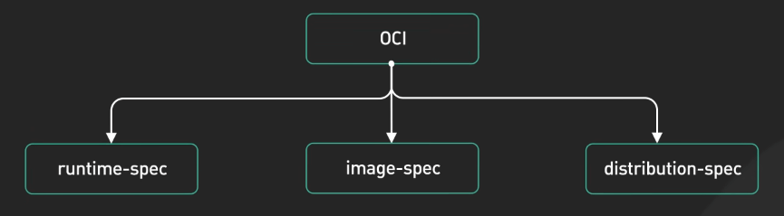
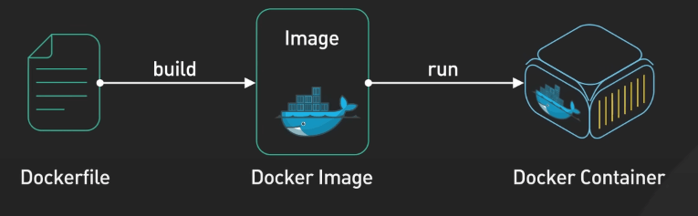
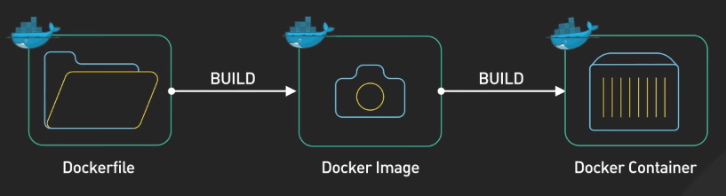
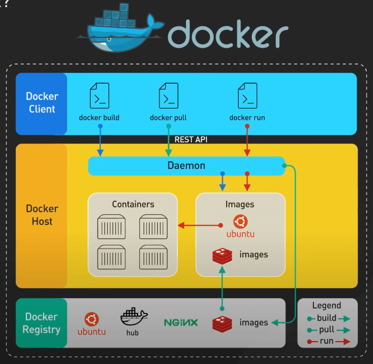
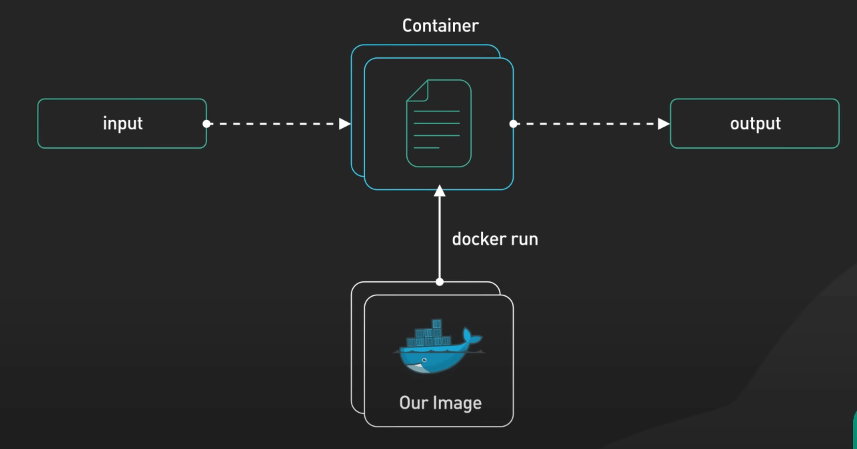
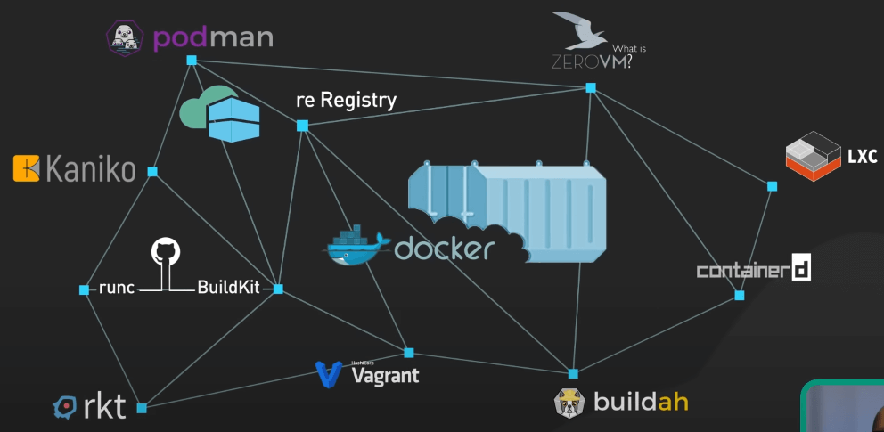

# Docker có còn cần thiết không?

## Nguồn

 [Is Docker Still Relevant?](https://www.youtube.com/watch?v=Cs2j-Rjqg94)

## Giới thiệu

Docker đã bùng nổ trong vòng 10 năm trở lại đây và mang lại cho chúng ta các container rất tiện dụng để phát triển phần mềm. Nhưng có một số ý kiến cho rằng sự phổ biến của Docker có thể dẫn đến sự xuống dốc của chính nó. Ta sẽ cùng tìm hiểu xem Docker có còn cần thiết không, hay nó đang trở nên lỗi thời.

## Docker làm được gì?

Docker gồm 3 thành phần chính.

Thứ nhất, Docker Client là giao diện chính để tương tác với Docker. Nó giao tiếp với Docker Daemon để quản lý nhiều đối tượng Docker, bao gồm các Image và các Container.

{:class="centered-img"}

Thứ hai, Docker Daemon, đây là thành phần cốt lõi của Docker, quản lý các thao tác trên container. Nó nằm trong hệ thống chạy Docker, còn được biết đến với tên là Docker Host. Docker Daemon còn có thể tận dụng các OCI Compliant Runtimes như containerd hay CRI-O để chạy container.

{:class="centered-img"}

Thứ ba là Docker Registry. Registry được sử dụng nhiều nhất là Docker Hub, nơi lưu trữ và phân phối các Image

{:class="centered-img"}

## Open Container Initiative (OCI)

Open Container Initiative (OCI) là một sáng kiến mở, chuyên về việc tạo ra các tiêu chuẩn cho container. OCI chuẩn hóa container runtime, image và các chỉ định phân phối container, giúp cho hệ sinh thái container giữ được tính mở và không phụ thuộc vào bất kỳ nhà phân phối cụ thể nào.

{:class="centered-img"}

## Các lệnh Docker cơ bản

- `docker pull`: Image sẽ được tải về từ Registry
- `docker build`: Dùng một Dockerfile để build thành một Image, tuân thủ chuẩn OCI, qua đó tương thích với nhiều runtime khác nhau.
- `docker run`: Tạo container từ một Image và được quản lý bởi Docker Daemon. Ở đây containerd và CRI-O có thể được dùng để chạy container, cảm ơn OCI nhiều nha.

{:class="centered-img"}

## Các concept khởi đầu từ Docker

1. Chuẩn Image
2. Hợp lý hóa việc build image thành container
3. Cho phép chia sẻ và phân phối image thông qua Registry
4. Tạo điều kiện cho việc chạy container trên nhiều môi trường khác nhau

{:class="centered-img"}

{:class="centered-img"}

{:class="centered-img"}

## Bạn Docker có còn ổn không?

Docker được phát triển dựa trên công nghệ độc quyền nhưng giờ đây đã trở thành một chuẩn mở, như OCI, mở đường cho nhiều client, runtime và registry khác nhau. Những chuẩn mực và hệ sinh thái mà Docker tạo ra đã làm cho Docker engine trở nên ít quan trọng hơn. Tính độc nhất của Docker giờ đây bị nghi ngờ khá nhiều. Người dùng hiện nay có khá nhiều lựa chọn để sử dụng, con cá voi Docker có thể không chết nhưng thực sự nếu không có những cải tiến khác với các đối thủ, Docker có thể lâm nguy.

{:class="centered-img"}
