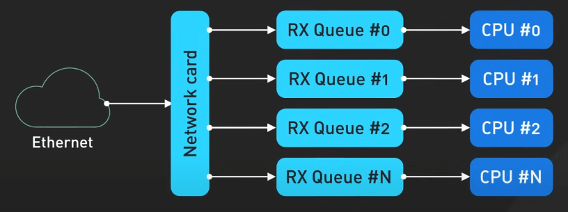
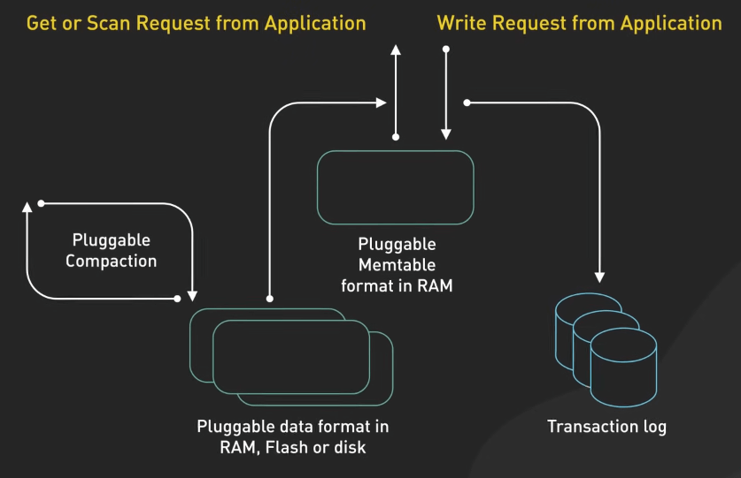
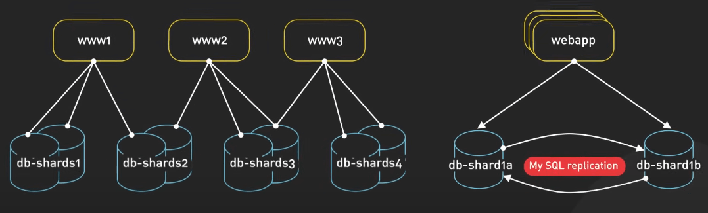
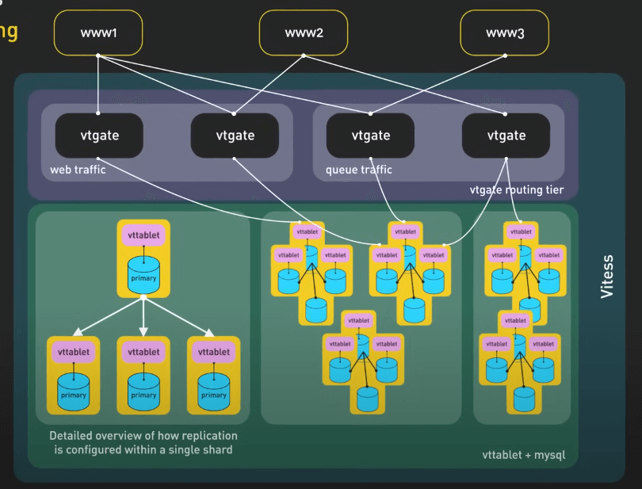
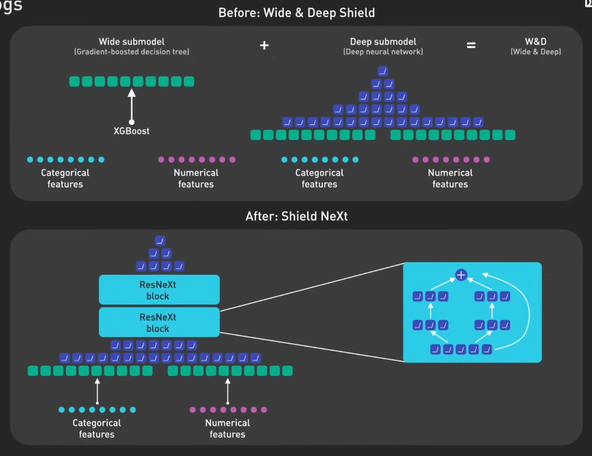

# Bạn nên theo dõi các Engineering Blogs nào?

## Nguồn

 [Top 9 Must-Read Blogs for Engineers](https://www.youtube.com/watch?v=UuT61kf292A)

## Netflix TechBlog

Netflix được biết đến với việc sử dụng rất nhiều cloud computing. Engineering Blog của họ trải dài trên nhiều chủ đề từ microservice đến data pipeline.

Series nổi tiếng nhất của Netflix là về công cụ Chaos Monkey. Chaos Monkey là một phần trong tập các công cụ của Netflix, được thiết kế để kiểm tra và cải thiện tính đàn hồi (resilience) của hạ tầng đám mây Netflix. Nó hoạt động bằng cách tắt một số máy chủ ngẫu nhiên trên môi trường live để đảm bảo rằng hệ thống có thể chịu được sự cố mà không ảnh hưởng đến người dùng. Các bài viết trên Chaos Monkey series cho thấy sự đảm bảo của Netflix để duy trì hệ thống có độ đàn hồi tốt, thông qua một loạt các kiểm tra và sửa lỗi trên hạ tầng.

## Uber Blog

Uber đã tạo ra cuộc cách mạng trong việc vận chuyển và Engineering Blog của họ cho ta thấy cách họ thực hiện điều đó. 

Uber sử dụng AI và Machine Learning để giải quyết một số vấn đề như dự đoán nhu cầu vận chuyển và đặt giá tự động. Uber sử dụng Machine Learning để tối ưu hệ thống đặt xe thời gian thực, ghép cặp tài xế và hành khách một cách hiệu quả. Uber cho ta thấy cách các công nghệ đột phá nhất hiện nay có thể giải quyết các bài toán trong thực tế và chuyển đổi ngành công nghiệp rõ rệt như thế này với AI và Machine Learning.

## Cloudflare Blog

Cloudflare là doanh nghiệp đi đầu trong việc cung cấp dịch vụ CDN và dịch vụ chống DDoS trên thế giới. Engineering Blog của họ cung cấp cái nhìn sâu rộng về cách giúp cho website của bạn chạy nhanh và an toàn. Khá khó để chọn ra một bài viết tiêu biểu trên này vì độ sâu và độ rộng về kiến thức của mỗi bài đều rất hay. Ví dụ, Cloudflare có một bài về cách nhận cả triệu gói tin trong một giây, đi sâu vào việc xử lý số lượng gói tin lớn trong hệ thống Linux. Nó sử dụng multi-queue NICs để phân phối tải cho các lỗi CPU, giúp giải thích cách NICs hoạt động một cách rõ ràng.

{:class="centered-img"}

## Engineering at Meta

Meta sở hữu một trong những mạng xã hội lớn nhất hành tinh - Facebook, cho nên họ cũng gặp những thách thức kỹ thuật vô cùng khó khăn. Engineering Blog của Meta trải dài trên nhiều chủ đề như làm sao để scale database hay dùng AI để phát hiện tin giả. Một series bài trên này nói về RocksDB, một hệ thống key-value store được thiết kế để lưu trữ nhanh. Kiến trúc của RocksDB cho phép tùy chỉnh và tối ưu, cho phép họ xử lý hàng Petabyte dữ liệu và tăng cường xử lý cho các sản phẩm của Meta với lượng người dùng khổng lồ. Bài viết đó còn nhấn mạnh tính thích ứng cao của RocksDB như cài đặt thời gian hết hạn với compaction filter, giúp Meta xử lý các vấn đề độc đáo và nâng cao quy mô hạ tầng một cách hiệu quả.

{:class="centered-img"}

## LinkedIn Engineering

LinkedIn là nền tảng việc làm trực tuyến lớn nhất thế giới. Engineering Blog của họ cho chúng ta thấy một phần đằng sau nền tảng này, từ cách nó được xây dựng đến cách mở rộng quy mô. Bài viết đáng chú ý nhất trên đây là về sự hình thành của Kafka, thảo luận về vai trò quan trọng của log trong các hệ thống dữ liệu phân tán và các kiến trúc ứng dụng thời gian thực. Log là nền tảng kiến thức để hiểu được rất nhiều hệ thống phần mềm như database, NoSQL, cơ chế replication và hệ thống kiểm soát phiên bản (VCS).

## Discord Blog

Discord là chat app cho game thủ, nhưng Engineering Blog của họ rất có ích cho những người muốn tìm hiểu về thiết kế hệ thống. Họ có một series bài về cách họ dùng Elixir để tạo ra hệ thống có nhiều người dùng đồng thời. Discord tận dụng VM của Erlang để xử lý hàng triệu event mỗi giây, giúp hỗ trợ hàng triệu người dùng đồng thời điểm. Tuy nhiên, việc mở rộng quy mô cũng tạo ra nhiều vấn đề mới, các bài viết này cho thấy các bài học giá trị và các thư viện được tạo ra để giải quyết các vấn đề này.

## AWS Architecture

Với những người dùng AWS, AWS Architecture là một địa chỉ đáng tin cậy để tìm hiểu các kiến thức về nền tảng này. AWS là nhà cung cấp dịch vụ đám mây lớn nhất thế giới và Engineering Blog của họ tràn ngập các case study và best practice với AWS.

Ví dụ, series Let's Architect tập trung vào best practice trên kiến trúc đám mây và các pattern khác nhau có thể được triển khai với AWS. Series này bao gồm các case study, hướng dẫn và khám phá chi tiết về kỹ thuật để giúp người đọc hiểu rõ hơn về cách xây dựng hệ thống trên AWS.

## Slack Engineering

Slack là ứng dụng chat cho các doanh nghiệp, Engineering Blog của Slack cung cấp cái nhìn về cách Slack xây dựng và mở rộng nền tảng của mình để xử lý lượng dữ liệu và người dùng lớn.

Một bài viết tiêu biểu trên Slack Engineering nói về cách Slack dùng Vitess, một công cụ được xây dựng trên MySQL, để giúp horizontal scale dễ dàng hơn và quản lý việc sharding. Hệ thống Slack rất lớn, yêu cầu các chiến lược tối ưu như lưu trữ các message cũ hoặc xây dựng hệ thống replication để đảm bảo dữ liệu an toàn nếu xảy ra sự cố.

{:class="centered-img"}

{:class="centered-img"}  

## Stripe Blog

Stripe là công ty chuyên về xử lý thanh toán, và Engineering Blog của họ cung cấp ý tưởng xây dựng các hệ thống tài chính an toàn và uy tín. Một bài viết tiêu biểu của Stripe nói về cách họ dùng Machine Learning để phát hiện gian lận trong giao dịch thanh toán trong thời gian thực, dựa vào Stripe Radar. Stripe Radar phân tích rủi ro giao dịch gian lận trong ít hơn 100 mili giây. Bài viết cũng nói về cách Radar phát triển trong 7 năm trở lại đây, với các cải thiện vào phần kiến trúc Machine Learning và việc sử dụng dữ liệu từ Stripe Network để cải thiện chất lượng dự đoán.

{:class="centered-img"}
