# AI tạo sinh là gì?

## Nguồn

 [Introduction to Generative AI](https://www.youtube.com/watch?v=2p5OHDxR2l8)

## Các thuật ngữ AI

AI, hay Artificial Intelligence (Trí tuệ nhân tạo), đề cập đến việc phát triển các hệ thống máy tính có thể thực hiện các nhiệm vụ mà thường cần trí tuệ của con người. AI là một lĩnh vực như vật lý, bao gồm nhiều phân ngành như machine learning, natural language processing, computer vision và nhiều hơn nữa.

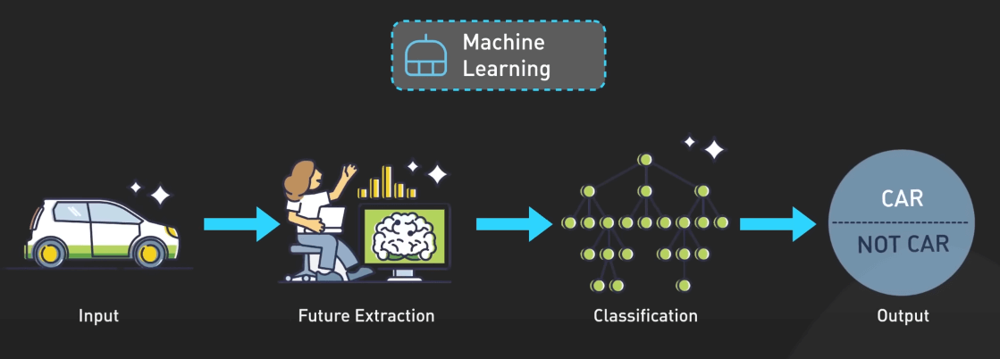{:class="centered-img"}

Machine Learning, hay học máy, là một phần của AI tập trung vào việc cho phép máy tính học và cải thiện từ dữ liệu mà không cần được lập trình một cách rõ ràng. Nó bao gồm việc huấn luyện các mô hình trên dữ liệu để nhận biết các pattern, đưa ra dự đoán và thực hiện hành động.

Deep Learning, hay học sâu, sử dụng mạng nơ-ron nhân tạo và là một phần của machine learning.

NLP, hay Natural Language Processing (xử lý ngôn ngữ tự nhiên), là một phần của AI tập trung vào việc cho phép máy tính hiểu, diễn giải và tạo ra ngôn ngữ con người. Nó bao gồm các nhiệm vụ như phân loại văn bản, phân tích cảm xúc, dịch máy và tạo ra văn bản.

Các model của Deep Learning, đặc biệt là các model Transformer, đã làm thay đổi NLP trong những năm gần đây. Nói về các model Transformer, chúng là một loại kiến trúc mô hình Deep Learning được giới thiệu trong bài báo nổi tiếng "Attention is All You Need" vào năm 2017. Chúng dựa vào cơ chế tự chú ý để xử lý và tạo ra dữ liệu tuần tự như văn bản. Transformer đã trở thành nền tảng cho nhiều mô hình NLP như BERT, GPT và T5. Chúng cũng đã được điều chỉnh cho các lĩnh vực khác như thị giác máy tính (computer vision) và xử lý âm thanh.

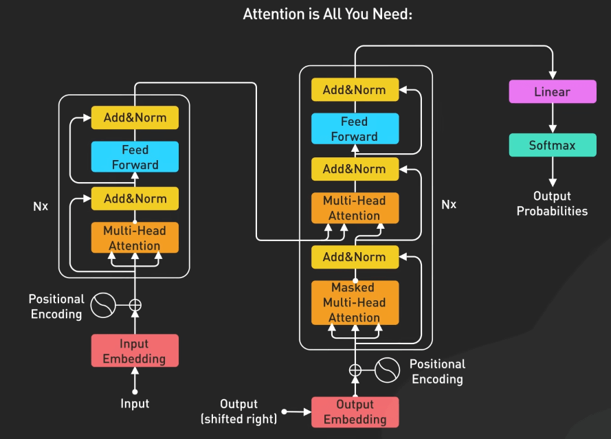{:class="centered-img"}

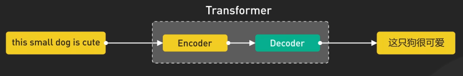{:class="centered-img"}

Giờ ta hãy nói về GenAI nhé. GenAI là viết tắt của Generative Artificial Intelligence (trí tuệ nhân tạo tạo sinh, hay AI tạo sinh), đề cập đến các hệ thống AI có thể tạo ra nội dung mới như văn bản, hình ảnh và âm nhạc. Nó là một phần của Deep Learning. Các model GenAI có thể tạo ra output mới giống với dữ liệu huấn luyện mà chúng sử dụng. Chúng sử dụng các mô hình Deep Learning để học các pattern và biểu diễn từ dữ liệu hiện có.

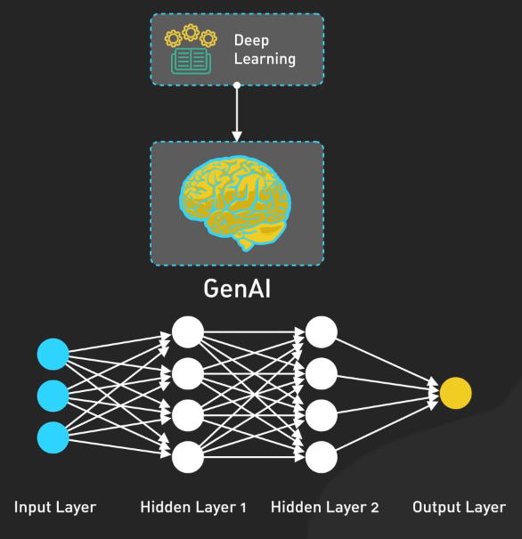{:class="centered-img"}

Một khái niệm quan trọng trong GenAI là Large Language Model hoặc LLM (Mô hình ngôn ngữ lớn). LLM là một loại mô hình AI được huấn luyện trên lượng lớn dữ liệu văn bản để hiểu và tạo ra văn bản giống con người. Các mô hình này có thể thực hiện một loạt các nhiệm vụ ngôn ngữ từ trả lời câu hỏi, viết bài luận và thậm chí là lập trình. LLM là trái tim của nhiều ứng dụng Gen AI mà chúng ta sẽ nói sau.

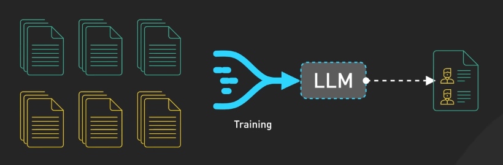{:class="centered-img"}

Cuối cùng, hãy nói về Prompt Engineering. Đây là việc thiết kế các prompt (câu lệnh) hiệu quả để có được output mong muốn từ các mô hình Gen AI. Nó bao gồm việc hiểu khả năng, giới hạn và tính thiên vị của mô hình. Prompt hiệu quả cung cấp hướng dẫn rõ ràng, ví dụ liên quan và ngữ cảnh để hướng dẫn output của mô hình. Prompt Engineering là một kỹ năng quan trọng để tận dụng tối đa các mô hình Gen AI.

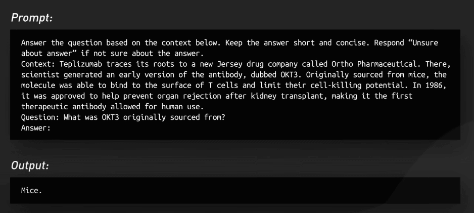{:class="centered-img"}

## Sử dụng API của model

Phần lớn các mô hình Gen AI đều có thể truy cập thông qua các API REST. Để bắt đầu, bạn cần lấy API key từ nền tảng mong muốn như OpenAI, Anthropic và Hugging Face. Khi bạn có API key, bạn có thể xác thực yêu cầu của mình tới các endpoint của mô hình Gen AI. Việc xác thực thường bao gồm việc cung cấp API key trong header của request hoặc như một tham số. Bạn cần giữ API key thật an toàn và tránh chia sẻ ra ngoài.

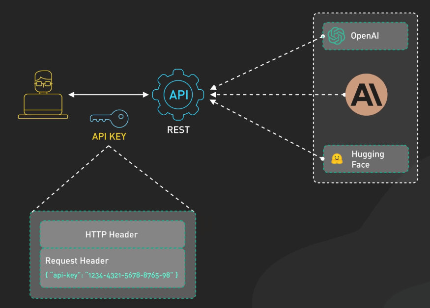{:class="centered-img"}

Khi sử dụng các API này, hãy theo các best practice sau để đảm bảo độ tin cậy và hiệu quả:

- Tối ưu hóa việc sử dụng API bằng cách chọn kỹ các tham số của mô hình như số lượng token tối đa. Điều này rất cần thiết để cân bằng giữa chất lượng output mong muốn và chi phí.

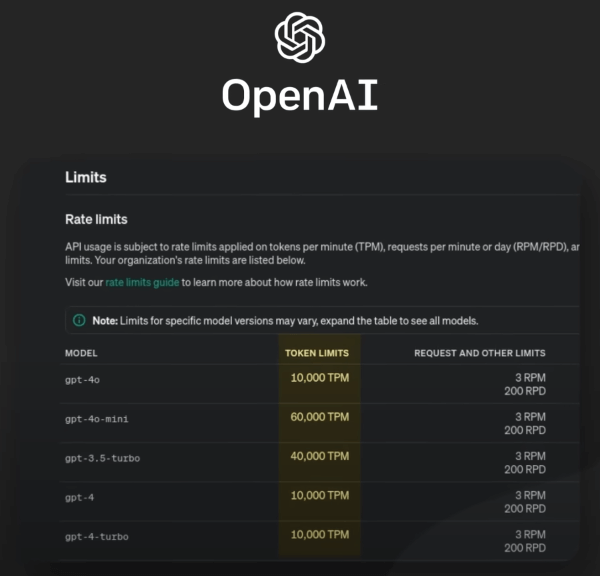{:class="centered-img"}

- Khi gửi các request, chú ý đến rate limit mà nền tảng đặt ra. Vượt quá rate limit có thể dẫn đến lỗi API hoặc hạn chế truy cập tạm thời.

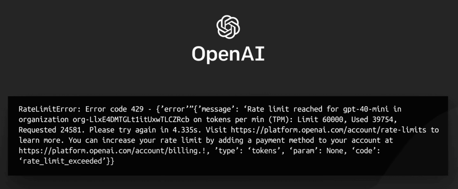{:class="centered-img"}

## Xây dựng ứng dụng sử dụng Gen AI

Giả sử ta muốn xây dựng một chatbot sử dụng LLM để cung cấp gợi ý sách cá nhân. Dưới đây là cách tiếp cận:

- Chọn một nhà cung cấp LLM dựa trên các yếu tố như giá cả, tính khả dụng và tài liệu API.
- Thiết lập môi trường phát triển bằng cách lấy API key và cài đặt các thư viện cần thiết.

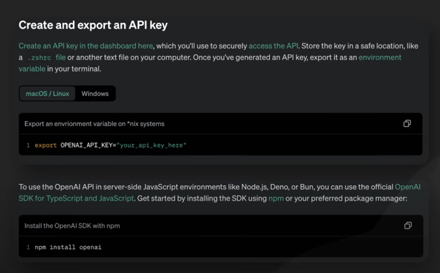{:class="centered-img"}

- Thiết kế luồng trò chuyện của chatbot bằng cách lập kế hoạch câu hỏi để hiểu sở thích của người dùng và xác định cách hiển thị gợi ý.
- Sử dụng một framework web để xây dựng ứng dụng, tạo giao diện người dùng và logic backend để xử lý tương tác.

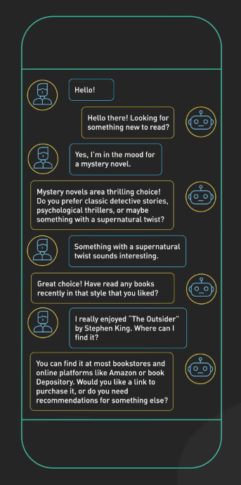{:class="centered-img"}

- Tích hợp LLM bằng cách xác định các câu hỏi để tạo ra gợi ý sách cá nhân dựa trên sở thích của người dùng.
- Sau khi xử lý và hiển thị các gợi ý, thu thập phản hồi từ người dùng và cải thiện chatbot dựa trên phản hồi đó.

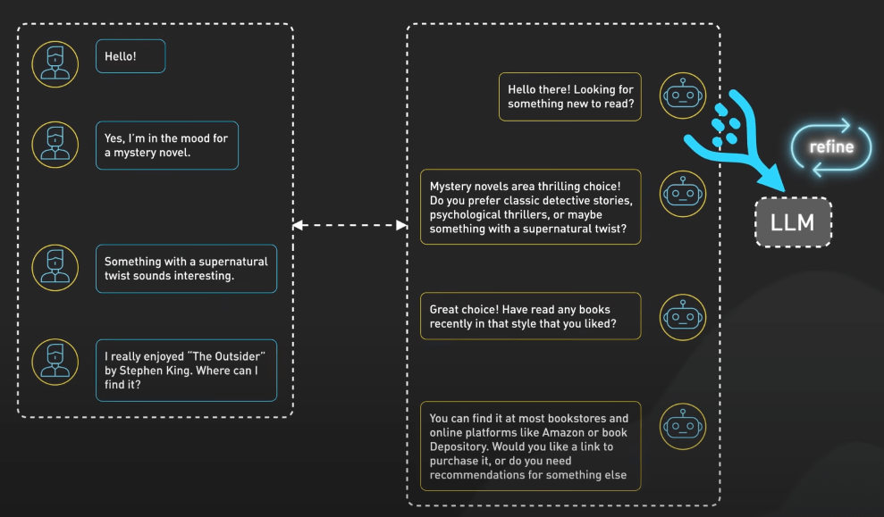{:class="centered-img"}

- Triển khai ứng dụng và thiết lập giám sát để theo dõi hiệu suất và tương tác của người dùng.

Quy trình này cho thấy cách chúng ta có thể tận dụng Gen AI để tạo ra các ứng dụng thông minh cá nhân cung cấp giá trị trong các lĩnh vực cụ thể.

## Tùy chỉnh mô hình AI của bạn

Giả sử bạn muốn tạo ra một mô hình không chỉ thông minh mà còn thông minh về nhu cầu cụ thể của bạn, đó là mục tiêu của chúng ta ở đây. Có hai kỹ thuật chính để đạt được điều này: retrieval augmented generation (RAG) hoặc fine-tuning.

RAG cho phép mô hình AI của bạn truy cập vào các nguồn thông tin bên ngoài như cơ sở dữ liệu, tài liệu hoặc thậm chí internet trong thời gian thực. Điều này có nghĩa là mô hình có thể truy xuất thông tin mới nhất và liên quan nhất để trả lời câu hỏi rất cụ thể cho bạn.

Khi người dùng đặt câu hỏi, hệ thống trước tiên tìm kiếm thông tin từ các nguồn bên ngoài để tìm thông tin liên quan. Sau đó, nó cung cấp thông tin này cho mô hình AI cùng với câu hỏi. Mô hình sau đó tạo ra một câu trả lời bằng cách sử dụng cả thông tin đã truy xuất và kiến thức của chính nó. Điều này giống như có một chuyên gia không chỉ biết nhiều mà còn biết chính xác nơi để tìm thông tin bổ sung. 

Cái hay của RAG là nó kết hợp sức mạnh của truy xuất thông tin và ngôn ngữ tạo sinh, dẫn đến các câu trả lời chính xác và liên quan hơn, đặc biệt khi xử lý các câu hỏi phức tạp cần tổng hợp thông tin từ nhiều nguồn.

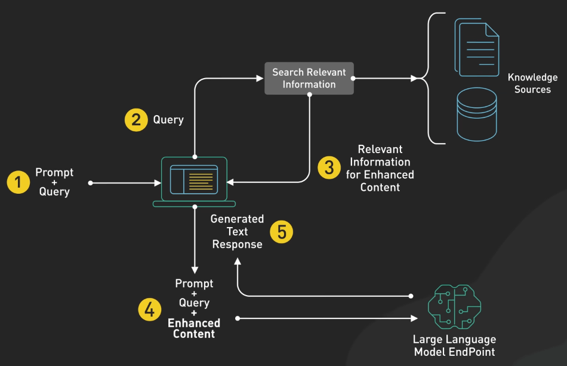{:class="centered-img"}

Fine-tuning là kỹ thuật điều chỉnh mô hình AI đã được huấn luyện trước cho nhu cầu cụ thể của bạn, cải thiện hiệu suất và nhiệm vụ cụ thể. 

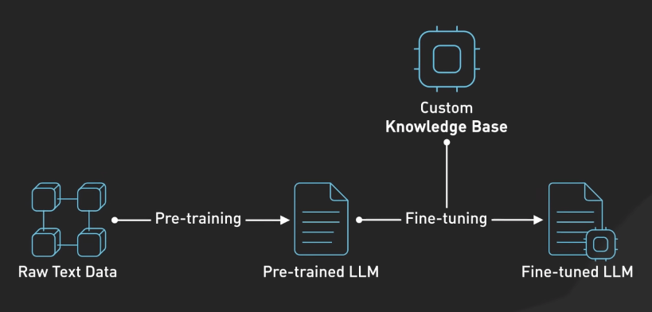{:class="centered-img"}

Chúng ta bắt đầu với một mô hình cơ sở như GPT hoặc Llama, mà đã học từ việc huấn luyện trên lượng lớn dữ liệu tổng quát. Fine-tuning sau đó điều chỉnh mô hình này cho nhu cầu cụ thể hoặc tập dữ liệu nhiệm vụ của bạn. Ta kiểm tra hiệu suất của mô hình bằng cách sử dụng một tập dữ liệu xác thực và điều chỉnh quá trình khi cần thiết. Kết quả là một mô hình kết hợp kiến thức rộng lớn với chuyên môn trong lĩnh vực của bạn.

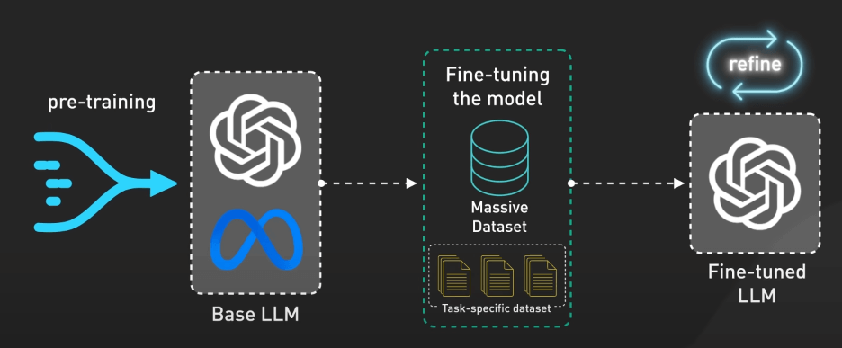{:class="centered-img"}

Với fine-tuning, bạn tạo ra một mô hình AI hiểu biết về thách thức độc đáo của bạn và nói chuyện bằng ngôn ngữ của bạn, thực sự làm cho AI trở thành của riêng bạn.

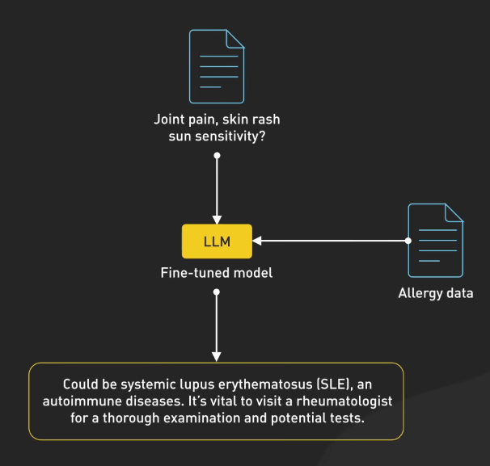{:class="centered-img"}
