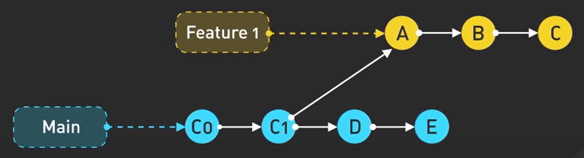
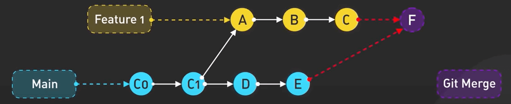
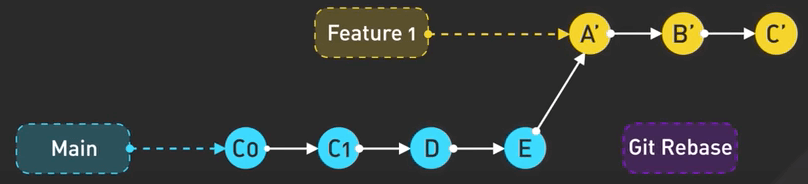
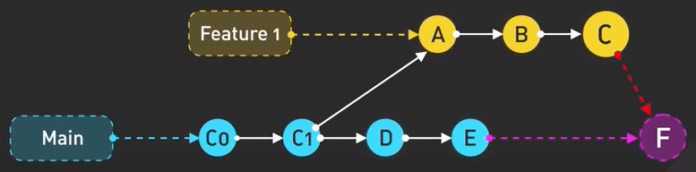
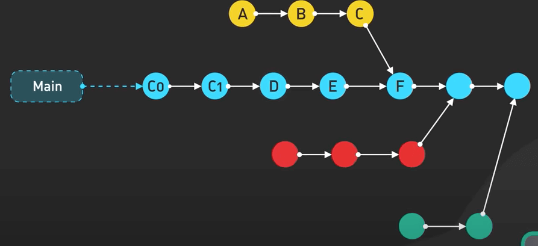
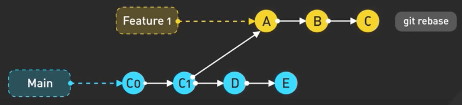
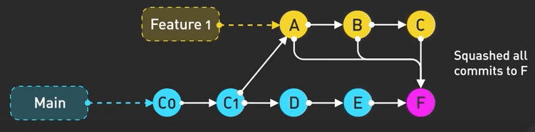
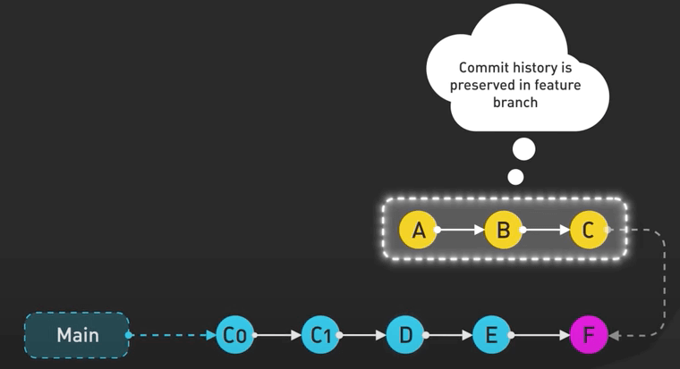
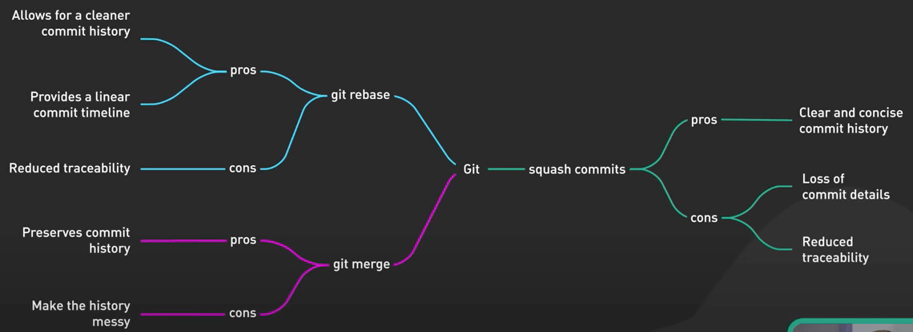

# Git Merge vs Rebase

## Nguồn

 [Git MERGE vs REBASE: Everything You Need to Know](https://www.youtube.com/watch?v=0chZFIZLR_0)

## Giới thiệu

Nếu bạn từng làm việc trong một git project với một đống branch, bạn chắc hẳn đã phải tìm cách để lấy các thay đổi trên feature branch thả vào main branch, hoặc giữ cho feature branch của bạn luôn cập nhật với main branch. Câu hỏi là, giờ nên xài **git merge**, **git rebase** hay **squash commit**?

## Cập nhật feature branch với main branch

Giờ giả sử bạn tạo một feature branch mới từ main branch đi. Ta thêm các commit A, B và C trên feature branch này. Cùng lúc này thì main branch có thêm các commit D, E. Việc này giống như hai nhánh của một cái cây mọc ra hai hướng khác nhau ấy.

{:class="centered-img"}

Việc cập nhật feature branch của bạn với main branch là một phần quan trọng của git workflow. Ta có thể làm được điều này với git merge hoặc git rebase.

### git merge

Lệnh git merge sẽ pull những thay đổi mới nhất từ main branch về feature branch và tạo ra một merge commit. Nhìn nó giống việc lấy dây tạo ra một nút thắt để thắt 2 nhánh cây lại ấy.

{:class="centered-img"}

### git rebase

Lệnh git rebase sẽ thay đổi base của feature branch thành commit mới nhất trên main branch và đặt các thay đổi trong feature branch từ đó. Nó cho ta một lịch sử commit đẹp và thẳng. Nhiều người rất thích điều này.

{:class="centered-img"}

## Đưa feature branch về main branch

Khi dev xong thì ta sẽ muốn các thay đổi trên feature branch về lại main branch. Có một số cách như sau.

### git merge

Đầu tiên là git merge. Git sẽ tạo ra một merge commit bao gồm lịch sử của cả hai branch, giống như tạo ra một cái nút thắt cho thấy hai branch này hợp vào nhau ở chỗ nào.

{:class="centered-img"}

Nhưng mà nếu làm nhiều lần, ta sẽ có rất nhiều nút thắt như thế, làm lịch sử commit trở nên rối rắm.

{:class="centered-img"}

### git rebase

Cách tiếp theo là git rebase và forward merge. Ta có thể dùng git rebase để di chuyển các thay đổi từ feature branch về đầu (commit mới nhất) của main branch, sau đó thực hiện fast-forward merge. Làm cách này sẽ giúp lịch sử commit đẹp hơn.

{:class="centered-img"}

{:class="centered-img"}

### Squash commit

Cách cuối là squash commit để thu tất cả các commit của feature branch thành một commit duy nhất rồi merge cái commit đó vào main branch. Cách này giúp lịch sử commit giữ được tính tuyến tính như rebase nhưng vẫn tạo ra một merge commit. Tuy nhiên, ta sẽ mất đi chi tiết các commit riêng lẻ đã thực hiện trước đó trong lịch sử commit của main branch.

{:class="centered-img"}

Squash commit là cách khá phổ biến trên các nền tảng như GitHub vì nó cho phép ta dọn dẹp lịch sử commit trên main branch nhưng vẫn giữ được chi tiết lịch sử commit trên feature branch. Nó như kiểu kết hợp ấy.

{:class="centered-img"}

## Tổng kết

Kết lại,

- git merge giữ nguyên lịch sử commit của cả hai branch, và sự phát triển của các feature branch.
- git rebase dọn dẹp lịch sử commit bằng cách di chuyển các commit về đầu main branch.
- Squash commit gộp tất cả các commit làm một và tạo ra một lịch sử commit thẳng và đẹp nhưng cái giá phải trả là lịch sử commit chi tiết.

Dưới đây sẽ là tổng kết ưu và nhược điểm của mỗi cách. Không có cách nào là tốt cho mọi trường hợp cả. Cái nào tốt nhất cho bạn thì hãy dùng thôi.

{:class="centered-img"}
