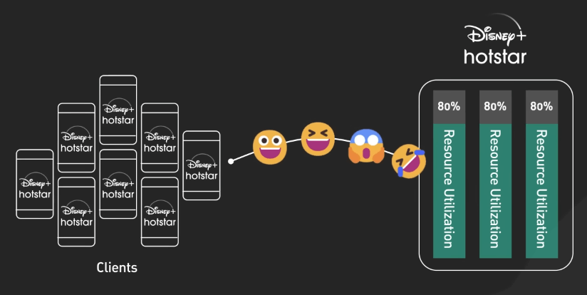
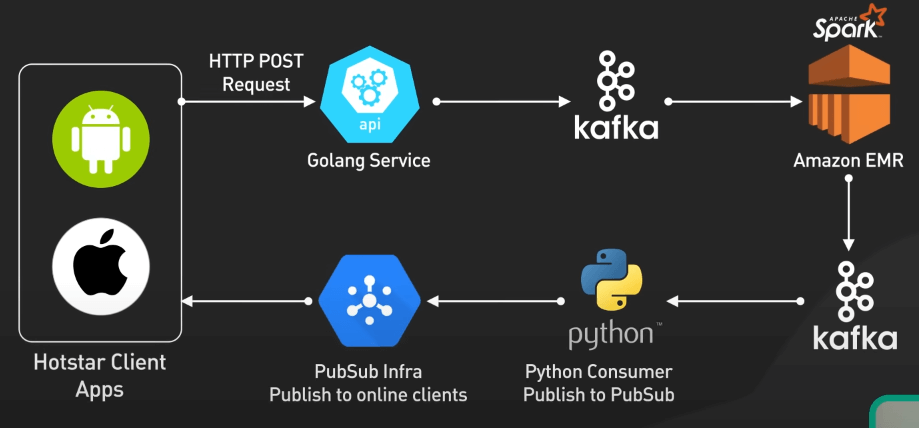
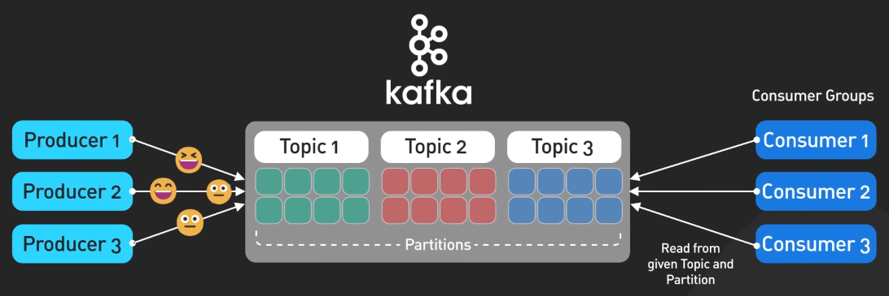
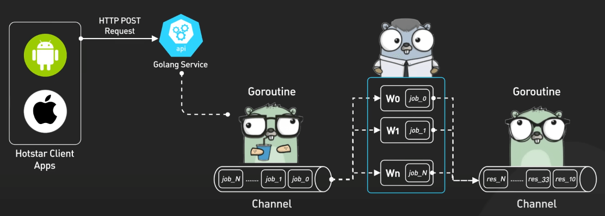
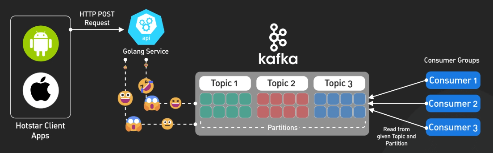
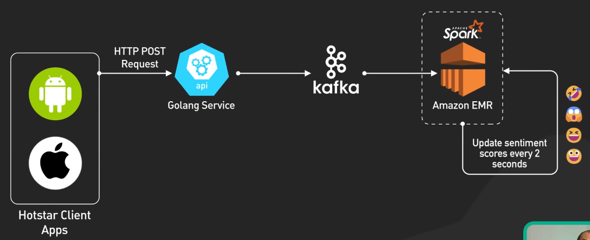
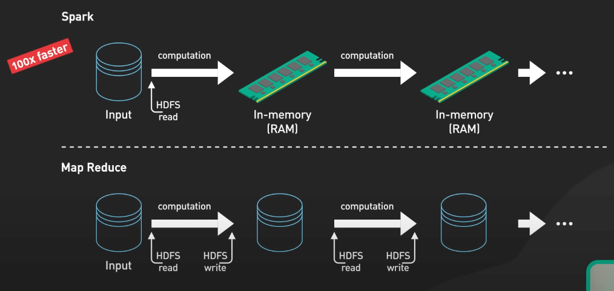
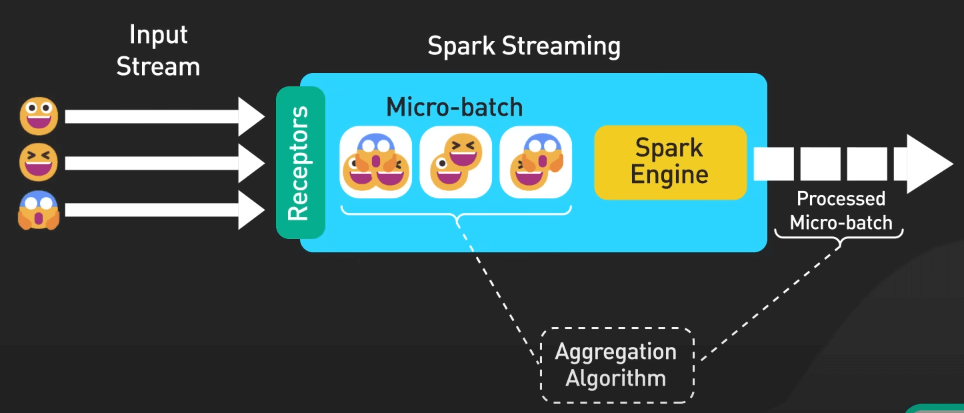

# Disney Hotstar xử lý cả tỷ react như thế nào?

## Nguồn

 [How Disney Hotstar Captures One Billion Emojis!](https://www.youtube.com/watch?v=UN1kW5AHid4)

## Giới thiệu

Chúng ta sẽ khám phá cách Disney Hotstar vượt qua thách thức kỹ thuật khó nhằn để quản lý 5 tỷ react bằng emoji trong một trận đấu World Cup Cricket căng thẳng. Hãy tưởng tượng: một trận đấu gay cấn thu hút hàng triệu người hâm mộ. Khi cảm xúc dâng trào, hàng triệu người dùng đã bắn phá backend của Hotstar với những react bằng emoji, đẩy các server tới giới hạn. Cùng xem Hotstar đã giải quyết thử thách này thế nào và biến người xem thụ động thành một cộng đồng sôi động, cùng hòa mình vào cảm xúc mà chỉ có thể có từ các sự kiện thể thao trực tiếp.

{:class="centered-img"}

## Giải pháp

Đầu tiên là một kiến trúc dựa vào xử lý không đồng bộ qua các thành phần tách biệt. Điều này là yếu tố then chốt để đảm bảo tính mở rộng, tốc độ và khả năng chịu tải lớn. 

{:class="centered-img"}

Việc tiếp nhận dữ liệu được xử lý bởi Kafka, một nền tảng mã nguồn mở giúp phát luồng sự kiện phân tán. Kafka sử dụng các topic để tổ chức dòng dữ liệu và các nhóm consumer để xử lý song song. Khả năng buffer lượng lớn dữ liệu từ nhiều nguồn khác nhau khiến Kafka trở thành lựa chọn lý tưởng để xử lý lượng lớn emoji.

{:class="centered-img"}

Các ứng dụng client gửi react emoji đến các API server được xây dựng bằng Golang, ngôn ngữ lập trình mã nguồn mở của Google. Nhờ Goroutines, Golang cho phép chạy đồng thời hàng loạt tiến trình, trong khi các kênh (channels) giúp giao tiếp giữa các tiến trình một cách an toàn.

{:class="centered-img"}

Các cơ chế này cho phép các API của Hotstar tiếp nhận hàng triệu react đồng thời, sau đó gom nhóm dữ liệu bằng channels và ghi một cách không đồng bộ vào các topic Kafka.

{:class="centered-img"}

Bước tiếp theo là Spark, một engine phân tích nhanh chóng được xây dựng trên JVM, xử lý dòng emoji từ Kafka, cập nhật điểm cảm xúc cứ mỗi 2 giây để phản ánh sự thay đổi trong tâm trạng của khán giả theo thời gian thực. 

{:class="centered-img"}

Spark tận dụng việc xử lý in-memory, giúp chạy các workload nhanh hơn 100 lần so với các nền tảng big data cũ như Hadoop MapReduce. 

{:class="centered-img"}

Kiến trúc micro-batch của Spark Streaming rất quan trọng ở đây, chia dòng dữ liệu liên tục thành các nhóm nhỏ để xử lý. Spark sau đó chạy các thuật toán tổng hợp trên dữ liệu, xác định sự phân phối cảm xúc emoji của người dùng.

{:class="centered-img"}

Dữ liệu cảm xúc tổng hợp được đẩy vào một topic Kafka khác để lưu trữ trước khi đến đích cuối cùng. Một consumer Python kéo dữ liệu từ topic này và publish lên hệ thống PubSub của Hotstar. Hệ thống PubSub tự xây dựng này được xây dựng dựa trên MQTT, cho phép gửi dữ liệu cảm xúc đến hàng triệu thiết bị với độ trễ thấp.

Tóm lại, kiến trúc không đồng bộ của Hotstar cho phép mỗi thành phần mở rộng một cách độc lập. Nó đảm bảo việc streaming mượt mà trong một trong những sự kiện thể thao căng thẳng nhất, chứng minh rằng kỹ thuật thông minh có thể biến những lượng dữ liệu nặng nề nhất thành một trải nghiệm mượt mà cho hàng triệu người dùng.

Kết quả? Độ trễ giảm mạnh từ 6 giây xuống chỉ còn 2 giây, sự cố hệ thống hầu như không còn, và chi phí giảm đến 85%.
