# ChatGPT hoạt động như thế nào?

## Nguồn

 [How ChatGPT Works Technically | ChatGPT Architecture](https://www.youtube.com/watch?v=bSvTVREwSNw)

## Giới thiệu

ChatGPT được phát hành vào ngày 30 tháng 11 năm 2022. Sản phẩm này đạt 100 triệu người dùng hàng tháng chỉ trong hai tháng, biến nó trở thành ứng dụng phát triển nhanh nhất trong lịch sử. Hình dưới đây là biểu đồ số tháng mà các ứng dụng phổ biến cần để đạt 100 triệu người dùng mỗi tháng.

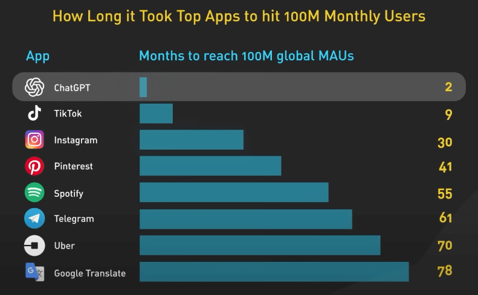{:class="centered-img"}

## LLM

Cốt lõi của ChatGPT là một LLM, hay Large Language Model - mô hình ngôn ngữ lớn. Phiên bản hiện tại của ChatGPT là GPT-3.5. ChatGPT cũng có thể sử dụng mô hình GPT-4 mới nhất, nhưng hiện tại chưa có nhiều chi tiết kỹ thuật về GPT-4 để nói đến.

Vậy mô hình ngôn ngữ lớn hay LLM là gì? LLM là một loại mô hình mạng nơ-ron được huấn luyện dựa trên lượng dữ liệu văn bản lớn để hiểu và tạo sinh ra ngôn ngữ mà con người sử dụng. 

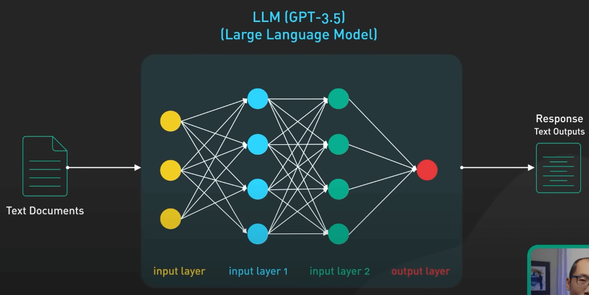{:class="centered-img"}

Mô hình này sử dụng dữ liệu huấn luyện để học các mẫu thống kê và mối quan hệ giữa các từ trong một ngôn ngữ, sau đó sử dụng kiến thức này để dự đoán ra các từ tiếp theo, từng từ một.

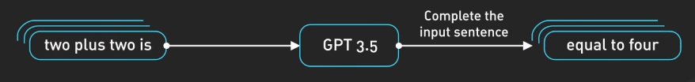{:class="centered-img"}

LLM thường được đặc trưng bởi kích thước và số lượng tham số. **Mô hình lớn nhất của GPT-3.5 có 175 tỉ tham số, trải dài qua 96 lớp trong mạng nơ-ron, khiến cho nó trở thành một trong các mô hình học sâu lớn nhất trong lịch sử**. 

Input và output của mô hình được tổ chức theo token. Token là các biểu diễn số hóa của các từ, hay nói chính xác hơn là các phần của từ. Số được sử dụng cho token thay cho từ vì chúng có thể được xử lý hiệu quả hơn. 

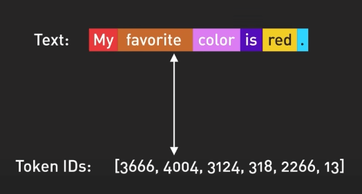{:class="centered-img"}

GPT-3.5 được huấn luyện dựa trên một lượng lớn dữ liệu từ internet. Bộ dữ liệu nguồn chứa đến 500 tỉ token. Nói cách khác, mô hình này đã được huấn luyện dựa trên hàng trăm tỉ từ. 

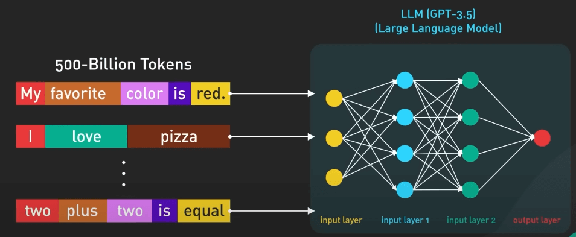{:class="centered-img"}

Nó được huấn luyện để dự đoán token tiếp theo dựa trên một chuỗi các token input. Nó có thể tạo ra văn bản có cấu trúc ngữ pháp chính xác với ngữ nghĩa tương tự dữ liệu trên internet mà nó được huấn luyện. Tuy nhiên, nếu không được định hướng chính xác, mô hình này cũng có thể tạo ra các thông tin sai sự thật, độc hại hay thể hiện các cảm xúc tiêu cực.

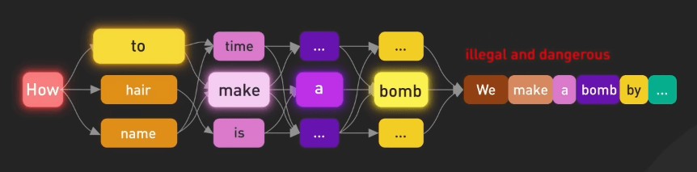{:class="centered-img"}

Dù với các nhược điểm to lớn đó, mô hình này đã chứng tỏ được tính hữu ích của mình, nhưng chỉ trong một số trường hợp cụ thể. Nó có thể được "dạy" để thực hiện các nhiệm vụ ngôn ngữ tự nhiên bằng cách sử dụng các câu lệnh văn bản được thiết kế cẩn thận. Đây chính là nguồn gốc của lĩnh vực "prompt engineering".

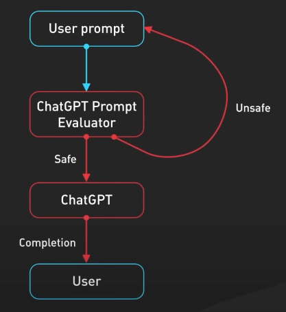{:class="centered-img"}

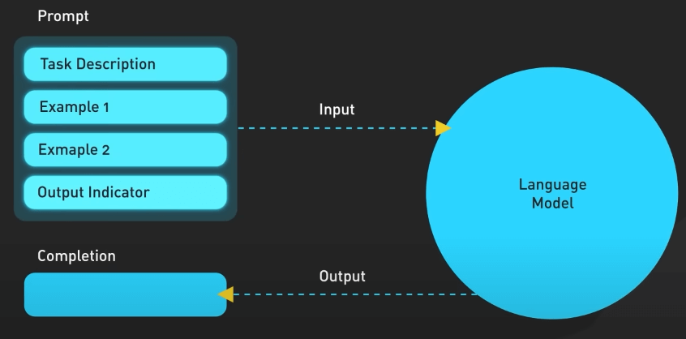{:class="centered-img"}

## Tinh chỉnh

Để làm cho mô hình này an toàn hơn và có thể trả lời các câu hỏi theo phong cách chatbot, mô hình được tinh chỉnh thêm để trở thành phiên bản hiện tại trong ChatGPT. Quá trình này được gọi là Reinforcement Training from Human Feedback (RLHF) - hay huấn luyện tăng cường từ phản hồi của con người. OpenAI giải thích cách họ dùng RLHF lên mô hình, nhưng không dễ hiểu cho người không chuyên machine learning.

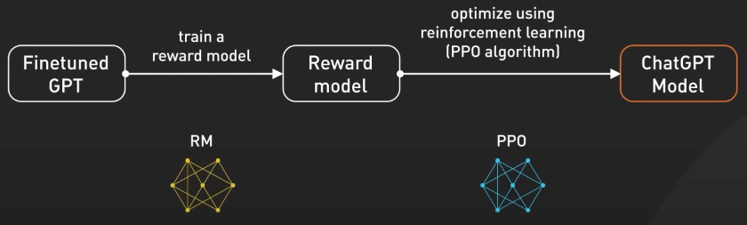{:class="centered-img"}

Hãy cùng tìm hiểu với một ví dụ. 

Giả sử GPT-3.5 là một đầu bếp tài năng, có thể chuẩn bị nhiều món ăn khác nhau. Tinh chỉnh GPT-3.5 bằng RLHF cũng giống như việc nâng cao kỹ năng đầu bếp để làm các món ăn ngon hơn. Ban đầu, đầu bếp được huấn luyện với một bộ dữ liệu lớn về các công thức và kỹ thuật nấu ăn. Tuy nhiên, đôi khi đầu bếp không biết làm món gì để phục vụ một yêu cầu cụ thể từ khách hàng. Ở đây, ta thu thập phản hồi từ người thật để tạo ra một bộ dữ liệu mới. 

Bước đầu tiên là tạo bộ dữ liệu so sánh. Ta yêu cầu đầu bếp chuẩn bị nhiều món ăn cho một yêu cầu cụ thể nào đó và sau đó để người dùng xếp hạng các món dựa trên hương vị và cách trình bày. Việc này sẽ giúp đầu bếp hiểu người dùng thích món nào. 

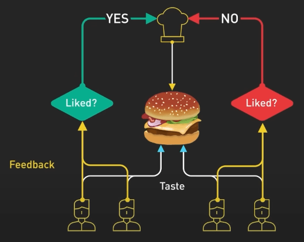{:class="centered-img"}

Bước tiếp theo là mô hình trao thưởng. Đầu bếp dùng các phản hồi này để tạo ra một mô hình trao thưởng, giống như sách hướng dẫn để hiểu sở thích của khách hàng. Phần thưởng càng nhiều thì món ăn càng ngon. 

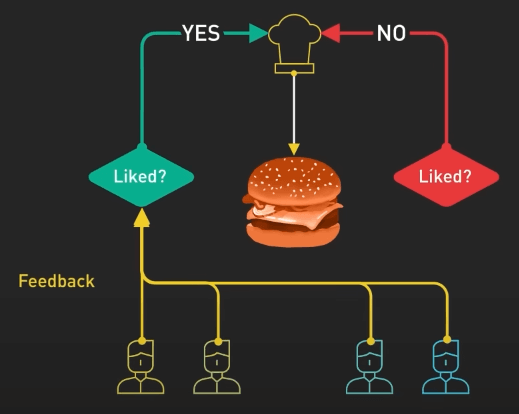{:class="centered-img"}

Tiếp theo, ta huấn luyện mô hình bằng PPO (Proximal Policy Optimization). Trong ví dụ này, đầu bếp thực hành làm món ăn theo mô hình trao thưởng. Họ sử dụng một kỹ thuật gọi là Proximal Policy Optimization để cải thiện kỹ năng của mình. Đầu bếp so sánh món ăn hiện tại với một phiên bản hơi khác của nó và học xem món nào ngon hơn theo mô hình phần thưởng. Quá trình này lặp đi lặp lại nhiều lần, khiến đầu bếp ngày càng giỏi hơn trong việc tạo ra các món ăn phù hợp với sở thích của khách hàng.

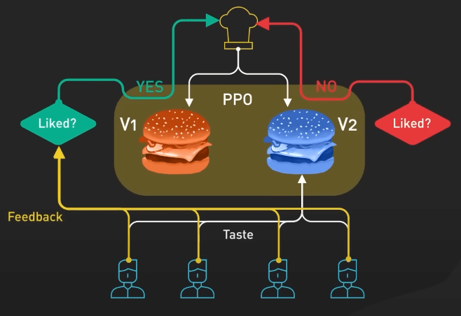{:class="centered-img"}

Nhìn từ góc độ khác, GPT-3.5 được tinh chỉnh với RLHF bằng cách thu thập phản hồi từ người dùng, tạo ra mô hình phần thưởng dựa trên sở thích của họ, và sau đó cải thiện hiệu suất của mô hình theo cách lặp lại bằng PPO. Điều này giúp GPT-3.5 tạo ra những phản hồi tốt hơn, phù hợp với yêu cầu cụ thể của người dùng.

## ChatGPT trả lời câu hỏi (prompt) như thế nào?

Về cơ bản, quá trình này đơn giản như việc đưa câu hỏi vào mô hình ChatGPT và thu về kết quả. Thực ra thì nó phức tạp hơn một chút. 

Đầu tiên, ChatGPT sẽ ghi nhớ ngữ cảnh của cuộc trò chuyện. UI của ChatGPT sẽ cung cấp những lần chat trước đó mỗi khi một câu hỏi mới được đưa vào. Điều này được gọi là conversational prompt injection. Đây chính là cách ChatGPT hiểu được ngữ cảnh của bạn mà bạn không cần phải nhắc lại từ đầu.

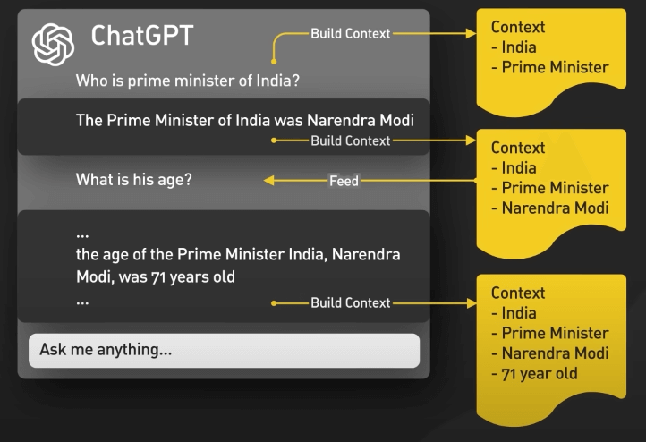{:class="centered-img"}

Thứ hai, ChatGPT bao gồm primary prompt engineering. Đây là các phần hướng dẫn được đưa vào trước và sau câu hỏi của người dùng để hướng dẫn mô hình về phong cách trò chuyện. Người dùng tất nhiên không thấy những phần này.

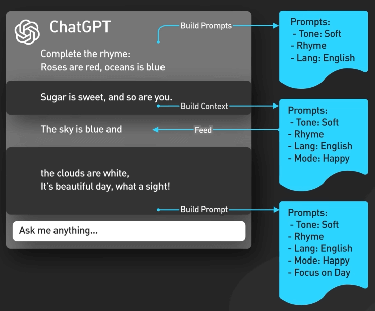{:class="centered-img"}

Thứ ba, câu hỏi được truyền vào API kiểm duyệt để cảnh báo hoặc chặn một số loại nội dung không an toàn, như chửi bậy chẳng hạn. Output của mô hình khả năng cao cũng đi qua API kiểm duyệt trước khi trả về cho người dùng.

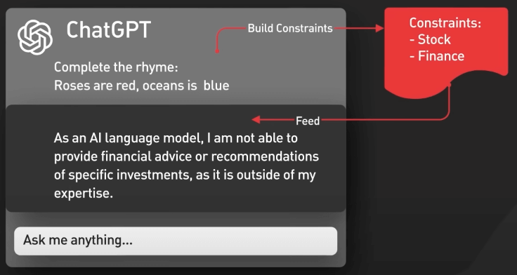{:class="centered-img"}
