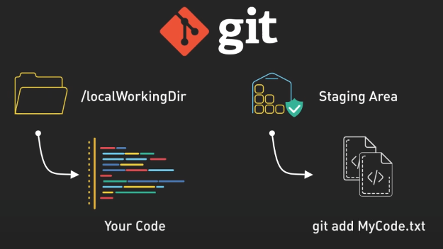
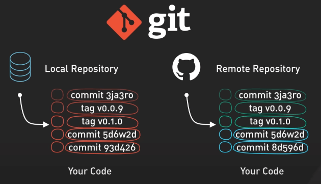
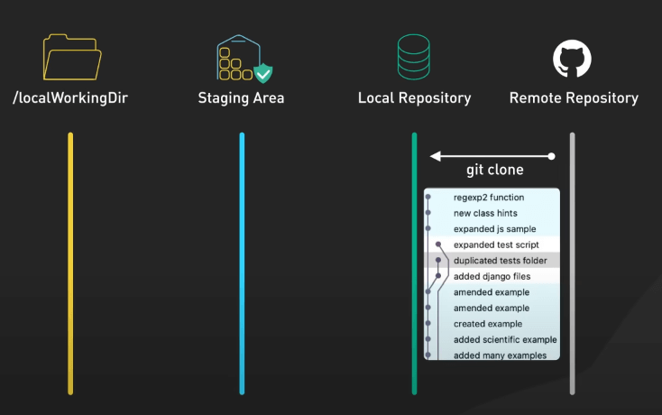
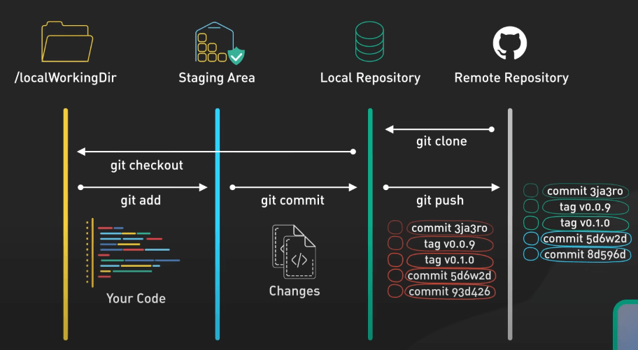
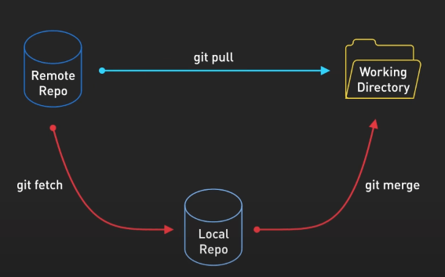
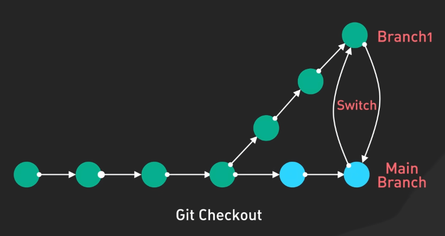
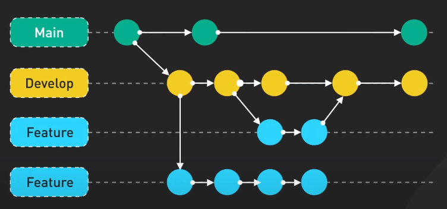
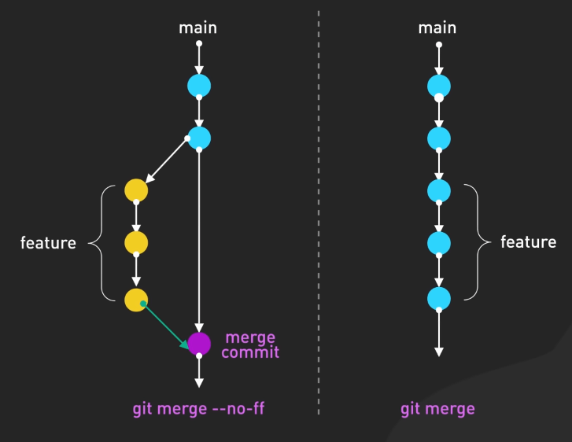

# Git hoạt động như thế nào?

## Nguồn

 [How Git Works: Explained in 4 Minutes](https://www.youtube.com/watch?v=e9lnsKot_SQ)

## Code trong Git được lưu ở đâu?

Trước khi đi vào các lệnh Git, hãy cùng xem Git lưu code của chúng ta như thế nào. Thường mọi người nghĩ rằng chỉ có hai nơi lưu code, nhưng thực tế code không chỉ tồn tại trên GitHub hoặc máy cá nhân của ta. Có 4 vị trí chính mà code của ta tồn tại trong Git:

1. **Thư mục làm việc (Working Directory)**: Nơi ta chỉnh sửa các file cục bộ. Đây là nơi chúng ta làm việc.
2. **Khu vực Staging (Staging Area)**: Đây là nơi tạm thời lưu trữ các thay đổi trước khi commit.
3. **Kho lưu trữ cục bộ (Local Repository)**: Đây là nơi lưu trữ các thay đổi đã commit cục bộ.
4. **Kho lưu trữ từ xa (Remote Repository)**: Một máy chủ như GitHub để chia sẻ và sao lưu code.

{:class="centered-img"}

{:class="centered-img"}

## Hành trình của code

Với các vị trí này, hãy cùng hình dung hành trình của code nhé. Hầu hết các lệnh `git` sẽ di chuyển file giữa 4 vị trí này. Bước đầu tiên là sử dụng lệnh `git clone` để sao chép một repository đã tồn tại, giúp bạn có một phiên bản cục bộ của project, với tất cả lịch sử git của nó.

{:class="centered-img"}

Khi đã có repository cục bộ, cùng xem code được lưu ở đâu. Khi bắt đầu làm việc với một file, bạn đang ở Working Directory. Đây là môi trường phát triển cục bộ của bạn, nơi bạn tạo các thay đổi trên code (thêm file, sửa file, xóa file, ...).

Khi sẵn sàng commit các thay đổi ở trên, bạn dùng `git add` để đưa snapshot của các file đó vào Staging Area. Tưởng tượng đây là một checkpoint, nơi các thay đổi của bạn được tập hợp lại và sẵn sàng để hoàn tất.

Bước tiếp theo là sử dụng `git commit`, lấy một snapshot của Staging Area và lưu nó vào Local Repository của bạn. Việc này giúp khóa các thay đổi đó bằng cách tạo một bản ghi vĩnh viễn mà bạn có thể tham chiếu lại, giống như một bức ảnh chụp tại một thời điểm.

Code của bạn không chỉ nằm trên máy cá nhân. Khi sẵn sàng chia sẻ tiến độ với team hoặc muốn sao lưu công việc của mình, bạn dùng lệnh `git push` để gửi các commit lên Remote Repository. Đây thường là một máy chủ chia sẻ nơi team có thể cùng làm việc, như GitHub hoặc Bitbucket.

{:class="centered-img"}

Cộng tác trong Git là một quá trình trao đổi hai chiều. Để tích hợp công việc của đồng nghiệp, bạn dùng `git pull`, để tải các thay đổi từ Remote Repository và hợp nhất chúng vào Local Repository của bạn. Lệnh này kết hợp hai lệnh: `git fetch`, để tải các cập nhật mới nhất, và `git merge`, để hợp nhất các cập nhật này với công việc của bạn. 

{:class="centered-img"}

Có những lúc bạn cần chuyển đổi ngữ cảnh, có thể để sửa lỗi trên một branch khác, đó là lúc `git checkout` hoặc `git switch` giúp bạn. Nó cho phép bạn chuyển đổi giữa các branch khác nhau để làm việc trên các tính năng cụ thể.

{:class="centered-img"}

Git branching cho phép bạn tách ra từ code chính để phát triển một tính năng mới mà không ảnh hưởng đến code chính. Một số khái niệm quan trọng bao gồm: tạo nhánh mới với lệnh `git branch`, chuyển đổi giữa các nhánh với `git switch`, gộp nhánh bằng `git merge`, và giải quyết merge conflict khi các thay đổi chồng lấn. Branching hỗ trợ phát triển và cộng tác độc lập. Mình cũng có một bài về [Git Merge vs Rebase](git-merge-vs-rebase.md) nếu bạn muốn tìm hiểu thêm.

{:class="centered-img"}

{:class="centered-img"}

Nhiều dev sử dụng các công cụ Git đồ họa như GitHub Desktop và SourceTree. Các công cụ này cung cấp giao diện trực quan và các phím tắt cho các lệnh phổ biến. Chúng có thể giúp người mới bắt đầu dễ dàng làm quen với Git.
