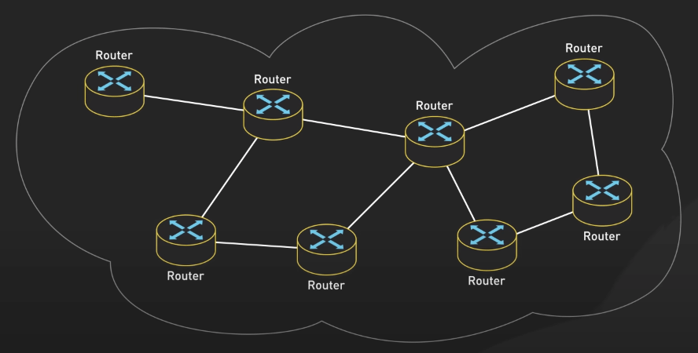

# Internet hoạt động như thế nào?

## Nguồn

 [How the Internet Works in 9 Minutes](https://www.youtube.com/watch?v=sMHzfigUxz4)

## Lịch sử của Internet

Sự phát triển của Internet là một hành trình hấp dẫn kéo dài qua nhiều thập kỷ. 

- Bắt đầu với ARPANET vào cuối những năm 1960, một dự án được tài trợ bởi Bộ Quốc phòng Hoa Kỳ.
- Sau đó là sự phát triển của TCP/IP vào những năm 1970, mở ra nền tảng cho Internet hiện đại.
- Sự ra đời của World Wide Web vào năm 1989 đã làm thay đổi cách chúng ta truy cập và chia sẻ thông tin.
- Đến năm 2000, sự phát triển của mạng xã hội và Internet di động đã biến đổi cách chúng ta kết nối với nhau. 
- Ngày nay, chúng ta đang chứng kiến sự mở rộng của Internet of Things và mạng 5G, đẩy ranh giới của những gì có thể trong một thế giới kết nối.

{:class="centered-img"}

## Cấu trúc của Internet

Ta bắt đầu với các network edge. Network edge bao gồm các hệ thống đầu cuối (end system), còn được gọi là host, là các thiết bị kết nối với Internet. Chúng bao gồm máy tính cá nhân, server, thiết bị di động và một số thiết bị IoT như các thiết bị thông minh trong nhà. 

Host đôi khi còn được chia thành hai loại: client và server. Client thường là các thiết bị cá nhân như máy tính và điện thoại thông minh, trong khi server thường là các máy mạnh mẽ hơn lưu trữ và phân phối các trang web, stream video, gửi email và cung cấp các dịch vụ tương tự. Ngày nay, hầu hết các server cung cấp kết quả tìm kiếm, dịch vụ email, web và video được đặt tại các trung tâm dữ liệu lớn. Các trung tâm dữ liệu này có thể chứa hàng nghìn server kết nối với nhau, tạo nên cột sống của nhiều dịch vụ Internet mà chúng ta sử dụng hàng ngày.

{:class="centered-img"}

Tiếp theo, chúng ta sẽ xem xét các mạng truy cập, kết nối vật lý giữa hệ thống đầu cuối và router đầu tiên trên một đường dẫn đến các hệ thống đầu cuối khác. 

{:class="centered-img"}

Có ba loại mạng truy cập chính:

- Mạng truy cập tại nhà: Kết nối các hệ thống đầu cuối trong nhà. Thông thường sử dụng các công nghệ như DSL, cáp hoặc cáp quang để kết nối các hộ gia đình với Internet.

{:class="centered-img"}

- Mạng truy cập tại tổ chức: Kết nối các hệ thống đầu cuối trong tổ chức hoặc doanh nghiệp. Các mạng này thường được thiết kế để đáp ứng các yêu cầu và nhu cầu cụ thể của các tổ chức lớn. Chúng thường sử dụng kết nối cáp quang tốc độ cao và kiến trúc mạng phức tạp để hỗ trợ nhiều người dùng và ứng dụng sử dụng lượng dữ liệu lớn.

{:class="centered-img"}

{:class="centered-img"}

- Mạng truy cập di động: Kết nối các hệ thống đầu cuối di động như điện thoại thông minh và máy tính bảng với Internet. Các mạng di động sử dụng các công nghệ không dây như 4G và 5G để cung cấp kết nối Internet di động cho người dùng. Sự phát triển của mạng di động đã thay đổi cách chúng ta truy cập và sử dụng Internet, cho phép chúng ta kết nối gần như bất cứ nơi nào.

{:class="centered-img"}

Giờ ta sẽ đến phần quan trọng nhất của Internet: network core. Đây là mạng lưới của các packet router và các liên kết để kết nối các Internet và hệ thống ở trái tim của mạng. Router là các thiết bị chuyên biệt điều hướng các gói tin từ một mạng đến mạng khác. Những router này xử lý nhiệm vụ chuyển tiếp gói tin, đảm bảo dữ liệu đến đúng nơi một cách hiệu quả. 

{:class="centered-img"}

Network core hoạt động dựa trên nguyên tắc chuyển mạch gói tin, nhưng điều đó có nghĩa là gì? Khi bạn gửi một email hoặc trang web, dữ liệu không di chuyển như một luồng liên tục mà thay vào đó nó được chia thành các phần nhỏ hơn gọi là gói tin. Mỗi gói tin chứa một phần của dữ liệu cùng với thông tin về nguồn và đích. 

{:class="centered-img"}

Những gói tin này được gửi độc lập qua mạng, có thể đi qua các đường dẫn khác nhau và đến đích vào thời gian khác nhau. Khi tất cả các gói tin đến đích, chúng sẽ được ghép lại thành tin nhắn ban đầu. Phương pháp này có nhiều ưu điểm: cho phép mạng xử lý nhiều giao tiếp cùng một lúc, đảm bảo dữ liệu luôn chuyển tiếp dù có lỗi xảy ra, và có thể chuyển tiếp lại gói tin qua các đường dẫn khác nhau nếu cần.

{:class="centered-img"}

{:class="centered-img"}

Trong network core, có hai chức năng chính được thực hiện: chuyển tiếp (forwarding) và định tuyến (routing). Chuyển tiếp là hành động di chuyển một gói tin đang đến, đến đúng router tiếp theo. Nó được điều khiển bởi một bảng chuyển tiếp trong mỗi router. Khi một gói tin đến, router sẽ xem xét địa chỉ đích của gói tin và sử dụng bảng chuyển tiếp để xác định đường dẫn đến router đích. 

{:class="centered-img"}

Định tuyến, ngược lại, là quá trình xác định đường đi mà các gói tin sẽ đi từ nguồn đến đích trên Internet.

{:class="centered-img"}

Các thuật toán định tuyến Internet tính toán các đường dẫn ngắn nhất và hiệu quả nhất giữa hai điểm trên mạng toàn cầu. Các thuật toán này xem xét các yếu tố như tình trạng mạng, điều kiện lưu lượng và khả năng kết nối để đưa ra quyết định định tuyến.

{:class="centered-img"}

Một trong những giao thức định tuyến quan trọng nhất trên Internet là BGP (Border Gateway Protocol). BGP được sử dụng để trao đổi thông tin định tuyến giữa các hệ thống khác nhau, như các mạng lớn của các nhà cung cấp dịch vụ Internet hoặc các tổ chức lớn. BGP cho phép mỗi hệ thống thông báo về các dải địa chỉ IP mà nó có thể đến, và thông tin này sẽ lan truyền trên Internet. Các router BGP sử dụng dữ liệu này để đưa ra quyết định định tuyến, chọn lựa con đường tốt nhất cho dữ liệu để đi qua nhiều hệ thống.

{:class="centered-img"}

Quá trình định tuyến động và linh hoạt, nếu một liên kết thất bại hoặc trở nên quá tải, các thuật toán định tuyến có thể nhanh chóng tính toán lại con đường để đảm bảo dữ liệu tiếp tục chuyển tiếp một cách hiệu quả trên mạng.

{:class="centered-img"}

Tất cả các hoạt động có liên quan đến giao tiếp trên internet giữa các thiết bị mạng được quản lý bởi các giao thức. 

{:class="centered-img"}

Giao thức là các quy tắc tiêu chuẩn xác định cách thông tin được truyền qua mạng. Mọi hoạt động trên Internet liên quan đến giao thức. Các giao thức đảm bảo rằng các thiết bị và hệ thống mạng khác nhau có thể hiểu và giao tiếp với nhau.

{:class="centered-img"}

Một số giao thức phổ biến bao gồm TCP, UDP, IP và HTTP. Mỗi giao thức phục vụ một mục đích cụ thể trong mạng. Ví dụ, TCP đảm bảo việc chuyển giao dữ liệu đáng tin cậy giữa các ứng dụng, như việc chia dữ liệu thành các gói, xác nhận gói tin đã nhận và gửi lại gói tin bị mất.

{:class="centered-img"}

IP quản lý việc địa chỉ hóa và định tuyến các gói tin trên Internet. Mọi thiết bị kết nối với Internet đều có một địa chỉ IP, giống như một địa chỉ bưu điện cho gói tin.

{:class="centered-img"}

HTTP là giao thức hỗ trợ truy cập web, xác định cách thông điệp được định dạng và truyền qua mạng. Khi bạn nhập URL vào trình duyệt, bạn đang gửi một yêu cầu HTTP đến web server để lấy trang web.

{:class="centered-img"}

Các giao thức này và nhiều giao thức khác làm việc cùng nhau để cho phép các tương tác phức tạp xảy ra mỗi khi bạn gửi email, stream video hoặc duyệt web.

{:class="centered-img"}

## Internet Protocol Stack

Giờ ta sẽ nói về Internet Protocol stack, còn được gọi là TCP/IP stack, là một khung khái niệm chuẩn hóa các giao thức được sử dụng cho việc giao tiếp qua Internet. TCP/IP stack thường bao gồm bốn tầng. 

Ở tầng trên cùng, chúng ta có tầng ứng dụng. Tầng này gần nhất với người dùng cuối và tương tác trực tiếp với các ứng dụng phần mềm. Các giao thức trong tầng này bao gồm HTTP cho duyệt web, SMTP cho email và FTP cho truyền file.

{:class="centered-img"}

Dưới tầng ứng dụng là tầng vận chuyển. Tầng này đảm bảo việc chuyển giao dữ liệu đáng tin cậy giữa các ứng dụng. Hai giao thức chính trong tầng này là TCP và UDP. TCP cung cấp việc chuyển giao dữ liệu đáng tin cậy, trong khi UDP cung cấp việc chuyển giao dữ liệu nhanh hơn nhưng không đáng tin cậy.

{:class="centered-img"}

Dưới tầng vận chuyển là tầng mạng, còn được gọi là tầng IP. Tầng này quản lý việc địa chỉ hóa và định tuyến các gói tin trên Internet. Các giao thức chính trong tầng này là IPv4 và IPv6, xác định cách dữ liệu được đóng gói, địa chỉ hóa, truyền, định tuyến và nhận ở các thiết bị mạng.

{:class="centered-img"}

Ở dưới cùng, chúng ta có tầng liên kết. Tầng này quản lý kết nối vật lý giữa các thiết bị trên cùng một mạng. Tầng này xử lý các khía cạnh vật lý của giao tiếp mạng, bao gồm các card mạng và driver thiết bị.

{:class="centered-img"}

Các tầng này làm việc cùng nhau để cho phép giao tiếp qua Internet. Khi bạn gửi dữ liệu, dữ liệu bắt đầu từ tầng ứng dụng và di chuyển xuống qua các tầng bên dưới, mỗi tầng thêm thông tin của riêng mình vào dữ liệu. Khi dữ liệu đến đích, nó di chuyển lên qua các tầng, mỗi tầng loại bỏ thông tin của mình ra khỏi dữ liệu. Hai quá trình này được gọi lần lượt là encapsulation và decapsulation.

{:class="centered-img"}

Cách tiếp cận theo tầng này giúp Internet linh hoạt và mạnh mẽ, cho phép sử dụng các công nghệ khác nhau ở các tầng mà không ảnh hưởng đến các tầng khác. Ví dụ, bạn có thể chuyển từ kết nối dây sang kết nối không dây, mà là một thay đổi ở tầng liên kết mà không ảnh hưởng đến cách trình duyệt web của bạn hoạt động ở tầng ứng dụng.

{:class="centered-img"}
