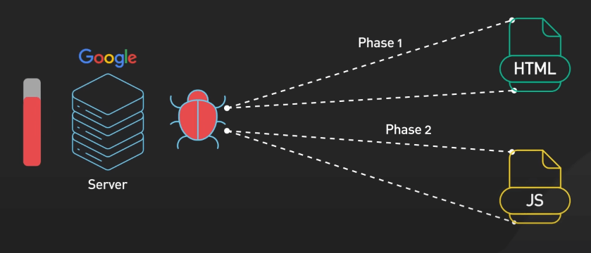

# Các công cụ tìm kiếm hoạt động như thế nào?

## Nguồn

 [How Search Really Works](https://www.youtube.com/watch?v=TByRaraQqW4)

## Crawling

Để tìm kiếm được web, ta cần có các trang web để làm kết quả. Ta sẽ bắt đầu với công việc quét web. Đó là một quá trình phức tạp, quét và index các trang web trên internet.

{:class="centered-img"}

Các công cụ tìm kiếm triển khai các web crawler tiên tiến kết hợp các chiến lược BFS (breath-first search - tìm kiếm theo chiều rộng) hay DFS (depth-first search - tìm kiếm theo chiều sâu) để quét các trang web một cách hiệu quả.

{:class="centered-img"}

Crawling bắt đầu với các URL seed và đi theo các hyperlink trong các trang seed đó để tìm ra các trang mới. Các web crawler thu thập dữ liệu quan trọng về mỗi trang như tiêu đề, từ khóa và liên kết. Thông tin này sau đó được lưu trữ để xử lý.

{:class="centered-img"}

Các crawler phải ưu tiên thông minh việc quét các trang dựa trên các yếu tố như số lượng liên kết ngoại, tần suất cập nhật và độ uy tín.

{:class="centered-img"}

Ta cũng cần chú ý đến việc quản lý hàng đợi URL. Các công cụ tìm kiếm sử dụng các thuật toán phức tạp để quyết định thứ tự quét. Ta cũng cần cân bằng giữa việc tìm ra các trang mới và việc quét sâu các trang cũ. Các trang mới có thể được quét mỗi vài phút trong khi các trang ít cập nhật chỉ được quét một tháng một lần.

Ngay cả với khả năng xử lý lớn, các công cụ tìm kiếm chỉ có thể quét một phần nhỏ của internet mỗi ngày. Họ phải phân bổ một hạn ngạch quét dựa trên kiến trúc trang web, bản đồ trang và chất lượng các liên kết nội bộ. Điều này đảm bảo ưu tiên cho nội dung quan trọng nhất và thường xuyên được cập nhật.

Các crawler cũng phải xử lý vấn đề phát hiện và xử lý nội dung trùng lặp. Chúng sử dụng URL normalization và content fingerprinting để tránh việc quét trùng lặp, tối ưu hóa tài nguyên và tính hiệu quả.

{:class="centered-img"}

Các trang web hiện đại ngày nay thường phụ thuộc nhiều vào JavaScript để tạo ra nội dung động. Để giải quyết vấn đề này, các crawler sử dụng một phương pháp hai giai đoạn: trước hết quét HTML tĩnh, sau đó render JavaScript để thu thập nội dung trang đầy đủ. Quá trình này tốn nhiều tài nguyên tính toán, nhấn mạnh vào việc phát triển web hiệu quả để tăng khả năng hiển thị trên công cụ tìm kiếm.

{:class="centered-img"}

Khi các crawler đang quét web, chúng sẽ trích xuất và phân loại các liên kết ngoại, phân biệt giữa liên kết nội và liên kết ngoại. Thông tin này được sử dụng cho các giai đoạn index sau, đặc biệt trong việc phân tích mối quan hệ giữa các trang và xác định độ quan trọng tương đối.

Hệ thống quét web không chỉ thu thập dữ liệu mà còn đưa ra quyết định quan trọng về xử lý nội dung. Một số trang có thể được chuyển tiếp ngay lập tức để được index. Trong khi đó, một số trang có thể được đặt trong một khu vực riêng biệt để được đánh giá thêm. Điều này giúp lọc ra nội dung spam tiềm ẩn hoặc chất lượng thấp trước khi nó được đưa vào index chính.

## Indexing

Khi trang đã được quét, quá trình index bắt đầu. Quá trình này bao gồm việc phân tích và phân loại nội dung, tạo cơ sở dữ liệu cấu trúc để truy xuất nhanh và hiệu quả khi có truy vấn tìm kiếm. Hệ thống index gán các định danh duy nhất cho mỗi nội dung, đảm bảo theo dõi và quản lý hiệu quả ngay cả với thông tin tương tự trên nhiều URL.

{:class="centered-img"}

{:class="centered-img"}

Quá trình bắt đầu bằng việc phân tích nội dung trang thành các từ và cụm từ riêng lẻ. Điều này đơn giản với các ngôn ngữ như tiếng Anh nhưng trở nên phức tạp hơn với các ngôn ngữ không có ranh giới từ rõ ràng như tiếng Trung hoặc tiếng Nhật. Các công cụ tìm kiếm sau đó xử lý các từ này để hiểu các hình thức và ý nghĩa cơ bản của chúng, nhận biết rằng "running", "runs", và "ran" đều liên quan đến khái niệm "run".

Sau đó, quá trình phân tích ngữ cảnh bắt đầu. Các công cụ tìm kiếm xem xét văn bản xung quanh để xác định liệu "Jaguar" có liên quan đến một loài động vật hay một thương hiệu xe hơi. Sự hiểu biết sâu sắc về ngôn ngữ và ngữ cảnh rất quan trọng để cung cấp kết quả tìm kiếm liên quan và câu trả lời chính xác cho các truy vấn người dùng.

{:class="centered-img"}

Các từ đã được phân tích sẽ được đưa vào pipeline index với inverted index ở trung tâm. Cấu trúc dữ liệu mạnh mẽ này cho phép truy xuất nhanh các tài liệu chứa các từ cụ thể. Thực tế, nó ánh xạ từng từ xuất hiện trong từng tài liệu, cho phép công cụ tìm kiếm nhanh chóng tìm ra các trang liên quan khi người dùng nhập truy vấn.

{:class="centered-img"}

Với hàng tỷ trang web, việc xử lý dữ liệu lớn đặt ra thách thức lớn về kích thước index. Các công cụ tìm kiếm sử dụng các kỹ thuật nén khác nhau để giữ cho index nằm trong tầm kiểm soát. Một số thậm chí sử dụng các thuật toán học máy để tối ưu hóa việc nén dữ liệu, đảm bảo lưu trữ và truy xuất hiệu quả của lượng thông tin lớn. 

Indexing không chỉ dừng lại ở việc phân tích từ và cụm từ. Các công cụ tìm kiếm lưu trữ và đánh giá thông tin quan trọng của trang như tiêu đề, mô tả và ngày xuất hiện trên mạng. Họ đánh giá chất lượng và tính liên quan của nội dung, xem xét các yếu tố như độ sâu, sự sáng tạo và mục đích người dùng.

{:class="centered-img"}

Hệ thống index cũng ánh xạ các liên kết giữa các trang, giúp xác định độ quan trọng của mỗi trang. Qua quá trình này, các công cụ tìm kiếm liên tục cập nhật cơ sở dữ liệu của mình để phản ánh sự thay đổi trong nội dung các trang. Họ theo dõi trang mới, trang đã sửa đổi và trang đã xóa, đảm bảo kết quả tìm kiếm luôn phản ánh nội dung mới nhất và phù hợp nhất.

## Ranking

Khi các nội dung đã được index, các công cụ tìm kiếm đối mặt với nhiệm vụ phức tạp là xác định xem trang nào là phù hợp và có giá trị nhất cho mỗi truy vấn tìm kiếm. Quá trình này liên quan đến các thuật toán phức tạp mà xem xét các yếu tố sẽ cung cấp kết quả hữu ích nhất cho người dùng.

Các hệ thống ranking hiện đại dựa nhiều vào các mô hình học máy tiên tiến. Các mô hình này được huấn luyện trên các tập dữ liệu lớn về truy vấn tìm kiếm và kết quả được đánh giá bởi con người, học cách nhận biết điều gì là quan trọng và liên quan. Họ sử dụng các kỹ thuật như học cách xếp hạng để cải thiện trực tiếp chất lượng xếp hạng, bắt kịp các pattern phức tạp mà lập trình thủ công khó có thể đạt được.

{:class="centered-img"}

Các thuật toán Ranking xem xét nhiều yếu tố khác nhau. Chúng xem xét sự phù hợp của nội dung với truy vấn, xem xét các yếu tố như phủ sóng chủ đề và sự hiện diện của từ khóa. Nhưng sự phù hợp thôi thì không đủ. Các công cụ tìm kiếm cũng đánh giá chất lượng và độ uy tín của nội dung, xem xét các yếu tố như độ uy tín của trang web, độ sâu của nội dung và mức độ thỏa mãn nhu cầu người dùng.

Việc tương tác của người dùng cũng đóng một vai trò trong xếp hạng. Các công cụ tìm kiếm phân tích cách người dùng tương tác với kết quả tìm kiếm, xem xét các yếu tố như tỷ lệ click và thời gian mà người dùng dành trên một trang. Sự tương tác liên tục với một kết quả cụ thể được xem là một tín hiệu tích cực về giá trị của trang.

Các yếu tố kỹ thuật của trang web cũng quan trọng. Tốc độ trang, khả năng tương thích với di động và trải nghiệm người dùng tổng thể đều ảnh hưởng đến xếp hạng. Một trang nhanh, dễ sử dụng hơn và dễ tìm kiếm hơn có khả năng xếp hạng tốt hơn so với một trang chậm, khó sử dụng.

Việc phân tích liên kết cũng là một yếu tố quan trọng trong xếp hạng. Các công cụ tìm kiếm xem xét số lượng và chất lượng của các liên kết trỏ đến một trang, xem xét chúng như là sự ủng hộ từ các trang khác. Tuy nhiên, sự tập trung nên dành vào các liên kết tự nhiên và uy tín thay vì việc xây dựng liên kết nhân tạo.

{:class="centered-img"}

Sự tươi mới và thời gian của nội dung cũng được xem xét cho các truy vấn về sự kiện hiện tại hoặc chủ đề thay đổi nhanh. Nội dung mới hơn có thể được ưu tiên, tuy nhiên đối với các chủ đề Evergreen, nội dung cũ nhưng chất lượng vẫn có thể xếp hạng tốt.

Sự cá nhân hóa cũng là một yếu tố quan trọng trong xếp hạng. Các công cụ tìm kiếm có thể tùy chỉnh kết quả dựa trên vị trí người dùng, lịch sử tìm kiếm và các yếu tố cá nhân khác. Điều này giúp cung cấp kết quả phù hợp hơn nhưng cũng cân nhắc với nhu cầu cung cấp các quan điểm đa dạng.

Lưu ý là các yếu tố xếp hạng liên tục thay đổi. Các công cụ tìm kiếm thường cập nhật thuật toán của mình để cải thiện chất lượng kết quả và thích ứng với sự thay đổi trong nội dung web và hành vi người dùng. Sự linh động này có nghĩa là việc duy trì khả năng hiển thị tìm kiếm cao đòi hỏi nỗ lực và thích ứng liên tục với các best practice.

{:class="centered-img"}

## Phục vụ kết quả

Khi một người dùng nhập truy vấn tìm kiếm, công cụ tìm kiếm sẽ phải cân nhắc xem ý muốn của người dùng là gì. Đây là một thách thức phức tạp vì hầu hết các truy vấn chỉ là một vài từ. Quá trình bắt đầu với việc phân tích và xác định ý muốn của người dùng, xem xét xem họ đang tìm kiếm một trang cụ thể, thông tin tổng quát hoặc muốn hoàn thành một nhiệm vụ. Các công cụ tìm kiếm sử dụng các kỹ thuật phức tạp để cải thiện việc hiểu ý muốn của người dùng. Họ sửa lỗi chính tả, mở rộng truy vấn với các từ liên quan và sử dụng các phương pháp phân tích tiên tiến để xử lý các truy vấn hiếm và mơ hồ.

Truy vấn thường được phân loại thành các loại như truy vấn dẫn nhập, truy vấn thông tin hoặc truy vấn giao dịch, giúp công cụ tìm kiếm điều chỉnh kết quả của mình một cách phù hợp, phản ánh nhu cầu cụ thể của người dùng.

Việc phục vụ các kết quả tìm kiếm với quy mô hàng tỉ truy vấn mỗi ngày là một thách thức lớn. Các công cụ tìm kiếm phải dựa vào cơ sở hạ tầng phức tạp để quản lý và phục vụ kết quả tìm kiếm một cách hiệu quả. Index là quá lớn so với một máy duy nhất nên nó được phân tán trên nhiều máy chủ với sự dự phòng để đảm bảo độ tin cậy. Các cụm này bao gồm nhiều trung tâm dữ liệu trên toàn cầu. Việc duy trì hệ thống phân tán được cập nhật thường xuyên là một thách thức lớn với nội dung mới thường được index riêng trước khi được tích hợp vào index chính.

{:class="centered-img"}

Các công cụ tìm kiếm hiện đại kết hợp các kỹ thuật học máy tiên tiến, hệ thống phân tán và kỹ thuật truy xuất thông tin để tổ chức và cung cấp quyền truy cập vào thông tin trên toàn thế giới. Chính sự kết hợp này giúp chúng ta tìm kiếm hầu hết mọi thứ trực tuyến chỉ với một vài phím nhấn.
