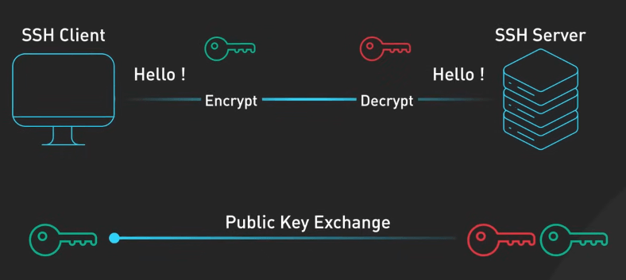

# SSH hoạt động như thế nào?

## Nguồn

 [How SSH Really Works](https://www.youtube.com/watch?v=rlMfRa7vfO8)

## SSH là gì?

SSH (Secure Shell) là một giao thức mạng dùng để thiết lập kết nối mạng bảo mật giữa máy tính người dùng và server trên một mạng có thể không an toàn.

{:class="centered-img"}

SSH trở thành một phần quan trọng trong bảo mật mạng hiện đại. Đây là giao thức được sử dụng rộng rãi cho rất nhiều tác vụ, như quản lý hệ thống từ xa và truyền file qua mạng. Chúng ta sẽ tập trung vào SSH-2, chuẩn hóa bởi IETF (Internet Engineering Task Force). SSH-2 cung cấp nhiều cải tiến quan trọng cho SSH-1, bao gồm mã hóa mạnh hơn, khả năng xác thực mạnh mẽ hơn, và khả năng chuyển dữ liệu an toàn hơn.

{:class="centered-img"}

## Quá trình kết nối SSH

Khi một SSH client muốn kết nối với một SSH server, quy trình băt đầu bằng việc thiết lập một kết nối TCP, thường qua cổng 22. Sau khi kết nối TCP được thiết lập, client và server bắt đầu đàm phán về phiên bản. Điều này đảm bảo client và server có chung tiếng nói, về phiên bản SSH nào sẽ được sử dụng. Tiếp theo là đàm phán về thuật toán. Ở đây, client và server sẽ thống nhất các thuật toán mã hóa dùng cho các tác vụ như trao đổi key, mã hóa dữ liệu, và kiểm tra tính toàn vẹn. Việc này cho phép SSH thích nghi với các yêu cầu bảo mật khác nhau và các khả năng tính toán khác nhau.

{:class="centered-img"}

Sau khi xong việc ở trên, ta đến một bước quan trọng trong bắt tay SSH là việc trao đổi key. Thông thường, client và server sẽ sử dụng thuật toán Diffie-Hellman để sinh ra một session key chung. Trong quy trình này, cả hai phía sẽ tạo một cặp key tạm thời và trao đổi public key của mình để tạo ra một secret key chung để mã hóa.

{:class="centered-img"}

Việc sử dụng key tạm thời giúp hỗ trợ bí mật tối đa. Nếu key bị lộ, những thông tin đã được mã hóa trước đó vẫn an toàn.

{:class="centered-img"}

Secret key chung này sẽ được dùng để mã hóa đối xứng dữ liệu trao đổi giữa client và server. Giờ client sẽ bắt đầu quá trình đăng nhập vào server. Server lúc này sẽ thực hiện kiểm tra bảo mật bằng cách tìm xem có public key nào khớp trong danh sách key được cho phép hay không, thường sẽ nằm trong file `~/.ssh/authorized_keys`. Đây là xác thực public key, là cách phổ biến nhất để xác nhận rằng client có quyền truy cập vào server.

SSH cũng cho phép xác thực bằng mật khẩu, nhưng cách này kém an toàn hơn so với xác thực bằng public key.

{:class="centered-img"}

Khi tìm ra được key khớp, server sẽ mã hóa một số ngẫu nhiên nào đó với public key của client và yêu cầu client giải mã. Việc này chứng tỏ rằng server đã khớp được public key và đảm bảo client có private key tương ứng.

Sau đó client sẽ giải mã số ngẫu nhiên này với private key, rồi gửi cho server. Server kiểm tra giải mã này, xác nhận danh tính của client. Khi xác thực hoàn tất, SSH session sẽ được thiết lập. Từ thời điểm này, tất cả các command từ client đến server sẽ được mã hóa bằng session key chung. Server thực thi command, mã hóa kết quả với session key, và gửi lại cho client, client giải mã với session key đó và hiển thị kết quả. Việc này tiếp tục cho đến khi session kết thúc.

{:class="centered-img"}

SSH tiện dụng để thực thi các command từ xa. Nó còn có một số tính năng khác như SSH Local Forwarding, cho phép ta tunnel qua một server trung gian để truy cập một server khác. Việc này rất hữu ích khi truy cập các service bị chặn bởi firewall hoặc khi muốn thêm một lớp bảo mật nữa cho service thông qua một giao thức không mã hóa.

{:class="centered-img"}
