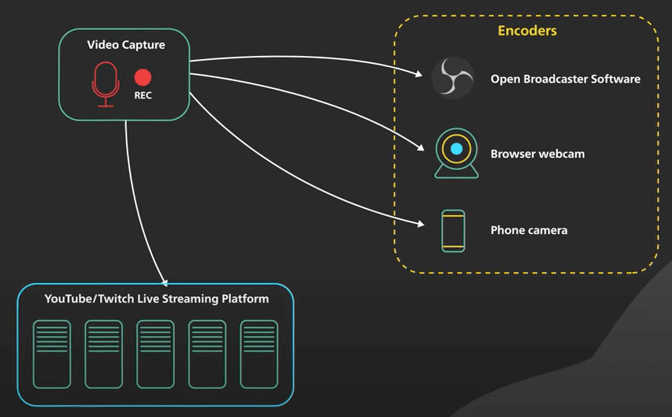
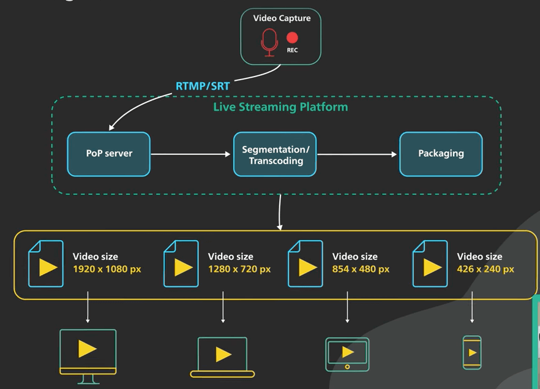
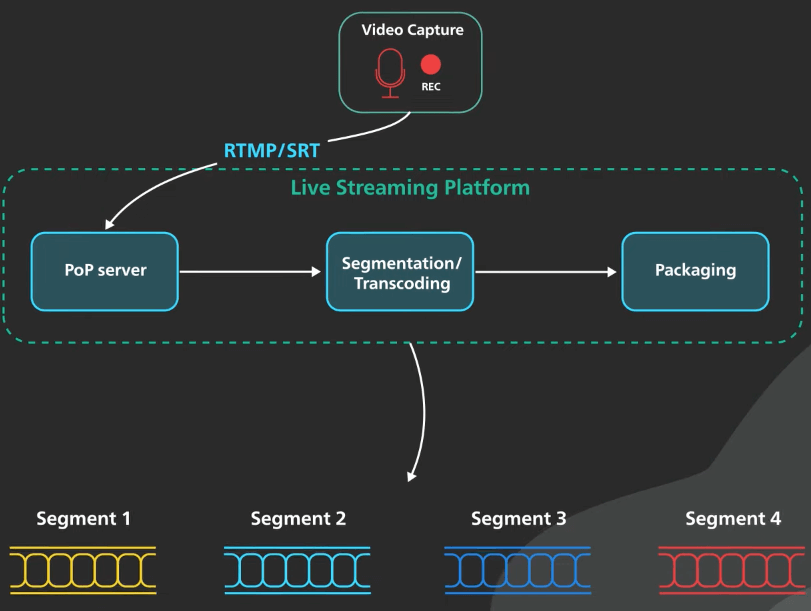
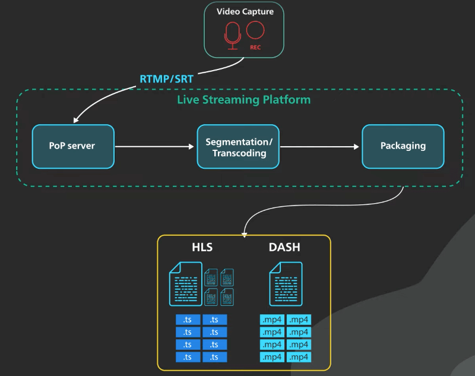
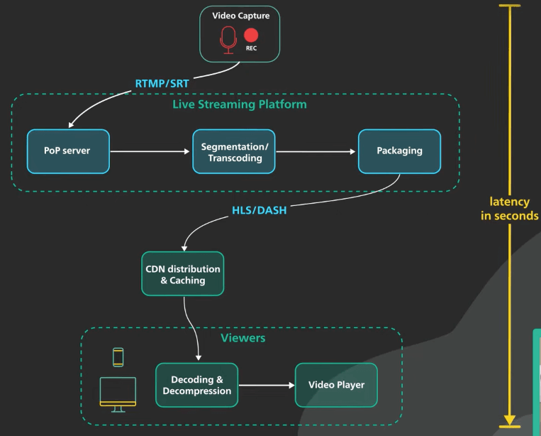

# Các nền tảng streaming hoạt động như thế nào?

## Nguồn

 [How Does Live Streaming Platform Work? (YouTube live, Twitch, TikTok Live)](https://www.youtube.com/watch?v=7AMRfNKwuYo)

## Từ streamer đến người xem

Live streaming là một việc không hề dễ dàng về mặt kĩ thuật vì nội dung video sẽ được gửi qua internet trong thời gian gần như là thực. Thêm nữa, Việc xử lý video đòi hỏi nhiều tài nguyên từ máy tính, gửi một lượng lớn nội dung video qua internet sẽ mất thời gian. Những yếu tố này khiến live streaming trở nên khó khăn. Như vậy một video stream đi từ streamer đến người xem như thế nào?

Đầu tiên, stream sẽ bắt đầu buổi stream. Nguồn nội dung có thể là bất kỳ nguồn video và âm thanh nào được kết nối với một bộ mã hóa (encoder), như phần mềm mã hóa mã nguồn mở phổ biến OBS (Open Broadcaster Software). Một số nền tảng phổ biến như YouTube cung cấp phần mềm đơn giản để stream từ trình duyệt với webcam, hoặc trực tiếp từ camera điện thoại di động. Bộ mã hóa có nhiệm vụ đóng gói video stream và gửi nó qua một giao thức vận chuyển mà nền tảng live streaming có thể nhận để xử lý tiếp.

{:class="centered-img"}

Giao thức vận chuyển phổ biến nhất là RTMP (Real-time Messaging Protocol). RTMP là một giao thức dựa trên TCP. Nó được ra mắt từ lâu dưới dạng giao thức video streaming cho Adobe Flash. Các bộ mã hóa đều có thể giao tiếp thông qua RTMP, hoặc qua biến thể an toàn của nó gọi là RTMPS. Có một giao thức mới gọi là SRT (Secure Reliable Transport) có thể sẽ thay thế RTMP. SRT dựa trên UDP, hứa hẹn độ trễ thấp hơn và độ bền tốt hơn trong điều kiện mạng kém. Tuy nhiên, hầu hết các nền tảng streaming phổ biến hiện tại vẫn chưa hỗ trợ SRT.

Để cung cấp điều kiện upload tốt nhất cho streamer, hầu hết các nền tảng live streaming hiện nay cung cấp cho họ các máy chủ point-of-presence trên toàn thế giới. Streamer sẽ kết nối với máy chủ point-of-presence gần nhất. Việc kết nối này thường là tự động với cả DNS định tuyến dựa trên độ trễ hoặc mạng anycast. 

Khi stream đến máy chủ point-of-presence, nó sẽ được truyền qua một mạng trung gian nhanh và đáng tin cậy đến nền tảng live streaming để xử lý tiếp. Tại đây, mục tiêu chính của việc xử lý thêm này là cung cấp video stream ở các chất lượng và bit-rate khác nhau. Các trình phát video tự động chọn chất lượng video và bit-rate tốt nhất dựa trên chất lượng kết nối internet của người xem và có thể điều chỉnh ngay lập tức bằng cách yêu cầu các bit-rate khác khi điều kiện mạng thay đổi. Đây gọi là adaptive bitrate streaming.

{:class="centered-img"}

Các bước xử lý cụ thể sẽ khác nhau tùy theo nền tảng và định dạng streaming đầu ra. Nói chung, các bước xử lý sẽ kiểu như sau.

Đầu tiên, video stream đầu vào sẽ được chuyển đổi sang các độ phân giải và bit-rate khác nhau - cơ bản là các cấp độ chất lượng khác nhau cho video. Video stream đã chuyển đổi sẽ được chia thành các đoạn video nhỏ tầm vài giây. Quá trình này gọi là segmentation (phân đoạn). Mã hóa video đòi hỏi nhiều tài nguyên máy tính. Video đầu vào thường được mã hóa sang các định dạng khác nhau một cách song song, đòi hỏi sức mạnh tính toán lớn.

{:class="centered-img"}

Tiếp theo, các đoạn video từ quá trình mã hóa sẽ được đóng gói thành các định dạng streaming trực tiếp mà trình phát video có thể hiểu. Định dạng streaming trực tiếp phổ biến nhất là HLS (HTTP Live Streaming). HLS được Apple cho ra mắt vào năm 2009. Nó là định dạng streaming phổ biến nhất hiện nay. Một stream HLS bao gồm một file mô tả và một loạt các đoạn video nhỏ, mỗi đoạn dài tầm vài giây. File mô tả là một thư mục để cho trình phát video biết tất cả các định dạng đầu ra và nơi để tải các đoạn video qua HTTP. File mô tả HLS và các đoạn video từ quá trình đóng gói sẽ được cache bởi CDN, giúp giảm độ trễ đến người xem. DASH (Dynamic Adaptive Streaming over HTTP) là một định dạng streaming phổ biến khác. Thiết bị của Apple mặc định không hỗ trợ DASH.

{:class="centered-img"}

Cuối cùng, video bắt đầu đến trình phát video của người xem. Độ trễ từ khi streamer gửi video đến khi người xem nhận được video gọi là “glass-to-glass” latency. “Glass-to-glass” latency khoảng 20 giây là bình thường. 

{:class="centered-img"}

Có nhiều yếu tố mà streamer hoặc nền tảng live streaming có thể điều chỉnh để cải thiện độ trễ này, đó là bằng cách hy sinh các yếu tố của chất lượng video. Một số nền tảng đơn giản hóa quá trình điều chỉnh này bằng cách cung cấp điều chỉnh cho streamer để chọn mức độ tương tác mà họ muốn. Các nền tảng sau đó sẽ điều chỉnh chất lượng của stream dựa trên đầu vào đó. Streamer rõ ràng không cần quan tâm nền tảng làm gì ở bước này. Điều tốt nhất mà streamer có thể làm là tối ưu hóa setup ở máy stream để hỗ trợ độ trễ thấp nhất từ camera đến nền tảng live streaming.
