# Một số HTTP status code thông dụng

## Nguồn

 [HTTP Status Codes Explained In 5 Minutes](https://www.youtube.com/watch?v=qmpUfWN7hh4)

## 2xx

Các status code 2xx, ví dụ 200, 201, về cơ bản là các trạng thái tích cực.

- 200 OK nghĩa là mọi thứ đã diễn ra suôn sẻ ở phía server.

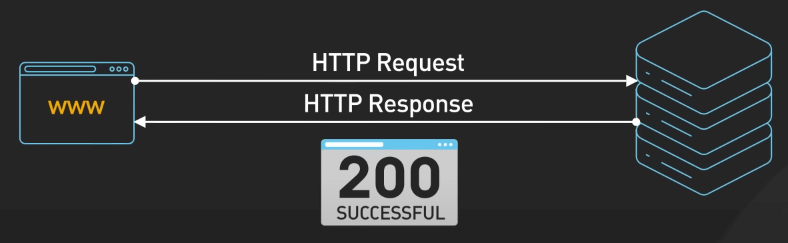{:class="centered-img"}

- 201 Created là một trạng thái khác, được trả về khi có gì đó được tạo ra ở phía server. Ví dụ, bạn đang xây dựng một API tạo các profile người dùng. 201 Created nghĩa là "Dữ liệu của bạn đã được nhận, profile mới đã được tạo!".

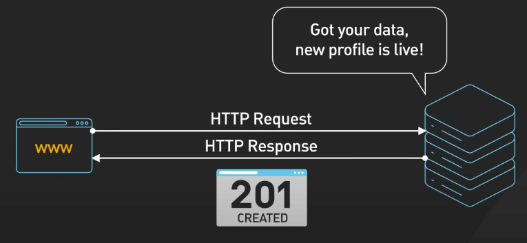{:class="centered-img"}

- 204 No Content hơi khác một tí, thường được dùng với các request DELETE để xóa dữ liệu người dùng. 204 nghĩa là việc xóa dữ liệu đã thành công, nhưng không có dữ liệu nào được trả về.

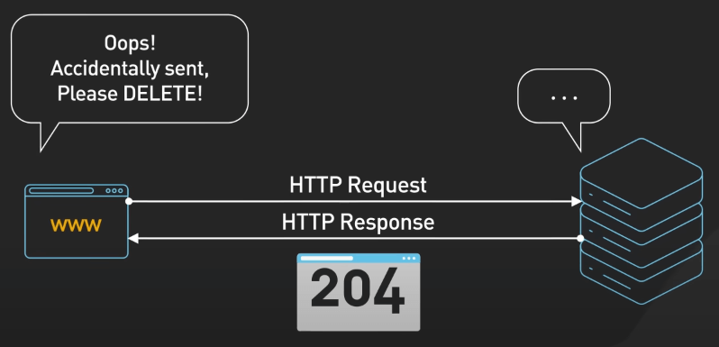{:class="centered-img"}

## 4xx

Các status code 4xx là cách mà server nói cho bạn rằng bạn gửi gì đó không ổn lắm.

- 400 Bad Request biểu thị việc server không hiểu bạn đang gửi cái gì lên.

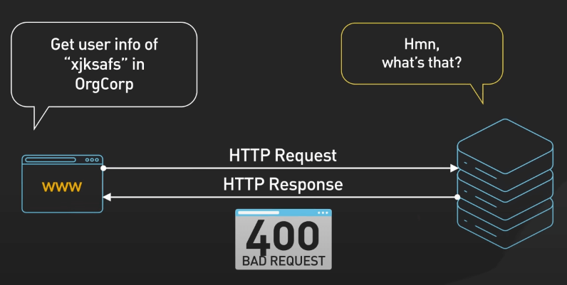{:class="centered-img"}

- 401 Unauthorized nghĩa là bạn đang thiếu credential để gọi, giống việc cố gắng đi vào một căn phòng đang khóa mà không có chìa khóa.

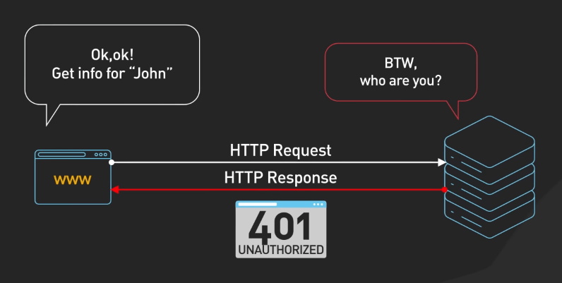{:class="centered-img"}

- 403 Forbidden nghĩa là bạn không được phép dùng API này, giống việc bạn có vé phổ thông vào concert nhưng cố gắng lẻn vào khu VIP, cụ thể ở đây nó như là việc bạn cố gắng sử dụng tính năng admin dù chỉ có tài khoản guest.

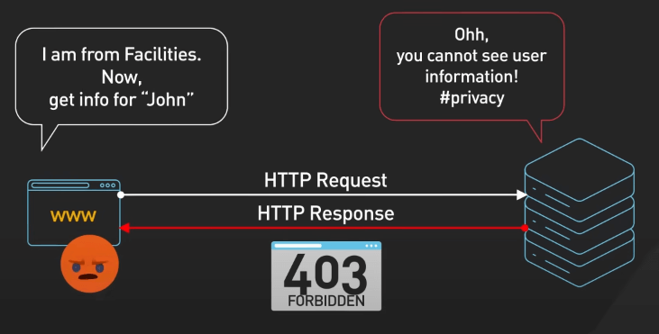{:class="centered-img"}

- 404 Not Found biểu thị thông tin bạn request không có ở đây. Hãy kiểm tra lại route và endpoint của bạn.

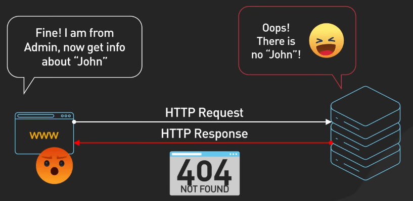{:class="centered-img"}

- 429 Too Many Requests biểu thị rằng bạn đang gửi request quá nhanh và đang chạm đến rate limit. Với các API nhiều tải, bạn cần điều chỉnh lại để gọi API lại với chút backoff.

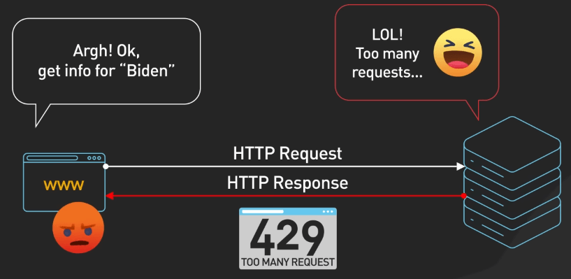{:class="centered-img"}

## 5xx

Các status code 5xx biểu thị rằng có vấn đề ở phía server, những lỗi này thường cần điều tra kỹ và không dễ tìm ra ngay lập tức.

- 500 Internal Server Error biểu thị việc server đang tuyệt vọng và cần bạn giúp đỡ, hãy kiểm tra log để tìm ra lỗi.

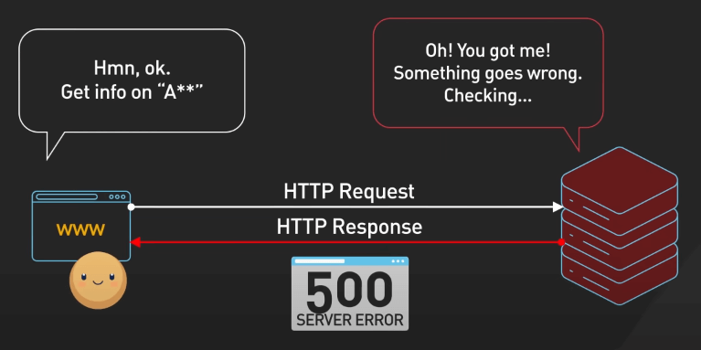{:class="centered-img"}

- 502 Bad Gateway biểu thị việc có vấn đề giữa các server, ví dụ như một proxy không nhận được response từ server ứng dụng, có thể do quá tải, mạng mẽo hoặc config sai.

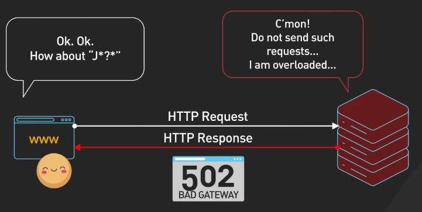{:class="centered-img"}

- 503 Service Unavailable biểu thị server không thể xử lý request lúc này, có thể do bảo trì hoặc quá tải. 

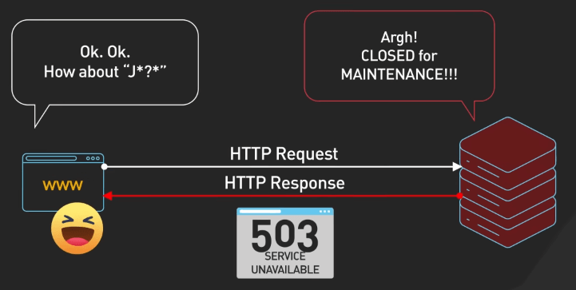{:class="centered-img"}

Mặc dù cả 502 và 503 đều biểu thị vấn đề ở server, nhưng nguyên nhân thì khác nhau: 502 là vấn đề về giao tiếp giữa các server, 503 là vấn đề về trạng thái hiện tại của server và khả năng xử lý request.

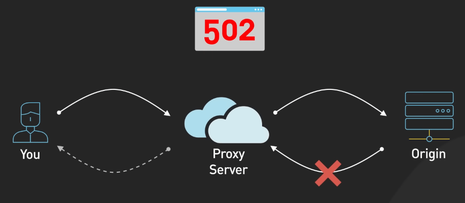{:class="centered-img"}

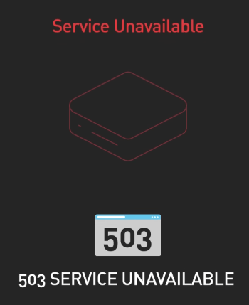{:class="centered-img"}

## 3xx

Các status code 3xx là các status code điều hướng, giúp bạn chuyển hướng request.

- 301 Moved Permanently là một địa chỉ mới, server sẽ chuyển hướng request đến địa chỉ mới.

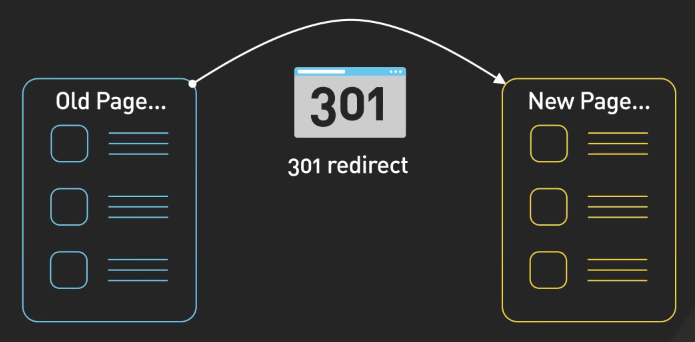{:class="centered-img"}

- 302 Found là chuyển hướng tạm thời, nghĩa là địa chỉ cũ vẫn hoạt động nhưng server muốn bạn chuyển sang địa chỉ mới.

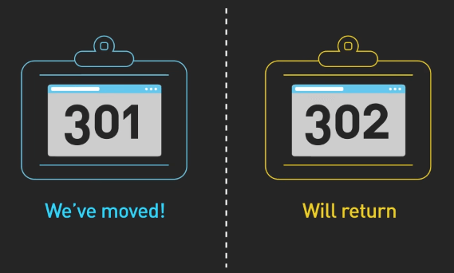{:class="centered-img"}

- 304 Not Modified là cách server nói rằng dữ liệu bạn request không thay đổi kể từ lần cuối cùng bạn request (và cache nó trong browser), nó giúp tiết kiệm băng thông và thời gian bằng cách tránh việc tải dữ liệu không cần thiết.

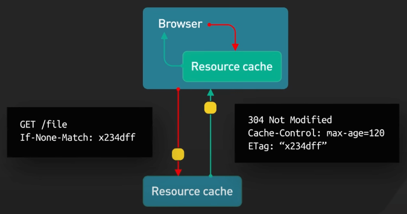{:class="centered-img"}

## 1xx

Các status code 1xx không được chú ý nhiều nhưng vẫn hữu ích. Ví dụ như 101 Switching Protocols được sử dụng khi client muốn chuyển từ HTTP sang WebSocket.

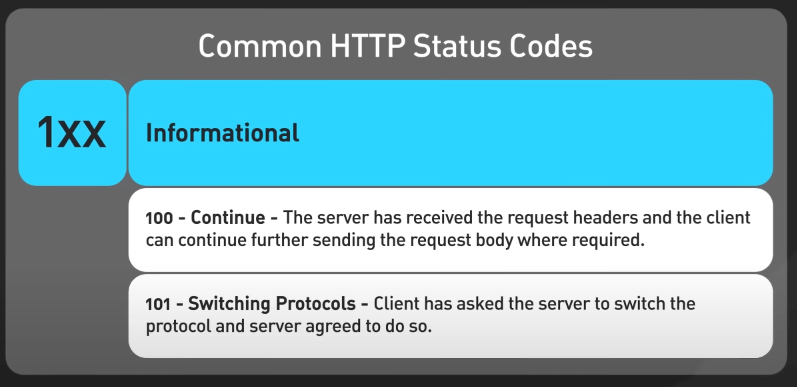{:class="centered-img"}

## Một số tip khi gặp vấn đề với status code

Khi gặp vấn đề với status code, hãy bắt đầu từ những điều cơ bản. 

- Kiểm tra request headers và body, đảm bảo HTTP method đúng, và xác nhận URL endpoint. 
- Các công cụ như Postman hoặc Insomnia có thể rất hữu ích trong việc kiểm tra request và xem response. Đừng quên kiểm tra server logs nếu bạn có quyền truy cập.
