# HTTP/1 đến HTTP/2 đến HTTP/3

## Nguồn

 [HTTP/1 to HTTP/2 to HTTP/3](https://www.youtube.com/watch?v=a-sBfyiXysI)

 [HTTP 1 Vs HTTP 2 Vs HTTP 3!](https://www.youtube.com/watch?v=UMwQjFzTQXw)

## HTTP là gì?

HTTP là viết tắt của HyperText Transfer Protocol, hay giao thức truyền tải siêu văn bản. Giao thức này là cách mà trình duyệt giao tiếp với các web server, yêu cầu các trang web từ server và nhận lại các trang web đó.

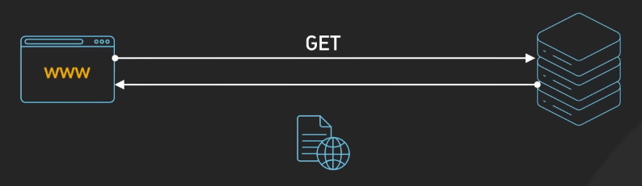{:class="centered-img"}

Ban đầu, HTTP được thiết kế dành cho các tài liệu siêu văn bản (HTML), đây là các tài liệu có thể chứa các liên kết đến các tài liệu khác. Tuy nhiên, các nhà phát triển nhanh chóng nhận ra rằng HTTP cũng có thể được sử dụng để truyền tải các loại dữ liệu khác như hình ảnh, video, âm thanh, v.v. Giờ nó được sử dụng cho các API, truyền tải file và rất nhiều dịch vụ dựa trên web khác.

## HTTP/0.9

Trước khi có HTTP/1, có một phiên bản HTTP đầu tiên được gọi là HTTP/0.9. Nó ra đời vào năm 1991, chỉ hỗ trợ `GET`, không có header và chỉ gửi file HTML. Nó không có HTTP header hay status code, những thứ sẽ được giới thiệu trong HTTP/1, cùng với các HTTP method khác như `POST`, `PUT`, `DELETE`, v.v.

## HTTP/1

HTTP/1 ra mắt vào năm 1996, được xây dựng dựa trên TCP. Nó rất đơn giản, trình duyệt yêu cầu một trang web, server trả lại cái trang web đó. Mỗi request đến cùng một server cần một TCP connection riêng, việc này không hiệu quả lắm.

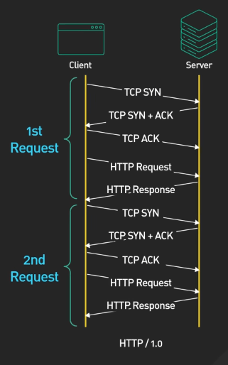{:class="centered-img}

Vì sao vậy? Đầu tiên, ta cần bắt tay 3 bước TCP (3-way handshake) để thiết lập một connection. Rồi với HTTPS thì còn phải thêm bước thiết lập TLS. Các bước này xảy ra trước khi có bất kỳ dữ liệu nào được gửi đi. Với HTTP/1, tất cả các tài nguyên đều cần các bước này xảy ra trước, nghĩa là cần connection với mỗi file ảnh, file CSS, file JavaScript, v.v.

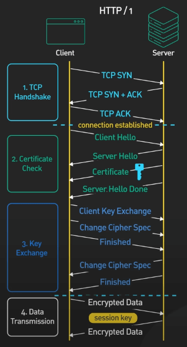{:class="centered-img"}

## HTTP/1.1

HTTP/1.1 ra mắt sau HTTP/1 một năm, vào năm 1997, giúp giải quyết một số vấn đề của HTTP/1. Giờ nó vẫn còn được sử dụng rất nhiều. 

Nó giới thiệu cơ chế **keep-alive** nhằm giúp cho một connection có thể được sử dụng lại cho nhiều request. Duy trì kết nối (persistent connection) sẽ giúp giảm độ trễ khi request vì client sẽ không cần phải khởi tạo lại connection cho các request sau đó (bắt tay 3 bước TCP).

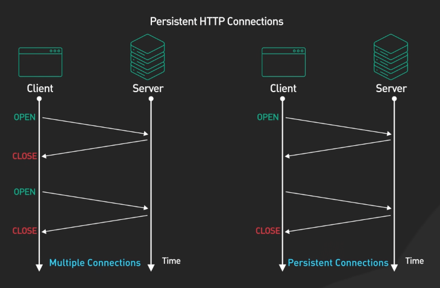{:class="centered-img"}

Một chi tiết đáng chú ý nữa của HTTP/1.1 là chức năng **HTTP pipelining**. Về mặt lý thuyết, chức năng này cho phép client gửi nhiều request lên server trước khi đợi mỗi response. Các response phải được nhận theo thứ tự được request để đảm bảo tính chính xác. Ví dụ, để request 2 ảnh thì client có thể gửi request cho ảnh 1 trước và ảnh 2 ngay sau đó, giảm thời gian chờ đợi cho mỗi ảnh.

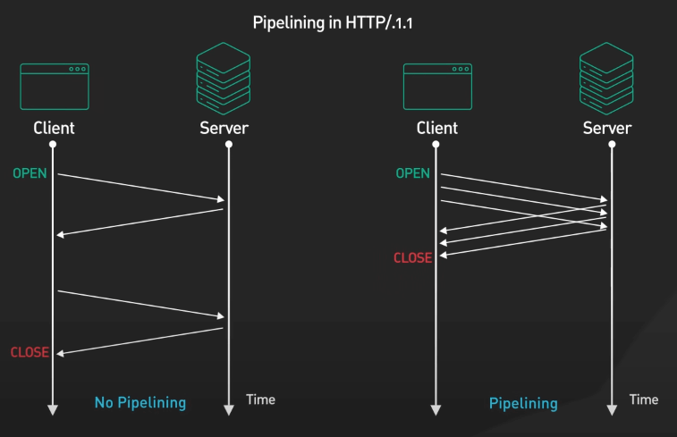{:class="centered-img"}

HTTP/1.1 còn hỗ trợ gửi response về theo chunks, tức là chia nhỏ response thành nhiều phần (mỗi phần là một chunk). Bằng cách này thì server sẽ không cần phải chờ cho tất cả dữ liệu được tạo xong trước khi gửi response đi. Client có thể bắt đầu xử lý dữ liệu ngay khi nhận được một phần của response. Ví dụ thực tiễn có thể là việc giúp cho rendering trang web nhanh hơn, cải thiện trải nghiệm người dùng, đặc biệt với các trang web động hoặc có nhiều nội dung.

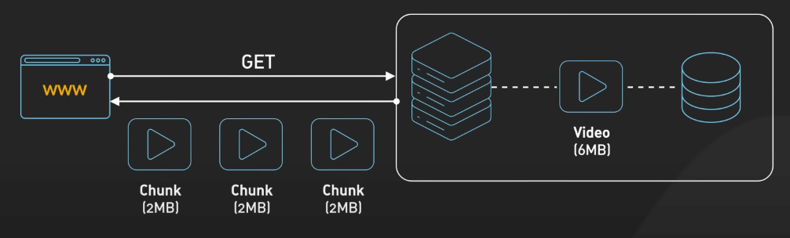{:class="centered-img"}

HTTP/1.1 hỗ trợ tốt hơn về mặt caching và request có điều kiện (conditional request). Với caching, các header được sử dụng là `Cache-Control` và `ETag`. Việc này giúp quản lý content trong cache và giảm tải cho server.

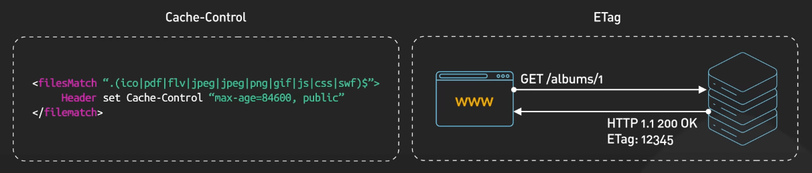{:class="centered-img"}

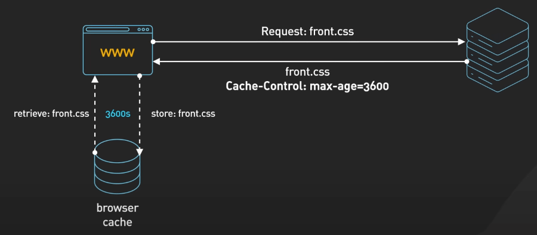{:class="centered-img"}

Về request có điều kiện dùng các header như `If-Modified-Since` để kiểm tra xem một tài nguyên có thay đổi hay không. Nếu không thay đổi, server sẽ trả về status code 304 (Not Modified) và client sẽ sử dụng dữ liệu trong cache.

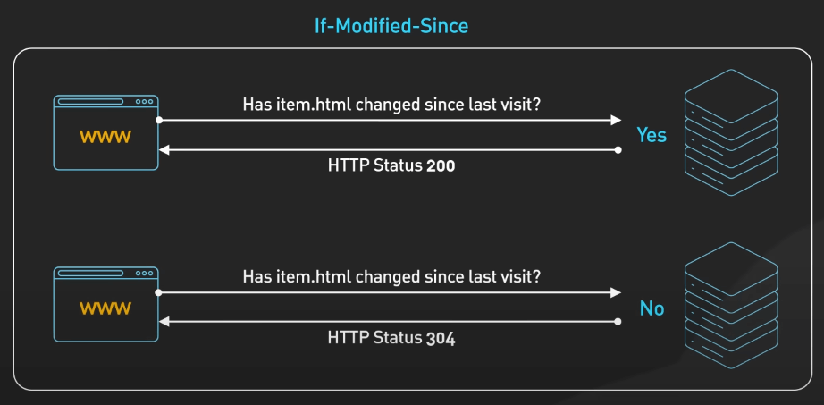{:class="centered-img"}

Với sự phát triển của các website ngày nay, các vấn đề của HTTP/1.1 trở nên rõ ràng hơn, cụ thể là **head-of-line blocking** (HOL blocking). Đại khái thì với cùng một connection, các request sau sẽ phải đợi request trước đó xong (nghĩa là request đã được gửi lên server). Nếu một request bị chặn vì một số lý do như mất gói tin (packet loss), các request sau nó trên cùng một connection cũng bị ảnh hưởng.

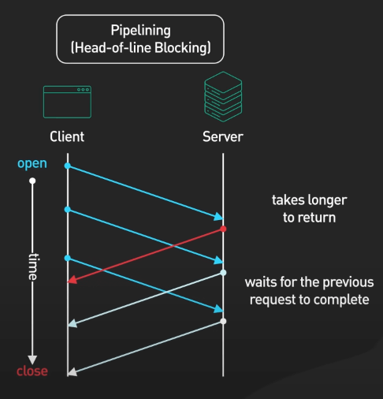{:class="centered-img"}

Một vấn đề nữa là HTTP pipelining khá khó để cài đặt và nhiều proxy server ở giữa không thể nào xử lý pipelining chính xác được. Chức năng này vì thế không còn được hỗ trợ bởi nhiều trình duyệt ngày nay.

Một số cách để giải quyết các vấn đề trên bao gồm:

- Domain Sharding: Các website sẽ phục vụ nội dung tĩnh thông qua các subdomain, mỗi subdomain có thêm 6 connection nữa.

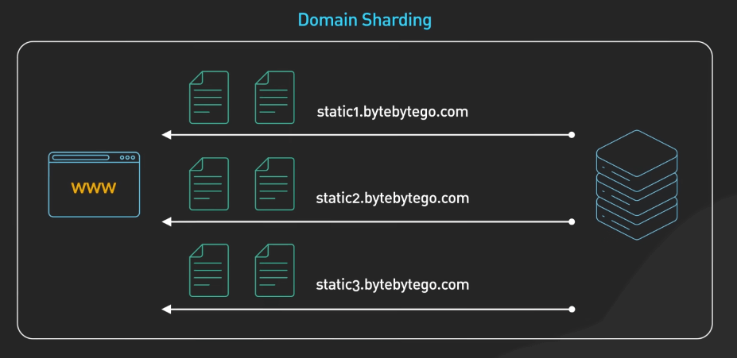{:class="centered-img"}

- Giảm số request phải thực hiện bằng cách nhóm các file CSS và JavaScript lại thành các bundle.

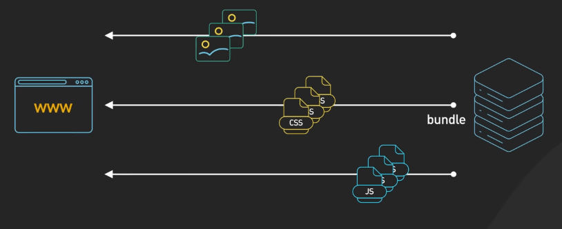{:class="centered-img"}

## HTTP/2

HTTP/2 ra đời năm 2015, được thiết kế để giải quyết các vấn đề hiệu suất của HTTP/1.1. HTTP/2 giới thiệu một layer mới tên là Binary Framing Layer, sử dụng binary để gửi dữ liệu thay vì text như trong HTTP/1.1.

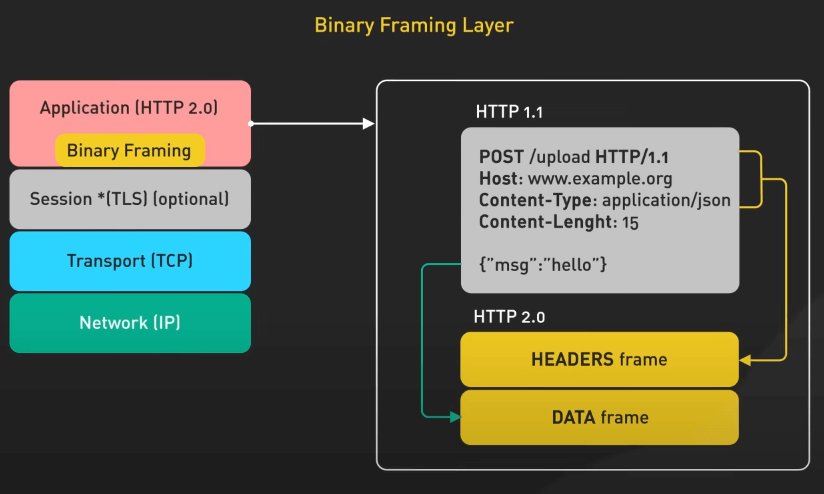{:class="centered-img"}

Các message sẽ được chia thành các đơn vị nhỏ hơn gọi là frame. Các frame này được gửi qua TCP connection và Binary Framing Layer sẽ xử lý các công việc này.

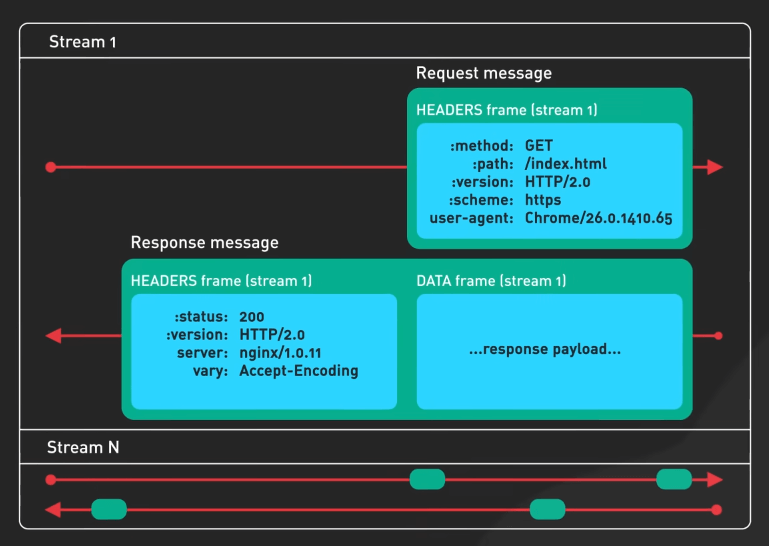{:class="centered-img"}

HTTP/2 cũng cho ta multiplexing cho cả request và response. Client và server có thể chia nhỏ các message thành các frame độc lập. Các frame này có thể hòa trộn với nhau khi đang trên đường đi giữa client và server. Việc ghép các frame này lại để tạo thành message ban đầu sẽ được thực hiện bởi nơi nhận, giúp giải quyết được vấn đề head-of-line blocking của HTTP/1.1.

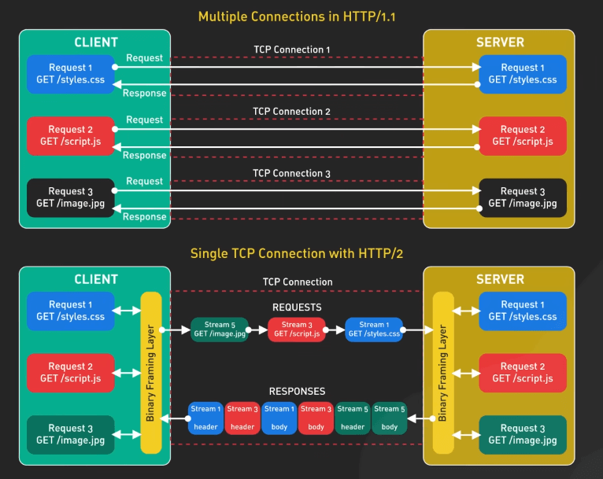{:class="centered-img"}

Việc ưu tiên stream (stream prioritization) cũng là một tính năng quan trọng của HTTP/2. Lý do là bởi thứ tự ưu tiên của việc tải nội dung trong một website là khác nhau. Ví dụ, việc tải CSS trước có thể quan trọng hơn việc tải ảnh. Với tính năng này, ta có thể thiết lập độ quan trọng của các request.

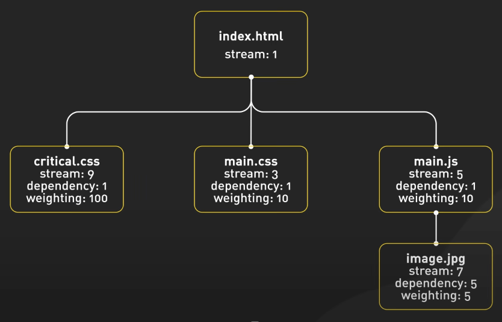{:class="centered-img"}

Trình duyệt có thể cho server biết tài nguyên nào có mức độ ưu tiên cao hơn để server có thể gửi về nhiều frame hơn của tài nguyên đó.

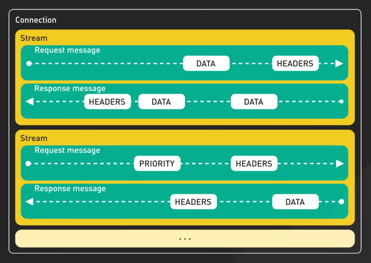{:class="centered-img"}

HTTP/2 cũng hỗ trợ server push, nghĩa là cho phép nhiều response trên một request, server có thể gửi thêm các tài nguyên bổ sung, cùng với response ban đầu.

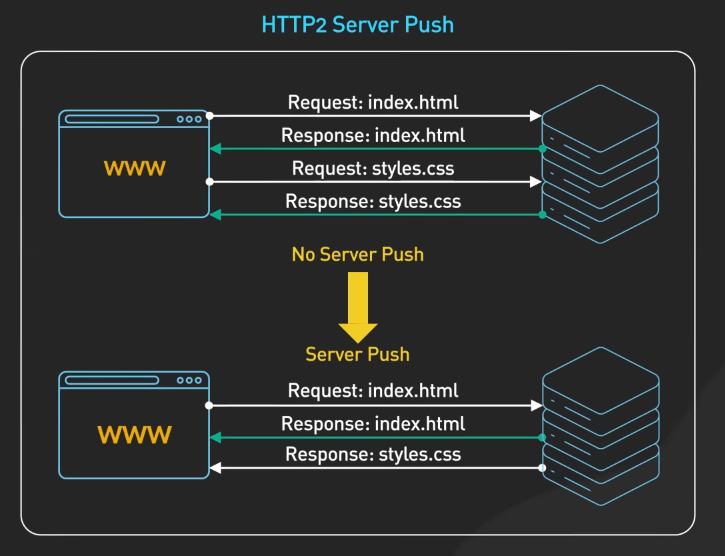{:class="centered-img"}

Cuối cùng, HTTP/2 hỗ trợ nén header. Trong HTTP/1, chỉ có dữ liệu chính được nén, còn header thì vẫn ở dạng text. HTTP/2 sử dụng HPACK để nén header, giúp giảm kích thước header. XPACK nén header và ghi nhớ header trước đó, dùng thông tin này để nén các header tiếp theo gọn hơn nữa.

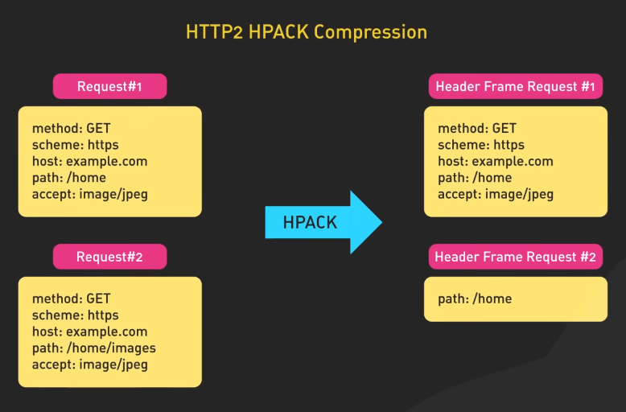{:class="centered-img"}

## HTTP/3

Khi web app trở nên phức tạp hơn và internet di động trở nên phổ biến hơn, HTTP/2 bộc lộ một số hạn chế. Bản chất của TCP là xử lý mất gói tin và head-of-line blocking khiến cho việc tải web chậm hơn, điều này càng phổ biến hơn trên các mạng có độ trễ cao hay mạng hay mất sóng như mạng di động. HTTP/3 ra đời để giải quyết các vấn đề này.

HTTP/3 ra mắt bản thử nghiệm vào năm 2020 và được ra mắt chính thức vào tháng 6 năm 2022. Nó sử dụng một giao thức tên là **QUIC** thay vì dùng TCP. QUIC được phát triển bởi Google và dựa trên UDP. UDP không cần phải thiết lập connection như TCP trước khi gửi các gói tin.

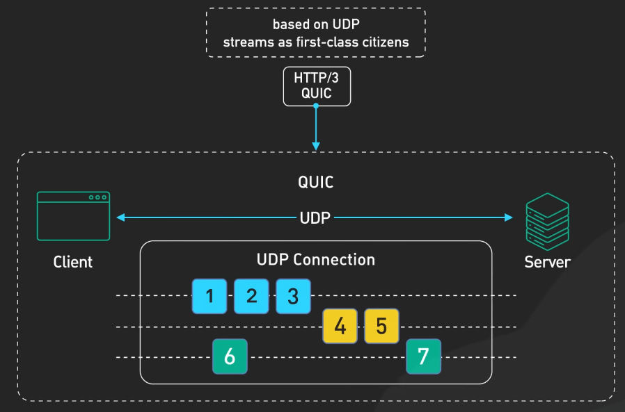{:class="centered-img"}

QUIC và HTTP/3 có nhiều lợi ích lớn. Chúng giúp cải thiện multiplexing mà không cần phải lo lắng về head-of-line blocking và xử lý mất gói tin tốt hơn. HTTP/3 hoạt động tốt hơn trên mạng di động với việc thay đổi mạng một cách mượt mà. Khi một client kết nối với một server với HTTP/3, quy trình bắt tay QUIC bắt đầu. QUIC kết hợp với TCP 1.3 để bảo mật tốt hơn. Bắt tay TLS xảy ra trong quá trình setup của connection QUIC, giúp giảm độ trễ.

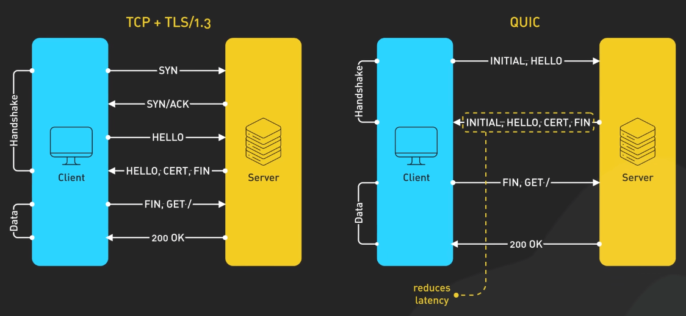{:class="centered-img"}

HTTP/3 thiết lập connection nhanh hơn TCP. Nếu client và server từng giao tiếp trước đây thì QUIC có thể có connection mới chỉ trong một round-trip, đôi khi là không cần round-trip nào cả. Trong 0-RTT, client có thể gửi request ngay lập tức cho server và server vẫn xử lý nó mà không cần bắt tay phải xong.

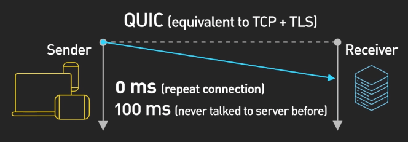{:class="centered-img"}

HTTP/3 xử lý việc chuyển mạng rất tốt. Nếu bạn chuyển từ mạng di động sang wifi và ngược lại, HTTP/3 có thể giữ cho kết nối vẫn ổn định, nhờ vào connection ID của QUIC, do nó không phụ thuộc vào địa chỉ IP.

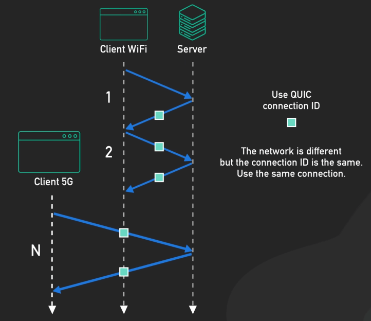{:class="centered-img"}

## Thị phần

Tính đến năm 2023, HTTP/1.1 vẫn phổ biến, đặc biệt với các website đơn giản. HTTP/2 thì được sử dụng rất nhiều, xử lý 60% web request hiện nay theo một số nguồn. HTTP/3 vẫn còn mới nhưng dần dần sẽ trở nên phổ biến hơn. Google và Cloudflare đang dẫn đầu trong việc triển khai HTTP/3.
